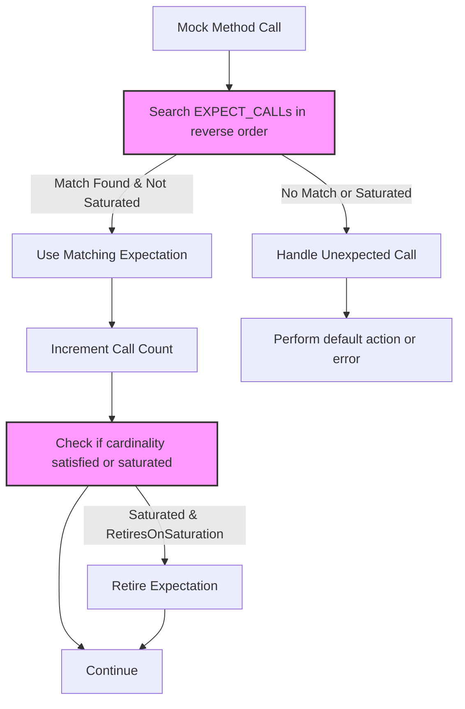

# Expectations & Call Counts

This page details how to use GoogleMock's expectation-setting macros—primarily `EXPECT_CALL()` and `ON_CALL()`—to precisely define how your mock objects should be called during tests. It covers how to specify call counts (cardinalities), establish when and how many times mock methods are expected to run, and how to diagnose deviations from those expectations. Mastering these features helps tests express intent clearly, avoid brittleness, and provide actionable feedback on unexpected or missing interactions.

---

## Interface Overview

GoogleMock provides two core macros to specify mock behavior and expectations:

- `ON_CALL(mock, method(matchers))` — Defines default behavior without asserting that the call must occur.
- `EXPECT_CALL(mock, method(matchers))` — Defines both behavior and an expectation that the call will happen a specific number of times.

These macros can be finely tuned with clauses such as `.Times()`, `.WillOnce()`, `.WillRepeatedly()`, `.InSequence()`, `.After()`, and `.RetiresOnSaturation()` to fully articulate test intent about call frequency, order, and actions.

### Cardinalities: Controlling Call Counts

A cardinality defines **how many times** a mock method is expected to be called. GoogleMock offers flexible cardinalities:

| Cardinality               | Meaning
|---------------------------|----------------------------------------------|
| `AnyNumber()`             | The call may happen any number of times.
| `AtLeast(n)`              | The call is expected at least *n* times.
| `AtMost(n)`               | The call is expected at most *n* times.
| `Between(m, n)`           | The call is expected between *m* and *n* times inclusively.
| `Exactly(n)` or `n`       | The call is expected exactly *n* times.

Cardinalities can be combined with `EXPECT_CALL` using the `.Times()` clause.

<AccordionGroup title="Common Cardinalities Explained">
<Accordion title="AnyNumber()">
Allows a mock function to be invoked any number of times, including zero. Use this when the call can happen arbitrarily without causing test failures.

```cpp
EXPECT_CALL(mock, SomeMethod(_)).Times(AnyNumber());
```
</Accordion>
<Accordion title="AtLeast(n)">
Ensures the method is called at least *n* times but does not restrict the upper count.

```cpp
EXPECT_CALL(mock, SomeMethod(_)).Times(AtLeast(2));
```
</Accordion>
<Accordion title="AtMost(n)">
Ensures the method is called at most *n* times.

```cpp
EXPECT_CALL(mock, SomeMethod(_)).Times(AtMost(3));
```
</Accordion>
<Accordion title="Between(m, n)">
Specifies an inclusive range for allowed call counts.

```cpp
EXPECT_CALL(mock, SomeMethod(_)).Times(Between(1, 4));
```
</Accordion>
<Accordion title="Exactly(n)">
The method must be called exactly *n* times.

```cpp
EXPECT_CALL(mock, SomeMethod(_)).Times(Exactly(1));
```
</Accordion>
</AccordionGroup>

### Defaults and Inference of Cardinalities

When `.Times()` is omitted, GoogleMock infers cardinalities based on `.WillOnce()` and `.WillRepeatedly()` clauses:

- No `WillOnce` or `WillRepeatedly`: defaults to `.Times(1)`.
- *n* `WillOnce()` clauses without a `WillRepeatedly()`: infers `.Times(n)`.
- *n* `WillOnce()` clauses and one `WillRepeatedly()` clause: infers `.Times(AtLeast(n))`.

```cpp
EXPECT_CALL(mock, GetValue())
    .WillOnce(Return(1))
    .WillOnce(Return(2));  // Implicitly expects 2 calls

EXPECT_CALL(mock, GetValue())
    .WillOnce(Return(1))
    .WillRepeatedly(Return(5));  // Expects at least 1 call
```

### Setting Default Behavior with ON_CALL

Use `ON_CALL()` to define default behavior for calls without setting expectations on invocation counts.

```cpp
ON_CALL(mock, SomeMethod(_))
    .WillByDefault(Return(true));
```

`ON_CALL()` is useful for setting a “default” behavior, especially in test fixtures, to reduce the need for many explicit `EXPECT_CALL`s.

---

## EXPECT_CALL Syntax and Modifiers

The typical form of an expectation is:

```cpp
EXPECT_CALL(mock, Method(matchers))
    .Times(cardinality)         // Optional; see cardinalities above
    .WillOnce(action)           // Optional; specify actions for calls
    .WillRepeatedly(action)     // Optional; default action after WillOnce calls
    .InSequence(sequences...)   // Optional; enforce call ordering
    .After(expectations...)     // Optional; define call dependencies
    .RetiresOnSaturation()      // Optional; retire when saturated
```

### Detailed Modifier Descriptions

- `.Times(cardinality)` — Specify how many times the call is expected.
- `.WillOnce(action)` — Define behavior for one matching call. Multiple calls can have different behaviors by chaining `.WillOnce()`.
- `.WillRepeatedly(action)` — Define behavior for all matching calls after `.WillOnce()` actions are exhausted. At most one per `EXPECT_CALL`.
- `.InSequence(seq1, seq2, ...)` — Require calls to occur in specified sequence(s).
- `.After(expectation_or_set...)` — Expect calls to this mock method only after other expectations have been met.
- `.RetiresOnSaturation()` — Automatically retire the expectation once its call upper bound is reached, allowing subsequent expectations to match.

### Examples

#### Expecting Exact Number of Calls with Specific Return Values

```cpp
EXPECT_CALL(mock, GetData())
    .Times(3)
    .WillOnce(Return(10))
    .WillOnce(Return(20))
    .WillOnce(Return(30));
```

This expects exactly 3 calls to `GetData()` with return values 10, 20, and 30 respectively.

#### Expecting At Least N Calls with Repeated Behavior

```cpp
EXPECT_CALL(mock, SendMessage(_))
    .Times(AtLeast(2))
    .WillRepeatedly(Return(true));
```

This expects `SendMessage` to be called at least twice, returning `true` every time.

#### Using Sequences to Require Order

```cpp
Sequence seq;
EXPECT_CALL(mock, Initialize())
    .InSequence(seq);
EXPECT_CALL(mock, Execute())
    .InSequence(seq);
EXPECT_CALL(mock, Cleanup())
    .InSequence(seq);
```

Calls to `Initialize()`, `Execute()`, and `Cleanup()` must occur in that order.

#### Retiring Calls After Saturation

```cpp
EXPECT_CALL(mock, UpdateConfig(_))
    .Times(2)
    .RetiresOnSaturation();
EXPECT_CALL(mock, UpdateConfig(_))
    .Times(AnyNumber());
```

After two calls matching the first expectation, it retires so further calls are matched by the catch-all expectation.

---

## Best Practices and Tips

- **Prefer `ON_CALL` unless you want to verify calls:** Overusing `EXPECT_CALL` makes tests fragile.
- **Place expectations before exercising code:** Setting expectations after calls have begun leads to undefined behavior.
- **Use `.RetiresOnSaturation()` when chaining expectations:** It avoids unexpected call saturation errors.
- **Order expectations carefully:** The last matching `EXPECT_CALL` takes precedence, so put more specific expectations after general ones.
- **Use wildcard matchers (`_`) when you don’t care about arguments:** This makes tests less brittle and easier to maintain.
- **Suppress "uninteresting call" warnings with `NiceMock` or `EXPECT_CALL(...).Times(AnyNumber())`:** Helps reduce noise when calls are irrelevant to the test.
- **Use sequences (`InSequence`) or `.After()` to specify call ordering:** Useful for verifying dependencies between calls.

## Common Pitfalls

- Missing `EXPECT_CALL` for methods called during tests triggers warnings and may cause unexpected behavior.
- Over-specifying cardinalities or call sequences leads to brittle tests.
- Forgetting `.RetiresOnSaturation()` when chaining expectations causes errors on excess calls.
- Placing `EXPECT_CALL`s after mock methods are invoked is undefined and must be avoided.

---

## Troubleshooting

### Excessive Calls

If a mocked method is called more times than expected, GoogleMock will report an error and by default perform the method's default action if any: returning a default value or returning/doing nothing if void.

```
Mock function called more times than expected ...
```

### Missing Calls

If a mocked method is called fewer times than specified in `EXPECT_CALL().Times()`, GoogleMock will report an unsatisfied expectation when the mock object is destroyed or explicitly verified:

```
Actual function call count doesn't match EXPECT_CALL ...
Expected: to be called at least twice
Actual: called once - unsatisfied and active
```

### Unexpected Calls

If a call does not match any `EXPECT_CALL()`, it is considered unexpected and results in an error:

```
Unexpected mock function call - returning default value.
Function call: Foo(7)
Google Mock tried the following expectations, but none matched...
```

### Uninteresting Calls

Calls to mock methods without any `EXPECT_CALL()` produce warnings unless `NiceMock` or `Times(AnyNumber())` is used. Use these to reduce noise or explicitly specify expected calls.

---

## Example: Setting Call Expectations with Cardinalities

```cpp
#include <gmock/gmock.h>
using ::testing::AtLeast;
using ::testing::Exactly;
using ::testing::AnyNumber;

class MockLogger {
 public:
  MOCK_METHOD(void, Log, (const std::string& message), ());
};

TEST(LoggerTest, LogsErrorsProperly) {
  MockLogger mock_logger;

  // Expect Log() to be called exactly twice with any message.
  EXPECT_CALL(mock_logger, Log(_))
      .Times(Exactly(2));

  // Call mock method twice - success.
  mock_logger.Log("Error 1");
  mock_logger.Log("Error 2");

  // Calling it a third time would trigger a failure.
}

TEST(LoggerTest, LogsDebugMessagesFlexibly) {
  MockLogger mock_logger;

  // Log() may be called any number of times (including zero).
  EXPECT_CALL(mock_logger, Log(_))
      .Times(AnyNumber());

  mock_logger.Log("Debug message");
}

TEST(LoggerTest, SequenceOfCalls) {
  MockLogger mock_logger;
  testing::Sequence s;

  EXPECT_CALL(mock_logger, Log("Start"))
      .InSequence(s);
  EXPECT_CALL(mock_logger, Log("Process"))
      .InSequence(s);
  EXPECT_CALL(mock_logger, Log("End"))
      .InSequence(s);

  mock_logger.Log("Start");
  mock_logger.Log("Process");
  mock_logger.Log("End");  // Must be called in this order
}
```

---

## How Expectations Work Together

When multiple `EXPECT_CALL`s are set on the same mock method, GoogleMock searches **in reverse order** for a matching expectation. The last matching expectation with an unsaturated call count wins, allowing you to set up broad catch-all expectations first and refine them later with more specific ones.


---

## Further Reading and References

- [gMock Cookbook - Setting Expectations](https://github.com/google/googletest/blob/main/docs/gmock_cook_book.md#setting-expectations)
- [Mocking Reference - EXPECT_CALL](https://github.com/google/googletest/blob/main/docs/reference/mocking.md#EXPECT_CALL)
- [Matchers and Call Verification](./matchers-and-verification-api.mdx)
- [Mock Actions and Behaviors API](./mock-actions-and-behaviors-api.mdx)


## Diagram: Expectation Matching Flow



This flow ensures that the most specific active expectation matching the call is honored, calls beyond expected bounds are flagged, and retired expectations no longer interfere.

---

## Troubleshooting Tips

- Always set `EXPECT_CALL`s before exercising the code.
- Use `.RetiresOnSaturation()` to avoid errors from sticky expectations.
- Utilize sequences (`InSequence`) to enforce call order.
- Use `NiceMock` for mocks where uninteresting calls should not warn.
- Run tests with `--gmock_verbose=info` to gain detailed insights into matching and call handling.

---