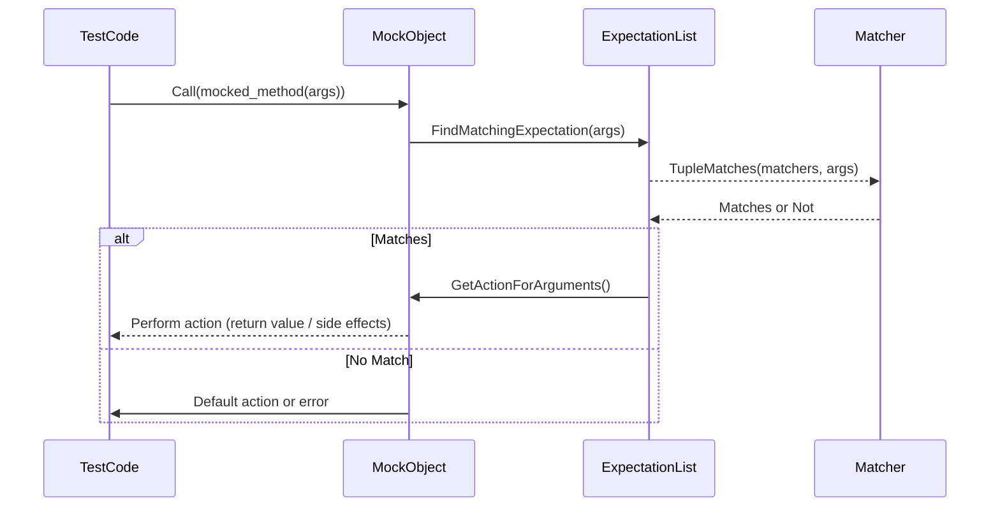

# Matchers & Call Verification

A core strength of GoogleMock lies in its ability to flexibly specify what arguments mock functions are expected to be called with and to verify those calls. This reference guide provides you with a comprehensive overview of matchers—predicates for method arguments—and the macros and constructs used to verify function calls and their properties.

---

## 1. Understanding Matchers

Matchers belong at the heart of expressing expectations about mock function calls. They enable your tests to focus only on relevant aspects of arguments, while ignoring less interesting details, preventing brittle tests that break with irrelevant changes.

### 1.1 What are Matchers?

Matchers act like predicates that check whether a function argument meets specific conditions. Instead of specifying exact values for arguments, matchers let you write expressive, composable rules about what kinds of arguments you care about.

For example, to expect a call with a positive integer:

```cpp
using ::testing::Gt;
EXPECT_CALL(mock_obj, Foo(Gt(0)))
    .WillOnce(Return(true));
```

If you don't care about an argument's value, use the wildcard matcher `_`:

```cpp
EXPECT_CALL(mock_obj, Foo(_, _));  // Matches any two arguments
```

### 1.2 Using Built-in Matchers

GoogleMock provides an extensive range of built-in matchers to capture common scenarios, such as:

| Matcher    | Description                                     |
|------------|------------------------------------------------|
| `_`        | Wildcard that matches any value                  |
| `Eq(val)`  | Equals a specific value (also implicit in literals) |
| `Ne(val)`  | Not equal to a value                              |
| `Lt(val)`  | Less than a value                                 |
| `Le(val)`  | Less than or equal to value                       |
| `Gt(val)`  | Greater than value                                |
| `Ge(val)`  | Greater than or equal to value                    |
| `Not(m)`   | Negation of matcher `m`                           |
| `AllOf(m1,...)` | Matches if all sub-matchers match              |
| `AnyOf(m1,...)` | Matches if any sub-matcher matches              |
| `ElementsAre(...)` | Matches container elements by order           |
| `UnorderedElementsAre(...)` | Matches container elements ignoring order  |
| `Pointee(m)` | Matches pointer to a value matching `m`         |

For example, matching a vector argument with ordered elements:

```cpp
EXPECT_CALL(mock_obj, ProcessVector(ElementsAre(1, 2, 3)));
```

See the [Matchers Reference](reference/matchers.md) for a complete list.

### 1.3 Safe Matcher Casting

Sometimes argument types don’t match exactly. Use `SafeMatcherCast<T>(m)` to safely cast a matcher `m` to type `Matcher<T>`, ensuring implicit conversions don't result in errors.

```cpp
EXPECT_CALL(mock, Foo(SafeMatcherCast<Derived*>(base_class_matcher)));
```

### 1.4 Matchers for Overloaded Methods and Const Methods

To differentiate among overloaded or const and non-const overloads, use the `Const()` wrapper:

```cpp
EXPECT_CALL(Const(mock_obj), GetValue()).WillOnce(Return(value));
```

When overloading by argument types, specifying matchers with explicit argument types helps disambiguate.


## 2. Verifying Function Calls with `EXPECT_CALL` and Related Macros

The cornerstone of mocking is to declare expectations that your mock object will receive calls matching certain signatures and behaviors.

### 2.1 Basic `EXPECT_CALL` Syntax

```cpp
EXPECT_CALL(mock_object, Method(matchers...))
    .Times(cardinality)
    .WillOnce(action)
    .WillRepeatedly(action);
```

- `mock_object` — the mock instance
- `Method(matchers...)` — the method and matchers for arguments
- Optional modifiers control call count and behavior

### 2.2 Clauses to Control Expectations

The following methods are chainable and must appear in order:

| Clause             | Purpose                                               | Usage Constraint              |
|--------------------|-------------------------------------------------------|------------------------------|
| `.With(matcher)`   | Applies a multi-argument matcher to all arguments     | Max once, first clause        |
| `.Times(cardinality)` | Specifies the number of expected calls               | Max once                     |
| `.InSequence(...)` | Requests particular call ordering across mocks        | Any number of times          |
| `.After(...)`      | Sets expectations on call order using named calls     | Any number of times          |
| `.WillOnce(action)` | Sets behavior for a single matching call             | Any number of times          |
| `.WillRepeatedly(action)` | Sets behavior after all `WillOnce` actions are used | Max once                    |
| `.RetiresOnSaturation()` | Makes expectation inactive after saturation          | Max once, last clause        |


### 2.3 Using `Times()` -- Cardinalities

GoogleMock supports many cardinalities for call counts:

- `Exactly(n)` or simply `n` — exactly _n_ calls
- `AnyNumber()` — zero or more calls
- `AtLeast(n)` — at least _n_ calls
- `AtMost(n)` — at most _n_ calls
- `Between(m, n)` — calls between _m_ and _n_ inclusive

If omitted, GoogleMock infers `Times()` based on actions:

- No `.WillOnce()` or `.WillRepeatedly()` means exactly 1 call
- _n_ `.WillOnce()` clauses with no `.WillRepeatedly()` means exactly _n_ calls
- _n_ `.WillOnce()` clauses with one `.WillRepeatedly()` means at least _n_ calls

### 2.4 Handling Argument Matching with `.With()` Clause

Allows matching the entire argument tuple with a multi-argument matcher:

```cpp
EXPECT_CALL(mock_obj, Method(_, _))
    .With(Gt());  // Expects first arg < second arg
```

This is especially useful to express relationships between parameters.

### 2.5 Ordering and Partial Ordering

By default, calls may occur in any order. To enforce ordering:

- Use `InSequence` object to make all expectations within scope ordered
- Use `.InSequence(sequence_obj)` and `.After(expectation)` to define sequences or DAGs

Example of a sequence:

```cpp
{
  InSequence s;
  EXPECT_CALL(mock, Foo(1));
  EXPECT_CALL(mock, Foo(2));
}
```

For partial orders, use multiple sequences and/or `.After()` clauses.

### 2.6 Retiring Expectations

Expectations remain "sticky" by default. Use `.RetiresOnSaturation()` to mark an expectation as retired as soon as it saturates:

```cpp
EXPECT_CALL(mock, Foo(7))
    .Times(2)
    .RetiresOnSaturation();
```

This allows another expectation to match subsequent calls.


## 3. Writing Custom Matchers

Sometimes built-in matchers are insufficient. You can define your own:

### 3.1 MATCHER Macros

```cpp
MATCHER(IsDivisibleBy7, "") {
  return (arg % 7) == 0;
}
```

You can use it as:

```cpp
EXPECT_CALL(foo, Bar(IsDivisibleBy7()));
```

### 3.2 MATCHER_P and MATCHER_Pk Macros

Parameterized matchers take arguments:

```cpp
MATCHER_P(isInRange, range, "") {
  return arg >= range.first && arg <= range.second;
}
```

Use:

```cpp
EXPECT_THAT(value, isInRange(std::make_pair(10, 20)));
```

### 3.3 Implementing Matcher Classes

For advanced matchers, implement a class with:

- `bool MatchAndExplain(T value, std::ostream* os) const` to check match and optionally explain
- `void DescribeTo(std::ostream* os) const` and `DescribeNegationTo` for messages

Then use `Matcher<T>(your_class_instance)` to create a matcher.

## 4. Tips for Effective Verification

### 4.1 Use Wildcards Wisely

Avoid over-specifying argument expectations; omit or use `_` where appropriate.

### 4.2 Order Matters

Place more specific expectations after general ones to ensure they take precedence.

### 4.3 Managing Uninteresting Calls

By default, uninteresting calls emit warnings but don't fail tests — use `NiceMock` to suppress warnings or `StrictMock` to fail on uninteresting calls.

### 4.4 Verbose Logging

Use the `--gmock_verbose=info` flag to trace mock call matching and arguments.

### 4.5 Checking Call Counts

Expectations are automatically verified at mock destruction. You can also explicitly check with `Mock::VerifyAndClearExpectations(&mock_obj)`.

## 5. Example Workflow

Below is a typical usage example demonstrating matchers and call verification:

```cpp
#include <gmock/gmock.h>

using ::testing::Return;
using ::testing::_;
using ::testing::Gt;

class MockFoo {
 public:
  MOCK_METHOD(int, Compute, (int x, int y), ());
};

TEST(FooTest, ComputeBehavior) {
  MockFoo mock;

  // Default any call to Compute returns -1
  ON_CALL(mock, Compute(_, _)).WillByDefault(Return(-1));

  // Expect Compute called twice with x < y
  EXPECT_CALL(mock, Compute(_, _))
      .With(Gt())
      .Times(2)
      .WillOnce(Return(5))
      .WillOnce(Return(10));

  EXPECT_EQ(mock.Compute(3, 5), 5);
  EXPECT_EQ(mock.Compute(1, 2), 10);
  EXPECT_EQ(mock.Compute(10, 5), -1);  // Default action
}
```

Here, the matcher `Gt()` applies to the tuple `(x, y)`, requiring `x < y` (the
`Gt` matcher when used with tuples compares the entire argument tuple).

## 6. Related Verification Macros

- `EXPECT_CALL` — declares call expectations and behaviors.
- `ON_CALL` — declares default behaviors without requiring calls.
- `EXPECT_THAT` — verifies a value against a matcher.

## 7. Troubleshooting

<AccordionGroup title="Common Matchers & Call Verification Issues">
<Accordion title="Why am I seeing 'Uninteresting mock function call' warnings?">
If a mock method is called but no `EXPECT_CALL` was set for it, this warning
appears by default. To suppress, either add `EXPECT_CALL(...).Times(AnyNumber())`
or use `NiceMock`.
</Accordion>
<Accordion title="My expectations are not matched as I expect; what's wrong?">
Use the `--gmock_verbose=info` command-line flag to trace expectation setup and
which expectation matches each call. This can help identify mistyped matchers or
the wrong ordering of expectations.
</Accordion>
<Accordion title="How do I handle overloaded methods when setting expectations?">
Use `Const(mock)` for const overloads, and specify argument matchers with explicit
types to disambiguate overloads.
</Accordion>
<Accordion title="Why does the test fail if I call the mock method more times than expected?">
Expectations are "sticky" by default; an expectation remains active even after
it saturates unless marked `.RetiresOnSaturation()`. Add this clause to let
subsequent calls match another expectation.
</Accordion>
</AccordionGroup>

---

## Detailed References

Greatly expand your mastery by consulting these references:

- [GoogleTest Matchers Reference](reference/matchers.md)
- [GoogleMock Mocking Reference](docs/reference/mocking.md) for the full macro and matcher syntax
- [gMock Cheat Sheet](docs/gmock_cheat_sheet.md) for quick lookup of syntax
- [gMock Cookbook](docs/gmock_cook_book.md) for advanced usage recipes

---

## Diagram: How Matchers and Expectations Interact



---

## Additional Tips

- Always set `EXPECT_CALL` before exercising the mock to avoid undefined behavior.
- Use `.With()` clause sparingly to avoid over-constraining.
- For complex argument validation, consider custom matchers or `Truly()` predicates.
- Use `Sequence` and `After` clauses for precise call order control.


---

For more specialized custom matchers and verification patterns, visit the guides on [Custom Actions and Matchers](guides/advanced-patterns/custom-actions-matchers.mdx) and the [Mocking Reference](docs/reference/mocking.md).

<Source url="https://github.com/google/googletest" paths='[{"path": "docs/reference/mocking.md", "range": "#macros-EXPECT_CALL"},{"path": "docs/reference/matchers.md"}]'/>