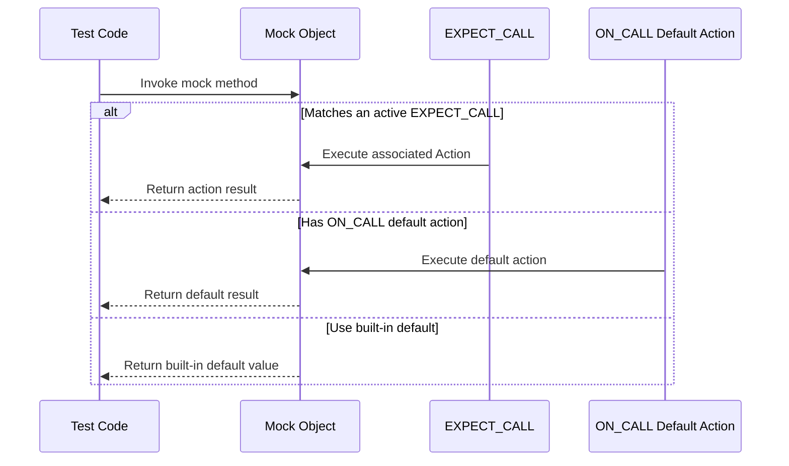

# Actions & Stubbing

API details for specifying mock behaviors using built-in and custom actions. Explores macros, templates, and utilities to define return values, side effects, invocation actions, and flexible callback usage, supporting advanced stubbing scenarios.

---

## Overview

In GoogleMock, *actions* specify what a mock function should do when it is invoked. This page dives into the rich set of built-in and extensible actions available, showing how you can define the return values, side effects, and invocation behavior of mocked methods. Actions are central for creating sophisticated mock behaviors that replace real implementations during testing.

This includes defining single-call or repeated behaviors, chaining multiple effects, invoking callbacks passed as arguments, delegating to real or fake implementations, and creating your own custom actions to precisely control mock function executions.

The documentation here focuses exclusively on how to specify these mocking behaviors—not on how to define mocks or expectations themselves. To learn about defining mocks and setting expectations, see the related pages on [Mock Creation & Usage](../mocking-framework-apis/mocking-basics-api.md) and [Matchers & Call Verification](../mocking-framework-apis/matchers-and-verification-api.md).

---

## Built-in Actions

GoogleMock provides a comprehensive library of pre-defined actions designed for the most common stubbing requirements. These include:

### Returning Values

| Action               | Description                                                    |
| ---------------------| --------------------------------------------------------------|
| `Return()`           | Return from a `void` mock function.                            |
| `Return(value)`      | Return the provided `value`. The value is converted *when the expectation is set*, not at mock call time. |
| `ReturnArg<N>()`     | Return the N-th (0-based) argument of the mock function.       |
| `ReturnNew<T>(...)`  | Return a freshly allocated `new T(...)` object each time.      |
| `ReturnNull()`       | Return a null pointer.                                         |
| `ReturnPointee(ptr)` | Return the value pointed to by `ptr` at the time the action is executed.
| `ReturnRef(variable)`| Return a reference to a variable; use when mocking functions returning references. |
| `ReturnRefOfCopy(value)` | Return a reference to a copy of a value which lasts as long as the action. |
| `ReturnRoundRobin({a1, ..., ak})` | Return successive values from a list, cycling repeatedly. |

### Side Effects

Actions supporting manipulation of mock function arguments to simulate output parameters, state changes, or other side effects.

| Action                              | Description                                                     |
| ---------------------------------- | ---------------------------------------------------------------|
| `Assign(&variable, value)`          | Assign `value` to a variable (useful for setting output parameters).
| `DeleteArg<N>()`                    | Deletes the N-th argument (which must be a pointer).            |
| `SaveArg<N>(pointer)`               | Saves the N-th argument to `*pointer` by copy assignment.       |
| `SaveArgByMove<N>(pointer)`         | Saves the N-th argument by move-assignment to `*pointer`.       |
| `SaveArgPointee<N>(pointer)`        | Saves the value pointed to by the N-th argument to `*pointer`.  |
| `SetArgReferee<N>(value)`           | Assigns value to the reference argument at position N.          |
| `SetArgPointee<N>(value)`           | Assigns value to the pointee of argument N.                      |
| `SetArrayArgument<N>(first, last)` | Copies a range of elements to the array pointed by argument N.  |
| `SetErrnoAndReturn(error, value)`  | Set `errno` to `error` and return `value`.                      |
| `Throw(exception)`                  | Throw the specified exception. (Since v1.1.0)                   |

### Invoking Functions and Callables

Actions can wrap existing free functions, member functions, lambdas, or function objects:

| Action                                | Description                                                      |
| ------------------------------------ | --------------------------------------------------------------- |
| `f`                                  | Calls a callable `f` with the mock function arguments.          |
| `Invoke(f)`                          | Calls free/static function, functor, or lambda `f`.             |
| `Invoke(object_ptr, &Class::method)` | Calls a method on `object_ptr` with mock function arguments.    |
| `InvokeWithoutArgs(f)`               | Invokes a zero-argument callable ignoring mock function arguments. |
| `InvokeWithoutArgs(object_ptr, &Class::method)` | Invokes a zero-argument method on an object.          |
| `InvokeArgument<N>(args...)`         | Invokes the N-th argument (a callback) with provided arguments. |

### Composite Actions

Composite actions let you combine or adapt other actions for more complex behaviors.

| Action                         | Description                                                  |
| ------------------------------ | ------------------------------------------------------------|
| `DoAll(a1, a2, ..., an)`       | Execute all actions sequentially; return the result of `an`.  |
| `IgnoreResult(a)`              | Perform action `a` but discard its result (useful when `a` returns non-void but mock function returns void). |
| `WithArg<N>(a)`                | Pass only the N-th argument to inner action `a`.             |
| `WithArgs<N1, N2, ..., Nk>(a)` | Pass selected arguments by index to inner action `a`.         |
| `WithoutArgs(a)`               | Invoke inner action with no arguments.                        |

---

## Using Actions in Mocks

Actions are specified when setting expectations or default behaviors for mock methods:

- In `EXPECT_CALL()`, use `.WillOnce(action)` to specify an action for a single call and `.WillRepeatedly(action)` for subsequent calls.

- In `ON_CALL()`, use `.WillByDefault(action)` to specify the fallback action if no expectation matches.

Example:

```cpp
using ::testing::Return;
using ::testing::Invoke;

EXPECT_CALL(mock, GetValue())
    .WillOnce(Return(42))                  // Returns 42 once.
    .WillRepeatedly(Return(7));           // Then returns 7 every time afterwards.

ON_CALL(mock, GetName())
    .WillByDefault(Return("Default Name"));

EXPECT_CALL(mock, DoWork(_))
    .WillOnce(Invoke([](int n) { return n * 2; })); // Use lambda as action
```

### Important notes:

- The arguments in actions are generally by value. When passing references to actions or callbacks, prefer wrapping them with `std::ref()` to avoid unnecessary copies.

- Actions specified in an expectation (`EXPECT_CALL`) override those in `ON_CALL` for matching calls.

- If no action is specified, built-in default actions apply: `void` simply returns, `bool` returns `false`, numeric types return zero, and pointers return `nullptr`.

---

## Creating Custom Actions

To extend GoogleMock with behaviors not covered by built-in actions, define your own callable object with a `operator()` matching the signature of your mock method.

```cpp
struct MyAction {
  ReturnType operator()(ArgType1 arg1, ArgType2 arg2) {
    // Implement behavior
    return some_value;
  }
};

EXPECT_CALL(mock, DoSomething(_))
    .WillOnce(MyAction());
```

For more control, implement the `::testing::ActionInterface` interface, or create polymorphic actions with `MakePolymorphicAction()` to handle multiple mock signatures.

---

## Delegating Calls

GoogleMock supports delegating the behavior of mock methods to other objects or real implementations.

### Delegating to a Fake

You can have a mock call methods on a fake implementation to reuse logic:

```cpp
class MockFoo : public Foo {
 public:
  MOCK_METHOD(int, Bar, (int n), (override));

  void DelegateToFake() {
    ON_CALL(*this, Bar)
        .WillByDefault([this](int n) { return fake_.Bar(n); });
  }

 private:
  FakeFoo fake_;
};
```

### Delegating to the Real Object

Similarly, delegate default mock actions to a real concrete object:

```cpp
class MockFoo : public Foo {
 public:
  MockFoo() {
    ON_CALL(*this, Bar)
        .WillByDefault([this](int n) { return real_.Bar(n); });
  }
  MOCK_METHOD(int, Bar, (int n), (override));

 private:
  Foo real_;
};
```

You still get to verify calls while preserving real logic.

### Delegating to the Parent Class

If overriding a non-pure virtual method, you can call the parent implementation inside an action:

```cpp
EXPECT_CALL(foo, ConcreteMethod(_))
    .WillOnce([&foo](ArgType arg) {
      return foo.Foo::ConcreteMethod(arg);
    });
```

---

## Advanced: Invoking Callback Arguments

When a mock method receives a callback (function pointer, functor, or lambda) as an argument, you can invoke it via `InvokeArgument<N>(args...)`.

For example, if a mock method takes a callback as its second argument:

```cpp
EXPECT_CALL(mock, SomeMethod(_, _))
    .WillOnce(InvokeArgument<1>(5));  // Calls callback(5)
```

If the callback expects references, wrap arguments in `std::ref()` to pass by reference.

---

## Usage Best Practices

- Use `ON_CALL` for setting common default mock behavior shared across tests.
- Use `EXPECT_CALL` to specify expected calls and their actions.
- Chain multiple `.WillOnce()` calls to specify behaviors for consecutive calls.
- Use `.WillRepeatedly()` for fallback behavior after exhausting `.WillOnce()` actions.
- Combine actions with `DoAll()` for composite behaviors.
- When writing custom actions, keep action's side effects idempotent to avoid test brittleness.

---

## Troubleshooting Common Issues

- If a mock method returns an unexpected value, ensure `Return()` is not returning a moved-from object.
- Use `ReturnPointee()` for live values instead of captured ones.
- Remember `WillOnce()` executes its action only once; multiple calls will use the next action or default action.
- Use `RetiresOnSaturation()` to let an expectation become inactive after matching its cardinality to allow fallback expectations.
- When invoking callbacks with reference arguments, wrap them with `std::ref()`.

---

## Additional Resources

- See the [Actions Reference](../reference/actions.md) for all built-in actions.
- Consult the [Mocking Reference](../reference/mocking.md) for interaction with matchers and expectations.
- Review the [gMock Cookbook](../gmock_cook_book.md) for hands-on recipes to customize actions.
- Explore [Extending gMock with Custom Actions and Matchers](guides/advanced-patterns/custom-actions-matchers.mdx) for advanced usage.

---

## Diagram: Action Invocation Flow



