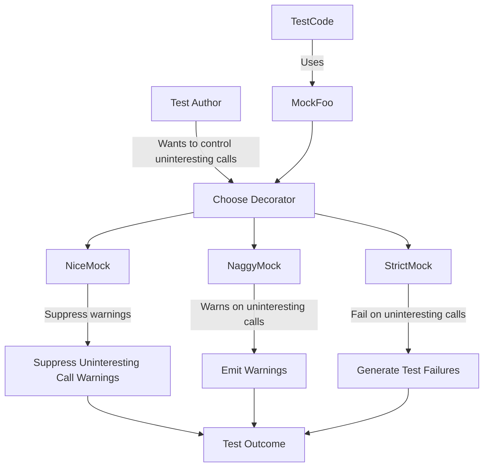

# Strictness Modes

This page explains the decorators available in GoogleMock—`NiceMock`, `StrictMock`, and `NaggyMock`—which help you control how uninteresting or unexpected calls on mock objects are handled during testing. Use these decorators to fine-tune your mock object's behavior to suit different testing scenarios, ranging from exploratory development to robust production-grade test suites.

---

## Understanding the Strictness Modes

By default, GoogleMock treats calls to mock methods without explicit expectations as "uninteresting calls." How these calls are handled depends on the strictness mode of the mock object:

| Decorator         | Behavior on Uninteresting Calls                           | Typical Use Case                             |
|-------------------|----------------------------------------------------------|---------------------------------------------|
| `NaggyMock<T>`    | Prints a warning message (default behavior)               | Useful during test development and debugging |
| `NiceMock<T>`     | Suppresses warnings on uninteresting calls               | Preferred for maintainable tests that tolerate extra calls |
| `StrictMock<T>`   | Treats all uninteresting calls as test failures           | Best when you want to catch any unexpected interactions |

Currently, `NaggyMock` behavior is the default for regular mocks. However, upcoming changes will switch the default to `NiceMock` for better test maintainability.

## Why Does Strictness Matter?

Mocks let you specify expectations (`EXPECT_CALL`) on method calls, but it’s common for a mock class to have many methods you do not explicitly specify expectations for. 

- **Uninteresting calls** are calls to mock methods **without** any `EXPECT_CALL` specification.
- **Unexpected calls** are calls to mock methods **with** expectations, but whose arguments don’t match any `EXPECT_CALL`.

The choice of mock strictness affects how your tests report and handle uninteresting calls. It does **not** change the behavior towards unexpected calls—they always cause test failures.

## How To Use the Strictness Decorators

### Basic Usage

Assuming you have a mock class `MockFoo`, you can wrap it with a strictness modifier:

```cpp
using ::testing::NiceMock;
using ::testing::StrictMock;
using ::testing::NaggyMock;

// Default naggy mock
MockFoo default_mock;

// A nice mock that suppresses warnings for uninteresting calls
NiceMock<MockFoo> nice_mock;

// A strict mock that treats uninteresting calls as errors
StrictMock<MockFoo> strict_mock;
```

Each decorator acts as a subclass of the mock class, so usage is identical. Constructors are "inherited", so if your `MockFoo` expects arguments, you can pass them through:

```cpp
NiceMock<MockFoo> nice_mock(5, "hello");  // Calls MockFoo(int, const char*)
StrictMock<MockFoo> strict_mock(7);
```

### Effect on Test Behavior

- When your test uses a **NiceMock**, uninteresting calls will be silently ignored.
- When your test uses a **NaggyMock**, uninteresting calls generate warning messages but do not fail the test.
- When your test uses a **StrictMock**, uninteresting calls generate test failures.

For example, consider:

```cpp
EXPECT_CALL(mock_foo, DoSomething());

mock_foo.DoSomething();  // Allowed and expected
mock_foo.DoSomethingElse();  // What happens here depends on strictness
```

- With `NiceMock`, the call to `DoSomethingElse()` quietly proceeds.
- With `NaggyMock`, a warning is printed.
- With `StrictMock`, the test fails immediately.

### When to Use Each

- Use **NiceMock** when your tests only care about specific interactions and want to tolerate incidental calls to others.
- Use **NaggyMock** (the current default) when you want to be reminded about any unanticipated usage but still continue running the test.
- Use **StrictMock** when it’s critical to catch any unexpected calls to keep tests tightly scoped and resilient to unintended behaviors.

## Important Constraints and Caveats

- `NiceMock<T>`, `NaggyMock<T>`, and `StrictMock<T>` only work if all the mock methods are defined directly in class `T` with the `MOCK_METHOD` macros. They may not affect methods inherited from base classes depending on compiler behavior.
- Nesting strictness modifiers (e.g., `NiceMock<StrictMock<T>>`) is not supported.
- If your mock class `T` doesn’t have a virtual destructor, behavior of these wrappers may be unreliable.

## Practical Examples

### Suppressing Warnings in Exploratory Tests

```cpp
using ::testing::NiceMock;

class MockDatabase {
 public:
  MOCK_METHOD(void, Connect, (), ());
  MOCK_METHOD(int, GetUserCount, (), ());
};

TEST(UserManagerTest, ConnectsToDatabase) {
  NiceMock<MockDatabase> db;  // No warnings about uninteresting calls
  EXPECT_CALL(db, Connect());

  UserManager mgr(&db);
  mgr.Initialize();  // Only Connect() call expected
}
```

The call to `GetUserCount()` if inadvertent will generate no warnings, keeping test output clean.

### Strictly Enforcing Method Call Coverage

```cpp
using ::testing::StrictMock;

StrictMock<MockDatabase> db;
EXPECT_CALL(db, Connect());

UserManager mgr(&db);
mgr.Initialize();
// if the code calls db.GetUserCount() without expectation, the test fails
```

In this mode, any call to a non-expected method immediately results in test failure, helping identify gaps in test coverage.

## Implementation Notes

Each of these decorators is a template class that privately inherits an internal implementation registering the corresponding reaction (`AllowUninterestingCalls`, `WarnUninterestingCalls`, or `FailUninterestingCalls`) upon construction and deregisters on destruction. This ensures consistent strictness behavior through the mock’s lifecycle.

## Troubleshooting

- **Why do I still get warnings with NiceMock or StrictMock?**
  - If your mock methods are defined in a base class rather than directly in the mock class, the decorators may not take effect.

- **Can I combine these decorators?**
  - No, nesting is unsupported and will trigger compilation errors.

- **What if my mock class has no virtual destructor?**
  - This can cause undefined behavior. It’s best practice to define a virtual destructor in any mock class.

- **Unexpected call errors remain unchanged by strictness mode. Why?**
  - Strictness decorators only affect uninteresting calls, not unexpected calls which always signal failures.

## Summary

Decorate your mock objects with `NiceMock`, `NaggyMock`, or `StrictMock` to control how GoogleMock handles uninteresting calls — calls to mock methods without explicit expectations. This choice impacts the verbosity and strictness of your tests. Use `NiceMock` for clean tests that ignore such calls, `NaggyMock` to warn about them (default for now), and `StrictMock` to treat them as errors, ensuring strict interaction verification.

---

## Additional Resources

- [gMock Cookbook: The Nice, the Strict, and the Naggy](https://google.github.io/googletest/gmock_cook_book.html#NiceStrictNaggy)
- [Mocking Reference - StrictMock, NiceMock, and NaggyMock](reference/mocking.md#NiceMock)
- [gMock for Dummies - Control Mock Strictness](https://google.github.io/googletest/gmock_for_dummies.html)

---

## Illustrative Example

```cpp
#include <gmock/gmock.h>
using ::testing::NiceMock;
using ::testing::StrictMock;

class MockFoo {
 public:
  MOCK_METHOD(void, DoThis, ());
  MOCK_METHOD(void, DoThat, ());
};

// Test with NiceMock - uninteresting calls produce no warnings
TEST(MyTest, NiceMockExample) {
  NiceMock<MockFoo> mock;
  EXPECT_CALL(mock, DoThis());

  mock.DoThis();       // Expected call
  mock.DoThat();       // Uninteresting call, no warnings
}

// Test with StrictMock - uninteresting calls cause failures
TEST(MyTest, StrictMockExample) {
  StrictMock<MockFoo> mock;
  EXPECT_CALL(mock, DoThis());

  mock.DoThis();        // Expected call
  mock.DoThat();        // Test failure: uninteresting call
}
```

## Conceptual Diagram


