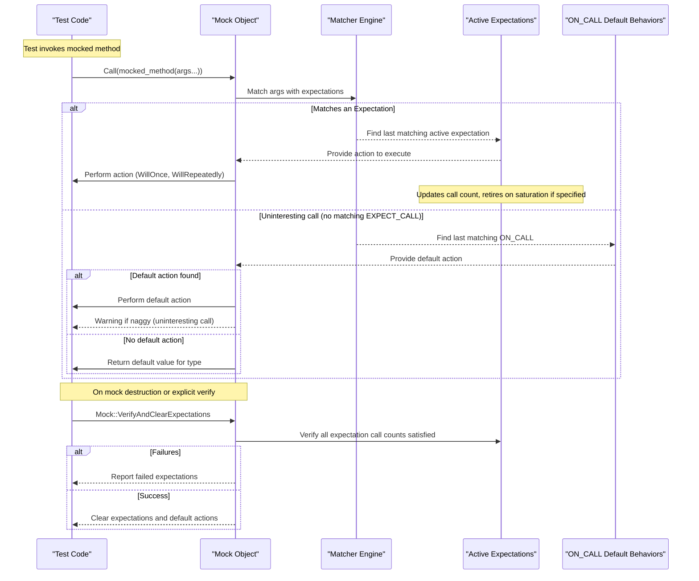

# Setting Expectations and Verifications

This page demonstrates how to specify expected method calls on mock objects, match arguments precisely, define the results returned or actions performed on calls, and verify that all expected calls occur properly during test execution. It focuses on the primary APIs in GoogleMock: `ON_CALL`, `EXPECT_CALL`, and related mechanisms for controlling call ordering, sequences, and mock strictness.

---

## 1. Understanding Expectations and Default Actions

### What Are Expectations?
Expectations specify which mock methods are expected to be called during your test, with what arguments, how many times, and optionally, what behavior they should perform.

GoogleMock distinguishes between **expectations** and **default actions**:

- **Expectations**, declared via `EXPECT_CALL`, define calls that must happen (or must not happen) and supply the behavior for those calls.
- **Default Actions**, declared via `ON_CALL`, set up default behavior for calls that are not explicitly expected but nonetheless occur.

> **Key principle:** Use `ON_CALL` to define *what happens* by default (without enforcing call counts), and `EXPECT_CALL` to define *what must happen* (verifying calls and counts).

<Tip>
Avoid overusing `EXPECT_CALL`. Too many expectations can make your tests brittle. Set expectations only where you need to verify interactions, and use `ON_CALL` for typical default behaviors.
</Tip>


## 2. Linking Mock Methods to Expectations with `EXPECT_CALL`

### Basic Syntax
```cpp
EXPECT_CALL(mock_object, Method(matchers...))
    .With(multi_argument_matcher)    // Optional, used at most once
    .Times(cardinality)              // Optional, used at most once
    .InSequence(sequences...)        // Optional, can be repeated
    .After(expectations...)          // Optional, can be repeated
    .WillOnce(action)                // Optional, can be repeated
    .WillRepeatedly(action)          // Optional, at most once
    .RetiresOnSaturation();          // Optional, at most once
```

- The macros expect *all* the argument matchers or `_` wildcards for each argument.
- Omitting the argument list is possible **only** for methods that are *not overloaded*, and then means all arguments are wildcarded.

### Selecting Arguments
You can specify argument matchers individually, for example:
```cpp
EXPECT_CALL(mock, Foo(Eq(5), Lt(10)));  // Foo expected with 5 and less than 10
```
Or omit the argument list to expect any arguments (non-overloaded methods only):
```cpp
EXPECT_CALL(mock, Foo);  // Expects Foo called with any arguments
```

### The `.With()` Clause

For complex conditions on all arguments as a tuple, `.With()` allows passing a matcher for the combined argument tuple:
```cpp
EXPECT_CALL(mock, SetPosition(_, _))
    .With(Lt())  // matches first arg < second arg
    .Times(1);
```
This applies only to calls where the full tuple of arguments satisfies the matcher.

### The `.Times()` Clause
Controls how many times the expected call should happen:
- `AnyNumber()`: any number, including zero
- `AtLeast(n)`, `AtMost(n)`, `Between(m,n)`, or `Exactly(n)`/`n`

If `.Times()` is omitted, GoogleMock infers:
- If no `WillOnce` or `WillRepeatedly`, `.Times(1)` is assumed
- If there are `n` `WillOnce` actions but no `WillRepeatedly` action, `.Times(n)`
- If there are `n` `WillOnce` actions and one `WillRepeatedly` action, `.Times(AtLeast(n))`

### The `.WillOnce()` and `.WillRepeatedly()` Clauses
Define what happens when the expectation matches:
- `.WillOnce(action)` sets the behavior for a single matching call; supports multiple calls chained in a row to specify behavior per call.
- `.WillRepeatedly(action)` defines behavior for all matching calls beyond those covered by `.WillOnce()` clauses.

For example:
```cpp
EXPECT_CALL(mock, GetValue())
    .WillOnce(Return(10))
    .WillOnce(Return(20))
    .WillRepeatedly(Return(30));
```
Here, first call returns 10, second returns 20, and subsequent calls return 30.

### The `.InSequence()` Clause

You can declare sequences to enforce order on calls:
```cpp
Sequence s;
EXPECT_CALL(mock, Method1()).InSequence(s);
EXPECT_CALL(mock, Method2()).InSequence(s);
```
This requires `Method1()` to be called before `Method2()`.

You can associate multiple sequences for specifying partial orderings.

### The `.After()` Clause

Adds ordering constraints indicating the current expectation should occur only after specified other expectations or sets of expectations are satisfied.

Example:
```cpp
Expectation init_x = EXPECT_CALL(mock, InitX());
Expectation init_y = EXPECT_CALL(mock, InitY());
EXPECT_CALL(mock, Process()).After(init_x, init_y);
```
This requires `Process()` to be called only after both `InitX()` and `InitY()`.

### The `.RetiresOnSaturation()` Clause

Marks an expectation to become inactive once its call count reaches the upper bound.
This helps specify behaviors where limited calls match a particular expectation before fallback or other expectations are used.

Example:
```cpp
EXPECT_CALL(mock, Foo(7)).Times(2).RetiresOnSaturation();
EXPECT_CALL(mock, Foo(_)).Times(AnyNumber());
```
Here, first two calls with `7` match the first expectation, then subsequent calls match the second.

## 3. Setting Default Behaviors with `ON_CALL`

### Syntax

```cpp
ON_CALL(mock_object, Method(matchers...))
    .With(multi_argument_matcher)  // Optional, at most once
    .WillByDefault(action);        // Required
```

`ON_CALL` differs from `EXPECT_CALL` by setting behavior **without** imposing an expectation of call count or order.

### Multiple `ON_CALL`s

If multiple `ON_CALL` clauses are defined for the same method, GoogleMock uses the **last matching** one to determine the default action.

### Usage

Use `ON_CALL` in your test fixture or setup to provide default behaviors shared across many tests.

Example:
```cpp
ON_CALL(mock, GetAnswer())
    .WillByDefault(Return(42));
```
Calls to `GetAnswer()` will return 42 unless an expectation overrides them.

<Tip>
If you want calls always to be expected and no uninteresting call warnings are desired, use an `EXPECT_CALL` with `.Times(AnyNumber())` rather than `ON_CALL`.
</Tip>

## 4. Call Precedence and Overlapping Expectations

- **Newer expectations override older ones for matching calls.**
- When multiple expectations could match a call, GoogleMock selects the last active matching expectation.
- `EXPECT_CALL`s and `ON_CALL`s maintain separate precedence orderings.

Example:
```cpp
EXPECT_CALL(mock, Foo(_)).WillRepeatedly(Return(1));
EXPECT_CALL(mock, Foo(5)).WillRepeatedly(Return(2));
```
When `Foo(5)` is called, the second expectation fires; for `Foo(6)`, the first applies.

## 5. Verification and Clearing Expectations

### Automatic Verification

At destruction time, a mock object automatically verifies that all expectations have been satisfied according to their cardinalities.

If expectations are not met, GoogleTest reports failures with detailed diagnostic messages.

### Manual Verification

You can force verification earlier or explicitly:
```cpp
bool ok = Mock::VerifyAndClearExpectations(&mock_obj);
EXPECT_TRUE(ok);
```
This verifies that all expectations on the mock object have been satisfied and clears them.

```cpp
bool ok = Mock::VerifyAndClear(&mock_obj);
EXPECT_TRUE(ok);
```
This verifies all expectations *and* clears default actions set by `ON_CALL()`.

<Tip>
Avoid setting new expectations after verification and clearing. Doing so leads to undefined behavior.
</Tip>

## 6. Controlling Uninteresting Calls: Nice, Naggy, and Strict Mocks

By default, mock methods not covered by `EXPECT_CALL` are considered *uninteresting* calls.

- **NaggyMock** (default currently): Warns on uninteresting calls but allows them.
- **NiceMock**: Suppresses warnings on uninteresting calls.
- **StrictMock**: Treats uninteresting calls as test failures.

Example:
```cpp
using ::testing::NiceMock;
NiceMock<MockClass> nice_mock;
```

Use these based on the strictness you want for undocumented calls in your tests.

## 7. Best Practices and Common Pitfalls

- Define expectations *before* exercising code under test to guarantee deterministic matching and verification.
- Use `ON_CALL` for default behavior, reserving `EXPECT_CALL` for behavior verification.
- Prefer sequences or `.After()` when order matters.
- Combine `.WillOnce()` and `.WillRepeatedly()` to flexibly specify behavior across multiple calls.
- Use `RetiresOnSaturation()` to prevent expectations from remaining sticky and overlapping subsequent calls.
- When mocking overloaded methods, be explicit about which overload you mean (use `Const()` wrapper for const methods).
- Avoid setting expectations with unprotected commas; alias complex types or wrap in parentheses.

## 8. Example: Using `EXPECT_CALL`, Sequences, and Default Actions

```cpp
using ::testing::Return;
using ::testing::Sequence;
using ::testing::_;

class MockCalculator {
 public:
  MOCK_METHOD(int, Add, (int a, int b), ());
  MOCK_METHOD(int, Sub, (int a, int b), ());
};

TEST(CalculatorTest, OperationsInSequence) {
  MockCalculator mock_calc;

  Sequence seq;

  EXPECT_CALL(mock_calc, Add(1, 2))
      .InSequence(seq)
      .WillOnce(Return(3));
  EXPECT_CALL(mock_calc, Sub(_, _))
      .InSequence(seq)
      .WillOnce(Return(0));

  ON_CALL(mock_calc, Add(_, _)).WillByDefault(Return(-1));

  EXPECT_EQ(mock_calc.Add(1, 2), 3);  // Matches EXPECT_CALL with sequence
  EXPECT_EQ(mock_calc.Sub(5, 5), 0);  // Matches EXPECT_CALL with sequence
  EXPECT_EQ(mock_calc.Add(2, 3), -1); // Matches default ON_CALL
}
```

## 9. Troubleshooting

### Missing Call Failures
- Verify you have set up all `EXPECT_CALL` clauses before exercising code.
- Use `--gmock_verbose=info` to trace mock function calls and matching.

### Unexpected Call Failures
- Make sure there is an `EXPECT_CALL` matching the unexpected call arguments.
- Consider adding a catch-all `EXPECT_CALL(mock, Method(_)).Times(AnyNumber())` if some calls are allowed but not explicitly expected.

### Uninteresting Call Warnings
- Use `NiceMock` to suppress.
- Or specify expectations for those calls if you want to verify them.

### Call Order Failures
- Use sequences (`InSequence`, `.InSequence()`) or `.After()` to specify order constraints explicitly.


## 10. Additional Resources

- [GoogleMock for Dummies](https://google.github.io/googletest/gmock_for_dummies.html)
- [gMock Cookbook](https://google.github.io/googletest/gmock_cook_book.html)
- [Matchers Reference](matchers.md)
- [Actions Reference](actions.md)
- [Using Assertions Effectively Guide](/guides/real-world-usage-and-best-practices/using-assertions-effectively.md)
- [Creating and Using Mocks Guide](/guides/advanced-mocking-integrations/creating-and-using-mocks.md)


---

## Mermaid Diagram: Call Matching and Expectation Flow


