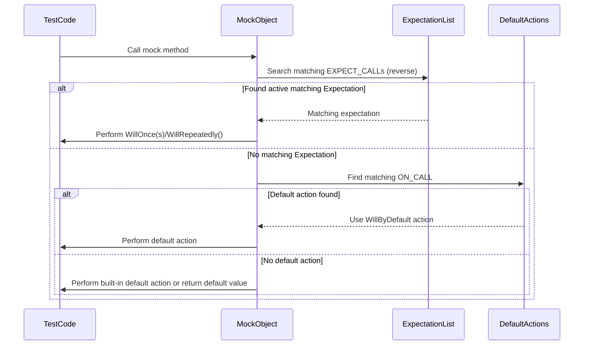

# Mock Actions and Defaults

Comprehensive catalog of built-in and user-defined actions in GoogleMock, including how to specify return values and side effects for mock functions. This page covers the usage of `ON_CALL` for setting default actions on mocks, explains default actions behavior, and describes variadic and templated action macros to help you customize mock behaviors effectively.

---

## Overview

When using mocks in your tests, controlling how mocked methods respond to calls is crucial. GoogleMock enables you to specify both explicit expectations (`EXPECT_CALL`) and default behaviors (`ON_CALL`). This page focuses on the latter and the variety of actions you can assign to mocks — detailing the built-in actions available, how to define default return values, and ways to chain or customize actions.

You will learn:

- How to assign default behaviors to mock methods using `ON_CALL`.
- How the default action system works and when it applies.
- Available side-effect and return-value actions.
- How to create composite and custom actions.
- Usage of variadic and templated action macros for advanced scenarios.

---

## 1. Assigning Default Actions with ON_CALL

GoogleMock separates behavior specification into two concepts:

- **EXPECT_CALL:** Sets up an expectation that a mock method will be called with specified arguments, along with the behavior for these calls.
- **ON_CALL:** Sets up default behavior for calls to a mock method when no explicit expectation exists.

### Syntax

```cpp
ON_CALL(mock_object, MockMethod(matchers))
    [.With(multi_argument_matcher)]  // optional
    .WillByDefault(action);
```

- `.With(...)` is optional and restricts the default action to calls where the combined arguments match.
- `.WillByDefault(...)` sets the default behavior invoked when calls occur outside explicit expectations.

### When to Use ON_CALL

Use `ON_CALL` to specify fallback or default behavior without requiring that the method must be called. This is ideal for setting up mocks that can be called any number of times without strict verification.

### Example

```cpp
using ::testing::_;
using ::testing::Return;

class MockFoo {
 public:
  MOCK_METHOD(int, GetValue, (), (const));
};

MockFoo foo;
ON_CALL(foo, GetValue()).WillByDefault(Return(42));

EXPECT_EQ(42, foo.GetValue());  // Will use the default action
```

---

## 2. Built-in Default Actions

GoogleMock provides built-in default actions and means to customize them:

- **Default Return Values:** By default, mock methods with non-void return types return zero-initialized or default-constructed values.
- **`DefaultValue<T>`:** Template to set or clear global default return values for types that mock methods return.

Example: Customize the default return value for a particular type:

```cpp
::testing::DefaultValue<std::unique_ptr<Buzz>>::SetFactory([] {
  return std::make_unique<Buzz>(AccessLevel::kInternal);
});

ON_CALL(foo, MakeBuzz(_)).WillByDefault(::testing::Invoke([](std::string) {
  return std::make_unique<Buzz>(AccessLevel::kInternal);
}));

// Reset when done
::testing::DefaultValue<std::unique_ptr<Buzz>>::Clear();
```

### Default Behavior Summary

| Return Type           | Built-in Default Action             |
|----------------------|-----------------------------------|
| `void`               | Return immediately                 |
| `bool`               | Return false                      |
| Numeric types        | Return zero                      |
| Pointer types        | Return null pointer               |
| Types with default ctor| Return default constructed value |

---

## 3. Common Built-in Actions

| Action                    | Description                              | Example Usage                                     |
|---------------------------|------------------------------------------|--------------------------------------------------|
| `Return(value)`           | Returns the given value, copied at expectation set time. | `.WillOnce(Return(5))`                           |
| `ReturnRef(variable)`     | Returns a reference to a variable.      | `.WillOnce(ReturnRef(my_var))`                    |
| `ReturnPointee(ptr)`      | Returns the value pointed to by `ptr` at call time. | `.WillRepeatedly(ReturnPointee(&live_value))`   |
| `SetArgPointee<N>(value)` | Sets value to the N-th argument pointer, useful for output params. | `.WillOnce(SetArgPointee<1>(42))`                |
| `DoAll(action1, action2, ...)` | Runs multiple actions in order and returns the last action's result. | `.WillOnce(DoAll(SetArgPointee<0>(5), Return(true)))` |
| `Invoke(function)`        | Invokes a callable with the mock arguments. | `.WillOnce(Invoke(&MyCallback))`                  |
| `InvokeWithoutArgs(function)` | Invokes callable without arguments.      | `.WillRepeatedly(InvokeWithoutArgs(&NoArgFunc))` |
| `InvokeArgument<N>(args...)` | Invokes the N-th argument (callable) with the given arguments. | `.WillOnce(InvokeArgument<1>(5))`                 |
| `DoDefault()`             | Perform the default action (i.e., that of `ON_CALL` or built-in). | `.WillRepeatedly(DoDefault())`                   |

See the [Actions Reference](../reference/actions.md) for full descriptions and examples.

---

## 4. Composing Actions

Often you want a mock method to do more than one thing, like setting an output argument and returning a value. Use `DoAll()` to sequence multiple actions:

```cpp
EXPECT_CALL(mock, Process(_))
    .WillOnce(DoAll(SetArgPointee<0>(5), Return(true)));
```
Only the result of the last action is used as the mock method's return value.

Others include:
- `IgnoreResult(action)` — Ignores the return value of `action`.
- `WithArg<N>(action)` — Calls `action` with only the N-th mock argument.
- `WithArgs<N1, ..., Nk>(action)` — Calls `action` with a subset of arguments.
- `WithoutArgs(action)` — Calls `action` without any arguments.

---

## 5. Variadic and Templated Action Macros

GoogleMock provides the following macro facilities for defining custom actions easily:

### ACTION, ACTION_P, ACTION_TEMPLATE

- `ACTION(Name) { ... }`
  Define an action named `Name` with no parameters.

- `ACTION_P(Name, param) { ... }`
  Parameterized action that accepts one argument.

- `ACTION_Pk(Name, p1, p2, ..., pk) { ... }`
  Parameterized action with multiple parameters.

- `ACTION_TEMPLATE(Name, HAS_TemplateParams, AND_ValueParams) { ... }`
  Defines a templated action.

These macros generate classes implementing the action callable interface.

### Example

```cpp
ACTION(IncrementArg0) {
  return ++arg0;
}

ACTION_P(AddToArg0, n) {
  return arg0 + n;
}

EXPECT_CALL(mock, Foo(1))
    .WillOnce(IncrementArg0())
    .WillOnce(AddToArg0(5));
```

This allows you to write expressive, reusable actions responding to mock calls.

---

## 6. Best Practices and Common Pitfalls

- **Use `ON_CALL` for default/mock fallback behavior, and `EXPECT_CALL` for expectations to be verified.** This reduces brittle tests.
- **Don’t suppress uninteresting call warnings blindly; consider using `NiceMock` if warnings are unwanted.**
- **Be explicit with `WillOnce`, `WillRepeatedly`, and `Times()`. GoogleMock infers times from these, but explicit is clearer.**
- **Use `RetiresOnSaturation()` to automatically disable expectations after their cardinality is met, avoiding "sticky" expectations that cause surprising errors.**
- **Use `ReturnPointee` to return live (changing) values, as `Return` saves a copy at expectation set time.**
- **When chaining multiple actions, use `DoAll()` and remember the last action’s return value is returned.**
- **For complex side effects on output parameters, prefer built-in actions like `SetArgPointee` over custom code when possible.**
- **Avoid mocking non-virtual functions directly; use interface wrappers or `MockFunction` instead.**

---

## 7. Troubleshooting and Verification

- Call `Mock::VerifyAndClearExpectations(mock_obj)` to verify that all expectations are met early, before mock destruction.
- Use `Mock::VerifyAndClear(mock_obj)` to also clear default actions set by `ON_CALL`.
- Use `Mock::AllowLeak(&mock_obj)` if your test intentionally leaks a mock, to suppress leak errors.
- To observe unexpected calls, run tests with flag `--gmock_verbose=info` to see detailed matching diagnostics.

---

## Resources and Next Steps

- See the [gMock Cookbook](../gmock_cook_book.md) for practical usage patterns of actions and defaults.
- Consult the [Mocking Reference](../reference/mocking.md) for detailed syntax and semantics of `EXPECT_CALL` and `ON_CALL`.
- Review the [Actions Reference](../reference/actions.md) for a complete list of built-in actions and macros.
- For templates and variadic action macros usage, review the `ACTION` macros chapter.

---

## Diagram: Mock Call Handling with Default and Explicit Actions



---

<Callout title="Tip">
Use `ON_CALL` to specify the mock's default behavior upfront, and reserve `EXPECT_CALL` for when you want to assert specific usage patterns.
</Callout>

<Callout title="Warning">
Beware of "sticky" expectations. Without calling `.RetiresOnSaturation()`, expectations remain active even after reaching their call count limit, potentially causing confusing errors.
</Callout>

---

## Code Example

```cpp
#include <gmock/gmock.h>
using ::testing::Return;
using ::testing::_;

class MyInterface {
 public:
  virtual ~MyInterface() {}
  virtual int Foo(int x) = 0;
};

class MockMyInterface : public MyInterface {
 public:
  MOCK_METHOD(int, Foo, (int x), (override));
};

TEST(DefaultActionTest, UsingOnCall) {
  MockMyInterface mock;

  // Set default behavior: always return 10
  ON_CALL(mock, Foo(_)).WillByDefault(Return(10));

  // Set an expectation with a specific return value
  EXPECT_CALL(mock, Foo(5)).WillOnce(Return(20));

  // This call matches the EXPECT_CALL; returns 20.
  EXPECT_EQ(20, mock.Foo(5));

  // This call doesn't match EXPECT_CALL; defaults to ON_CALL action; returns 10.
  EXPECT_EQ(10, mock.Foo(7));
}
```

---