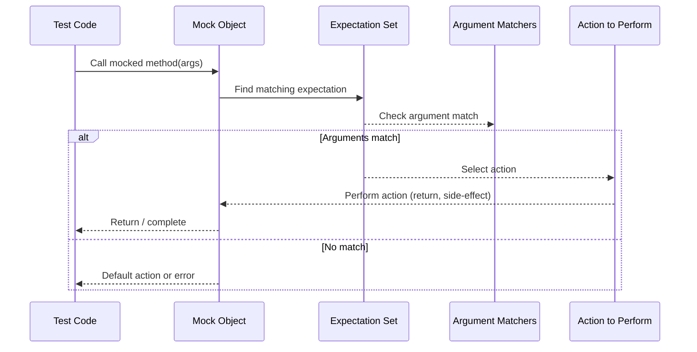

# Actions and Matchers for Mocks

Effective and flexible mocking hinges on how you control the behavior and expectations of mock methods. This page explains how to define and use **actions** and **matchers** with GoogleMock, empowering you to specify return values, side effects, and custom behaviors in your tests with precision.

---

## 1. Understanding Actions in gMock

Actions dictate what a mock method does when it is invoked. Under the hood, an action is tied to a matching expectation and can be composed, customized, or implemented by users. Here’s how actions help shape your tests:

- **Return values:** Specify what your mock method should return on each call.
- **Side effects:** Change output arguments, manipulate state, or invoke callbacks.
- **Custom behaviors:** Implement complex or asynchronous behavior with functions, lambdas, or functors.

### 1.1 Returning Values

By default, gMock auto-returns values for built-in types (`void`, `bool`, numeric types) or default-constructible types. Customize returned values using built-in actions:

```cpp
using ::testing::Return;

EXPECT_CALL(mock_obj, GetValue())
    .WillOnce(Return(42));
```

- Use `ReturnRef(variable)` to return a reference.
- Use `ReturnPointee(pointer)` to return the value pointed to by a pointer at the time of invocation.
- Use `ReturnNew<T>(...)` to return a newly allocated object each time.

If you want to return live or computed values, implement this via lambdas or callable objects.

### 1.2 Side Effects

Mock methods often modify state or output parameters instead of returning data directly:

- Use `SetArgPointee<N>(value)` to assign `value` to the `N`th output pointer argument.
- Use `SetArrayArgument<N>(first, last)` to copy a range of elements to an array argument.
- Use `SaveArg<N>(pointer)` or `SaveArgByMove<N>(pointer)` to capture argument values for later verification.
- Chain side effects with return values using `DoAll(a1, a2, ..., aN)`.

Example:

```cpp
EXPECT_CALL(mock_mutator, Mutate(true, _))
    .WillOnce(DoAll(SetArgPointee<1>(5), Return(true)));
```

### 1.3 Using Callable as Actions

GoogleMock seamlessly supports functions, functors, methods, and lambdas as actions:

```cpp
EXPECT_CALL(mock, Compute(_, _))
    .WillOnce(Invoke(&ComputeFunction));

EXPECT_CALL(mock, Process(_))
    .WillOnce([](int x) { return x > 0; });
```

- Callables can have compatible but not identical signatures, as long as implicit conversions apply.
- Ownership of callable objects is transferred into the expectation.

### 1.4 Calling Function Argument(s)

When a mock method receives a callable as an argument, you can invoke it:

```cpp
EXPECT_CALL(mock, DoThis(_, _))
    .WillOnce(InvokeArgument<1>(5));  // Calls 2nd argument with 5
```

If the callable takes references, wrap passed arguments using `std::ref()` to avoid copying.

### 1.5 Controlling Arguments to Actions

You can select which mock function arguments to pass to an action:

- `WithArg<N>(action)` passes one argument `N`.
- `WithArgs<N1, N2, ..., Nk>(action)` passes multiple selected arguments.
- `WithoutArgs(action)` ignores the mock method arguments.

Example:

```cpp
EXPECT_CALL(mock, Foo(_, _, _))
    .WillOnce(WithArgs<0, 2>(Invoke(MyFunc)));
```

## 2. Matchers: Defining Argument Expectations

Matchers verify whether the arguments in a mock method call conform to expectations.

### 2.1 Basic Matchers

- `_` matches *any* value.
- `Eq(value)` matches arguments equal to `value`.
- Numeric matchers like `Gt()`, `Lt()`, `Ge()`, `Le()`, `Ne()` test inequalities.
- `NotNull()` and `IsNull()` match pointer arguments.

Example:

```cpp
EXPECT_CALL(mock, Func(Gt(5), NotNull()));
```

### 2.2 Combining Matchers

Use combinators to build expressive, complex criteria:

```cpp
EXPECT_CALL(mock, Func(AllOf(Gt(0), Ne(10))));
EXPECT_CALL(mock, Func(Not(HasSubstr("error"))));
```

### 2.3 Matching Whole Argument Lists

`.With(multi_argument_matcher)` can constrain all arguments at once using tuple matchers:

```cpp
EXPECT_CALL(mock, Method(_, _))
    .With(Lt());  // 1st arg must be less than 2nd
```

### 2.4 Specialized Matchers

- `Field(&Type::member, matcher)` matches if a member variable satisfies a matcher.
- `Property(&Type::getter, matcher)` uses a const getter method.
- `ElementsAre()` and `UnorderedElementsAre()` match container contents.

### 2.5 Custom Matchers

Write custom matchers using `MATCHER` and its variants:

```cpp
MATCHER(IsDivisibleBy7, "is divisible by 7") {
  return (arg % 7) == 0;
}
```

For more control, implement matcher classes conforming to GoogleMock's matcher interface.

<Tip>
Matchers must be *pure functions* with no side effects because gMock may invoke them unpredictably.
</Tip>

## 3. Combining Actions and Matchers: Best Practices

- Use `ON_CALL` to set **default behaviors** without requiring that calls must occur.
- Use `EXPECT_CALL` to set **expectations** and define **specific behaviors** when calls happen.
- Carefully select matchers to avoid over-specifying your test, making it fragile.
- Use `WillOnce` and `WillRepeatedly` to express sequential and fallback behaviors.
- Consider sequences (`InSequence`) and partial orderings (`After`) to control call order.

## 4. Code Patterns & Advanced Usage

### 4.1 Returning Move-Only Types

Mocking methods with `std::unique_ptr` or other move-only types works directly:

```cpp
class MockBuzzer : public Buzzer {
 public:
  MOCK_METHOD(std::unique_ptr<Buzz>, MakeBuzz, (StringPiece text), (override));
};

EXPECT_CALL(mock_buzzer_, MakeBuzz("hello"))
    .WillOnce(Return(std::make_unique<Buzz>(AccessLevel::kInternal)));
```

To produce new objects on each call, use lambdas:

```cpp
EXPECT_CALL(mock_buzzer_, MakeBuzz(_))
    .WillRepeatedly([](StringPiece) {
      return std::make_unique<Buzz>(AccessLevel::kInternal);
    });
```

### 4.2 Delegating Calls to Another Object

You can delegate behavior to fake or real objects to get a combination of real behavior with expectation tracking.

```cpp
class MockFoo : public Foo {
 public:
  MOCK_METHOD(int, DoThis, (int n), (override));
  void DelegateToFake() {
    ON_CALL(*this, DoThis).WillByDefault([this](int n) {
      return fake_.DoThis(n);
    });
  }

 private:
  FakeFoo fake_;
};
```

### 4.3 Chaining Side Effects

Multiple actions can be chained where only the last return value is used:

```cpp
EXPECT_CALL(mock, Method(_))
    .WillOnce(DoAll(SetArgPointee<0>(42), Return(true)));
```

### 4.4 Writing Custom Actions

Define custom actions using lambdas or functors compatible with the mock method signature:

```cpp
ACTION(MultiplyByTwo) {
  return arg0 * 2;
}

EXPECT_CALL(mock, Compute(_)).WillOnce(MultiplyByTwo());
```

Or more complex:

```cpp
struct Incrementer {
  int operator()(int x) { return x + 1; }
};
EXPECT_CALL(mock, Compute(_)).WillOnce(Incrementer());
```

### 4.5 Mocking Non-Virtual Methods

Mock non-virtual methods by mimicking signatures in unrelated classes and using template injection techniques as described in the cookbook.

## 5. Troubleshooting and Tips

- Always verify that your mocked methods are `virtual`. Non-virtual methods cannot be mocked directly.
- Use the `--gmock_verbose=info` flag when your test fails unexpectedly to get detailed mock call traces.
- Suppress spurious warnings about uninteresting calls by using `NiceMock` or by adding catch-all expectations with `Times(AnyNumber())`.
- Use `.RetiresOnSaturation()` on expectations to avoid sticky expectation errors.

<Tip>
Avoid over-specifying expectations. Too many constraints make tests brittle and hard to maintain.
</Tip>

---

<AccordionGroup title="Example Code Snippets">
<Accordion title="Basic MOCK_METHOD Definition and Usage">
```cpp
class MockTurtle : public Turtle {
 public:
  MOCK_METHOD(void, PenUp, (), (override));
  MOCK_METHOD(int, GetX, (), (const, override));
  MOCK_METHOD(void, GoTo, (int x, int y), (override));
};

MockTurtle mock_turtle;
EXPECT_CALL(mock_turtle, PenUp()).Times(1);
mock_turtle.PenUp();
```
</Accordion>
<Accordion title="Using Matchers and Actions in EXPECT_CALL">
```cpp
using ::testing::Return;
using ::testing::_;
using ::testing::Gt;

EXPECT_CALL(mock_turtle, GoTo(Gt(10), _))
    .WillOnce(Return());
```
</Accordion>
<Accordion title="Mocking a Method with Side Effects and Return Value">
```cpp
using ::testing::DoAll;
using ::testing::SetArgPointee;
using ::testing::Return;

EXPECT_CALL(mock, Mutate(_, _))
    .WillOnce(DoAll(SetArgPointee<1>(5), Return(true)));
```
</Accordion>
<Accordion title="Custom Matcher Example">
```cpp
MATCHER(IsEven, "is even") {
  return (arg % 2) == 0;
}

EXPECT_CALL(mock, Foo(IsEven()));
```
</Accordion>
<Accordion title="Using With Clause to Match Multiple Arguments as a Tuple">
```cpp
EXPECT_CALL(mock, SetPosition(_, _))
    .With(Lt());  // 1st arg less than 2nd arg
```
</Accordion>
</AccordionGroup>

---

## 6. See Also

- [gMock Cookbook](gmock_cook_book.md) — practical recipes for common mocking scenarios
- [gMock for Dummies](gmock_for_dummies.md) — getting started guide
- [Matchers Reference](matchers.md) — detailed list and behavior of built-in matchers
- [Actions Reference](actions.md) — comprehensive list of built-in actions
- [Mocking Reference](mocking.md) — full specification of mocking macros and classes

<Source url="https://github.com/google/googletest" branch="main" paths={[{"path": "googlemock/include/gmock/gmock-spec-builders.h", "range": "1-335"}]} />

---

## Mermaid Diagram: Mock Call Flow with Actions and Matchers


```

---

This page focuses on user-facing guidance for defining and using **actions** and **matchers** so that you can:

- Precisely specify how mocks respond and verify interaction patterns
- Build maintainable and flexible tests that evolve with code
- Handle special cases like move-only types and async code elegantly
- Create custom matchers and actions to model domain-specific logic

Your journey through GoogleMock will be greatly enhanced by mastering these tools.

---