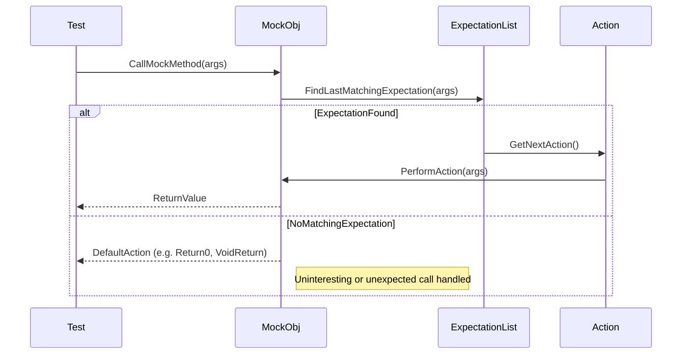

# Custom Actions and Return Values

The power of GoogleMock’s action system lies in its flexibility and expressiveness for defining what happens when a mock method is called. This page explores the full palette of actions assignable to mock calls — from the rich set of built-in actions all the way to custom, user-defined behaviors. Understanding how to harness these actions unlocks expressive, fine-grained control of mock method responses, enabling you to write more precise and robust tests.

---

## 1. Understanding Actions in GoogleMock

Every time a mocked method is invoked, GoogleMock needs to know what to do. Actions drive this behavior; they describe the return value (if any), side effects on arguments, exceptions thrown, or custom logic executed. You assign an action to an expectation with clauses such as `.WillOnce()` or `.WillRepeatedly()`:

```cpp
EXPECT_CALL(mock_obj, Method(args))
    .WillOnce(Return(value))
    .WillRepeatedly(Return(default_value));
```

The flexibility to mix and match predefined or custom actions lets you simulate various scenarios effortlessly, from simple fixed returns to complex state changes.

---

## 2. Built-in Actions: Covering the Common Cases

GoogleMock ships with an extensive set of built-in actions for the most frequent needs. They neatly divide into several categories:

### 2.1 Returning Values

- **`Return()`**: Returns from a void function.
- **`Return(value)`**: Returns a copy of `value` (converted as necessary).
- **`ReturnArg<N>()`**: Returns the N-th argument (zero-based).
- **`ReturnNew<T>(args...)`**: Returns a new heap-allocated object of type `T` created with the given arguments.
- **`ReturnNull()`**: Returns a null pointer.
- **`ReturnPointee(ptr)`**: Returns the value pointed to by `ptr`, useful when you want the current value at call time.
- **`ReturnRef(variable)`**: Returns a reference to `variable`.
- **`ReturnRefOfCopy(value)`**: Returns a reference to a copy of `value`.
- **`ReturnRoundRobin({values...})`**: Returns values in a rotating cycle.

```cpp
EXPECT_CALL(mock, GetValue())
    .WillOnce(Return(10))
    .WillOnce(Return(20))
    .WillRepeatedly(Return(30));
```

### 2.2 Side Effects

Side effect actions allow modification of arguments or other external state:

- **`Assign(&var, value)`**: Assigns `value` to `var`.
- **`DeleteArg<N>()`**: Deletes the pointer passed as the N-th argument.
- **`SaveArg<N>(pointer)`**: Copies the N-th argument to `*pointer`.
- **`SaveArgByMove<N>(pointer)`**: Moves the N-th argument to `*pointer`.
- **`SaveArgPointee<N>(pointer)`**: Saves the value pointed by the N-th argument.
- **`SetArgReferee<N>(value)`**: Assigns `value` to the variable referenced by N-th argument.
- **`SetArgPointee<N>(value)`**: Assigns `value` to the pointee of the N-th argument.
- **`SetArrayArgument<N>(first, last)`**: Copies a range into the N-th argument, useful for arrays or iterators.
- **`SetErrnoAndReturn(error, value)`**: Sets the global `errno` and returns `value`.
- **`Throw(exception)`**: Throws the given exception.

### 2.3 Invoking Callables as Actions

You can use functions, functors, or lambdas directly:

- **`Invoke(f)`**: Calls the callable `f` with the mock arguments.
- **`Invoke(object_ptr, &Class::Method)`**: Calls the member method on the given object.
- **`InvokeWithoutArgs(f)`**: Calls a callable ignoring the mock function's arguments.
- **`InvokeArgument<N>(args...)`**: Calls the N-th argument (which must be callable) with specified arguments.

```cpp
EXPECT_CALL(mock, Compute(_))
    .WillOnce(Invoke([](int x) { return x * 2; }));
```

### 2.4 Composite Actions

- **`DoAll(a1, a2, ..., an)`**: Executes all actions in order, returning the result of the last (used to combine side effects with returns).
- **`IgnoreResult(a)`**: Executes action `a` ignoring its return value.
- **`WithArg<N>(a)`**: Executes action `a` with the N-th argument of the mock.
- **`WithArgs<N1, N2, ...>(a)`**: Passes selected arguments to action `a`.
- **`WithoutArgs(a)`**: Executes action `a` with no arguments.

```cpp
EXPECT_CALL(mock, Process(_))
    .WillOnce(DoAll(SetArgPointee<0>(42), Return(true)));
```

---

## 3. Defining Your Own Custom Actions

When the built-in actions don't fit your needs, GoogleMock provides two flexible approaches for defining custom actions.

### 3.1 Using Functors or Lambdas as Actions

Actions are any callable objects compatible with the mocked method's signature. You can supply:

- **Lambdas:** Convenient for inline custom logic.
- **Functors:** Structs or classes with operator(), potentially templated.

```cpp
EXPECT_CALL(mock, DoWork(_))
    .WillOnce([](int x) { return x + 10; });
```

You can also ignore arguments you don't care about by declaring them with `Unused`.

### 3.2 Implementing ActionInterface<F> for Monomorphic Actions

This approach requires implementing the `Perform()` method with the exact mock function's signature embedded as a tuple. It gives type safety and more control.

```cpp
template <typename F>
class ActionInterface {
 public:
  virtual ~ActionInterface();
  virtual ReturnType Perform(const ArgumentTuple& args) = 0;
};
```

Example:

```cpp
class IncrementAction : public ActionInterface<int(int*)> {
 public:
  int Perform(const std::tuple<int*>& args) override {
    int* p = std::get<0>(args);
    return ++(*p);
  }
};

Action<int(int*)> Increment() {
  return MakeAction(new IncrementAction);
}
```

### 3.3 Defining Polymorphic Actions with MakePolymorphicAction()

If you want to define an action reusable with methods of different signatures, define an implementation class with a templated `Perform<Result, Args>()` method and use `MakePolymorphicAction()` to wrap it:

```cpp
class ReturnSecondArgumentAction {
 public:
  template <typename Result, typename ArgsTuple>
  Result Perform(const ArgsTuple& args) {
    return std::get<1>(args);
  }
};

PolymorphicAction<ReturnSecondArgumentAction> ReturnSecondArgument() {
  return MakePolymorphicAction(ReturnSecondArgumentAction());
}
```

This composability lets you craft versatile actions that morph to expected signatures.

---

## 4. Guidelines and Best Practices

- **Order of Actions Matters:** The last matching `EXPECT_CALL` overrides earlier ones.
- **Use `RetiresOnSaturation()` When Expecting Multiple Sequential Calls:** It allows expectations to retire after saturation, enabling clean sequencing and avoiding sticky expectations.
- **Use `ON_CALL` to Specify Default Actions:** It sets how a mock behaves when no explicit expectations match.
- **Avoid Side Effects in Return Statements:** The action expressions are evaluated only once at the time of expectation setup, not at call time. For dynamic behavior, use custom functors or lambdas.
- **Use `IgnoreResult()` to Adapt Return Types:** When an action returns a value but the mocked method returns void, `IgnoreResult()` suppresses the return.
- **Use `InvokeArgument<N>` Carefully:** Wrap arguments with `std::ref` if passing by reference to avoid copies.
- **Reuse Actions That Are Stateless:** Copying actions is cheap, but stateful actions may behave unexpectedly if shared.

---

## 5. Practical Examples

### 5.1 Returning Sequential Values with Actions

```cpp
EXPECT_CALL(mock, GetNumber())
    .WillOnce(Return(1))
    .WillOnce(Return(2))
    .WillRepeatedly(Return(3));

// Calls return 1, then 2, then 3 indefinitely.
```

### 5.2 Setting Output Argument and Returning a Value

```cpp
EXPECT_CALL(mock, Compute(_, _))
    .WillOnce(DoAll(SetArgPointee<1>(100), Return(true)));

// Sets second argument to 100 and returns true.
```

### 5.3 Using a Lambda to Compute Return Value Based on Arguments

```cpp
EXPECT_CALL(mock, Multiply(_, _))
    .WillRepeatedly([](int x, int y) { return x * y; });

// Returns the product of arguments each call.
```

### 5.4 Invoking a Callback Argument

```cpp
using ::testing::InvokeArgument;

EXPECT_CALL(mock, RegisterCallback(_))
    .WillOnce(InvokeArgument<0>(42));

// Calls the first argument (a callable) with 42.
```

### 5.5 Combining Multiple Actions

```cpp
EXPECT_CALL(mock, Update(_))
    .WillOnce(DoAll(SetArgPointee<0>(10), Return(true)));
```

---

## 6. Troubleshooting Common Issues

- **Actions Run Out:** If there are fewer `WillOnce()` actions than expected calls, GoogleMock defaults to the default action and emits a warning.
- **Unexpected Calls:** Calls that do not match any `EXPECT_CALL` result in errors.
- **Uninteresting Calls:** Calls to mock methods without any expectations emit warnings unless using `NiceMock`.
- **Type Compatibility:** Ensure your custom actions’ signatures are compatible with the mocked method's signature.
- **Dangling References:** When returning references, use `ReturnRef()` carefully to ensure the referenced object outlives the mock.

---

## 7. See Also

- [gMock Actions Reference](reference/actions.md) for comprehensive built-in action descriptions.
- [Mocking Reference](reference/mocking.md) for expectation and mock behavior.
- [gMock Cookbook](gmock_cook_book.md) for recipes on using and combining actions.
- [gMock for Dummies](gmock_for_dummies.md) for beginner-friendly introduction to mocks and actions.

---

## 8. Illustrative Action Flow Diagram



---

This page equips you with the essential knowledge to master GoogleMock’s comprehensive action system. Whether leveraging built-in actions or crafting custom response logic, you'll be able to model complex mock behaviors with confidence and precision.