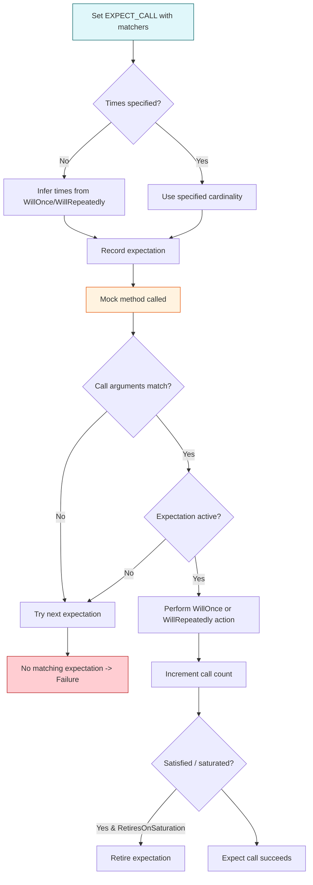

# Cardinalities and Expectations

This page provides a comprehensive reference for specifying **call count expectations**, **call order sequencing**, and **default mock behaviors** in GoogleMock using the `EXPECT_CALL` and `ON_CALL` macros. These features empower you to precisely control how mocks behave in your tests with regard to how often methods are called, in what order, and what default actions they take.

---

## 1. Setting Call Count Expectations with `EXPECT_CALL`

At the heart of GoogleMock's mocking framework lies `EXPECT_CALL`, the macro that lets you declare how many times and under what conditions a mock method should be called.

```cpp
EXPECT_CALL(mock_object, MethodName(matchers...))
    .Times(cardinality)
    .WillOnce(action)
    .WillRepeatedly(action);
```

- **`mock_object`**: The instance of a mock class.
- **`MethodName`**: The mocked method being targeted.
- **`matchers...`**: Argument matchers to specify expected call parameters. Can be omitted if method is not overloaded to use wildcard matchers `_` by default.
- **`Times(cardinality)`**: Specifies how many times the call is expected. See section below.
- **`WillOnce(action)`** and **`WillRepeatedly(action)`**: Define behavior on calls.

### Cardinalities (Call Counts)

Cardinalities define **how often** the mock method should be called matching the specification:

| Cardinality        | Meaning                                                             |
|--------------------|----------------------------------------------------------------------|
| `AnyNumber()`       | Any number of calls (including zero) allowed.                       |
| `AtLeast(n)`        | At least `n` calls expected (can be more).                         |
| `AtMost(n)`         | At most `n` calls expected (can be less).                          |
| `Between(m, n)`     | Between `m` and `n` calls expected (inclusive).                    |
| `Exactly(n)` or `n` | Exactly `n` calls expected. `0` means the call must never happen.  |

If `.Times()` is omitted:

- If neither `WillOnce()` nor `WillRepeatedly()` is used, the default is `.Times(1)`.
- If there are `n` `WillOnce()` calls and no `WillRepeatedly()`, then `.Times(n)` is inferred.
- If there are `n` `WillOnce()` calls and a `WillRepeatedly()`, `.Times(AtLeast(n))` is inferred.

### Examples of Call Counts

```cpp
using ::testing::Return;
using ::testing::AtLeast;
using ::testing::_;

EXPECT_CALL(mock, Foo(5)).Times(3);  // Expect exactly 3 calls with argument 5.
EXPECT_CALL(mock, Bar(_)).Times(AtLeast(1));  // At least 1 call with any arg.
EXPECT_CALL(mock, Baz()).Times(AnyNumber());  // Zero or more calls.

EXPECT_CALL(mock, Qux())  // Implicitly Times(1)
    .WillOnce(Return(true));
```

---

## 2. Sequencing Calls with `InSequence` and `Sequence`

Mock call sequencing helps you enforce **order constraints** on mock method calls.

### Strict Ordering with `InSequence`

By creating a scoped `InSequence` object, all `EXPECT_CALL`s within that scope are required to occur **in the declared order**.

```cpp
using ::testing::InSequence;

{
  InSequence seq;  // Begins sequence scope

  EXPECT_CALL(mock, MethodA());  // Must be called before MethodB
  EXPECT_CALL(mock, MethodB());  // Must be called after MethodA
}
```

### Partial Ordering with `Sequence` Objects

When you want more flexible partial orders or multiple sequencing paths, create `Sequence` objects and use `.InSequence()` with one or more sequences.

```cpp
using ::testing::Sequence;

Sequence s1, s2;

EXPECT_CALL(mock, Initialize())
    .InSequence(s1, s2);
EXPECT_CALL(mock, LoadData())
    .InSequence(s1);
EXPECT_CALL(mock, SetupUI())
    .InSequence(s2);
```

This imposes the order:

- `Initialize()` must happen before both `LoadData()` and `SetupUI()`.
- `LoadData()` and `SetupUI()` can occur in any order relative to each other.

### Combining Sequences

An expectation can participate in multiple sequences, allowing expression of a DAG of orderings.

---

## 3. Specifying Dependencies Between Expectations with `.After()`

You can specify that an expectation must happen after other expectation(s), by passing `Expectation` or `ExpectationSet` objects to `.After()`.

```cpp
using ::testing::Expectation;

Expectation e1 = EXPECT_CALL(mock, InitX());
Expectation e2 = EXPECT_CALL(mock, InitY());

EXPECT_CALL(mock, Describe())
    .After(e1, e2);  // Will occur only after InitX() and InitY()
```

`.After()` supports up to five expectations and can be called multiple times for the same expectation. This provides fine control over call ordering beyond simple sequences.

---

## 4. Controlling Call Behavior

GoogleMock allows you to precisely specify what your mock method should do on each call.

### `WillOnce(action)`

Used to specify behavior for the **next single matching call**. Multiple `WillOnce()` clauses can be chained to specify different behaviors on consecutive calls.

```cpp
using ::testing::Return;

EXPECT_CALL(mock, GetNumber())
    .WillOnce(Return(1))
    .WillOnce(Return(2))
    .WillOnce(Return(3));
```

### `WillRepeatedly(action)`

Used to specify behavior for **all subsequent calls after `WillOnce()` calls are exhausted**.

```cpp
EXPECT_CALL(mock, GetValue())
    .WillOnce(Return(10))
    .WillRepeatedly(Return(20));
```

If `WillOnce()` calls are not specified, `WillRepeatedly()` applies to all calls.

### `ON_CALL` to Set Default Behavior

`ON_CALL` defines default behavior for mock method calls **without setting expectations about whether they occur**.

```cpp
ON_CALL(mock, Method(_))
    .WillByDefault(Return(true));
```

Critical distinctions:

- `ON_CALL` does not cause failures if a call does not happen.
- `EXPECT_CALL` will cause failures if the call happens fewer or more times than specified.

You can chain `.With()` before `.WillByDefault()` to restrict the default behavior to calls matching a multi-argument matcher.

---

## 5. Retiring Expectations with `.RetiresOnSaturation()`

An expectation normally stays active even after its call count upper bound is reached, meaning it can cause over-saturation errors on extra calls.

Using `.RetiresOnSaturation()` makes the expectation **retire** immediately when it is saturated, no longer matching further calls. This is useful for specifying sequences where each call should match only once.

```cpp
EXPECT_CALL(mock, SetNumber(7))
    .Times(2)
    .RetiresOnSaturation();
```

Here, the first two calls to `SetNumber(7)` match this expectation, which then retires. Subsequent calls fall through to other expectations.

---

## 6. Understanding Sticky Expectations and Overlapping Expectations

- **Sticky Expectations:** `EXPECT_CALL` expectations remain active even after saturation, causing further calls with matching arguments to fail unless retired.
- **Overlapping Expectations:** When multiple expectations match a call, GoogleMock searches in reverse declaration order, picking the newest first. This allows more specific expectations to override general catch-alls.

Example:

```cpp
EXPECT_CALL(mock, Foo(_));  // #1
EXPECT_CALL(mock, Foo(42)).Times(2);  // #2

mock.Foo(42); // matches #2
mock.Foo(43); // matches #1
```

Be mindful to place general catch-all expectations before more specific ones.

---

## 7. Error Handling and Diagnostics

GoogleMock provides detailed failure messages when:

- Methods are called fewer or more times than expected.
- Calls occur out of order.
- Argument matchers fail.
- Uninteresting or unexpected calls occur.

Using the flag `--gmock_verbose=info` reveals detailed call matching and stack traces for easier debugging.

---

## 8. Best Practices and Tips

- Use `ON_CALL` for defining default behavior when you don't need to verify a call.
- Use `EXPECT_CALL` to verify that a call happens with expected arguments and call count.
- Avoid over-constraining expectations to minimize fragile tests.
- Use `InSequence` and `Sequence` to enforce call order only when order matters.
- Use `.RetiresOnSaturation()` to avoid sticky expectations causing unexpected failures.
- Use nice mocks (`NiceMock<T>`) to suppress warnings about uninteresting calls.
- Use strict mocks (`StrictMock<T>`) to treat uninteresting calls as failures.

---

## 9. Summary Diagram of Expectation Flow



---

## 10. Verifying and Resetting Mocks

You can manually verify all expectations and clear them from a mock object before its destruction:

```cpp
EXPECT_TRUE(::testing::Mock::VerifyAndClearExpectations(&mock));
```

Or also clear default actions:

```cpp
EXPECT_TRUE(::testing::Mock::VerifyAndClear(&mock));
```

Avoid setting more expectations after a mock has been verified and cleared.

Use `Mock::AllowLeak(&mock)` to tell GoogleMock to skip verifying mock destruction, useful when a mock may leak (e.g., owned by code under test).

---

## 11. Related References

- [MOCK_METHOD and Defining Mocks](api-reference/mocking-framework/mock-method-macros.md)
- [Matchers Reference](api-reference/matchers-and-actions/matchers-reference.md)
- [Actions and Macros](api-reference/matchers-and-actions/actions-and-macros.md)
- [Mocking Patterns Cookbook](guides/real-world-use-cases/mocking-patterns.md)

---

GoogleMock offers flexible and powerful tools for mocking behavior, enabling precise control of call expectations, ordering, and actions, paving the way for robust and maintainable tests.

---