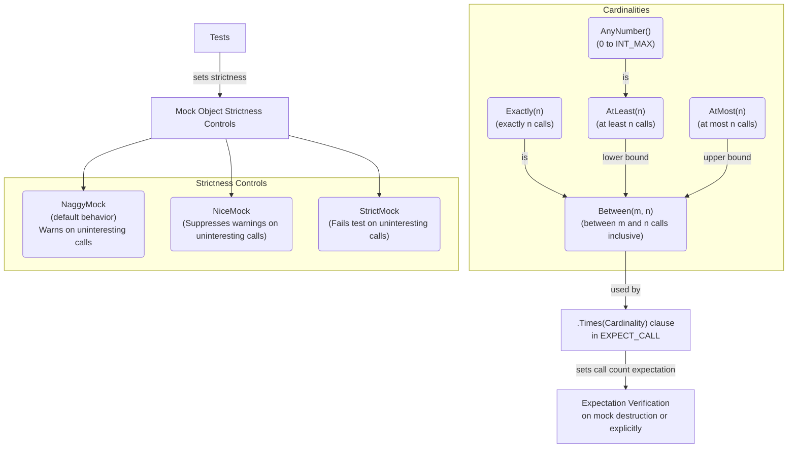

# Call Cardinalities and Strictness Controls

This page explains how to specify the expected number of times a mock function should be called using *call cardinalities* in GoogleMock (gMock). It also covers how to influence mock object behavior and test pass/fail criteria by using wrappers like `NiceMock`, `NaggyMock`, and `StrictMock`. Understanding these controls empowers you to write precise, maintainable tests that reflect your intended interaction contracts.

---

## 1. Understanding Call Cardinalities

Call cardinalities define how many times a mock function is expected or allowed to be invoked during a test. This can be an exact number, a range, or unbounded counts. Setting accurate cardinalities is essential for asserting interaction correctness and catching unexpected behavior.

### Built-in Cardinalities

GoogleMock provides a family of cardinality helpers, all located in the `testing` namespace:

| Cardinality                 | Description                                                |
|-----------------------------|------------------------------------------------------------|
| `Exactly(n)` or `n`         | Expect the call exactly `n` times.                         |
| `AtLeast(n)`                | Expect the call at least `n` times.                        |
| `AtMost(n)`                 | Expect the call at most `n` times.                         |
| `Between(m, n)`             | Expect the call between `m` and `n` times inclusive.      |
| `AnyNumber()`               | Expect the call any number of times (including zero).      |

### Example

```cpp
using ::testing::AtLeast;
using ::testing::Exactly;

EXPECT_CALL(mock_obj, Foo())
    .Times(Exactly(3));     // Must be called exactly 3 times

EXPECT_CALL(mock_obj, Bar())
    .Times(AtLeast(1));     // Called at least once

EXPECT_CALL(mock_obj, Baz())
    .Times(AnyNumber());    // Called zero or more times
```

### Behavior and Verification

When an expectation with cardinalities is set, gMock verifies at test teardown or mock destruction that the function calls met the specified cardinality. If the call count is too low or too high, gMock reports an error immediately or at teardown with precise diagnostic messages.

### Cardinality Details

- `Exactly(0)` means the mock method should **never** be called with the specified arguments.
- Using `Between(2, 4)` expects the call count to be no less than 2 and no more than 4 inclusive.
- `AnyNumber()` is equivalent to `AtLeast(0)`.

<Card title="Cardinalities Summary">

| Cardinality | Meaning |
|-------------|---------|
| `Exactly(n)` | Exactly `n` calls expected |
| `AtLeast(n)` | Calls expected at least `n` times |
| `AtMost(n)` | Calls expected at most `n` times |
| `Between(m, n)` | Calls expected between `m` and `n` times inclusive |
| `AnyNumber()` | Any number of calls allowed (including zero) |

</Card>

### Practical Tips

- Avoid over-specifying: use the loosest cardinality that safely verifies your test intent.
- Use `Times(0)` to forbid specific calls explicitly.
- For sequences of calls expected in order, combine cardinalities with ordering controls (see `InSequence`).

---

## 2. Using Cardinalities in EXPECT_CALL

The `.Times()` clause in `EXPECT_CALL` applies cardinalities. If omitted, gMock infers cardinalities based on the provided actions:

- No `.Times()` and no actions means `.Times(1)` is assumed.
- `.WillOnce()` clauses present with no `.WillRepeatedly()` lead to `.Times(n)` where `n` is the number of `.WillOnce()`.
- `.WillOnce()` and `.WillRepeatedly()` present implies `.Times(AtLeast(n))`, where `n` is the number of `.WillOnce()`.

Example:

```cpp
EXPECT_CALL(mock_obj, Foo())
    .WillOnce(Return(1))
    .WillOnce(Return(2));
// Expects exactly 2 calls.

EXPECT_CALL(mock_obj, Bar())
    .WillOnce(Return(false))
    .WillRepeatedly(Return(true));
// Expects the first call to be false, then true any number of calls.
```

---

## 3. Strictness Controls: NiceMock, NaggyMock, and StrictMock

When a mock method is called without an explicit expectation, by default gMock treats such calls as *uninteresting*. Strictness controls let you decide what happens to these uninteresting calls.

### Mock Behavior Wrappers

- `NaggyMock<T>` (default behavior): Issues a warning for uninteresting calls; test will still pass unless an explicit expectation is violated.
- `NiceMock<T>`: Suppresses warnings for uninteresting calls, allowing them silently.
- `StrictMock<T>`: Treats uninteresting calls as test failures, causing immediate test failure.

These wrappers inherit from your mock class `T` and can be used interchangeably where `T` is expected.

### Example

```cpp
using ::testing::NiceMock;
using ::testing::NaggyMock;
using ::testing::StrictMock;

class MockFoo {
 public:
  MOCK_METHOD(void, DoSomething, ());
};

// Default (NaggyMock): warns on uninteresting calls
MockFoo foo;

// Suppresses uninteresting call warnings
NiceMock<MockFoo> nice_foo;

// Makes uninteresting calls failures
StrictMock<MockFoo> strict_foo;
```

### Best Practices

- Use `NiceMock` primarily to keep test output clean when uninteresting calls are expected.
- `NaggyMock` (default) is useful during test debugging to notice unexpected calls.
- Use `StrictMock` sparingly for strict behavioral verification where any unanticipated call should fail the test.

### Caveats

- Only affects uninteresting calls (methods with no matching expectations).
- Does not affect unexpected calls (calls with expectations but arguments not matching).
- These wrappers only work properly when the mock methods are declared *directly* in the mock class using `MOCK_METHOD`.
- The mock class should have a virtual destructor for proper behavior.

---

## 4. Common Pitfalls and Troubleshooting

### Over-specified Expectations

Defining multiple expectations with overlapping match criteria can cause unexpected call failures or saturation errors. Remember that gMock picks the **last matching** expectation when a mock method is called.

### Sticky Expectations

Expectations are "sticky" by default — they remain active even after their upper call count limit is reached, causing errors on excessive calls. To disable this, use `.RetiresOnSaturation()` on the expectation or bundle related expectations in sequences.

Example:

```cpp
EXPECT_CALL(mock_obj, Foo(42))
    .Times(2)
    .RetiresOnSaturation();
```

After 2 calls, this expectation retires and does not cause failures on further calls.

### Uninteresting Call Warnings

If your tests emit warnings about uninteresting calls, but you expect these calls and want to suppress warnings, consider wrapping your mock with `NiceMock`. Don't suppress warnings by adding superfluous expectations with `.Times(AnyNumber())` as it may lead to brittle tests.

### Verification Failures Due to Call Cardinalities

gMock verifies expectations upon mock destruction. If mocks are not deleted, verification doesn't occur - leading to false positives. Always ensure mocks are destructed or force verification with `Mock::VerifyAndClearExpectations()` call.

---

## 5. Summary of Usage

### Specifying Cardinalities

```cpp
EXPECT_CALL(mock, Method(args))
    .Times(AtLeast(2));  // Method should be called at least twice
```

Use cardinalities to specify exact or fuzzy call count expectations.

### Choosing Mock Wrappers

- Use `NiceMock` to silence warnings on uninteresting calls.
- Use `NaggyMock` (default) to print warnings on uninteresting calls.
- Use `StrictMock` to fail tests on uninteresting calls.

### Advanced Example

```cpp
using testing::StrictMock;

StrictMock<MockFoo> strict_mock;
EXPECT_CALL(strict_mock, DoImportantStuff()).Times(Exactly(1));

// Any unplanned calls to other methods cause failures
```

---

## 6. References & Next Steps

- [GoogleMock Cheat Sheet](https://google.github.io/googletest/gmock_cheat_sheet.html) — Quick reference including `NiceMock`, `StrictMock` usage
- [gMock Cookbook](https://google.github.io/googletest/gmock_cook_book.html#NiceStrictNaggy) — In-depth discussion on strictness modes and cardinalities
- [Mocking Reference - EXPECT_CALL & ON_CALL](../reference/mocking.md#EXPECT_CALL.Times) — Detailed syntax and clauses including cardinalities
- [Cardinalities Implementation and Usage](https://github.com/google/googletest/blob/main/googlemock/include/gmock/gmock-cardinalities.h) — Defines built-in cardinalities such as `AtLeast()`, `AtMost()`, `Exactly()`, etc.

Also consider reviewing:
- [Using Assertions and Matchers Effectively](../guides/everyday-workflows/assertions-matchers.md) to combine argument validation with call cardinalities
- [Configuring Actions & Expectations](../guides/mocking-and-advanced-techniques/actions-and-expectations.md) for comprehensive mocking behavior

---

<AccordionGroup title="Example: Using Call Cardinalities and Strictness">
<Accordion title="Basic Cardinality Example">
```cpp
using ::testing::Exactly;
using ::testing::AtLeast;

class MockFoo {
 public:
  MOCK_METHOD(void, Bar, ());
};

TEST(MyTest, CallCardinalities) {
  MockFoo foo;

  // Bar() must be called exactly twice
  EXPECT_CALL(foo, Bar()).Times(Exactly(2));

  foo.Bar();
  foo.Bar();
}
```
</Accordion>
<Accordion title="Using StrictMock to Fail on Unexpected Calls">
```cpp
using ::testing::StrictMock;

StrictMock<MockFoo> strict_foo;
EXPECT_CALL(strict_foo, Bar()).Times(1);

strict_foo.Bar();        // OK
strict_foo.Baz();        // Fails test since Baz() has no expectation
```
</Accordion>
<Accordion title="Using NiceMock to Silence Warnings">
```cpp
using ::testing::NiceMock;

NiceMock<MockFoo> nice_foo;
EXPECT_CALL(nice_foo, Bar()).Times(1);

nice_foo.Bar();    // OK
nice_foo.Baz();    // No warning generated, Baz() has no expectation
```
</Accordion>
</AccordionGroup>

---

## 7. Summary Diagram of Cardinalities


