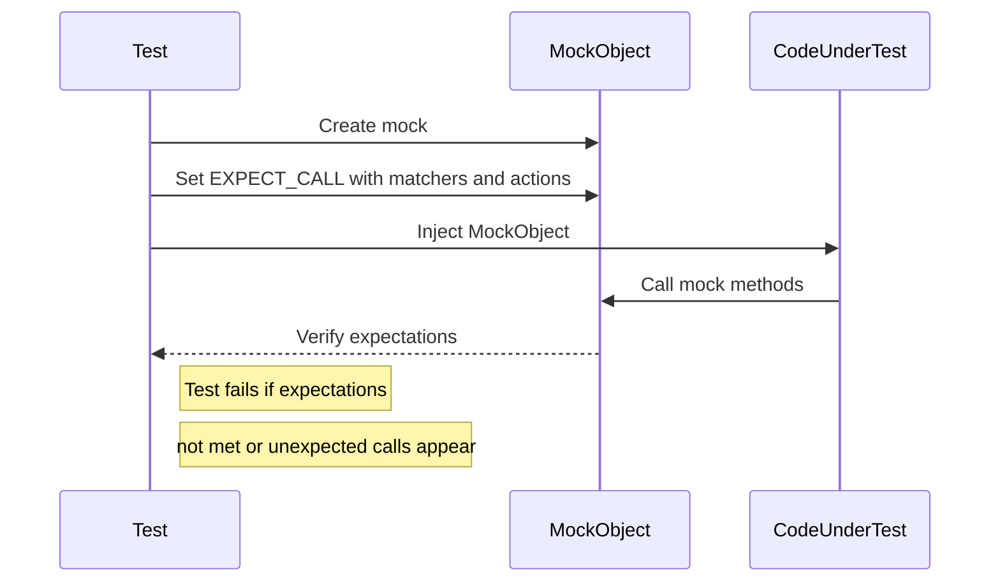

# Defining & Using Mock Objects

This page guides you through the essentials of declaring mock classes, mocking methods with diverse signatures, and instantiating/using mocks effectively in your C++ tests with GoogleMock (gMock). It covers the syntax of core macros like `MOCK_METHOD`, how to integrate mocks with test fixtures, and demonstrates typical, practical interaction patterns encountered in real-world scenarios.

---

## Introduction to Mock Classes

In testing, a **mock object** acts as a stand-in for a real object, implementing the same interface but allowing you to specify expected interactions and behaviors at runtime. This approach enables you to verify *how* your code interacts with its dependencies rather than just checking the final state.

### Why Define Mock Classes?

- To isolate units of code by replacing complex or unavailable dependencies.
- To express and verify interaction expectations explicitly.
- To control behavior of dependencies for simulating different scenarios.

---

## Declaring Mock Methods with `MOCK_METHOD`

GoogleMock provides the versatile `MOCK_METHOD` macro to declare mocked methods inside mock classes. It encapsulates the method declaration and generates the necessary plumbing for run-time expectation setting and verification.

### Syntax

```cpp
MOCK_METHOD(ReturnType, MethodName, (ArgumentTypes...), (Qualifiers...));
```

### Key Points

- The first three parameters mirror the signature of the method being mocked: return type, name, and parameter list.
- The fourth (optional) parameter denotes method qualifiers such as:
  - `const` for const methods.
  - `override` to mark that this method overrides a virtual method.
  - `noexcept` for noexcept-qualified methods.
  - `Calltype(...)` for specifying calling conventions (e.g., on Windows).
  - `ref(&)` or `ref(&&)` for reference qualifiers.

### Handling Commas in Types

If your return type or argument types include commas (like `std::pair<bool, int>` or `std::map<int, double>`), `MOCK_METHOD` needs you to either:

1. Wrap those types in an extra pair of parentheses:

```cpp
MOCK_METHOD((std::pair<bool, int>), GetPair, ());
MOCK_METHOD(bool, CheckMap, ((std::map<int, double>), bool));
```

2. Or define type aliases to remove commas:

```cpp
using BoolAndInt = std::pair<bool, int>;
MOCK_METHOD(BoolAndInt, GetPair, ());
using MapIntDouble = std::map<int, double>;
MOCK_METHOD(bool, CheckMap, (MapIntDouble, bool));
```

### Example: Mocking the `Turtle` Interface

```cpp
#include <gmock/gmock.h>

class Turtle {
 public:
  virtual ~Turtle() {}
  virtual void PenUp() = 0;
  virtual void PenDown() = 0;
  virtual void Forward(int distance) = 0;
  virtual void Turn(int degrees) = 0;
  virtual void GoTo(int x, int y) = 0;
  virtual int GetX() const = 0;
  virtual int GetY() const = 0;
};

class MockTurtle : public Turtle {
 public:
  MOCK_METHOD(void, PenUp, (), (override));
  MOCK_METHOD(void, PenDown, (), (override));
  MOCK_METHOD(void, Forward, (int distance), (override));
  MOCK_METHOD(void, Turn, (int degrees), (override));
  MOCK_METHOD(void, GoTo, (int x, int y), (override));
  MOCK_METHOD(int, GetX, (), (const, override));
  MOCK_METHOD(int, GetY, (), (const, override));
};
```

### Best Practices

- Always place `MOCK_METHOD` declarations inside the `public:` section, even if the base method is `protected` or `private`.
- Ensure all virtual methods you want to mock are either mocked or overridden.
- Prefer adding `override` qualifier for safety and clarity.

---

## Integrating Mocks into Tests

### Typical Workflow

1. **Import Namespaces:** Import the necessary gMock symbols for concise code.

```cpp
using ::testing::_;        // For wildcard matcher
using ::testing::AtLeast;   // For cardinality
using ::testing::Return;    // For specifying return
```

2. **Create Mock Objects:** Instantiate your mock classes.

```cpp
MockTurtle mock_turtle;
```

3. **Set Expectations:** Define expected method calls with argument matchers, call counts, and actions.

```cpp
EXPECT_CALL(mock_turtle, PenDown())
    .Times(AtLeast(1));
EXPECT_CALL(mock_turtle, Forward(100));
```

4. **Exercise Code:** Run your production code that interacts with the mock.

5. **Automatic Verification:** Upon destruction, gMock checks if expectations were met.

### Example Test

```cpp
#include <gtest/gtest.h>
#include <gmock/gmock.h>

using ::testing::AtLeast;
using ::testing::Return;

TEST(PainterTest, DrawsCircle) {
  MockTurtle turtle;

  EXPECT_CALL(turtle, PenDown())
      .Times(AtLeast(1));
  EXPECT_CALL(turtle, Forward(100));

  Painter painter(&turtle);  // class under test

  EXPECT_TRUE(painter.DrawCircle(0, 0, 10));
}
```

If `PenDown()` or `Forward(100)` are not called as expected, your test will fail immediately.

### Important Notes

- Expectations **must be set before exercising the mock methods**; otherwise, behavior is undefined.
- Use wildcards (`_`) to ignore arguments you don't care about.
- Use `.Times(0)` to explicitly forbid certain method calls.

---

## Setting Expectations and Default Behaviors

### `EXPECT_CALL`

Sets an expectation requiring that a mock method is called with specified arguments, optionally how many times, in which order, and with what behavior.

Basic syntax:

```cpp
EXPECT_CALL(mock_object, MethodName(matchers...))
    .Times(cardinality)
    .WillOnce(action)
    .WillRepeatedly(action);
```

**Modifiers (in order):**

- `.With(multi_argument_matcher)`: Matches all arguments as a tuple.
- `.Times(cardinality)`: Specify how many times the call is expected.
- `.InSequence(sequences...)`: Expect calls in specified sequences.
- `.After(expectations...)`: Expect call after specified expectations.
- `.WillOnce(action)`: Defines behavior once.
- `.WillRepeatedly(action)`: Defines behavior for all subsequent calls.
- `.RetiresOnSaturation()`: Deactivates expectation after it's fully used.

### `ON_CALL`

Defines default behavior when a mock method is called but **does not set an expectation**.

```cpp
ON_CALL(mock_object, MethodName(matchers...))
    .With(multi_argument_matcher)
    .WillByDefault(action);
```

Use `ON_CALL` to specify how uninteresting calls behave without requiring them.

### Cardinalities

You can specify call counts:

| Cardinality        | Meaning                               |
| ------------------ | ----------------------------------- |
| `AnyNumber()`      | Any number of calls allowed          |
| `AtLeast(n)`       | Called at least n times              |
| `AtMost(n)`        | Called at most n times               |
| `Between(m, n)`    | Called between m and n times
| `Exactly(n)` or `n`| Called exactly n times; `n=0` forbids call |

If omitted, gMock infers cardinality based on action clauses.

### Actions

Specify behaviors with:

- `Return(value)`: Return value
- `ReturnRef(value)`: Return reference
- `ReturnPointee(pointer)`: Return value pointed by pointer at call time
- `Invoke(function or callable)`: Call a function/lambda
- `DoAll()`: Sequence of actions
- `SetArgPointee<N>(value)`: Set output argument
- `DeleteArg<N>()`: Delete pointer argument

---

## Using Nice, Naggy, and Strict Mock Objects

GoogleMock provides wrappers to control how mocks handle uninteresting calls (calls without expectations):

| Mock Type           | Behavior on Uninteresting Calls      |
|---------------------|-------------------------------------|
| `NiceMock<T>`       | Suppresses warnings (quiet)         |
| `NaggyMock<T>`      | Warns on uninteresting calls (default) |
| `StrictMock<T>`     | Fails on uninteresting calls        |

**Usage:**

```cpp
using ::testing::NiceMock;
using ::testing::NaggyMock;
using ::testing::StrictMock;

NiceMock<MockFoo> nice_foo;
NaggyMock<MockFoo> naggy_foo;
StrictMock<MockFoo> strict_foo;
```

**Notes:**
- These are subclasses of your mock class.
- They inherit constructors so you can pass arguments as usual.
- They only affect uninteresting calls; unexpected calls (calls that do not match any expected arguments) always cause errors.
- They work only if your mock class defines methods using the `MOCK_METHOD` macro **directly** in that class.

---

## Best Practices and Common Pitfalls

### Successful Mock Usage

- Always set your expectations *before* the code under test calls the mock.
- Use wildcards (`_`) when argument values are irrelevant.
- Use exact matchers like `Eq(value)` for precise argument checks.
- Avoid over-specification that leads to brittle tests.
- Use sequences or `.After()` to specify ordering constraints.
- Apply `.RetiresOnSaturation()` to expectations you want to disable after their quota.
- Delegate to existing implementations (fake or real) if reuse is beneficial.
- Set default behavior via `ON_CALL` to define graceful fallbacks.

### Common Pitfalls

- Forgetting to add the mock method in `public:` scope prevents interaction with `EXPECT_CALL` and `ON_CALL`.
- Overlapping expectations can cause confusing failures; remember last matching expectation wins.
- Not specifying cardinalities properly can hide missing or extra calls.
- Using `Return(std::move(...))` in `WillRepeatedly()` leads to runtime errors; prefer lambdas to produce fresh objects.
- Mixing up expectations and default behaviors causes unintended warnings.
- Calling mock methods before an expectation is set leads to undefined behavior.
- Complex argument types with unprotected commas cause compilation issues (wrap types in parentheses or use typedefs).
- `NiceMock` and `StrictMock` modifiers do not work for mock methods defined in base classes.

---

## Troubleshooting

| Problem                                        | Solution                                               |
|------------------------------------------------|--------------------------------------------------------|
| Mock method call unexpectedly triggers real method | Ensure method is `virtual` and properly mocked with `MOCK_METHOD`. |
| Unexpected warnings about uninteresting calls | Use `NiceMock` for suppressing, or add catch-all `EXPECT_CALL` with `.Times(AnyNumber())`.
| Test failures with 'Upper bound violated'       | Check your `Times()` clause and ensure `RetiresOnSaturation()` is used if needed.
| Problems mocking overloaded methods             | Specify argument types or use `Const()` wrapper to disambiguate.
| Compilation errors due to commas in types        | Wrap types in parentheses or define type aliases.
| Default action missing or causing failures       | Use `ON_CALL` to specify default behavior.
| Move-only types not handled well in mocks         | Use lambdas for actions to produce fresh move-only objects.

---

## Summary

This documentation has equipped you with the knowledge to:

- Declare mock classes and methods correctly using `MOCK_METHOD`.
- Use `EXPECT_CALL` to set precise expectations on mock methods.
- Specify default mock behaviors with `ON_CALL`.
- Control mock strictness using `NiceMock`, `NaggyMock`, and `StrictMock`.
- Avoid common mistakes and effectively debug mock-related issues.

For detailed strategy and fine-grained controls, explore related topics such as Matcher syntax, Action definitions, and advanced usage patterns.

---

## Additional References

- [GoogleMock for Dummies](https://google.github.io/googletest/gmock_for_dummies.html) – A beginner-friendly tutorial.
- [Mocking Reference](reference/mocking.md) – Comprehensive macro and class API details.
- [gMock Cookbook](gmock_cook_book.md) – Recipes and patterns for advanced use.
- [Matchers Reference](reference/matchers.md) – Understand argument matching deeply.
- [Actions Reference](reference/actions.md) – For custom mock behaviors.
- [Mock Behavior Modes](api-reference/mocking-framework/mock-behavior-modes) – Deep dive into Nice/Naggy/Strict mocks.


---

## Mermaid Diagram: Typical Mock Interaction




<AccordionGroup title="Key GoogleMock Macros and Classes">
<Accordion title="MOCK_METHOD">
Defines mock methods in your mock classes. It mirrors the base method signature and accepts qualifiers.
</Accordion>
<Accordion title="EXPECT_CALL">
Sets expectations on mock methods about how, when, and how many times they are called.
</Accordion>
<Accordion title="ON_CALL">
Defines default mock behaviors without setting call expectations.
</Accordion>
<Accordion title="NiceMock, NaggyMock, StrictMock">
Controls the strictness of mock objects over uninteresting calls.
</Accordion>
</AccordionGroup>

---

## Practical Tips

- Wrap complex types in extra parentheses or use typedefs in `MOCK_METHOD`.
- Use `EXPECT_CALL` sparingly to verify only crucial interactions; prefer `ON_CALL` for default behaviors.
- Apply `.RetiresOnSaturation()` to expectations that should deactivate after use.
- Leverage `InSequence` or `.After()` to maintain call order when needed.
- Use lambdas in `.WillOnce()` or `.WillRepeatedly()` to generate fresh data or handle move-only types correctly.

---

## Common Errors and How to Fix Them

<AccordionGroup title="Common Mocking Errors">
<Accordion title="Calls to real methods instead of mock">
Ensure methods are virtual and mocked via `MOCK_METHOD`. If necessary, mock non-virtual using advanced techniques.
</Accordion>
<Accordion title="Uninteresting call warnings">
Either use `NiceMock` or define `EXPECT_CALL` with `.Times(AnyNumber())` for those methods.
</Accordion>
<Accordion title="Overlapping expectations leading to failures">
Newer `EXPECT_CALL` overrides older ones; order expectations accordingly.
</Accordion>
<Accordion title="Compilation errors from commas in template types">
Wrap the type in an additional pair of parentheses or declare a type alias.
</Accordion>
<Accordion title="Move-only types usage problems">
Use lambdas or functors in actions to correctly handle move-only types.
</Accordion>
</AccordionGroup>

---

# Code Example: Defining and Using a Mock

```cpp
#include <gmock/gmock.h>

class MyInterface {
 public:
  virtual ~MyInterface() {}
  virtual int Compute(int x) = 0;
  virtual void Reset() = 0;
};

class MockMyInterface : public MyInterface {
 public:
  MOCK_METHOD(int, Compute, (int x), (override));
  MOCK_METHOD(void, Reset, (), (override));
};

// Usage in a test
#include <gtest/gtest.h>

using ::testing::Return;
using ::testing::_;

TEST(MyTest, UsesMock) {
  MockMyInterface mock;

  // Set expectation: Compute called once with any int, returns 42
  EXPECT_CALL(mock, Compute(_))
      .Times(1)
      .WillOnce(Return(42));

  // Set default behavior for Reset
  ON_CALL(mock, Reset())
      .WillByDefault([]() {
        // Do some default action
      });

  // Call the methods
  int result = mock.Compute(10);
  mock.Reset();

  EXPECT_EQ(result, 42);
}
```

---

## Additional Utilities

- Use `Mock::VerifyAndClearExpectations(&mock_obj)` for explicit expectation verification.
- `Mock::AllowLeak(&mock_obj)` to bypass leak checks if needed.

---

## Conclusion

Mastering mock definition and usage with GoogleMock empowers you to write precise, robust unit tests with clear interaction expectations. Use the patterns and best practices described here to augment your testing hygiene and maintainability.

---

<Source url="https://github.com/google/googletest" branch="main" paths={[{"path": "docs/reference/mocking.md", "range": "*"},{"path": "docs/gmock_for_dummies.md", "range": "*"},{"path": "docs/gmock_cheat_sheet.md", "range": "*"},{"path": "docs/gmock_cook_book.md", "range": "*"}]} />
