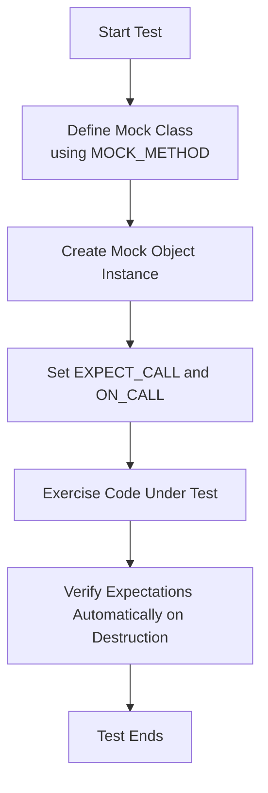

# Defining Mocks with GoogleMock

This documentation explains how to design and implement mock classes and methods using GoogleMock, the mocking framework integrated with GoogleTest. It focuses on the `MOCK_METHOD` macro family, which is the fundamental tool for creating mock methods in mock classes, covering its syntax, nuances, usage patterns, and best practices. You will learn how to mock virtual methods, handle method qualifiers, resolve common pitfalls, design test doubles through interfaces and delegation, and simplify complex interfaces.

---

## Overview of Mock Classes

A mock class is a user-defined class that mimics the interface of a real class but allows controlling and verifying interactions during testing. To define a mock class in GoogleMock:

- Derive from the interface or base class you want to mock.
- For every method to be mocked, use the `MOCK_METHOD` macro in the `public:` section of your mock class.
- Include method qualifiers such as `const`, `override`, `noexcept`, and calling conventions using the fourth macro argument.

Example:

```cpp
#include <gmock/gmock.h>

class Foo {
 public:
  virtual ~Foo();
  virtual int GetSize() const = 0;
  virtual std::string Describe(int type) = 0;
  virtual bool Process(Bar elem, int count) = 0;
};

class MockFoo : public Foo {
 public:
  MOCK_METHOD(int, GetSize, (), (const, override));
  MOCK_METHOD(std::string, Describe, (int type), (override));
  MOCK_METHOD(bool, Process, (Bar elem, int count), (override));
};
```


## The `MOCK_METHOD` Macro

### Syntax

```cpp
MOCK_METHOD(ReturnType, MethodName, (Args...), (Qualifiers));
```

- **ReturnType:** The function's return type.
- **MethodName:** The function's name.
- **Args...:** The function's arguments, enclosed in parentheses.
- **Qualifiers:** Optional comma-separated qualifiers such as `const`, `override`, `noexcept`, `Calltype(...)`, and reference qualifiers (e.g., `ref(&)`).

### Important Notes:

- `MOCK_METHOD` must be declared inside the `public:` section, regardless of the base class's access specifier.
- Commas inside template arguments (e.g., `std::pair<int, bool>`) confuse the parser unless properly parenthesized or aliased.

### Handling Commas in Template Arguments

You must either:

1. Enclose the type containing commas in an extra pair of parentheses:

```cpp
MOCK_METHOD((std::pair<bool, int>), GetPair, ());
```

2. Use a type alias to avoid direct commas:

```cpp
using BoolAndInt = std::pair<bool, int>;
MOCK_METHOD(BoolAndInt, GetPair, ());
```

### Method Qualifiers

When overriding virtual functions, the macro supports qualifiers to ensure correct method signatures:

| Qualifier          | Description                                              |
|--------------------|----------------------------------------------------------|
| `const`            | Marks the method as a `const` method.                     |
| `override`         | Indicates the method overrides a virtual function.       |
| `noexcept`         | Marks the method as `noexcept`.                           |
| `Calltype(...)`    | Specifies calling convention (e.g., `STDMETHODCALLTYPE`). Useful on Windows.| 
| `ref(...)`         | Reference qualifiers like `ref(&)` or `ref(&&)`.          |

Example:

```cpp
MOCK_METHOD(int, GetValue, (), (const, noexcept, override));
```

## Mocking Overloaded Functions

- Simply define each overload using its exact signature.
- If you mock some but not all overloads, use `using Base::MethodName;` to bring base overloads into visibility and avoid hiding.

Example:

```cpp
class Foo {
 public:
  virtual int Add(int x);
  virtual int Add(int times, int x);

  virtual Bar& GetBar();
  virtual const Bar& GetBar() const;
};

class MockFoo : public Foo {
 public:
  MOCK_METHOD(int, Add, (int x), (override));
  MOCK_METHOD(int, Add, (int times, int x), (override));

  MOCK_METHOD(Bar&, GetBar, (), (override));
  MOCK_METHOD(const Bar&, GetBar, (), (const, override));

  using Foo::Add;  // expose other overloads
};
```

## Mocking Class Templates

Templates can be mocked just like any normal class.

Example:

```cpp
template <typename T>
class StackInterface {
 public:
  virtual ~StackInterface();
  virtual int GetSize() const = 0;
  virtual void Push(const T& x) = 0;
};

template <typename T>
class MockStack : public StackInterface<T> {
 public:
  MOCK_METHOD(int, GetSize, (), (const, override));
  MOCK_METHOD(void, Push, (const T& x), (override));
};
```

## Mocking Non-virtual Methods

GoogleMock supports mocking methods without `virtual` on the mock class. This enables high-performance dependency injection by using different mock types selected at compile time.

- The mock class is unrelated to the real class but implements matching function signatures.
- Use templates to parametrize code for production (real class) or testing (mock class).

Example:

```cpp
class ConcreteStream {
 public:
  void AppendPacket(Packet* p);
  const Packet* GetPacket(size_t n) const;
  size_t Count() const;
};

class MockStream {
 public:
  MOCK_METHOD(const Packet*, GetPacket, (size_t n), (const));
  MOCK_METHOD(size_t, Count, (), (const));
};

template <class Stream>
void ProcessPackets(Stream* s) { ... }

MockStream mock;
EXPECT_CALL(mock, Count()).WillOnce(Return(5));
ProcessPackets(&mock);
```

## Mocking Private or Protected Methods

- Always use `MOCK_METHOD` in the `public:` section of the mock class, even for mocking base class `protected` or `private` virtual methods.
- This is required so that `ON_CALL` and `EXPECT_CALL` work correctly from outside the mock.

Example:

```cpp
class Foo {
 protected:
  virtual void Resume();
 private:
  virtual int GetTimeout();
};

class MockFoo : public Foo {
 public:
  MOCK_METHOD(void, Resume, (), (override));
  MOCK_METHOD(int, GetTimeout, (), (override));
};
```

## Mocking Free Functions

- You cannot mock free (non-member/static) functions directly.
- To mock free functions, abstract them behind an interface with virtual methods.
- Your code calls the interface, allowing mocking implementations for testing.

Example:

```cpp
class FileInterface {
 public:
  virtual bool Open(const char* path, const char* mode) = 0;
};

class File : public FileInterface {
 public:
  bool Open(const char* p, const char* m) override { return OpenFile(p, m); }
};
```

## Legacy MOCK_METHODn Macros

- Older macro family: `MOCK_METHODn`, `MOCK_CONST_METHODn`, etc., are supported but deprecated.
- Prefer using generic `MOCK_METHOD` macro for cleaner syntax and better extensibility.

## Using Mocks with Nice, Naggy, and Strict Behavior

- **NaggyMock** (default): warns on calls to mock methods without expectations (`EXPECT_CALL`).
- **NiceMock**: suppresses warnings on uninteresting calls.
- **StrictMock**: treats uninteresting calls as test failures.

Usage:

```cpp
using ::testing::NiceMock;
NiceMock<MockFoo> nice_mock;
```

Limitations:

- These modifiers only affect mock methods declared directly in the mock class (not base classes).
- May not work as expected if the mock class destructor is not virtual.

## Delegating Behavior to Fakes or Real Objects

GoogleMock supports delegating mock methods' default behavior to underlying fake or real objects, allowing sophisticated mixing of test doubles.

Example:

```cpp
class FakeFoo : public Foo { ... };
class MockFoo : public Foo {
 public:
  MOCK_METHOD(char, DoThis, (int), (override));
  void DelegateToFake() {
    ON_CALL(*this, DoThis).WillByDefault([this](int n) {
      return fake_.DoThis(n);
    });
  }
 private:
  FakeFoo fake_;
};
```

## Best Practices and Tips

- **Design for testability using interfaces** rather than mocking concrete classes.
- Use **type aliases** or **parentheses** to overcome parsing issues with templates in `MOCK_METHOD`.
- Always place `MOCK_METHOD` declarations in the **public** section of your mock class.
- Use the **appropriate method qualifiers** such as `const` and `override` to match the base class methods.
- Use **NiceMock** for most tests to reduce noise unless strictness is required.
- For **overloaded functions**, specify all overloads you want to mock and use `using` declarations to avoid hiding overloads.
- For **non-virtual methods**, use template dependency injection to replace the concrete class with a mock equivalently.

## Common Pitfalls

- Omitting **parentheses** or type aliasing for return or argument types containing commas causes compile errors.
- Forgetting to mark **destructors virtual** leads to undefined behavior and possible memory leaks.
- Setting expectations after the mock method has been called leads to undefined behavior.
- Ignoring the **placement of `MOCK_METHOD`** macro inside `public:` results in inaccessible mocks from testing code.

## Summary

By mastering the use of the `MOCK_METHOD` macros and following the best practices outlined here, you can create clean, robust mock classes that enable precise and maintainable interaction testing with GoogleMock. Embrace coding to interfaces and leverage the delegation patterns to improve test readability and reliability.

---

## Further Reading and Related Documentation

- **[Creating and Using Mocks](https://google.github.io/googletest/guides/mocking-scenarios/creating-and-using-mocks.html)** – Practical guide for mock creation and usage.
- **[Advanced Mock Behaviors and Actions](https://google.github.io/googletest/guides/mocking-scenarios/advanced-mock-behaviors.html)** – Learn about configuring mock expectations and actions.
- **[Strictness & Mock Behavior Modifiers](https://google.github.io/googletest/api/reference/mocking-framework/strictness-and-nice-mocks.html)** – Control uninteresting call warnings and errors.
- **[Matchers Reference](https://google.github.io/googletest/reference/matchers.html)** – Comprehensive list of argument matchers.

---

## Example: Simple Mock Class Definition

```cpp
#include <gmock/gmock.h>

class Widget {
 public:
  virtual ~Widget() = default;
  virtual bool IsValid() const = 0;
  virtual void Sync(int level) = 0;
};

class MockWidget : public Widget {
 public:
  MOCK_METHOD(bool, IsValid, (), (const, override));
  MOCK_METHOD(void, Sync, (int level), (override));
};

// Usage in a test
TEST(WidgetTest, ValidityCheck) {
  MockWidget mock;
  EXPECT_CALL(mock, IsValid()).WillOnce(Return(true));
  EXPECT_TRUE(mock.IsValid());
}
```

---

## Notes on Interface Design and Mocking Strategy

- Use interfaces (pure abstract classes) to decouple production code from concrete implementations.
- Mock these interfaces in tests using GoogleMock.
- Avoid mocking complex concrete classes; instead, wrap them with adapters implementing a clean interface.
- Use delegation patterns to layer mocks on top of fakes or real implementations when necessary.

<Info>
Designing mocks is a strategic choice in your testing architecture. Doing it well improves test clarity, robustness, and maintainability.
</Info>

---

## Troubleshooting

### I get compiler errors related to commas inside `MOCK_METHOD` arguments.

Wrap types containing commas in parentheses or use `using` type aliases.

### Why do unmocked methods produce warnings on uninteresting calls?

By default, mocks are "naggy" and warn on uninteresting calls. Suppress this with `NiceMock<T>` wrapper.

### My mock destructor is not called properly, causing memory leaks.

Ensure the base class has a **virtual destructor**.

### Expectation failures occur unexpectedly.

Set expectations *before* exercising the mock and use proper matchers. Use verbose logging with `--gmock_verbose=info` for debugging.

---

### Mermaid Diagram: Mock Definition Workflow



---

_End of Defining Mocks Documentation._