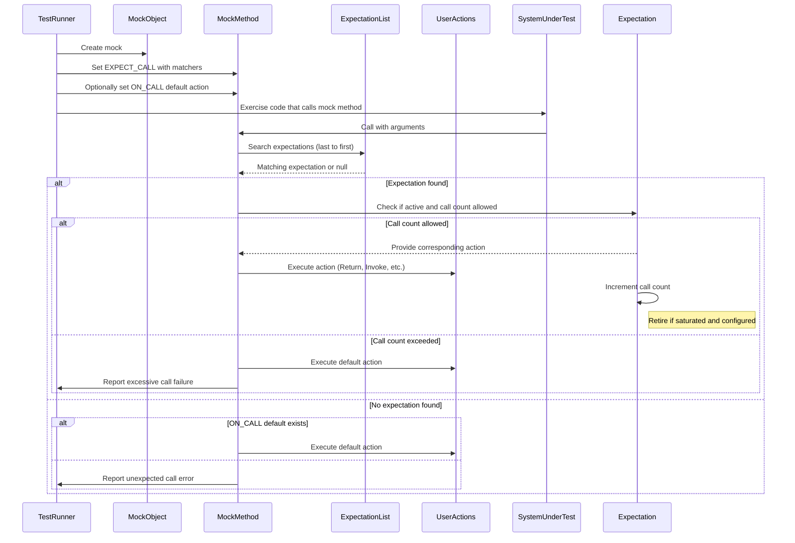

# Expectations and Actions

This page provides comprehensive guidance on how to define, control, and customize expectations on mock methods using GoogleMock. It focuses on setting precise invocation expectations with `EXPECT_CALL`, customizing default behavior using `ON_CALL`, managing call counts (cardinalities), orchestrating call sequences, and defining return behaviors or side effects via built-in or custom actions.

---

## 1. Introduction to Expectations and Actions

When testing with mocks, you need to specify what calls you expect your mock objects to receive, how many times, in what order, and how they should respond. Expectations express these conditions, while actions define the behavior that mock methods perform when invoked.

GoogleMock provides intuitive macros and clauses to let you precisely control these aspects, enabling interaction-based testing that verifies both *what* calls happen and *how* they behave.

---

## 2. Setting Expectations with `EXPECT_CALL`

The primary mechanism to set expectations on mock methods is the `EXPECT_CALL` macro.

### Syntax Overview

```cpp
EXPECT_CALL(mock_object, Method(argument_matchers))
    .With(multi_arg_matcher)      // Optional
    .Times(cardinality)            // Optional
    .InSequence(sequences...)      // Optional, repeatable
    .After(expectations...)        // Optional, repeatable
    .WillOnce(action)              // Optional, repeatable
    .WillRepeatedly(action)        // Optional
    .RetiresOnSaturation();        // Optional
```

- **`mock_object`**: The mock instance.
- **`Method`**: The mocked method name.
- **`argument_matchers`**: Matchers that specify expected arguments.

This expresses "I expect that `mock_object.Method()` is (will be) called at least as specified".

### Setting Argument Matchers

- Use specific values, e.g., `5`, or wildcards `_` to accept any argument.
- Complex conditions can be expressed using built-in or custom matchers.
- If method overloads exist, specify argument types or use `SafeMatcherCast` to resolve ambiguity.

### Call Cardinalities

Control how many times the expectation should be invoked with `.Times()`:

| Cardinality           | Meaning                             |
|-----------------------|-----------------------------------|
| `Exactly(n)` or `n`   | Exactly `n` times                  |
| `AtLeast(n)`          | At least `n` times                 |
| `AtMost(n)`           | At most `n` times                  |
| `Between(m, n)`       | Between `m` and `n` times, incl.  |
| `AnyNumber()`         | Any number of times                |

**Default:** Inferred automatically based on presence of `.WillOnce()` and `.WillRepeatedly()` clauses if `.Times()` is omitted.

### Call Order Control

You can specify relative order with:

- `.InSequence(sequences...)`: Group expectations that must occur sequentially.
- `.After(expectations...)`: Define that this expectation can only occur after others have been satisfied.

These features allow strict or partial ordering of calls.

### Actions on Calls

Define what your mock method should do when called:

- Repeated `.WillOnce(action)` clauses define behaviors for consecutive calls.
- A single optional `.WillRepeatedly(action)` defines behavior for all subsequent calls after all `.WillOnce()`s have run out.
- `.RetiresOnSaturation()` indicates the expectation retires (becomes inactive) after it reaches its upper call count.

---

## 3. Customizing Default Behavior with `ON_CALL`

While `EXPECT_CALL` sets both expectation and behavior, `ON_CALL` only defines default behavior when no matching expectation is set.

### Syntax

```cpp
ON_CALL(mock_object, Method(argument_matchers))
    .With(multi_arg_matcher)  // Optional
    .WillByDefault(action);   // Required
```

- Does *not* imply the call must occur.
- Useful for common behavior shared across tests.

---

## 4. Example: Defining and Using Expectations

```cpp
#include <gmock/gmock.h>
using ::testing::_;           // Wildcard matcher
using ::testing::Return;      // Return action
using ::testing::AtLeast;     // Cardinality
using ::testing::Sequence;

class MockTurtle {
 public:
  MOCK_METHOD(void, PenDown, (), ());
  MOCK_METHOD(void, Forward, (int distance), ());
  MOCK_METHOD(int, GetX, (), (const));
  MOCK_METHOD(int, GetY, (), (const));
};

Sequence seq;

TEST(DrawingTest, DrawsSquare) {
  MockTurtle turtle;

  EXPECT_CALL(turtle, PenDown()).InSequence(seq).Times(1);
  EXPECT_CALL(turtle, Forward(100)).InSequence(seq).Times(4);
  EXPECT_CALL(turtle, GetX()).WillRepeatedly(Return(50));

  turtle.PenDown();
  turtle.Forward(100);
  turtle.Forward(100);
  turtle.Forward(100);
  turtle.Forward(100);

  EXPECT_EQ(50, turtle.GetX());
}
```

This test expects `PenDown()` once and then `Forward(100)` four times sequentially. Calls out of order or unexpected calls will cause test failures.

---

## 5. Common Clauses Explained

### `.With(matcher)`

- Restricts expectation to calls matching a multi-argument matcher applied to the full argument tuple.
- Can be used once per expectation.

### `.Times(cardinality)`

- Specify exact or fuzzy invocation counts.
- Only once per expectation.

### `.InSequence(sequence...)`

- Declare expectation sequences.
- Use to enforce strict call ordering within sequences.

### `.After(expectations...)`

- Delay activation of an expectation until others are satisfied.
- Accepts up to 5 expectations or expectation sets.

### `.WillOnce(action)`

- Define action for a single call.
- Multiple allowed and executed in order.

### `.WillRepeatedly(action)`

- Define action for all subsequent calls after `.WillOnce()`s.
- Only once per expectation.

### `.RetiresOnSaturation()`

- Deactivate expectation once its upper call count is reached.
- Only makes sense for expectations with a bounded call count.

---

## 6. Actions Reference Highlights

GoogleMock provides many built-in actions to define mock behaviors:

### Returning values

| Action               | Usage                             |
|----------------------|----------------------------------|
| `Return(value)`       | Return `value` immediately.       |
| `ReturnArg<N>()`      | Return N-th argument (0-based).  |
| `ReturnNew<T>(args...)`| Return new `T` constructed with `args`. |
| `ReturnRef(variable)` | Return reference to `variable`.  |
| `ReturnPointee(ptr)`  | Return the value pointed to by `ptr`. |

### Side effects

| Action               | Description                      |
|----------------------|---------------------------------|
| `SetArgPointee<N>(value)` | Sets pointed-to value of N-th argument.
| `SaveArg<N>(pointer)`      | Saves N-th argument to pointer.
| `Assign(&var, value)`      | Assigns `value` to `var`.
| `Throw(exception)`         | Throws an exception.

### Functional callbacks

- `Invoke(functor)` - call the functor with method arguments.
- `InvokeWithoutArgs(functor)` - call functor without any argument.
- `InvokeArgument<N>(args...)` - invoke the N-th argument (a callback) with arguments.

### Composite actions

- `DoAll(a1, ..., an)` - chain multiple actions, returning the last's result.
- `IgnoreResult(action)` - perform action but ignore return value.
- `WithArg<N>(action)` - invoke action with N-th argument only.
- `WithoutArgs(action)` - invoke action with no arguments.

---

## 7. Best Practices and Tips

- Always set expectations *before* exercising the code under test to avoid undefined behavior.
- Use `_` (wildcard matcher) to reduce brittle test conditions.
- Use sequences and `.After()` for controlling call order precisely.
- Use `.RetiresOnSaturation()` to handle expectations that should deactivate after firing.
- Prefer `ON_CALL` for default behaviors when you don't want to enforce call expectations.
- Use `NiceMock<T>`, `NaggyMock<T>`, or `StrictMock<T>` wrappers to adjust mock strictness.
- When mocking methods returning references, use `ReturnRef()` to avoid dangling references.
- Avoid side effects inside matchers; they must be pure functions.
- Use `Invoke()` with lambdas or function pointers to delegate complex behaviors.

---

## 8. Troubleshooting Common Scenarios

### Unexpected Call Errors

- Occur when a mock method is called with arguments that don’t match any `EXPECT_CALL`.
- Diagnose with `--gmock_verbose=info` to see matching attempts and call traces.

### Excessive Calls

- Occur when a call is made more times than `Times()` permits.
- Use `.RetiresOnSaturation()` or extend cardinality to allow more calls.

### Uninteresting Calls Warnings

- Happen when calls are made on mock methods without `EXPECT_CALL`.
- Use `ON_CALL` to silence warnings by defining default behavior, or wrap mocks in `NiceMock`.
- Suppressing with an overly broad `EXPECT_CALL` is discouraged.

### Overloaded Method Ambiguity

- Actions and expectations on overloaded methods require disambiguation.
- Use explicit cast or `Const()` wrapper on mocks when matching const overloaded methods.

---

## 9. Advanced Usage

### Delegating to a Fake or Real Object

You can delegate behavior from a mock method to an existing implementation using actions like:

```cpp
ON_CALL(mock, Method).WillByDefault([this](args...) {
  return real_.Method(args...);
});
```

This combines behavioral fidelity and interaction verification.

### Mocking Non-Virtual Methods

Use template-based dependency injection and mock classes with matching signatures.

### Testing Asynchronous Calls

Combine actions with synchronization primitives like `Notification` to create deterministic tests.

---

## 10. Additional Resources

- [Mocking Reference](mocking.md) for detailed macros and classes
- [gMock for Dummies](gmock_for_dummies.md) for beginner-friendly concepts
- [gMock Cookbook](gmock_cook_book.md) for practical recipes
- [Actions Reference](actions.md) for a complete list of built-in actions
- [Matchers Reference](matchers.md) for argument matching techniques
- [Mock Methods and Fixtures](mock-methods.md) to understand defining mock classes
- [Mock Strictness Modes](mock-strictness-modes.md) to manage uninteresting/unexpected calls

---

## Diagram: Expectation Lifecycle and Call Matching Flow



---

<Check>
**Key Reminders:**
- Always set expectations before exercising mocks.
- Use `.Times` or `.WillOnce`/`.WillRepeatedly` appropriately.
- Use sequences and `.After` for call order dependencies.
- Use `ON_CALL` for default behavior without expectation.
- Employ `RetiresOnSaturation` when useful.
- Prefer `NiceMock` or `StrictMock` wrappers based on strictness needs.
- Avoid side effects inside matchers.
</Check>
