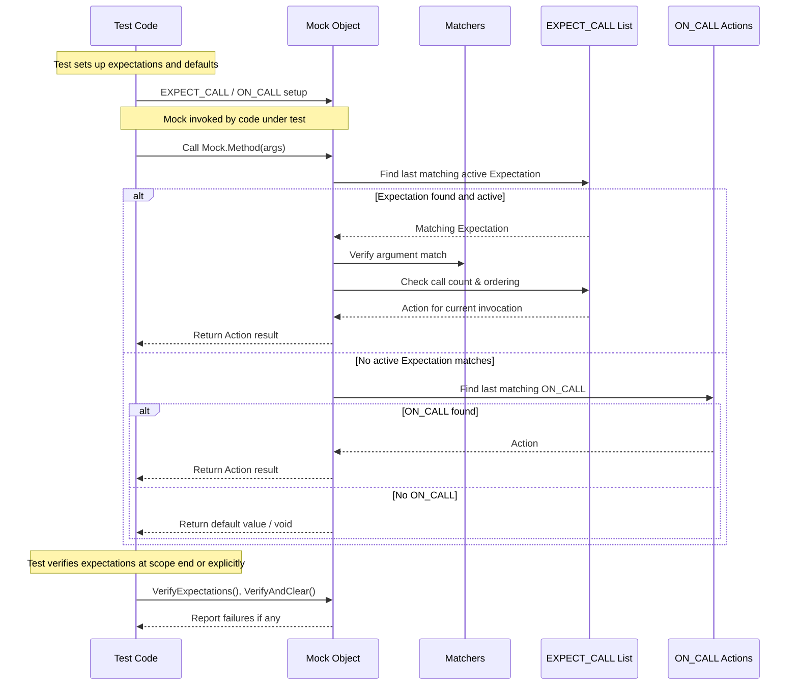

# Expectations, Actions & Sequences

This page details the core API for setting up and manipulating expectations (`EXPECT_CALL`, `ON_CALL`) on mock objects, defining mock actions, composing invocation sequences, and controlling default or canned behaviors. It offers practical insights and illustrative examples to help you handle multiple expectations, manage invocation order, and leverage advanced ordering constraints.

---

## Overview: Setting Expectations and Default Behaviors

In GoogleMock, controlling the behavior and verifying interactions of mock objects relies fundamentally on two macros:

- `EXPECT_CALL`: sets an expectation that a specific method with matching arguments will be called, specifying how and how many times. It both defines behavior and verifies invocations.
- `ON_CALL`: sets a default action for a mock method when called with matching arguments but does *not* imply any expectation that the call must occur.

These constructs allow users to precisely express *what* interactions they expect to occur in their tests, and *how* the mock should respond.

### Using `EXPECT_CALL`

```cpp
EXPECT_CALL(mock_object, Method(matchers...))
    .With(multi_argument_matcher)       // optional, for matching all args as a tuple
    .Times(cardinality)                 // optional, how many times to expect
    .InSequence(sequences...)           // optional, for ordering in sequences
    .After(expectations...)             // optional, partial ordering
    .WillOnce(action)                   // optional, action for one call; multiple allowed
    .WillRepeatedly(action)             // optional, action for all other calls
    .RetiresOnSaturation();             // optional, deactivate expectation after calls
```

- `matchers...` specify argument constraints; omit to match any if method is not overloaded.
- If `Times()` is omitted, gMock infers the call count from `WillOnce`/`WillRepeatedly` clauses.
- `InSequence` and `After` clauses let you impose ordering constraints on expected calls.
- Use `RetiresOnSaturation()` to make an expectation inactive immediately after its call count reaches the upper bound.

### Using `ON_CALL`

```cpp
ON_CALL(mock_object, Method(matchers...))
    .With(multi_argument_matcher)   // optional
    .WillByDefault(action);          // required
```

- Defines default behavior for matching calls that do not have an `EXPECT_CALL` overriding them.
- Helpful for setting up common mock behaviors in test fixtures or constructor phases.
- Does *not* create an expectation that calls *must* occur.

### Matching Behavior Precedence

- gMock searches expectations and default behaviors **in reverse order of definition**, meaning *newer rules override older ones*.
- This facilitates setting common default behaviors early and refining them with more specific expectations later.

---

## Detailed Workflow and Examples

### 1. Establish Default Behavior with `ON_CALL`

Use `ON_CALL` when you want to specify behavior for how the mock responds, without requiring verification of calls.

```cpp
ON_CALL(mock_turtle, GetX())
    .WillByDefault(Return(10));
```

This way, `mock_turtle.GetX()` returns 10 even if you don’t explicitly `EXPECT_CALL` it in some tests.

### 2. Set Expected Calls with `EXPECT_CALL`

Set expectations for specific mock method calls you want to verify, including call counts and order.

```cpp
using ::testing::Return;
using ::testing::_;
using ::testing::InSequence;

// Expect GetX() called exactly three times with specified returns
EXPECT_CALL(mock_turtle, GetX())
    .WillOnce(Return(100))
    .WillOnce(Return(150))
    .WillOnce(Return(200));

// Expect GoTo() called twice with the first argument 0, second any
EXPECT_CALL(mock_turtle, GoTo(0, _))
    .Times(2);
```

### 3. Using Multiple Expectations for the Same Method

You can specify multiple expectations on the same method with different matchers. The latest matching expectation will be used.

```cpp
EXPECT_CALL(mock_turtle, Forward(_));          // #1 Catch-all
EXPECT_CALL(mock_turtle, Forward(10)).Times(2); // #2 More specific

// The two calls to Forward(10) match #2; later calls with other arguments match #1.
```

### 4. Controlling Expectation Ordering

#### a. Full Order with `InSequence`
All expectations in the scope of an `InSequence` object must be matched sequentially in declaration order.

```cpp
{
  InSequence seq;
  EXPECT_CALL(mock_turtle, PenDown());
  EXPECT_CALL(mock_turtle, Forward(100));
  EXPECT_CALL(mock_turtle, PenUp());
}
```

#### b. Partial Order with `Sequence` and `.InSequence(sequences...)`
Build DAGs of invocation order by assigning expectations to one or more sequences.

```cpp
Sequence s1, s2;
EXPECT_CALL(mock_turtle, Init()).InSequence(s1, s2);
EXPECT_CALL(mock_turtle, DrawLine()).InSequence(s1);
EXPECT_CALL(mock_turtle, DrawCircle()).InSequence(s2);
```

This means `Init()` must happen before both `DrawLine()` and `DrawCircle()`, but `DrawLine()` and `DrawCircle()` may be called in any order.

#### c. Dependency Ordering with `.After()`
You can specify that a call must occur after specific expectations or expectation sets.

```cpp
Expectation init = EXPECT_CALL(mock_turtle, Init());
EXPECT_CALL(mock_turtle, Draw()).After(init);
```

---

## Advanced Invocation Control

### Sticky Expectations and `.RetiresOnSaturation()`

By default, expectations remain *sticky* — they remain active even after they satisfy their maximum expected calls — which means a call exceeding the upper bound produces a failure immediately.

If you want an expectation to become inactive (retire) as soon as its expected calls are fulfilled, use `.RetiresOnSaturation()`:

```cpp
EXPECT_CALL(mock_turtle, GetX())
    .WillOnce(Return(10))
    .WillOnce(Return(20))
    .RetiresOnSaturation();
```

Once both calls happen, this expectation retires and will no longer match additional calls.

### Combining Multiple `.WillOnce()` Actions with `.WillRepeatedly()`

You can specify different actions per call:

```cpp
EXPECT_CALL(mock_turtle, GetDistance())
     .WillOnce(Return(42))
     .WillOnce(Return(123))
     .WillRepeatedly(Return(0));
```

The first two calls return 42 and 123; all subsequent calls return 0.

### Using `.With()` Clause for Multi-Argument Matching

Use `.With()` to apply a single matcher over all arguments as an aggregated tuple.

```cpp
EXPECT_CALL(mock_turtle, SetPosition(_, _))
    .With(Lt())  // first argument < second argument
    .Times(AnyNumber());
```

---

## Default Behavior Management

If a mock method has no matching `EXPECT_CALL`, the behavior is controlled by:

- Default built-in actions (e.g., return zero or default-constructed value).
- Actions set with `ON_CALL()`.
- Mock object niceness (naggy, nice, strict) which controls how GoogleMock treats uninteresting calls.

You can suppress warnings on uninteresting calls by using `NiceMock<MockClass>` or explicitly set default actions.

---

## Verifying and Resetting Expectations

### Automatic Verification

Expectations are verified on mock destruction by default. However, you can manually verify and clear expectations early using:

```cpp
::testing::Mock::VerifyAndClearExpectations(&mock_object);
::testing::Mock::VerifyAndClear(&mock_object);  // Also clears ON_CALL default actions
```

Be careful to avoid setting new expectations after verification or clearing—this is undefined behavior.

---

## Practical Tips and Best Practices

- **Set Expectations Before Exercising the Mock:** Always call `EXPECT_CALL` before the code under test calls the mock methods.

- **Use `ON_CALL` for Common Default Behavior:** Define common default actions inside test fixtures or mock constructors, reserving `EXPECT_CALL` for verifications.

- **Order Expectations with Sequences When Needed:** Use `InSequence` to enforce strict order; use `Sequence` and `.After()` for partial orders.

- **Use `.RetiresOnSaturation()` to Avoid Sticky Expectation Pitfalls:** This is crucial when chaining multiple `WillOnce` actions to avoid unexpected failures.

- **Suppress Uninteresting Call Warnings with `NiceMock`:** If certain calls are expected to occur without explicit `EXPECT_CALL`, use `NiceMock` to reduce noise.

- **Leverage `EXPECT_CALL` Precedence:** Place specific expectations *after* more general ones to override default behavior effectively.

- **Use `.With()` to Validate Composite Arguments:** This helps express more complex constraints without multiple separate matchers.

- **Debugging:** Run your tests with `--gmock_verbose=info` to trace mock calls and understand expectation matching.

---

## Illustrative Example

```cpp
#include <gmock/gmock.h>
using ::testing::Return;
using ::testing::_;
using ::testing::InSequence;

class MockTurtle : public Turtle {
 public:
  MOCK_METHOD(void, PenUp, (), (override));
  MOCK_METHOD(void, PenDown, (), (override));
  MOCK_METHOD(void, Forward, (int distance), (override));
  MOCK_METHOD(void, GoTo, (int x, int y), (override));
  MOCK_METHOD(int, GetX, (), (const, override));
};

TEST(TurtleTest, DrawsLine) {
  MockTurtle turtle;

  ON_CALL(turtle, GetX()).WillByDefault(Return(0));  // Default behavior

  {
    InSequence seq;

    EXPECT_CALL(turtle, PenDown());
    EXPECT_CALL(turtle, Forward(100));
    EXPECT_CALL(turtle, PenUp());
  }

  EXPECT_CALL(turtle, GoTo(0, 0))
      .Times(2);

  // Exercise code calls turtle methods...
}
```

---

## Troubleshooting Common Issues

<AccordionGroup title="Troubleshooting Common Expectation and Action Issues">
  <Accordion title="Unexpected Calls Despite ON_CALL">
    If you receive warnings or errors about unexpected calls even when `ON_CALL` is defined, ensure you have an `EXPECT_CALL` matching that call or use `EXPECT_CALL(...).Times(AnyNumber())` to suppress warnings.
  </Accordion>
  <Accordion title="Sticky Expectations Cause Early Failures">
    By default, expectations remain active after saturation, resulting in failures on extra calls. Use `.RetiresOnSaturation()` to disable stickiness.
  </Accordion>
  <Accordion title="Multiple Expectations Shadowing Each Other">
    Remember that gMock searches expectations in reverse order, so put general `EXPECT_CALL`s first, specific ones later.
  </Accordion>
  <Accordion title="Ordering Errors in Sequences">
    Calls violating sequence or `.After()` orders will cause failures. Double-check the intended order and the sequence configuration.
  </Accordion>
  <Accordion title="Calls Without Expectations or Default Actions Warning">
    Use `NiceMock` to suppress uninteresting call warnings or add explicit `EXPECT_CALL` with `.Times(AnyNumber())` if those calls are expected but not verified.
  </Accordion>
</AccordionGroup>

---

## See Also

- [`EXPECT_CALL` and `ON_CALL` syntax and usage](reference/mocking.md#EXPECT_CALL) 
- [Actions Reference](reference/actions.md) for built-in and custom mock actions
- [Matchers Reference](reference/matchers.md) for argument matching
- [gMock Cookbook](gmock_cook_book.md) for practical recipes
- [Using Mocks Guide](guides/essential-workflows/using-mocks.mdx) for workflow examples

---

## Diagram: Mock Invocation Flow with Expectations and Actions


```

---

*This documentation empowers you to master mock expectations, default behaviors, invocation ordering, and complex interaction management with GoogleMock's flexible API.*
