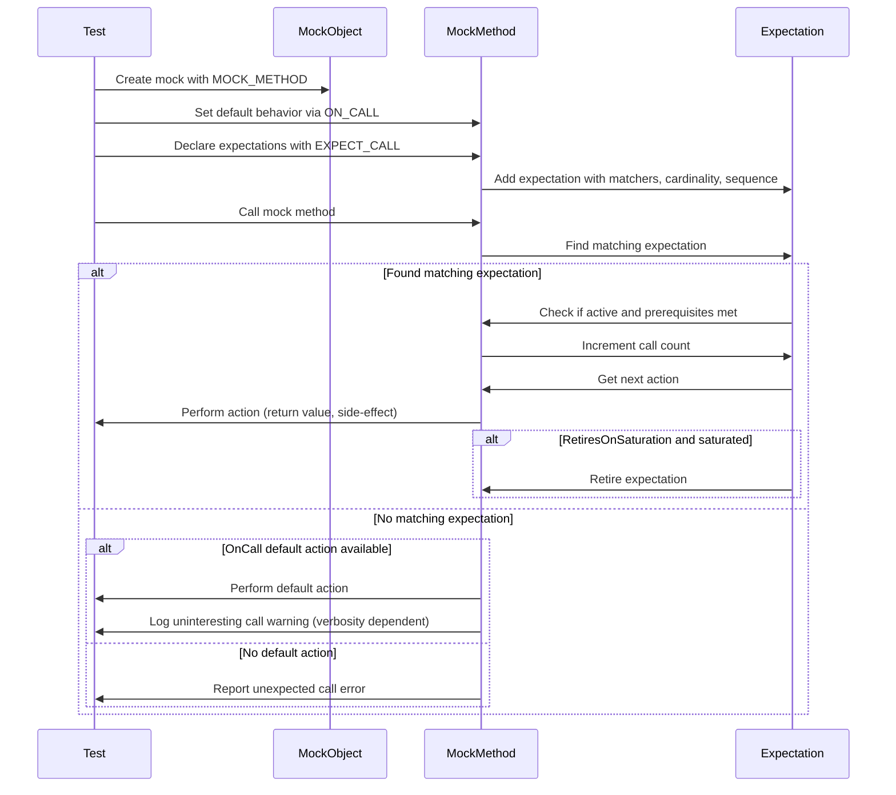

# Expectations and Invocation Control

This documentation explains how to define and manage expectations on mock objects using GoogleMock macros such as `EXPECT_CALL` and `ON_CALL`. You'll learn to specify how many times a mocked method should be called, control the order of calls, customize default behaviors, and handle invocation tracking for precise and robust tests.

---

## Overview

GoogleMock provides powerful macros and interfaces to express the expected behavior of mocked methods in your tests. The core constructs are:

- **`EXPECT_CALL`**: Declares an expectation that a particular mock method will be invoked with specific arguments, potentially a specified number of times, and possibly in sequence relative to other calls.
- **`ON_CALL`**: Sets default behaviors for mock methods without enforcing that they must be called.

Expectations are not only about matching calls, but also about configuring what happens when these calls occur, including sequences, cardinalities, and return actions.

Understanding this flow is key to crafting maintainable and meaningful mock-based tests.

---

## Setting Expectations with `EXPECT_CALL`

The `EXPECT_CALL` macro is the primary mechanism for specifying *expectations* on mock objects. It both sets the behavior when the method is called and enforces calls matching that specification.

### Syntax
```cpp
EXPECT_CALL(mock_object, MethodName(argument_matchers))
    .With(multi_argument_matcher)      // Optional
    .Times(cardinality)                // Optional
    .InSequence(sequences...)          // Optional, can appear multiple times
    .After(expectations...)            // Optional, can appear multiple times
    .WillOnce(action)                  // Optional, can appear multiple times
    .WillRepeatedly(action)            // Optional
    .RetiresOnSaturation();            // Optional
```

Each clause modifies how the expectation behaves. You only have to specify what you need.

### Argument Matchers
- Provide constraints on method parameters (e.g., equality, wildcards `_`, relational operators).
- If omitted, all arguments are matched with wildcards by default.

### `With` Clause
- Optional additional matcher that applies to all arguments together as a tuple.
- Must appear before other clauses and at most once.

### `Times` Clause
- Specifies how many times the expected call should occur.
- Can be one of the cardinalities like `Exactly(n)`, `AtLeast(n)`, `AtMost(n)`, `Between(m, n)`, or `AnyNumber()`.
- If omitted, inferred based on the presence of `WillOnce`/`WillRepeatedly` clauses.

### `InSequence` Clause
- Forces expectations to be matched in a particular order defined by one or more `Sequence` objects.
- Can be repeated to join multiple sequences.

### `After` Clause
- Specifies that this expectation should occur only after other expectation(s) or sets.
- Useful for expressing partial orders beyond simple sequences.

### `WillOnce` Clause
- Defines an action executed once per matching call.
- Multiple clauses can be chained; actions execute in order.

### `WillRepeatedly` Clause
- Defines an action for all matching calls after the `WillOnce` actions are exhausted.
- Can be used at most once.

### `RetiresOnSaturation` Clause
- Causes the expectation to become inactive after it has been saturated.
- Ensures subsequent calls won't match this expectation.

### Practical Example
```cpp
using ::testing::Return;
using ::testing::InSequence;
using ::testing::Sequence;
using ::testing::_;

class MockFoo {
 public:
  MOCK_METHOD(int, DoSomething, (int x, int y), (override));
};

TEST(FooTest, Example) {
  MockFoo mock;
  Sequence s;

  EXPECT_CALL(mock, DoSomething(42, _))
      .Times(2)
      .InSequence(s)
      .WillOnce(Return(1))
      .WillOnce(Return(2))
      .RetiresOnSaturation();

  EXPECT_CALL(mock, DoSomething(_, 0))
      .Times(AnyNumber());

  // Calls must follow the order due to sequence
  EXPECT_EQ(mock.DoSomething(42, 7), 1);
  EXPECT_EQ(mock.DoSomething(42, 1), 2);
  EXPECT_EQ(mock.DoSomething(10, 0), 0);  // Caught by the catch-all.
}
```

---

## Specifying Default Behavior with `ON_CALL`

`ON_CALL` sets the *default action* for a mock method without establishing any requirement that the method *must* be called.

### Syntax
```cpp
ON_CALL(mock_object, MethodName(argument_matchers))
    .With(multi_argument_matcher)  // Optional
    .WillByDefault(action);        // Required
```

- Must include `.WillByDefault()` to specify the default action.
- Actions specified here serve as fallbacks if no `EXPECT_CALL` matches a call.

### Example
```cpp
using ::testing::Return;
using ::testing::_;

ON_CALL(mock, GetValue(_))
    .WillByDefault(Return(42));  // Return 42 unless overridden by EXPECT_CALL
```

### Interaction With `EXPECT_CALL`
- Actions set by `EXPECT_CALL` take precedence over those set by `ON_CALL`.
- Use `ON_CALL` to configure broadly used default behaviors shared across many tests.

---

## Cardinalities: Controlling Call Counts

Cardinalities control **how many times** a mock method can or should be called. They are used in the `.Times()` clause of `EXPECT_CALL`.

### Common Cardinalities
| Cardinality         | Semantics                            |
|---------------------|------------------------------------|
| `Exactly(n)` or `n` | The call is expected exactly `n` times.
| `AtLeast(n)`        | At least `n` calls are expected.
| `AtMost(n)`         | At most `n` calls are expected.
| `Between(m, n)`     | Between `m` and `n` calls (inclusive).
| `AnyNumber()`       | Any number of calls are allowed.

### Omission and Inference
- If `.Times()` is omitted, GoogleMock infers cardinality from `WillOnce` and `WillRepeatedly`.
   - No `WillOnce` or `WillRepeatedly`: defaults to `.Times(1)`.
   - `n` `WillOnce` clauses, no `WillRepeatedly`: `.Times(n)`.
   - `n` `WillOnce` clauses and one `WillRepeatedly`: `.Times(AtLeast(n))`.

### Important Notes
- Use `.Times(0)` to **disallow a call** (i.e. method must never be called).
- Setting **too many** or **too few** `WillOnce` actions compared to the cardinality may cause warnings.

### Example
```cpp
EXPECT_CALL(mock, Foo())
    .Times(3)
    .WillOnce(Return(1))
    .WillOnce(Return(2))
    .WillOnce(Return(3));
```
The above expects exactly three calls to `Foo()`, returning 1, 2, then 3.

---

## Controlling Call Order

### Using `Sequence` and `InSequence`

`Sequence` objects let you define strict call orders for expectations. When multiple expectations belong to the same sequence, their calls must appear in the sequence declared.

```cpp
Sequence s1, s2;
EXPECT_CALL(mock, A()).InSequence(s1, s2);
EXPECT_CALL(mock, B()).InSequence(s1);
EXPECT_CALL(mock, C()).InSequence(s2);
```

This enforces that call `A` happens before `B` and `C`. Relative order of `B` and `C` is not enforced.

Using the scoped helper `InSequence` adds all expectations in scope to an anonymous sequence:

```cpp
{
  InSequence seq;
  EXPECT_CALL(mock, Foo());
  EXPECT_CALL(mock, Bar());
}
```

### Using `.After()` for Partial Order

For more complex partial orders, `After` clause specifies that an expectation is only valid after one or more other expectations are satisfied.

```cpp
Expectation e1 = EXPECT_CALL(mock, Init());
EXPECT_CALL(mock, Run()).After(e1);
```

You can specify multiple expectations/sets in `After`.

---

## Invocation Actions and Behavior

### `.WillOnce()` and `.WillRepeatedly()`

- `.WillOnce(action)`: Action to perform on the next matching call, can be chained multiple times.
- `.WillRepeatedly(action)`: Action for all subsequent calls after `WillOnce` actions are exhausted.

Example:
```cpp
EXPECT_CALL(mock, GetValue())
    .WillOnce(Return(1))
    .WillOnce(Return(2))
    .WillRepeatedly(Return(3));
```

On first call returns 1, second returns 2, and all following calls return 3.

### `.RetiresOnSaturation()`

This clause makes an expectation retire (no longer match calls) after it has been saturated (maximum expected calls reached).

```cpp
EXPECT_CALL(mock, SetNumber(7))
    .Times(2)
    .RetiresOnSaturation();

// First two calls to SetNumber(7) match this expectation; subsequent ones do not.
```

Without it, calls exceeding cardinality yield errors.


---

## Best Practices and Tips

- **Prefer `ON_CALL` for general default behaviors** to avoid over-specifying tests.
- Use `EXPECT_CALL` only when you need to verify that a call occurs.
- Use `RetiresOnSaturation` to make expectations non-sticky and avoid upper bound errors when consecutive calls happen.
- Use `Sequence` or `.InSequence()` to enforce call order.
- Add catch-all expectations using wildcard matchers `_` and `.Times(AnyNumber())` to avoid unhandled call warnings during testing.
- Avoid setting expectations after the mock has been exercised; behavior is undefined.

---

## Troubleshooting

- **Uninteresting call warnings** indicate mock methods called without expectations. Suppress by using `NiceMock`, adding catch-all `EXPECT_CALL`s with `.Times(AnyNumber())`, or increasing verbosity controls.
- **Unexpected call errors** occur when calls do not match any active expectation.
- Ensure **mocked methods are virtual** to avoid calls to real implementations.
- If you get strictness or warning issues, adjust the mock type between `NiceMock`, `NaggyMock`, and `StrictMock`.
- To debug failing expectations, run tests with `--gmock_verbose=info` to get detailed call matching logs.

---

## Related Concepts

- [Defining Mock Objects using `MOCK_METHOD`](../mocking-framework/defining-mock-objects.md)
- [Matchers Reference](../mocking-framework/matchers-and-custom-matchers.md)
- [Actions Reference](../mocking-framework/mock-actions-and-custom-actions.md)
- [GoogleMock Cookbook](../../guides/mocking-real-world/gmock_cook_book.md)
- [Understanding Uninteresting vs Unexpected Calls](../../guides/mocking-real-world/gmock_cook_book.md#UnderstandingUninterestingCalls)

---

## Mermaid Diagram: Expectations and Invocation Control Flow

