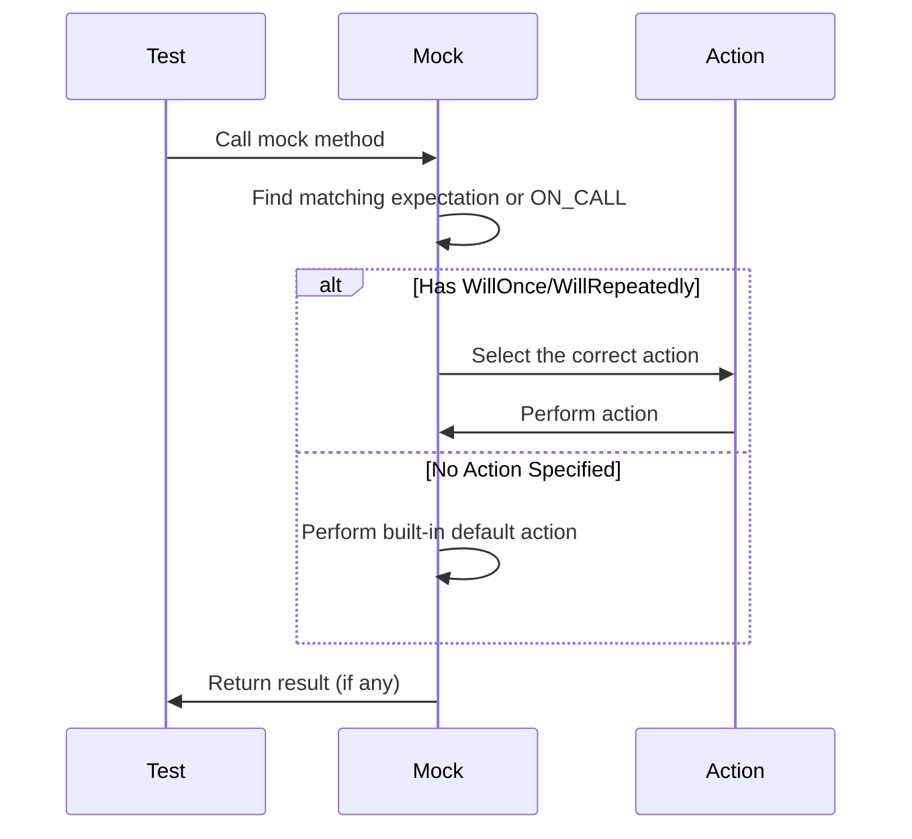

# Actions and Custom Actions

GoogleMock actions specify what a mock function does when it is called. This page documents the variety of built-in gMock actions, explains how to define your own custom actions, and demonstrates how to compose actions for flexible, reusable test behavior.

---

## 1. What Are Actions?

An *action* defines how a mock method should respond when invoked. By default, mock methods have a built-in default action that returns a default value based on the return type or returns void. Actions let you override this behavior in tests by specifying how many times and what the mock should do each time it is called.

*Key outcomes:* You control the behavior of mock methods beyond just checking whether they are called—you can specify returned values, invoke callbacks, throw exceptions, or perform side effects.

---

## 2. Using Built-in Actions

GoogleMock provides many built-in actions categorized by intent:

### a. Returning Values

| Action           | Description                                                                                               |
|------------------|-----------------------------------------------------------------------------------------------------------|
| `Return()`       | Return from a `void`-returning mock function.                                                            |
| `Return(value)`  | Return the specified `value`. The conversion to the mock method's return type is done when the expectation is set, not when the action is executed. |
| `ReturnArg<N>()` | Return the N-th argument passed to the mock function (0-based).                                           |
| `ReturnNew<T>(...)` | Each call returns a new instance of `T` created with the given constructor arguments.                    |
| `ReturnNull()`   | Return a null pointer.                                                                                     |
| `ReturnPointee(ptr)` | Return the value pointed to by `ptr` at the time of invocation.                                         |
| `ReturnRef(variable)` | Return a reference to `variable`.                                                                       |
| `ReturnRefOfCopy(value)` | Return a reference to a copy of `value`. The copy lifetime is tied to the action.                      |
| `ReturnRoundRobin({a1, ..., ak})` | Cycles through given values on each call in order, restarting at the beginning after the last one. |

#### Example: Returning Different Values on Each Call

```cpp
using ::testing::Return;
EXPECT_CALL(mock, GetValue())
    .WillOnce(Return(10))
    .WillOnce(Return(20))
    .WillRepeatedly(Return(30));

EXPECT_EQ(mock.GetValue(), 10);
EXPECT_EQ(mock.GetValue(), 20);
EXPECT_EQ(mock.GetValue(), 30);
EXPECT_EQ(mock.GetValue(), 30);
```

---

### b. Side Effects

| Action                      | Description                                                       |
|-----------------------------|-------------------------------------------------------------------|
| `Assign(&var, value)`       | Assign `value` to the variable `*var`.                            |
| `DeleteArg<N>()`            | Delete the N-th argument, assuming it is a pointer.               |
| `SaveArg<N>(pointer)`       | Save the N-th argument to `*pointer` by copy.                     |
| `SaveArgByMove<N>(pointer)` | Save the N-th argument to `*pointer` by move.                     |
| `SaveArgPointee<N>(pointer)`| Save the value pointed to by the N-th argument to `*pointer`.     |
| `SetArgReferee<N>(value)`  | If the N-th argument is a reference, assign `value` to it.        |
| `SetArgPointee<N>(value)`  | Assign `value` to the variable pointed to by the N-th argument.   |
| `SetArrayArgument<N>(first, last)` | Copy elements `[first, last)` into the array pointed by the N-th argument or iterator. |
| `SetErrnoAndReturn(error, value)` | Set `errno` and return `value`.                                 |
| `Throw(exception)`          | Throw the given exception object.                                 |

#### Example: Setting an Output Argument

```cpp
EXPECT_CALL(mock, Mutate(_))
    .WillOnce(SetArgPointee<0>(42));  // Sets first argument's pointee to 42
```

---

### c. Using Functions, Functors, or Lambdas as Actions

You can use any callable compatible with the mock's signature as an action.

| Action                                   | Description                                                         |
|------------------------------------------|---------------------------------------------------------------------|
| `f`                                      | Call the callable `f` with mock method arguments.                   |
| `Invoke(f)`                              | Similar to `f`, supports global functions, functors, or lambdas.    |
| `Invoke(object_ptr, &Class::method)`     | Call the method on the object with passed mock arguments.           |
| `InvokeWithoutArgs(f)`                    | Call `f` which must take no arguments.                              |
| `InvokeWithoutArgs(object_ptr, &method)` | Call the object's no-arg method.                                    |
| `InvokeArgument<N>(args...)`             | Call the N-th (0-based) argument (a callable) with the specified `args`. |

#### Example: Invoking an Argument Callback

```cpp
using ::testing::InvokeArgument;
EXPECT_CALL(mock, RunCallback(_, _))
    .WillOnce(InvokeArgument<1>(5));  // Call 2nd arg as a function with 5
```

---

### d. Composite Actions

To perform multiple actions in sequence or to transform actions, gMock provides:

| Action              | Description                                                  |
|---------------------|--------------------------------------------------------------|
| `DoAll(a1, a2, ..., an)` | Execute all actions `a1` through `an` sequentially, returning the last one's result.  |
| `IgnoreResult(a)`   | Performs action `a` and ignores its return value (must not be void). |
| `WithArg<N>(a)`     | Pass only the N-th argument of the mock function to action `a`. |
| `WithArgs<N1, ..., Nk>(a)` | Pass selected arguments to inner action `a`.               |
| `WithoutArgs(a)`    | Run action `a` without any arguments.                         |

#### Example: Performing Multiple Side Effects

```cpp
EXPECT_CALL(mock, Process(_))
    .WillOnce(DoAll(SetArgPointee<0>(5), Return(true)));
```

---

## 3. Creating Custom Actions

If the existing actions don't satisfy your needs, you can define your own.

### a. Using Lambdas or Callables

The easiest way to create an action is to use a lambda or functor with signature compatible with the mocked method:

```cpp
EXPECT_CALL(mock, Compute(_))
    .WillOnce([](int x) { return x * 2; });
```

When used with `WillOnce`, the callable can be move-only, meaning actions that can only be called once can be expressed cleanly.

### b. Implementing the `ActionInterface` (Advanced)

For advanced needs, implement the templated interface
`::testing::ActionInterface<F>` with a `Perform(const ArgumentTuple&)` method returning the appropriate result.

Example:

```cpp
class IncrementArgAction : public ::testing::ActionInterface<int(int*)> {
 public:
  int Perform(const std::tuple<int*>& args) override {
    int* ptr = std::get<0>(args);
    return ++(*ptr);
  }
};

EXPECT_CALL(mock, Baz(_)).WillOnce(::testing::MakeAction(new IncrementArgAction));
```

### c. Polymorphic Actions

If your action can be used with multiple different function signatures, define a class with a template `Perform<Result>(const ArgumentTuple&)` and use `MakePolymorphicAction`.

Example:

```cpp
class ReturnSecondArgAction {
 public:
  template <typename Result, typename Tuple>
  Result Perform(const Tuple& args) const {
    return std::get<1>(args);
  }
};

EXPECT_CALL(mock, Foo)  
    .WillOnce(::testing::MakePolymorphicAction(ReturnSecondArgAction()));
```

---

## 4. Tips, Pitfalls, and Best Practices

- **Default Actions**: By default, gMock returns zero, false, or default-constructed objects if no behavior is specified.

- **Action Evaluation**: Expressions passed to `Return(value)` are evaluated once at the time the expectation is set, not each call. To return fresh values each time, use a lambda or `ReturnNew`.

- **Order of Actions**: If multiple `WillOnce` actions are set, they are used in call order; when exhausted, the `WillRepeatedly` action (if any) applies.

- **Non-void vs Void Returns**: `IgnoreResult()` only applies to actions that return a value; using it on a void-returning action will cause compile errors.

- **Invoking Argument Callbacks**: When using `InvokeArgument<N>(...)`, wrap reference parameters in `std::ref` to avoid passing references to temporary copies.

- **Action Sharing**: Actions can be stored and reused just like matchers, but beware of internal state sharing which might cause surprising behavior.

- **Thread Safety**: gMock ensures that actions are invoked in the calling thread context and properly synchronizes state.

---

## 5. Example Usage

```cpp
#include <gmock/gmock.h>
using ::testing::Return;
using ::testing::DoAll;
using ::testing::SetArgPointee;
using ::testing::Invoke;

class MockFoo {
 public:
  MOCK_METHOD(int, GetNumber, (int x), ());
  MOCK_METHOD(void, Process, (int* output), ());
};

TEST(FooTest, ActionsDemo) {
  MockFoo mock;

  // Returns 42 regardless of argument.
  ON_CALL(mock, GetNumber)
      .WillByDefault(Return(42));

  // Returns input + 1 on the first call, 100 afterwards.
  EXPECT_CALL(mock, GetNumber(5))
      .WillOnce([](int x) { return x + 1; })
      .WillRepeatedly(Return(100));

  // Saves an output argument, then returns.
  EXPECT_CALL(mock, Process(_))
      .WillOnce(DoAll(SetArgPointee<0>(10), Return()));

  EXPECT_EQ(mock.GetNumber(0), 42);      // Default action
  EXPECT_EQ(mock.GetNumber(5), 6);       // WillOnce lambda
  EXPECT_EQ(mock.GetNumber(5), 100);     // WillRepeatedly

  int out = 0;
  mock.Process(&out);
  EXPECT_EQ(out, 10);
}
```

---

## 6. Visualizing the Action Flow



---

## 7. Additional Resources

- See the [Actions Reference](../reference/actions.md) for detailed syntax and list of built-in actions.
- For usage patterns on setting expectations and default behaviors, see [Expectations and Invocation Control](../api-reference/mocking-framework/expectations-and-invocation-control.md).
- Get practical recipes for common mocking scenarios in the [gMock Cookbook](../gmock_cook_book.md).
- Learn how to use matchers effectively in [Matchers and Custom Matchers](../api-reference/mocking-framework/matchers-and-custom-matchers.md).

---