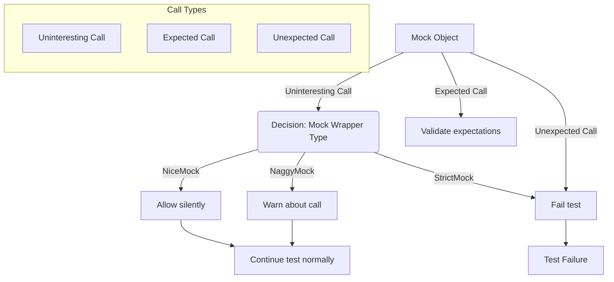

# Controlling Mock Behavior

GoogleMock provides powerful tools to control how your mock objects respond to unexpected or uninteresting method invocations. This page explains how to manage mock strictness and control warnings or errors when mock methods are called in ways your tests may not explicitly anticipate.

## Understanding Uninteresting vs Unexpected Calls

In GoogleMock, calls on mock objects fall into two categories:

- **Uninteresting calls**: These are calls to mock methods that have *no explicit expectations* (i.e., no `EXPECT_CALL` for that method). The test writer has not expressed interest in these calls.

- **Unexpected calls**: These occur when there are one or more `EXPECT_CALL`s set on a method, but none of those expectations match the actual call arguments or invocation count.

Uninteresting calls **do not cause test failures by default**, but generate warnings indicating the call was made without an expectation.
Unexpected calls, however, always cause test failures since they violate explicit expectations.

## The Mock Strictness Wrappers

GoogleMock offers three convenient wrappers to tune how uninteresting calls are handled on a per-mock-object basis:

- **`NiceMock<T>`**: Suppresses warnings for uninteresting calls. Useful when you want to ignore calls you don't care about.
- **`NaggyMock<T>`**: The default mock behavior that warns on uninteresting calls.
- **`StrictMock<T>`**: Treats all uninteresting calls as errors, causing tests to fail if any unexpected call is made without an expectation.

Each of these wrappers inherits from the original mock class `T` and alters the behavior on uninteresting calls.

### Using Strictness Wrappers

Here is how you use these wrappers:

```cpp
using ::testing::NiceMock;
using ::testing::NaggyMock;
using ::testing::StrictMock;

// Original mock class
class MockFoo {
 public:
  MOCK_METHOD(void, DoThis, (), ());
  MOCK_METHOD(int, GetValue, (), (const));
};

TEST(MyTest, NiceMockSuppressesWarnings) {
  NiceMock<MockFoo> mock_foo;
  // No EXPECT_CALL on DoThis(), but calling it won't print warnings.
  mock_foo.DoThis();
}

TEST(MyTest, NaggyMockWarnsWithoutExpectations) {
  NaggyMock<MockFoo> mock_foo;
  // Warning will be printed if DoThis() is called without expectations.
  mock_foo.DoThis();
}

TEST(MyTest, StrictMockFailsOnUninterestingCalls) {
  StrictMock<MockFoo> mock_foo;
  // Test will fail if DoThis() is called without expectations.
  mock_foo.DoThis();  // Fails the test
}
```

### When to Use Each Wrapper

- Use **`NiceMock`** when your test is not concerned about all method calls or to reduce noise when testing.
- Stick to **`NaggyMock`** (the default) during development to be aware of unexpected interactions.
- Use **`StrictMock`** for tests that must precisely verify every interaction and reject any unplanned calls.

**Tip:** `NiceMock` and `StrictMock` wrappers only affect uninteresting calls (no `EXPECT_CALL`). Calls that violate expectations will always fail, regardless of the wrapper.

## How Wrappers Work Internally

Each wrapper configures the mock object's internal reaction to uninteresting calls by registering its behavior:

- `NiceMock` instructs the framework to allow uninteresting calls silently.
- `NaggyMock` triggers warnings.
- `StrictMock` causes failures.

This behavior is scoped to the mock object instance, allowing fine-grained control.

## Customizing with `EXPECT_CALL` for Uninteresting Methods

If you want the mock to silently accept calls on a specific method without strict verification, you can add a catch-all expectation:

```cpp
using ::testing::AnyNumber;
using ::testing::_;

EXPECT_CALL(mock_foo, SomeMethod(_)).Times(AnyNumber());
```

This tells GoogleMock that any calls to `SomeMethod` with any arguments are expected and allowed any number of times, effectively suppressing warnings for that method without wrapping the entire mock in `NiceMock`.

## Best Practices for Mock Strictness

- Prefer **`NiceMock`** when your test only cares about specific interactions and other calls should be ignored.
- Use **`StrictMock`** in tests where exact call counts and call arguments are critical.
- When using **`NaggyMock`** or default mocks, resolve warnings by either adding explicit expectations or consciously suppress them with the catch-all `EXPECT_CALL`.
- Avoid mixing multiple wrappers on the same mock object or nesting wrappers, as this is not supported and can lead to undefined behavior.

## Troubleshooting Mock Strictness

- If you see warnings about uninteresting calls that are expected to be harmless, wrap your mock in `NiceMock` or add a permissive `EXPECT_CALL`.
- If your test fails due to unexpected calls, check that you have set appropriate `EXPECT_CALL`s covering all expected invocations.
- Remember that calls matching no `EXPECT_CALL` are always errors in a `StrictMock`.

## Summary of Options

| Wrapper     | Uninteresting Call Behavior                      | Intended Usage                                           |
| ----------- | ------------------------------------------------ | -------------------------------------------------------- |
| `NiceMock`  | Silently allows uninteresting calls (no warnings) | Tests lenient about unmocked method calls               |
| `NaggyMock` (default) | Warns on uninteresting calls                    | Default during development for visibility to unexpected calls |
| `StrictMock`| Fails tests on uninteresting calls              | Strict verification, catches all deviations             |

## Additional Considerations

- These wrappers propagate the constructors of their base mock class, so you can construct `NiceMock<T>` objects using the same arguments as `T`.
- They only affect methods mocked directly in the mock class (via `MOCK_METHOD`). Methods inherited from base mocks may not be affected.
- Proper virtual destructors on your base classes improve compatibility with these wrappers.

## Related Resources

- [Mocking Reference](./mocking.md) — Detailed API for `EXPECT_CALL`, `ON_CALL`, and mock method declarations.
- [gMock Cookbook](./gmock_cook_book.md) — Recipes on using strictness wrappers and mock behaviors.
- [Mock Strictness Guide](../guides/practical-testing-patterns/mock-strictness.mdx) — A practical pattern guide to managing strictness in real tests.

---

<AccordionGroup title="Example Usage Scenarios">
<Accordion title="Using NiceMock to Suppress Warnings">
```cpp
using ::testing::NiceMock;

class MockWidget {
 public:
  MOCK_METHOD(void, Initialize, (), ());
  MOCK_METHOD(void, DoWork, (int value), ());
};

TEST(WidgetTest, IgnoresUninterestedCalls) {
  NiceMock<MockWidget> mock_widget;
  EXPECT_CALL(mock_widget, Initialize());

  // DoWork may be called, but we don't care.
  mock_widget.DoWork(42);  // No warnings

  mock_widget.Initialize();  // Verified
}
```
</Accordion>
<Accordion title="StrictMock to Enforce Exact Calls">
```cpp
using ::testing::StrictMock;
using ::testing::_;  // wildcard matcher

class MockService {
 public:
  MOCK_METHOD(bool, Connect, (), ());
  MOCK_METHOD(void, Disconnect, (), ());
};

TEST(ServiceTest, RequiresExactCalls) {
  StrictMock<MockService> mock_service;

  EXPECT_CALL(mock_service, Connect()).Times(1);
  EXPECT_CALL(mock_service, Disconnect()).Times(1);

  mock_service.Connect();
  mock_service.Disconnect();
  // If Disconnect() was called twice or additional methods called, test fails.
}
```
</Accordion>
</AccordionGroup>

## Visualizing Mock Behavior Control




---

## Summary

Controlling mock behavior using `NiceMock`, `NaggyMock`, and `StrictMock` lets you balance test strictness and flexibility, suppress spurious warnings, or enforce exact call correctness. These wrappers provide fine-tuned control essential to effective mock-based testing.

---

<Source url="https://github.com/google/googletest" paths={[{"path": "googlemock/include/gmock/gmock-nice-strict.h", "range": "1-148"}, {"path": "docs/gmock_cheat_sheet.md", "range": "55-150"}, {"path": "docs/gmock_for_dummies.md", "range": "50-220"}]}/>
