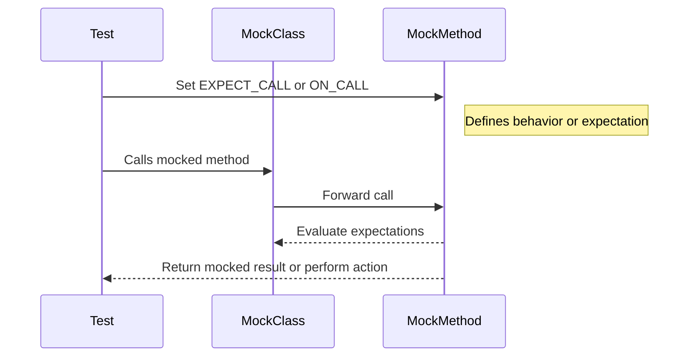

# Mock Methods and Classes

This guide explains how to define mock classes and their methods using the `MOCK_METHOD` macros provided by GoogleMock (gMock). It covers matching method signatures, using qualifiers like `const` and `override`, handling overloaded and templated methods, and best practices for structuring mock classes to achieve expressive and maintainable tests.

---

## Overview of MOCK_METHOD

At the core of mocking in gMock is the `MOCK_METHOD` macro. It allows you to create mock methods inside your mock classes that replicate the signature of the methods you want to mock. This macro generates all the necessary boilerplate to intercept calls and specify behaviors and expectations.

### Syntax

```cpp
MOCK_METHOD(return_type, method_name, (argument_types...), (specifiers...));
```

- **`return_type`**: The return type of the method to mock.
- **`method_name`**: The name of the method.
- **`argument_types...`**: The exact argument list as in the method signature. Parentheses must wrap this list.
- **`specifiers...`** (optional): Qualifiers such as `const`, `override`, `noexcept`, `Calltype(...)`, or reference qualifiers like `ref(&)`.

### Example

```cpp
class MockFoo {
 public:
  MOCK_METHOD(int, Calculate, (int x, int y), (const, override));
};
```
This defines a mock for a `const` method `Calculate` that takes two `int` parameters and returns an `int`.


## Matching Method Signatures

When mocking methods, your `MOCK_METHOD` parameters must precisely match the original function signature (except return type adjustments as per mocking conventions).

### Specifiers

| Qualifier                | Meaning
|--------------------------|----------------------------------------------|
| `const`                  | Method is const. Required if overriding a const method.
| `override`               | Marks the method as override. Strongly recommended.
| `noexcept`               | Required if overriding a noexcept method.
| `Calltype(calltype)`     | Specifies calling convention, useful in Windows COM or API calls.
| `ref(&)` or `ref(&&)`    | Marks reference qualifiers on methods (e.g., lvalue/rvalue references).

**Important**: Always place these specifiers inside parentheses as the 4th parameter.

### Handling Commas in Arguments

If your return type or arguments contain commas (e.g., template types like `std::pair<bool, int>`), the macro parser gets confused. To solve this:

- Wrap the type in extra parentheses:

  ```cpp
  MOCK_METHOD((std::pair<bool, int>), GetPair, ());
  MOCK_METHOD(bool, CheckMap, ((std::map<int, double>), bool));
  ```

- Or define type aliases and use the aliases in the macro:

  ```cpp
  using BoolAndInt = std::pair<bool, int>;
  MOCK_METHOD(BoolAndInt, GetPair, ());
  ```


## Placement in the Mock Class

All `MOCK_METHOD` declarations must be in the **public:** section of the mock class, **regardless of the access level of the original method in the base class**. This enables gMock to call and set expectations from outside the class.

Example:

```cpp
class Base {
 protected:
  virtual void ProtectedMethod() = 0;
 private:
  virtual int PrivateMethod() = 0;
};

class MockBase : public Base {
 public:
  MOCK_METHOD(void, ProtectedMethod, (), (override));
  MOCK_METHOD(int, PrivateMethod, (), (override));
};
```


## Mocking Overloaded Methods

You can mock overloaded methods naturally by replicating each overload's signature:

```cpp
class Foo {
 public:
  virtual int Add(int x) = 0;
  virtual int Add(int x, int y) = 0;
  virtual Bar& GetBar() = 0;
  virtual const Bar& GetBar() const = 0;
};

class MockFoo : public Foo {
 public:
  MOCK_METHOD(int, Add, (int x), (override));
  MOCK_METHOD(int, Add, (int x, int y), (override));
  MOCK_METHOD(Bar&, GetBar, (), (override));
  MOCK_METHOD(const Bar&, GetBar, (), (const, override));
};
```

### Avoiding Hidden Methods Warning

If you don't mock all overloads, the compiler may warn that some base class methods are hidden. To fix this, bring base class overloads into scope with `using`:

```cpp
class MockFoo : public Foo {
 public:
  using Foo::Add;  // Bring in all overloads from Foo.
  MOCK_METHOD(int, Add, (int x), (override));  // Override one overload
};
```


## Mocking Class Templates

You can mock template classes just like normal classes by specializing the template:

```cpp
template <typename T>
class StackInterface {
 public:
  virtual ~StackInterface() = default;
  virtual int GetSize() const = 0;
  virtual void Push(const T& x) = 0;
};

template <typename T>
class MockStack : public StackInterface<T> {
 public:
  MOCK_METHOD(int, GetSize, (), (const, override));
  MOCK_METHOD(void, Push, (const T& x), (override));
};
```


## Mocking Non-Virtual Methods

While gMock primarily mocks virtual functions, it can mock non-virtual methods for dependency injection by defining an unrelated mock class with the same method signatures (without `override`). You can then template your code on the type.

Example:

```cpp
class RealStream {
 public:
  void AppendPacket(Packet* p);
  const Packet* GetPacket(size_t i) const;
};

class MockStream {
 public:
  MOCK_METHOD(const Packet*, GetPacket, (size_t i), (const));
  MOCK_METHOD(size_t, NumberOfPackets, (), (const));
};

template <typename Stream>
void Process(Stream* stream) { ... }

// In tests
MockStream mock_stream;
EXPECT_CALL(mock_stream, GetPacket(0)).WillOnce(Return(nullptr));
Process(&mock_stream);
```


## Old-Style MOCK_METHODn Macros

Legacy `MOCK_METHODn` macros are still supported but the new generic `MOCK_METHOD` is recommended.

| Old Macro               | New Equivalent                              |
|-------------------------|--------------------------------------------|
| `MOCK_METHOD1(Foo, bool(int))` | `MOCK_METHOD(bool, Foo, (int))`           |
| `MOCK_CONST_METHOD1(Foo, bool(int))` | `MOCK_METHOD(bool, Foo, (int), (const))` |
| `MOCK_METHOD1_WITH_CALLTYPE(STDMETHODCALLTYPE, Foo, bool(int))` | `MOCK_METHOD(bool, Foo, (int), (Calltype(STDMETHODCALLTYPE)))` |


## Best Practices for Structuring Mocks

1. **Match the interface exactly**: Use matching method names, arguments, return types, and specifiers.

2. **Put all `MOCK_METHOD` declarations in public**: This allows test code to use `EXPECT_CALL` and `ON_CALL` normally.

3. **Use `using BaseClass::Method;` when not mocking all overloads**: This avoids hiding other overloads unintentionally.

4. **Handle complex argument types elegantly**: Use type aliases or parentheses to work around comma issues.

5. **When mocking const methods, include `(const)` in specifiers**.

6. **Prefer `override` specifier for clarity and correctness**.

7. **Avoid mocking non-virtual methods unless necessary and understand the template-based approach**.


## Example: Complete Mock Class

```cpp
#include <gmock/gmock.h>

class WidgetInterface {
 public:
  virtual ~WidgetInterface() {}
  virtual int GetId() const = 0;
  virtual void SetPosition(int x, int y) = 0;
  virtual std::pair<int, int> GetDimensions() const = 0;
  virtual void DoAction() noexcept = 0;
};

class MockWidget : public WidgetInterface {
 public:
  MOCK_METHOD(int, GetId, (), (const, override));
  MOCK_METHOD(void, SetPosition, (int x, int y), (override));
  MOCK_METHOD((std::pair<int, int>), GetDimensions, (), (const, override));
  MOCK_METHOD(void, DoAction, (), (noexcept, override));
};
```


## Tips & Troubleshooting

- **Compile errors with commas in types?** Wrap the type in extra parentheses or use type aliases.
- **Unexpected warning about const parameters?** Top-level `const` on parameters is ignored by the compiler; remove it if it causes MSVC warnings.
- **Uninteresting calls warnings in tests?** This means a mock method was called without any expectation set. Consider using `ON_CALL` to define default behavior or `EXPECT_CALL(...).Times(AnyNumber())`.
- **Mock methods must be public for `EXPECT_CALL` and `ON_CALL` to work properly.**
- **If you are mocking a method with reference qualifiers (like `&` or `&&`), use `ref(&)` or `ref(&&)` in specifiers.**
- **Mocking destructors is not supported by MOCK_METHOD - use a custom method (e.g., `Die()`) called from the destructor to test the destruction sequence.**


## Summary

Defining mock classes with `MOCK_METHOD` empowers you to simulate and control the behavior of class methods seamlessly in your tests. By matching method signatures precisely, using qualifiers correctly, handling overloads thoughtfully, and following best practices for mock class organization, you achieve expressive, robust, and maintainable test doubles that enhance test reliability.


---

# Appendix: Related Macros and Utilities

- `EXPECT_CALL` / `ON_CALL`: Set expectations and default behaviors on your mock methods.
- `NiceMock`, `StrictMock`, `NaggyMock`: Wrapper templates to control warning and error behavior on uninteresting calls.
- `DefaultValue<T>`: Set default return values for mocked functions.


---

# Visualizing Method Mocking Flow




---

# See Also

* [gMock Cookbook](https://google.github.io/googletest/gmock_cook_book.html) - Practical recipes on mocking
* [gMock for Dummies](https://google.github.io/googletest/gmock_for_dummies.html) - Beginner-friendly introduction
* [EXPECT_CALL Reference](./expectations-and-actions.md)
* [Matchers Reference](./matchers-for-arguments.md)
* [Actions and Stubbing](./actions-and-stubbing.md)