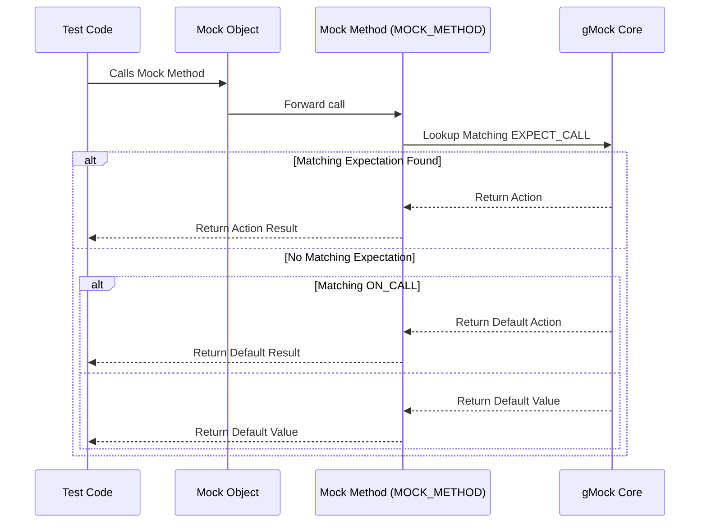

# Declaring and Using Mock Methods

Master the `MOCK_METHOD` macros for mocking interface methods of arbitrary signatures. Learn how to declare mock classes, understand method signature parsing, and apply key modifiers to customize behavior. This is foundational for simulating and controlling dependencies in tests.

---

## Overview

When writing unit tests in C++, isolating behavior by simulating dependencies is crucial. GoogleMock facilitates creating mock classes with minimal effort using the powerful `MOCK_METHOD` macro. This macro lets you declare mocked methods with arbitrary function signatures, including qualifiers and modifiers, enabling comprehensive control of interface behaviors in tests.

This page guides you through:

- Declaring mock methods with correct syntax
- Handling method signature parsing
- Applying key qualifiers and modifiers
- Best practices for robust mock classes

Whether mocking virtual interfaces, non-virtual methods, or template classes, understanding `MOCK_METHOD` usage is your gateway to expressive and maintainable tests.

---

## Defining Mock Methods with `MOCK_METHOD`

The `MOCK_METHOD` macro is the primary tool for declaring mock methods in your mock classes. It declares a method with the specified return type and signature, and generates the mock implementation that can be controlled with `EXPECT_CALL` and `ON_CALL`.

### Syntax

```cpp
class MyMock {
 public:
  MOCK_METHOD(ReturnType, MethodName, (Args...));
  MOCK_METHOD(ReturnType, MethodName, (Args...), (Modifiers...));
};
```

- **ReturnType**: The return type of the mocked method.
- **MethodName**: The name of the method.
- **Args...**: Argument types in parentheses.
- **Modifiers...** *(optional)*: Qualifiers like `const`, `override`, `noexcept`, calling conventions, and reference qualifiers.

### Example

```cpp
class MockFoo {
 public:
  MOCK_METHOD(int, Add, (int x, int y), (override));
  MOCK_METHOD(void, Reset, (), (const, override));
};
```

### Important Notes

- The macro must be used in the `public:` section, regardless of the access level of the base class method.
- When mocking methods that are `const`, add `(const)` in the modifiers.
- For virtual methods, use `(override)` to catch signature mismatch errors.
- Wrapping return or argument types in parentheses helps parse commas inside types (e.g., `std::pair<int, int>`).

### Handling Commas in Types

`MOCK_METHOD` uses commas as argument separators, so types with unprotected commas cause parsing issues.

**Problematic code:**

```cpp
MOCK_METHOD(std::pair<bool, int>, GetPair, ());  // Won't compile!
MOCK_METHOD(bool, CheckMap, (std::map<int, double>, bool));  // Won't compile!
```

**Solutions:**

- Wrap the type in extra parentheses:

  ```cpp
  MOCK_METHOD((std::pair<bool, int>), GetPair, ());
  MOCK_METHOD(bool, CheckMap, ((std::map<int, double>), bool));
  ```

- Use type aliases:

  ```cpp
  using BoolAndInt = std::pair<bool, int>;
  using MapIntDouble = std::map<int, double>;
  MOCK_METHOD(BoolAndInt, GetPair, ());
  MOCK_METHOD(bool, CheckMap, (MapIntDouble, bool));
  ```

---

## Mocking Private and Protected Methods

GoogleMock requires `MOCK_METHOD` definitions in the **public** section of the mock class. This is necessary for `EXPECT_CALL` and `ON_CALL` macros to access the mocked methods.

Even if the base class methods are `private` or `protected`, declare the corresponding mock methods as `public` in your mock class:

```cpp
class Foo {
 protected:
  virtual void Suspend();
 private:
  virtual int Timeout();
};

class MockFoo : public Foo {
 public:
  MOCK_METHOD(void, Suspend, (), (override));  // Must be public
  MOCK_METHOD(int, Timeout, (), (override));  // Must be public
};
```

---

## Mocking Overloaded Methods

Mocking overloaded functions requires defining each overloaded signature explicitly with `MOCK_METHOD` to avoid ambiguity.

Example:

```cpp
class Foo {
  virtual int Add(Element x);
  virtual int Add(int times, Element x);
  virtual Bar& GetBar();
  virtual const Bar& GetBar() const;
};

class MockFoo : public Foo {
  MOCK_METHOD(int, Add, (Element x), (override));
  MOCK_METHOD(int, Add, (int times, Element x), (override));
  MOCK_METHOD(Bar&, GetBar, (), (override));
  MOCK_METHOD(const Bar&, GetBar, (), (const, override));
};
```

**Tip:** To avoid hiding base class overloads if you don't mock all, bring them into scope with `using`:

```cpp
class MockFoo : public Foo {
  using Foo::Add;
  MOCK_METHOD(int, Add, (Element x), (override));
};
```

---

## Mocking Class Templates

You can mock class templates same as regular classes, placing `MOCK_METHOD` inside template classes.

```cpp
template <typename Elem>
class StackInterface {
  virtual ~StackInterface();
  virtual int GetSize() const = 0;
  virtual void Push(const Elem& x) = 0;
};

template <typename Elem>
class MockStack : public StackInterface<Elem> {
 public:
  MOCK_METHOD(int, GetSize, (), (const, override));
  MOCK_METHOD(void, Push, (const Elem& x), (override));
};
```

---

## Mocking Non-virtual Methods

While `MOCK_METHOD` is designed for virtual methods, you can mock non-virtual methods for dependency injection by defining matching methods in unrelated mock classes.

```cpp
class ConcretePacketStream {
 public:
  void AppendPacket(Packet* new_packet);
  const Packet* GetPacket(size_t packet_number) const;
  size_t NumberOfPackets() const;
};

class MockPacketStream {
 public:
  MOCK_METHOD(const Packet*, GetPacket, (size_t packet_number), (const));
  MOCK_METHOD(size_t, NumberOfPackets, (), (const));
};
```

Use templates to switch implementations between production and test builds.

---

## Declaring Mock Methods with Modifiers

The optional *modifiers* parameter allows adjusting the generated mock method to fit qualifiers of the overridden method.

| Modifier              | Purpose                                                  |
| --------------------- | -------------------------------------------------------- |
| `const`               | Makes the mocked method `const`.
| `override`            | Marks the method with `override`.
| `noexcept`            | Marks the method with `noexcept`.
| `Calltype(...)`       | Specifies calling convention (e.g., `STDMETHODCALLTYPE`).
| `ref(&)` or `ref(&&)` | Sets the reference qualifier (lvalue/rvalue refs).

Example:

```cpp
MOCK_METHOD(void, Foo, (int), (const, override, noexcept));
MOCK_METHOD(bool, Bar, (), (Calltype(STDMETHODCALLTYPE), override));
MOCK_METHOD(int, Baz, (), (ref(&), override));
```

---

## Using `ON_CALL` and `EXPECT_CALL` with Mock Methods

The mock methods declared with `MOCK_METHOD` are controlled by `EXPECT_CALL` for setting expectations and `ON_CALL` for default behaviors.

```cpp
EXPECT_CALL(mock_obj, Foo(5))
    .Times(2)
    .WillOnce(Return(true))
    .WillRepeatedly(Return(false));

ON_CALL(mock_obj, Foo(_))
    .WillByDefault(Return(true));
```

These rely on the function signature parsing established by `MOCK_METHOD`.

---

## Common Pitfalls and Best Practices

- Always declare mock methods in the `public:` section.
- Wrap argument or return types containing commas with parentheses or use type aliasing.
- Use appropriate modifiers matching the overridden signature.
- When mocking overloaded methods, declare all overloads explicitly or bring base overloads into scope with `using`.
- To avoid ambiguous overloads in `ON_CALL` or `EXPECT_CALL`, specify matchers explicitly.
- Use `RetiresOnSaturation()` and sequences to handle sticky expectations and ordering.
- To avoid warnings from uninteresting calls, configure default actions with `ON_CALL` or use `NiceMock`.

---

## Summary

Using `MOCK_METHOD`, you can easily declare mock methods matching interface signatures, enabling powerful, expressive expectations and default behaviors. Correct usage of the macro and its modifiers ensures compatibility with your interface and helps you write robust, maintainable tests.

---

## Code Example

```cpp
#include <gmock/gmock.h>

class FooInterface {
 public:
  virtual ~FooInterface() {}
  virtual int GetValue(int key) const = 0;
  virtual void SetValue(int key, int value) = 0;
};

class MockFoo : public FooInterface {
 public:
  MOCK_METHOD(int, GetValue, (int key), (const, override));
  MOCK_METHOD(void, SetValue, (int key, int value), (override));
};

// Usage in a test
TEST(FooTest, MockMethods) {
  MockFoo mock;

  ON_CALL(mock, GetValue(5)).WillByDefault(::testing::Return(42));
  EXPECT_CALL(mock, SetValue(5, 100)).Times(1);

  EXPECT_EQ(mock.GetValue(5), 42);
  mock.SetValue(5, 100);
}
```

This example shows a mock class declaration with `MOCK_METHOD`, including modifiers, and typical usage of `ON_CALL` and `EXPECT_CALL`.

---

## Mermaid Diagram: Mock Method Workflow



---

## Troubleshooting

- **Issue:** `MOCK_METHOD` fails to compile due to commas in argument types.
  - **Solution:** Wrap complex argument types in additional parentheses or use type aliases.

- **Issue:** `EXPECT_CALL` or `ON_CALL` ambiguous overload errors.
  - **Solution:** Specify argument matchers explicitly to disambiguate.

- **Issue:** Mock methods not recognized or no overrides.
  - **Solution:** Ensure the mocked methods are declared `virtual` and use the correct `const` and `override` qualifiers in `MOCK_METHOD`.

- **Issue:** Uninteresting call warnings.
  - **Solution:** Either add `EXPECT_CALL(...).Times(AnyNumber())` or use a `NiceMock` wrapper or set default actions with `ON_CALL`.

---

## Additional Resources

- [gMock Cookbook](https://google.github.io/googletest/gmock_cook_book.html) for practical examples
- [Mocking Reference](reference/mocking.md) for detailed API docs
- [gMock for Dummies](https://google.github.io/googletest/gmock_for_dummies.html) for beginner-friendly explanation
- Section on [`EXPECT_CALL` and `ON_CALL`](reference/mocking.md#EXPECT_CALL) for controlling mock behavior

---

## Summary

The `MOCK_METHOD` macro is your starting point to declare mock methods matching interface signatures with great flexibility, enabling control over test behavior and verification. Correct usage of its parameters and modifiers ensures method behavior is accurately mocked, setting the foundation for effective, maintainable unit testing.

---

