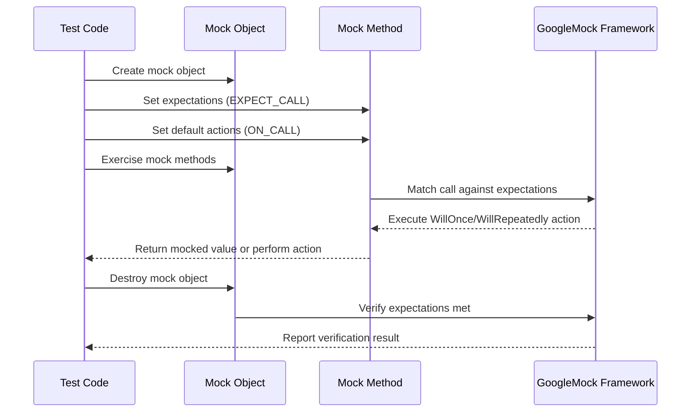

# Mock Object Creation & Usage

GoogleMock (also known as gMock) enables you to create and use mock classes effortlessly in C++. This page guides you through declaring and implementing mock classes and methods, focusing on the powerful `MOCK_METHOD` macro, and explores customizing mock behavior, setting expectations, and controlling mock interactions for better test verification.

---

## Overview

Mock objects simulate interfaces or classes in tests. They allow verification of interactions, such as how often methods are called, their argument values, and return values. GoogleMock automates mock class creation and provides a rich language to specify behaviors and expectations.

---

## Defining Mock Classes

To create a mock of a C++ class or interface, derive a class from the base, then declare mock methods with the `MOCK_METHOD` macro within the `public:` section.

### MOCK_METHOD Macro

```cpp
MOCK_METHOD(return_type, method_name, (arg_types...), (qualifiers));
```

- `return_type`: The method's return type.
- `method_name`: Name of the method to mock.
- `(arg_types...)`: Parenthesized list of argument types.
- `(qualifiers)`: Optional method qualifiers such as `(const)`, `(override)`, `(noexcept)`, or `Calltype(calling_convention)`.

**Important:** `MOCK_METHOD` must be placed in the `public` section, even for base methods that are `protected` or `private`.

### Example: Mocking an Interface

Given an interface:

```cpp
class Foo {
 public:
  virtual ~Foo() {}
  virtual int GetSize() const = 0;
  virtual void Process(int x) = 0;
};
```

The mock class would be:

```cpp
#include <gmock/gmock.h>

class MockFoo : public Foo {
 public:
  MOCK_METHOD(int, GetSize, (), (const, override));
  MOCK_METHOD(void, Process, (int x), (override));
};
```

This mock intercepts calls to `GetSize()` and `Process()` allowing you to set behaviors and expectations.

### Handling Special Cases

#### Methods With Commas in Types

Wrap return or argument types containing commas with extra parentheses to avoid parsing errors.

```cpp
MOCK_METHOD((std::pair<int, int>), GetPair, ());
MOCK_METHOD(bool, CheckMap, ((std::map<int, double>), bool));
```

Alternatively, define type aliases:

```cpp
using PairType = std::pair<int, int>;
MOCK_METHOD(PairType, GetPair, ());
```

#### Mocking Overloaded Methods

Mock each overload explicitly. Use `using Base::Method` in the mock class to avoid hiding base overloads.

```cpp
class MockPrinter : public Printer {
 public:
  using Printer::Print;  // Bring base overloads into scope.
  MOCK_METHOD(void, Print, (int n), (override));
  MOCK_METHOD(void, Print, (char c), (override));
};
```

#### Mocking Const Methods

Add the `(const)` qualifier in `MOCK_METHOD`.

```cpp
MOCK_METHOD(int, GetValue, (), (const, override));
```

#### Non-Virtual Methods

Mocking non-virtual methods requires extra setup (like templated approaches) and is generally discouraged. Prefer interfaces with virtual methods.

---

## Creating Mock Objects

Once mock classes are defined, instantiate them as normal objects.

```cpp
MockFoo mock_foo;
```

You can also create mocks inheriting from mocks:

```cpp
using ::testing::NiceMock;
NiceMock<MockFoo> nice_mock_foo;
```

---

## Customizing Mock Behavior

### Default Actions with ON_CALL

`ON_CALL(mock_object, Method(matchers))` specifies the default behavior of a mock method when called but with no expectation set.

Example:

```cpp
ON_CALL(mock_foo, GetSize()).WillByDefault(Return(42));
```

Here, calls to `GetSize()` will return 42 unless an `EXPECT_CALL` overrides this behavior.

### Setting Expectations with EXPECT_CALL

Expectations specify that a mocked method **must be called** with particular arguments, cardinality (how many times), and actions.

```cpp
EXPECT_CALL(mock_foo, Process(5))
    .Times(3)
    .WillRepeatedly(Return());
```

This expects `Process(5)` to be called exactly 3 times.

### Matchers

Match arguments using matchers to specify argument constraints (e.g., `_` for any, `Eq(5)` for equality).

```cpp
EXPECT_CALL(mock_foo, Process(_));  // Matches any argument.
```

---

## Mock Object Variants: Nice, Naggy, and Strict

GoogleMock allows different behaviors for uninteresting calls (calls not covered by expectations).

| Mock Variant  | Behavior on Uninteresting Calls           | Description                                  |
|---------------|------------------------------------------|----------------------------------------------|
| `NiceMock<T>` | Ignores uninteresting calls silently.    | Less noisy tests, suppress warning messages.|
| `NaggyMock<T>`| Warns on uninteresting calls (default).  | Prints warnings to alert to potential issues. |
| `StrictMock<T>` | Errors on uninteresting calls.          | Enforces stricter tests, failing on unexpected calls. |

Example:

```cpp
using ::testing::StrictMock;
StrictMock<MockFoo> strict_mock;
EXPECT_CALL(strict_mock, Process(_));
```

Uninteresting calls (without expectation) will cause test failure in strict mocks.

---

## Managing Expectations and Ordering

### Times Clause

Controls how many times a method is expected.

Examples:

- `Times(1)` or omitted: expect exactly one call.
- `Times(AnyNumber())`: zero or more calls allowed.
- `Times(AtLeast(n))`: at least n calls expected.

### Ordered Calls

Use `InSequence` or `Sequence` to restrict the expected order of calls.

```cpp
{
  InSequence s;
  EXPECT_CALL(mock, Foo(1));
  EXPECT_CALL(mock, Foo(2));
}
```

Here, `Foo(1)` must be called before `Foo(2)`.

### Partial Orders

Use multiple `Sequence`s or `After()` clauses to express complex call ordering.

---

## Mock Object Lifecycle

- When a mock object is destroyed, GoogleMock automatically verifies all expectations.
- You may explicitly verify and clear expectations with:

```cpp
testing::Mock::VerifyAndClearExpectations(&mock_foo);
```

- To suppress warnings/errors about leaked mocks, call:

```cpp
testing::Mock::AllowLeak(&mock_foo);
```

---

## Example: Complete Mock Usage

```cpp
#include <gmock/gmock.h>
#include <gtest/gtest.h>

class Foo {
 public:
  virtual ~Foo() {}
  virtual int GetValue() const = 0;
  virtual void DoWork(int n) = 0;
};

class MockFoo : public Foo {
 public:
  MOCK_METHOD(int, GetValue, (), (const, override));
  MOCK_METHOD(void, DoWork, (int n), (override));
};

TEST(ExampleTest, UsesMock) {
  MockFoo mock;

  // Set default behavior
  ON_CALL(mock, GetValue()).WillByDefault(testing::Return(10));

  // Expect calls
  EXPECT_CALL(mock, DoWork(testing::_))
      .Times(2);

  // Exercise code
  mock.DoWork(5);
  mock.DoWork(10);

  EXPECT_EQ(mock.GetValue(), 10);
}
```

---

## Practical Tips and Best Practices

- **Only mock virtual methods:** To ensure compatibility and avoid undefined behavior.
- **Put `MOCK_METHOD` in `public` section:** This is necessary for GoogleMock's macros to access the methods.
- **Use Matchers wisely:** Avoid over-specification; match only what matters.
- **Use `NiceMock` to suppress warnings:** Especially when uninteresting calls are frequent and include less critical methods.
- **Use `StrictMock` to ensure correctness:** To catch unexpected calls early during testing.
- **Define expectations before exercising mocks:** Setting expectations after calling mock methods leads to undefined behavior.
- **Leverage `ON_CALL` for default behavior:** Separate behavior specification from call expectations for cleaner, maintainable tests.

---

## Troubleshooting

- **Unmatched calls producing warnings:** If you see "Uninteresting mock function call" warnings, consider adding an `EXPECT_CALL` with `Times(AnyNumber())` for those methods or switch to `NiceMock`.
- **Mock method called too many times:** Review the `Times` clauses, and either increase the cardinality or adjust test logic.
- **Mock method not called enough times:** Ensure your test code exercises the mock as expected or modify `Times` to `AtMost` or `AtLeast`.

---

## Additional Resources

- [Mocking Reference](https://google.github.io/googletest/reference/mocking.html) — comprehensive details on mocking facilities.
- [gMock Cheat Sheet](https://google.github.io/googletest/gmock_cheat_sheet.html) — quick recipes for mock usage.
- [gMock Cookbook](https://google.github.io/googletest/gmock_cook_book.html) — practical how-tos and advanced scenarios.
- [Mocking for Dummies](https://google.github.io/googletest/gmock_for_dummies.html) — beginner friendly introduction.

---

## Diagram: Mock Object Interaction Flow



---