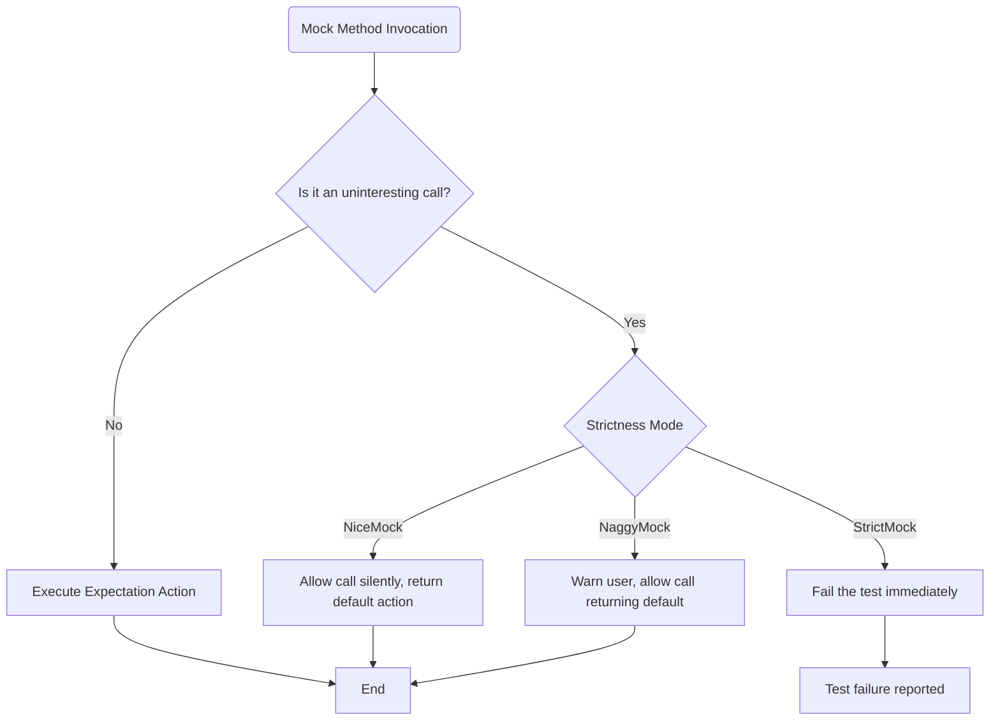

# Strictness Modes for Mocks

This page details the API for controlling runtime behavior of GoogleMock when mock methods are called unexpectedly. It covers the three primary strictness modes available — **NiceMock**, **NaggyMock**, and **StrictMock** — comparing their behavior and providing guidance to select the right mode based on your testing requirements.

---

## Overview

In GoogleMock, a call to a mock method that has **no matching `EXPECT_CALL`** is considered an *uninteresting call*. Handling uninteresting calls effectively helps keep your tests clean and focused.

GoogleMock provides three main strictness modes to manage uninteresting calls:

| Mode         | Behavior on Uninteresting Call                  | Typical Use Case                            |
|--------------|-------------------------------------------------|--------------------------------------------|
| **NiceMock** | Silently allows the call, no warnings or errors | When you want to ignore extraneous calls or keep test output clean |
| **NaggyMock**| Allows the call but prints a warning message     | Default mode; use when you want to be informed about unexpected calls but not fail the test |
| **StrictMock** | Treats uninteresting calls as test *failures* | When you want to explicitly ensure no unexpected calls occur | 

The current default behavior of mock objects is **Naggy**. However, GoogleMock may change this default to **NiceMock** going forward, promoting more maintainable tests.

---

## Using Strictness Modes

### NiceMock

`NiceMock<T>` is a subclass of the mock class `T` that suppresses warnings for uninteresting calls. It is ideal when you want to **avoid noise** from mock methods that are called but not explicitly expected.

**Example:**
```cpp
using ::testing::NiceMock;

NiceMock<MockFoo> nice_foo;

EXPECT_CALL(nice_foo, DoSomething());
// Calls to other methods are silently allowed.
```

**Key Points:**
- Silences warnings about uninteresting calls.
- Uninteresting calls execute their default actions (if any).
- Throws (or crashes) when returning a type with no default constructor without an explicit action.
- Works with constructors having arguments — simply pass them through.

---

### NaggyMock

`NaggyMock<T>` also allows uninteresting calls, but **prints a warning message** each time they occur. This mode is the current default and is useful for catching unnoticed unexpected calls during test development.

**Example:**
```cpp
using ::testing::NaggyMock;

NaggyMock<MockFoo> naggy_foo;

EXPECT_CALL(naggy_foo, DoSomething());
// Calls to other methods produce warnings.
```

**Key Points:**
- Warns on uninteresting calls, helping detect unexpected interactions.
- Allows calls to proceed and return default actions.
- Same constructor forwarding as `NiceMock`.
- Useful during test debugging or while tightening test expectations.

---

### StrictMock

`StrictMock<T>` treats **all uninteresting calls as test failures**, immediately reporting the violation. Use it when your test demands **strict enforcement** that only expected calls occur.

**Example:**
```cpp
using ::testing::StrictMock;

StrictMock<MockFoo> strict_foo;

EXPECT_CALL(strict_foo, DoSomething());
// Any unexpected calls cause test failures.
```

**Key Points:**
- Uninteresting calls cause test failures, maintaining stringent test correctness.
- Overrides default behavior to treat warnings as errors.
- Should be used carefully to avoid brittle tests.
- Also supports constructor forwarding.

---

## Selecting the Appropriate Strictness Mode

Consider the following scenarios:

| Scenario                                           | Recommended Mode   |
|---------------------------------------------------|-------------------|
| You want to suppress all warnings for cleaner output and focus on expected calls | **NiceMock**       |
| You want to be notified of unexpected but non-fatal calls to aid test debugging | **NaggyMock**      |
| You want to make any unexpected call a test failure to enforce strict contracts | **StrictMock**     |

> **Best Practice:** Generally, prefer `NiceMock` for routine tests to reduce maintenance cost and warnings. Use `NaggyMock` while actively developing tests, and `StrictMock` only when you must precisely enforce call constraints.

---

## How to Use Strictness Modes

The strictness wrappers are *template classes* wrapping your mock class `MockFoo`. They inherit constructors of the mock and behave as subclasses, so you can replace your mock declarations as follows:

```cpp
MockFoo mock_default;               // Default naggy mock
NiceMock<MockFoo> nice_mock;        // Suppresses warnings for uninteresting calls
NaggyMock<MockFoo> naggy_mock;      // Prints warnings (current default behavior)
StrictMock<MockFoo> strict_mock;    // Treats all uninteresting calls as errors
```

Pass constructor arguments similarly:

```cpp
NiceMock<MockBar> nice_bar("foo", 42);
StrictMock<MockBar> strict_bar('a', 'b', "c", "d", 0, 1, "e", "f", true, false);
```

### Important Caveats

- These wrappers only affect mock methods defined with `MOCK_METHOD` macros *directly* in the mock class. Methods inherited or defined in base classes may not respect strictness mode.
- Nested strictness (e.g. `NiceMock<StrictMock<MockFoo>>`) is not supported.
- The mock's destructor should be virtual for strictness wrappers to behave correctly.

---

## Runtime Behavior Summary

| Call Type          | NiceMock              | NaggyMock                 | StrictMock               |
|--------------------|-----------------------|---------------------------|--------------------------|
| Expected call      | Allowed, actions taken | Allowed, actions taken     | Allowed, actions taken    |
| Unexpected call    | Warning suppressed, default action or failure if no action set | Prints warning, default action | Failure, test error       |
| Uninteresting call | Silent, default action | Warning printed, default action | Failure immediately       |

## Debugging and Verbosity Control

GoogleMock supports controlling verbosity of warnings on uninteresting calls with flag `--gmock_verbose`:

- `info`: Show detailed call traces for all calls, including expected and uninteresting.
- `warning`: Show only warnings for uninteresting calls; default mode.
- `error`: Show only errors; suppress warnings.

Adjust this flag to tune message noise during test development.

---

## Practical Examples

```cpp
#include <gmock/gmock.h>

using ::testing::NiceMock;
using ::testing::StrictMock;
using ::testing::NaggyMock;
using ::testing::_;
using ::testing::Return;

class MockFoo {
public:
  MOCK_METHOD(void, DoThis, (), ());
  MOCK_METHOD(int, DoThat, (int n), ());
};

TEST(StrictnessModes, NiceMockExample) {
  NiceMock<MockFoo> nice;

  EXPECT_CALL(nice, DoThis());

  nice.DoThis();            // Passes as expected
  nice.DoThat(123);         // Ignored silently (no warning)
}

TEST(StrictnessModes, NaggyMockExample) {
  NaggyMock<MockFoo> naggy;

  EXPECT_CALL(naggy, DoThis());

  naggy.DoThis();           // Passes
  naggy.DoThat(123);        // Warning issued, call allowed
}

TEST(StrictnessModes, StrictMockExample) {
  StrictMock<MockFoo> strict;

  EXPECT_CALL(strict, DoThis());

  strict.DoThis();          // Passes
  strict.DoThat(123);       // Fails: unexpected uninteresting call
}
```

---

## Summary of API Usage

| Template       | Description                                   |
|----------------|-----------------------------------------------|
| `NiceMock<T>`  | Suppresses warnings on uninteresting calls    |
| `NaggyMock<T>` | Issues warnings on uninteresting calls (default) |
| `StrictMock<T>`| Treats uninteresting calls as test failures   |

**Constructors** are forwarded to the underlying mock class, allowing seamless substitution.

---

## Troubleshooting & Common Pitfalls

- **Unwanted warnings for uninteresting calls?**
  Consider switching to `NiceMock` or adding an explicit catch-all `EXPECT_CALL(...).Times(AnyNumber())`.

- **Unexpected test failures due to strictness?**
  Review your code for unintended calls to mocks or switch to a less strict mock mode.

- **Strictness mode not applied?**
  Ensure mock methods are declared with `MOCK_METHOD` directly in the mock class and that the destructor is virtual.

- **Compilation errors mixing strictness wrappers?**
  Nested wrappers like `NiceMock<StrictMock<T>>` are unsupported.

---

## Additional Resources

- [GoogleMock Cheat Sheet](https://google.github.io/googletest/gmock_cheat_sheet.html#NiceStrictNaggy) — concise examples on strictness modes.
- [Mocking Reference - EXPECT_CALL](../reference/mocking.md#EXPECT_CALL) — details on setting expectations.
- [gMock Cookbook — The Nice, the Strict, and the Naggy](https://google.github.io/googletest/gmock_cook_book.html#NiceStrictNaggy) — practical advice for choosing modes.
- [FAQ on Uninteresting Calls](../docs/gmock_faq.md#) — common questions and answers about strictness behavior.

---

<AccordionGroup title="Summary of Strictness Modes">
<Accordion title="NiceMock">
Suppresses all warnings for unexpected calls. Use this for tests where uninteresting calls are acceptable or when you want cleaner output.
</Accordion>
<Accordion title="NaggyMock">
Default behavior. Prints warnings on unexpected calls but allows them. Useful for detecting potential test issues.
</Accordion>
<Accordion title="StrictMock">
Treats unexpected calls as errors, failing the test immediately. Use for strong contract enforcement.
</Accordion>
</AccordionGroup>

## Glossary

- **Uninteresting call:** A call to a mock method that lacks any matching `EXPECT_CALL`.
- **Unexpected call:** A call that has expectations but no matching argument pattern.
- **Default action:** The behavior a mock method performs when its call is neither expected nor explicitly instructed.

---

## Diagram: Mock Strictness Mode Behavior



---

## Summary

This section documents the three strictness modes in GoogleMock—NiceMock, NaggyMock, and StrictMock—and guides users on controlling the runtime behavior of mocks when unexpected calls occur. It explains their differences, appropriate use cases, common pitfalls, and construction patterns, helping users build robust and maintainable tests.

---

<Check>
Ensure your mock classes' destructors are virtual for strictness wrappers to operate correctly.
</Check>

## References

- [`NiceMock<T>`, `NaggyMock<T>`, `StrictMock<T>` - gmock-nice-strict.h`](https://github.com/google/googletest/blob/main/googlemock/include/gmock/gmock-nice-strict.h)
- [gMock Cookbook: The Nice, the Strict, and the Naggy](https://google.github.io/googletest/gmock_cook_book.html#NiceStrictNaggy)
- [Mocking Reference](../reference/mocking.md#NiceMock)
- [gMock FAQ on Uninteresting Calls](../docs/gmock_faq.md#)

---

## Code Snippet: Creating a StrictMock

```cpp
#include <gmock/gmock.h>
using ::testing::StrictMock;

class MockDatabase {
 public:
  MOCK_METHOD(void, Connect, (), ());
  MOCK_METHOD(int, Query, (const std::string& query), ());
};

int main() {
  StrictMock<MockDatabase> db_mock;

  EXPECT_CALL(db_mock, Connect());

  db_mock.Connect();   // OK
  db_mock.Query("SELECT * FROM users;");  // Fails: unexpected call
}
```

---

The above code illustrates how `StrictMock` enforces that only expected calls to `Connect` succeed, while any unplanned call to `Query` triggers an immediate failure.


