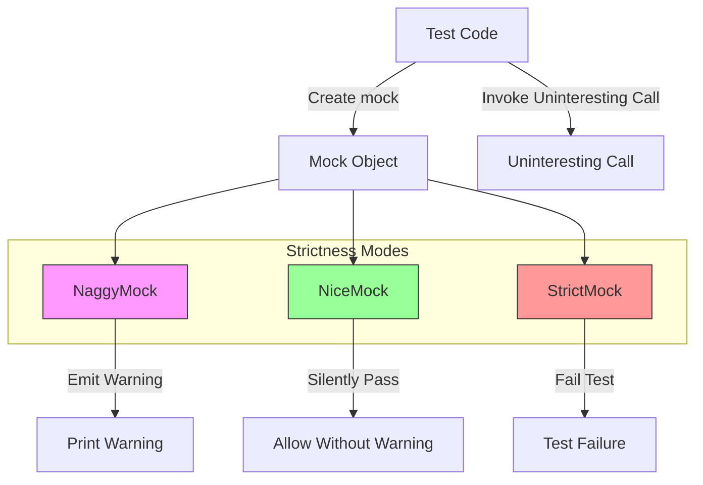

# Strictness and Mock Behavior Modes

GoogleMock provides three key mock configuration classes — `NiceMock`, `NaggyMock`, and `StrictMock` — that control how uninteresting calls are handled on mock objects. These classes allow developers to manage warnings and failures arising from calls to mock methods that have no explicit expectations set. Using these modes helps improve test robustness, maintainability, and clarity by tailoring the strictness applied to mock behavior.

---

## Overview of Strictness Modes

- **NaggyMock** (Default Behavior)
  - The default mock behavior where uninteresting calls (calls with no matching `EXPECT_CALL`) produce non-fatal warnings.
  - Suitable during test development and debugging, but may yield noisy outputs if many such calls occur.

- **NiceMock**
  - Suppresses warnings about uninteresting calls entirely.
  - Allows uninteresting calls to silently pass, returning default values.
  - Recommended when you want cleaner logs and don't care about calls without explicit expectations.

- **StrictMock**
  - Treats any uninteresting call as a test failure.
  - Enforces strict verification that only expected calls occur, preventing unexpected code paths.
  - Useful when you want very tight control over mock interactions.

These classes template on your mock type, subclass it, and override how uninteresting calls are handled.

## Usage Patterns

### Defining a NiceMock

Use `NiceMock<T>` to create a mock object that ignores uninteresting calls without warnings:

```cpp
#include <gmock/gmock.h>
using ::testing::NiceMock;

class MockFoo {
 public:
  MOCK_METHOD(void, DoThis, (), ());
};

TEST(MyTest, UsesNiceMock) {
  NiceMock<MockFoo> mock;
  EXPECT_CALL(mock, DoThis());

  mock.DoThis(); // No warnings if other methods called without expectations
}
```

### Defining a NaggyMock (Default)

NaggyMock is the baseline behavior of raw mocks and `NaggyMock<T>`. It emits warnings on uninteresting calls. Example:

```cpp
using ::testing::NaggyMock;

NaggyMock<MockFoo> mock;
mock.DoThis(); // Warning printed if no EXPECT_CALL
```

### Defining a StrictMock

To force errors for every uninteresting call, use `StrictMock<T>`:

```cpp
using ::testing::StrictMock;

StrictMock<MockFoo> mock;
EXPECT_CALL(mock, DoThis());

mock.DoThis();     // Allowed
mock.OtherCall();  // Causes test failure
```

## Construction and Compatibility

Each of `NiceMock`, `NaggyMock`, and `StrictMock` inherits constructors from your mock class, so you can supply any arguments needed to construct your mock:

```cpp
NiceMock<MockFoo> nice(42, "arg");
NaggyMock<MockFoo> naggy("hello");
StrictMock<MockFoo> strict;
```

## Behavior Details

### How Strictness Controls Uninteresting Calls

| Mock Type    | Behavior When Uninteresting Call Occurs          |
|--------------|--------------------------------------------------|
| Raw / Naggy  | Prints a warning message; test continues          |
| NiceMock     | Silently ignores uninteresting calls; no warnings |
| StrictMock   | Fails the test with a non-fatal failure          |


Uninteresting calls are calls made to mock methods for which there are no matching expectations (`EXPECT_CALL`). StrictMock treats these calls as errors, while NiceMock prevents all warning noise for such calls.

### Interactions with Unexpected Calls

Note that all strictness modes only affect **uninteresting calls** (no matching `EXPECT_CALL`). Calls that are **unexpected** (arguments do not match any `EXPECT_CALL`) are errors regardless of strictness mode.

### Support for Complex Constructors

`NiceMock`, `NaggyMock`, and `StrictMock` support forwarding arguments to mock constructors with any arity, including zero and more:

```cpp
NiceMock<MockBar> nice_bar('a', 'b', "c", "d", 1, 2, "e", "f", true, false);
```

### Limitations

- These wrappers only affect mock methods defined with `MOCK_METHOD` **directly** in the mock class. Mock methods inherited from base classes might not behave as expected.
- Nesting strictness wrappers like `NiceMock<StrictMock<MockFoo>>` is unsupported.
- Mock classes should have virtual destructors for correct behavior.

## Practical Examples

### Suppressing Warnings with NiceMock

```cpp
using ::testing::NiceMock;

class MockCalculator {
 public:
   MOCK_METHOD(int, Add, (int, int), ());
   MOCK_METHOD(int, Subtract, (int, int), ());
};

TEST(CalcTest, HandlesAdd) {
  NiceMock<MockCalculator> calc;
  EXPECT_CALL(calc, Add(5, 3));

  calc.Add(5, 3);       // Expected call
  calc.Subtract(10, 4); // Uninteresting call, no warnings
}
```

### Enforcing Strict Checking with StrictMock

```cpp
using ::testing::StrictMock;

class MockWriter {
 public:
  MOCK_METHOD(void, Write, (const std::string&), ());
};

TEST(WriterTest, FailsOnUnexpectedCall) {
  StrictMock<MockWriter> writer;
  EXPECT_CALL(writer, Write("Hello"));

  writer.Write("Hello");        // Passes
  writer.Write("Unexpected");  // Fails test with error
}
```

### Allowing Warnings with NaggyMock

```cpp
using ::testing::NaggyMock;

NaggyMock<MockFoo> foo;
foo.DoThis();  // Warning message about uninteresting call
```

## Controlling Verbosity Globally

GoogleMock supports controlling verbosity of output messages, which affects uninteresting call reporting. Use flag:

```
--gmock_verbose=LEVEL
```

where LEVEL can be:

- `info`: Logs expected and uninteresting calls with stack traces.
- `warning`: Logs uninteresting calls without stack traces (default).
- `error`: Only errors are logged; warnings suppressed.

Example usage:

```cpp
::testing::GMOCK_FLAG_SET(verbose, "info");
```

## Managing Leaked Mocks

To prevent errors at program exit from leaked mock objects not being deleted, use:

```cpp
Mock::AllowLeak(&mock_object);
```

This disables leak detection for that mock.

## Diagnosing Mocks Strictness

You can query at runtime whether a mock object is in a specific mode:

```cpp
if (Mock::IsNice(&mock)) { ... }
if (Mock::IsNaggy(&mock)) { ... }
if (Mock::IsStrict(&mock)) { ... }
```

## Best Practices and Tips

- Use **NiceMock** when uninteresting calls are expected and should not pollute test output.
- Use **NaggyMock** during early development to be warned about unexpected mock usage.
- Use **StrictMock** to enforce that the code strictly adheres to all expectations.
- Avoid mixing strictness wrappers; apply only once per mock hierarchy.
- Always set expectations explicitly for important calls instead of suppressing warnings globally.

## Troubleshooting

**Issue:** Unexpected warnings or errors on uninteresting calls.

- Check if you used correct strictness wrapper or none (default is `NaggyMock`).
- Consider using `NiceMock` to suppress warnings if you do not care.
- Use `StrictMock` if you want to catch unexpected calls early.
- Verify that your mock methods are defined with `MOCK_METHOD` macros directly on your mock class.

**Issue:** Leaked mock object error upon test exit.

- Use `Mock::AllowLeak()` to suppress if intentional.
- Ensure mocks are properly destroyed at end of test.

**Issue:** StrictMock fails on uninteresting call after mock object deletion.

- This is expected; ensure tests do not call mocks after they are deleted.

## Summary Diagram



## Related Links and References

- [Mocking Reference: NiceMock, NaggyMock, StrictMock](reference/mocking.md#NiceMock)
- [gMock for Dummies: Using Mocks in Tests](guides/mocking-and-advanced-patterns/using-mocks.md)
- [gMock Cookbook: The Nice, the Strict, and the Naggy](docs/gmock_cook_book.md#NiceStrictNaggy)
- [Setting Default Actions and Expectations](reference/mocking.md#ON_CALL) for uninteresting calls
- [Verifying and Clearing Mocks](reference/mocking.md#Mock)

---

This page fits within the API Reference > Mocking Framework Reference, complementing pages on defining mocks, setting expectations, and mocking best practices.

---

**Note:** For examples of how these strictness modes impact warnings or failures, see the GoogleMock unit tests in `test/gmock-nice-strict_test.cc` and the explanations in the gMock FAQ and Cookbook.