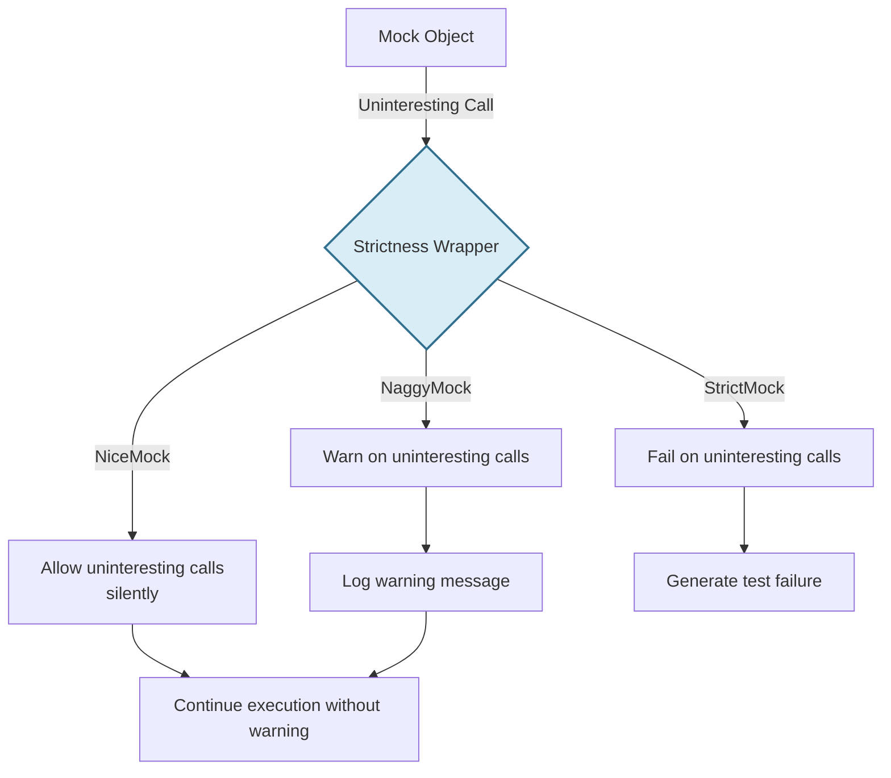

# Managing Mock Strictness

GoogleTest's Mocking Framework (`gMock`) offers powerful tools to control how mock objects behave when their methods are called without explicit expectations, referred to as *uninteresting calls*. This page guides you through managing mock strictness using the `NiceMock`, `NaggyMock`, and `StrictMock` wrappers, helping you write tests that are both reliable and easy to maintain.

---

## Understanding Mock Strictness

Mock strictness determines how `gMock` reacts to calls made on mock methods that do **not** have corresponding `EXPECT_CALL` specifications. These uninteresting calls usually either happen unexpectedly or are harmless and unverified. Managing strictness allows you to suppress noise or enforce tight correctness guarantees.

### Key Strictness Types

| Mock Wrapper       | Behavior on Uninteresting Calls                                      | Typical Use Case                             |
|--------------------|----------------------------------------------------------------------|---------------------------------------------|
| `NiceMock<T>`      | Allows uninteresting calls silently, no warnings or failures.       | Writing maintainable, less brittle tests; suppress warnings for uninteresting calls. |
| `NaggyMock<T>`     | Warns about uninteresting calls (default behavior).                  | During test development or debugging to spot unexpected calls without failing tests. |
| `StrictMock<T>`    | Fails the test upon any uninteresting call.                         | Enforcing strict call expectations; valuable for fully specifying mock interactions. |

<Note>
Currently, ordinary mocks behave like `NaggyMock` by default. However, this is planned to change to default to `NiceMock` for better test maintainability.
</Note>

## When to Use Each Mock Wrapper

Choosing the right strictness depends on your test goals and desired feedback:

- **Use `NiceMock` when:**
  - You want to ignore calls to mock methods that are not relevant to your specific test assertions.
  - You aim to keep test output clean, focusing only on meaningful failures.
  - Your test suite is mature and you prefer to reduce test maintenance overhead.

- **Use `NaggyMock` when:**
  - You are developing new tests and want to be alerted about any calls not explicitly expected.
  - You want warnings but don’t want to break test runs due to unexpected calls.

- **Use `StrictMock` when:**
  - You want full control to ensure no unexpected calls occur.
  - Your tests serve as a precise specification of all interactions.
  - You want failures to highlight any deviation from expectations.

<Tip>
Most tests benefit from `NiceMock` because it strikes the right balance: no noise from uninteresting calls and no accidental overlooking of important expectations.
</Tip>

## Usage Examples

Assuming you have a mock class `MockFoo`:

```cpp
#include <gmock/gmock.h>

class MockFoo {
 public:
  MOCK_METHOD(void, DoThis, (), ());
  MOCK_METHOD(int, DoThat, (bool flag), ());
};
```

### Using `NiceMock`

Suppress warnings for uninteresting calls automatically:

```cpp
using ::testing::NiceMock;

NiceMock<MockFoo> nice_foo;

EXPECT_CALL(nice_foo, DoThis());  // Expect this call

nice_foo.DoThis();   // OK
nice_foo.DoThat(true);  // No warning or failure – uninteresting call allowed
```

### Using `NaggyMock`

Get warnings on uninteresting calls without failing the test:

```cpp
using ::testing::NaggyMock;

NaggyMock<MockFoo> naggy_foo;

EXPECT_CALL(naggy_foo, DoThis());  // Expect this call

naggy_foo.DoThis();   // OK
naggy_foo.DoThat(true);  // Warning printed for uninteresting call
```

### Using `StrictMock`

Fail on any uninteresting call:

```cpp
using ::testing::StrictMock;

StrictMock<MockFoo> strict_foo;

EXPECT_CALL(strict_foo, DoThis());  // Expect this call

strict_foo.DoThis();    // OK
strict_foo.DoThat(true);  // Test failure due to unexpected uninteresting call
```

## Constructor Proxying

`NiceMock`, `NaggyMock`, and `StrictMock` inherit constructors from the underlying mock class `T`. This means you can instantiate them with the same constructor parameters:

```cpp
NiceMock<MockFoo> nice_foo(5, "hello");
StrictMock<MockFoo> strict_foo(10);
```

This feature ensures seamless integration without extra boilerplate.

## Internals and Limitations

- These wrappers only affect mock methods defined **directly** in the mock class using `MOCK_METHOD`. Methods inherited from base mock classes may **not** respond to these wrappers.
- Nesting strictness wrappers (`NiceMock<StrictMock<MockFoo>>`) is **not supported**.
- The destructor of the mock class should ideally be virtual for these wrappers to work correctly.

## Common Pitfalls and Troubleshooting

<Tip>
If you see warnings about uninteresting calls but want to silence them, prefer wrapping your mock with `NiceMock` instead of adding broad `EXPECT_CALL` catch-all statements, which can increase test maintenance complexity.
</Tip>

<Warning>
Be cautious with `StrictMock` as it makes tests sensitive to any calls not explicitly expected.
Use it when you want to fully specify mock interactions but be prepared for test failures if code changes increase calls.
</Warning>

<Tip>
Use the `Mock::AllowLeak(mock_obj)` API to avoid leaks warnings for mocks deliberately not destroyed during tests.
</Tip>

## Practical Tips

- Start with `NaggyMock` when creating new tests to catch any unexpected calls.
- Switch to `NiceMock` when tests stabilize and you want less noisy output.
- Apply `StrictMock` in critical areas to assert strict adherence to call expectations.

## Summary

`gMock` provides three primary wrappers to control the strictness level of mocks:
- `NiceMock` for quiet mocks that allow uninteresting calls,
- `NaggyMock` for warning-filled mocks,
- `StrictMock` for fail-fast mocks.

Selecting the proper strictness level improves test reliability, maintainability, and clarity.

---

## See Also

- [Creating and Using Mocks](https://google.github.io/googletest/reference/mocking.html)
- [Setting Expectations and Actions](https://google.github.io/googletest/reference/mocking-framework/expectations-actions.html)
- [gMock for Dummies](https://google.github.io/googletest/gmock_for_dummies.html)
- [gMock Cookbook](https://google.github.io/googletest/gmock_cook_book.html)

---

## References

```cpp
// Defining mocks with strictness wrappers
using ::testing::NiceMock;
using ::testing::NaggyMock;
using ::testing::StrictMock;

NiceMock<MockFoo> nice_mock;   // Allows uninteresting calls silently
NaggyMock<MockFoo> naggy_mock; // Warns on uninteresting calls
StrictMock<MockFoo> strict_mock; // Fails on uninteresting calls
```

```cpp
// Using constructors with arguments
NiceMock<MockBar> bar1("data");
StrictMock<MockBar> bar2(42, "more");
```

<Tip>
When a method returns a non-default-constructible type and is called unexpectedly on a `NiceMock`, it triggers a failure or exception.
</Tip>

<Warning>
Avoid nesting different strictness wrappers as it is unsupported and may lead to unpredictable behavior.
</Warning>

## How It Works Internally

- Each wrapper registers a different reaction with the mock registry for uninteresting calls:
  - `NiceMock` calls `AllowUninterestingCalls()`
  - `NaggyMock` calls `WarnUninterestingCalls()`
  - `StrictMock` calls `FailUninterestingCalls()`
- When an uninteresting call happens, `gMock` queries this reaction to decide how to behave.

## Testing Impact

Use `StrictMock` sparingly because it makes tests fragile to changes in implementation that add calls. Conversely, `NiceMock` improves test resilience but can miss some verification opportunities.

---

# Diagram: Mock Strictness Behavior



---

## API

This page covers these types provided by gMock:

```cpp
template <class MockClass> class NiceMock;  // Allows uninteresting calls silently
template <class MockClass> class NaggyMock; // Warns on uninteresting calls
template <class MockClass> class StrictMock; // Fails on uninteresting calls
```

All three are template wrappers inheriting from the mock class `MockClass` and modify its behavior.

## Related Flags

- `--gmock_verbose=LEVEL` controls verbosity of mock output:
  - `info` shows detailed info including uninteresting calls
  - `warning` shows warnings (default)
  - `error` shows errors only

---

## Best Practices

- Prefer `NiceMock` for general use to reduce noisy warnings.
- Use `NaggyMock` to detect unexpected uninteresting calls during test development.
- Reserve `StrictMock` for critical parts where strict adherence to call expectations is mandatory.
- Avoid mixing or nesting strictness wrappers.
- Explicitly suppress warnings using wrappers instead of catch-all `EXPECT_CALL` declarations.

---

For a thorough understanding of mocks and expectations, visit [Mocking Reference](https://google.github.io/googletest/reference/mocking.html).


