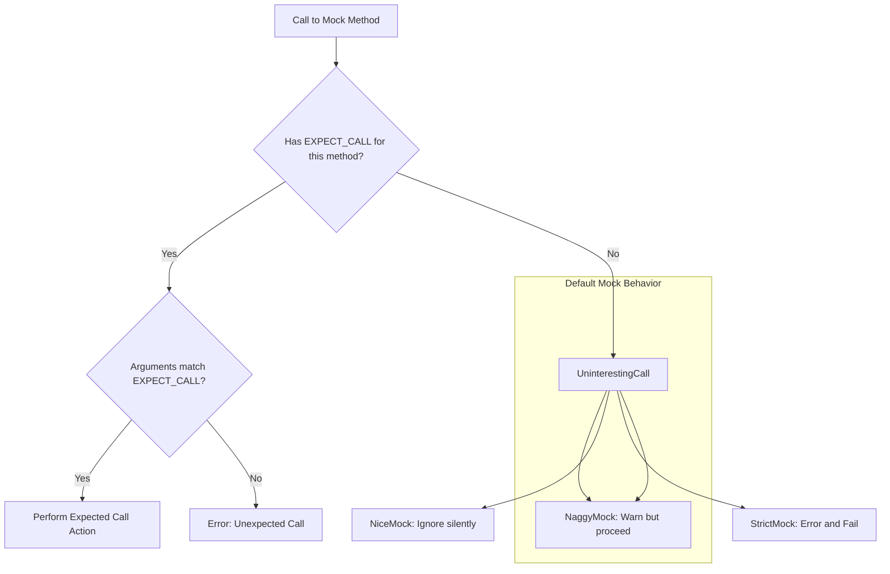

# Nice, Naggy, and Strict Mocks

GoogleMock provides three special template wrappers—`NiceMock`, `NaggyMock`, and `StrictMock`—that modify a mock object's behavior regarding **uninteresting calls**. These wrappers let you choose how your tests respond when mock methods are called without explicit expectations (`EXPECT_CALL`). This document explains how to use these wrappers effectively, illustrates their differences, and provides guidance on when to use each.

---

## Understanding Uninteresting Calls

An *uninteresting call* is when a mock method is invoked without a matching `EXPECT_CALL`. By default, gMock treats these calls as **naggy**: it allows the call to proceed but prints a warning.

In contrast, an *unexpected call* is one that matches an existing expectation but has arguments that do not satisfy any `EXPECT_CALL`. Unexpected calls always cause an error.

---

## Mock Types: Nice, Naggy, and Strict

### 1. NaggyMock

- **Behavior:** Warns on uninteresting calls but permits them.
- **Default:** This is the default behavior of a raw mock object.
- **Use case:** Useful during test development or debugging to get early notifications about unplanned interactions.

**Example:**
```cpp
using ::testing::NaggyMock;
NaggyMock<MockFoo> mock_foo;
EXPECT_CALL(mock_foo, DoSomething());
// Calls to other methods without expectations print warnings.
```

### 2. NiceMock

- **Behavior:** Suppresses warnings on uninteresting calls; uninteresting calls are ignored.
- **Use case:** Ideal for stable tests where uninteresting calls are frequent and their warnings are noise.
- **Compatibility:** This wrapper suppresses warnings for mock methods defined with `MOCK_METHOD` **directly** in the mock class.
- **Limitation:** Does not affect mock methods inherited from base classes.

**Example:**
```cpp
using ::testing::NiceMock;
NiceMock<MockFoo> mock_foo;
EXPECT_CALL(mock_foo, DoSomething());
// Other calls without expectations do not trigger warnings.
```

### 3. StrictMock

- **Behavior:** Treats all uninteresting calls as errors, causing test failures.
- **Use case:** Use strictly when you want your test to fail on any unexpected calls, boosting test rigor.
- **Compatibility:** Applies only for mock methods defined using `MOCK_METHOD` directly in the mock class.

**Example:**
```cpp
using ::testing::StrictMock;
StrictMock<MockFoo> mock_foo;
EXPECT_CALL(mock_foo, DoSomething());
// Any unplanned calls cause errors and test failures.
```

---

## How to Use These Wrappers

### Construction

All three wrappers are **template classes** that inherit from your mock class and "inherit" its constructors transparently. This means you can construct them just like your original mock:

```cpp
NiceMock<MockFoo> nice_obj;                 // Default constructor
NiceMock<MockFoo> nice_obj(5, "arg");    // Passing args to MockFoo constructor
```

### Restrictions

- You **cannot** nest these wrappers, e.g., `NiceMock<StrictMock<MockFoo>>` is **not supported**.
- They only work correctly for mock methods declared **directly** in your mock class using `MOCK_METHOD`. Mock methods inherited from parent classes may not honor the wrapper's behavior, depending on your compiler.
- Your mock class should have a **virtual destructor** to ensure proper cleanup and support for these wrappers.

### Summary of Behavior Differences

| Feature                  | NaggyMock                  | NiceMock                   | StrictMock                   |
|--------------------------|----------------------------|----------------------------|------------------------------|
| Uninteresting call       | Warns                     | Silently ignores           | Errors (test fails)           |
| Unexpected calls         | Always errors             | Always errors             | Always errors                 |
| Effect on expected calls | No effect                 | No effect                 | No effect                    |

---

## Why and When to Use Each

- **NaggyMock (default)**
  - Best when actively writing and debugging tests.
  - Gives warnings to catch unplanned calls early.

- **NiceMock**
  - Best for mature, stable tests where uninteresting calls are common and expected.
  - Avoids messy, verbose test output.
  - Recommended default in the near future.

- **StrictMock**
  - Best when you want to assert total control over all interactions.
  - Use sparingly to avoid brittle, hard-to-maintain tests.
  - Catch unintended calls early as test failures.

---

## Practical Tips & Common Pitfalls

- Use **`NiceMock`** for mocks with frequently uninteresting method calls, such as methods involved in logging or trivial callbacks.
- Avoid over-using **`StrictMock`**, as tests may become brittle and require constant maintenance for harmless code changes.
- Consider explicit `EXPECT_CALL(...).Times(AnyNumber())` for specific methods you expect to be called any number of times to avoid noise.
- When you see warnings about uninteresting calls, consider wrapping your mock in `NiceMock` instead of adding catch-all expectations blindly.
- Always ensure your mock classes have **virtual destructors** to avoid undefined behavior with these wrappers.

---

## Example:

```cpp
#include <gmock/gmock.h>
using ::testing::NiceMock;
using ::testing::StrictMock;

class MockDatabase {
 public:
  MOCK_METHOD(void, Connect, (), ());
  MOCK_METHOD(bool, Query, (const std::string& query_str), ());
};

TEST(DatabaseTest, AllowsQueries) {
  NiceMock<MockDatabase> mock_db;  // Suppresses warnings for uninteresting calls

  EXPECT_CALL(mock_db, Connect());  // Expect Connect to be called

  mock_db.Connect();  // Matches expectation
  mock_db.Query("SELECT 1;");  // No expectation, no warning due to NiceMock
}

TEST(DatabaseTest, NoUnexpectedCalls) {
  StrictMock<MockDatabase> strict_db;  // Fails on unexpected calls

  EXPECT_CALL(strict_db, Connect());  

  strict_db.Connect();  // OK
  strict_db.Query("SELECT 1;");  // Fails test: unexpected uninteresting call
}
```

---

## References and Additional Reading

- [gMock Cookbook: The Nice, the Strict, and the Naggy](https://google.github.io/googletest/gmock_cook_book.html#NiceStrictNaggy)
- [Mocking Reference](https://google.github.io/googletest/reference/mocking.html)
- [GoogleMock Cheat Sheet](https://google.github.io/googletest/gmock_cheat_sheet.html)
- [gMock for Dummies](https://google.github.io/googletest/gmock_for_dummies.html)

---

## Troubleshooting

- If you find that `NiceMock` or `StrictMock` does not suppress or cause errors for certain mock methods, verify that those methods are declared with `MOCK_METHOD` directly in your mock class.
- Use the `--gmock_verbose=info` flag to get detailed logs of which expectations are being matched and calls made to your mocks.
- Confirm your mock classes have virtual destructors; otherwise, the wrappers may not behave as expected and cause leaks or undefined behavior.

---

This wrapper pattern is a powerful, user-friendly way to tune the strictness of your mocks and helps you write tests that are both robust and maintainable.


### Diagram: Behavior of Nice, Naggy, and Strict Mocks on Uninteresting Calls


