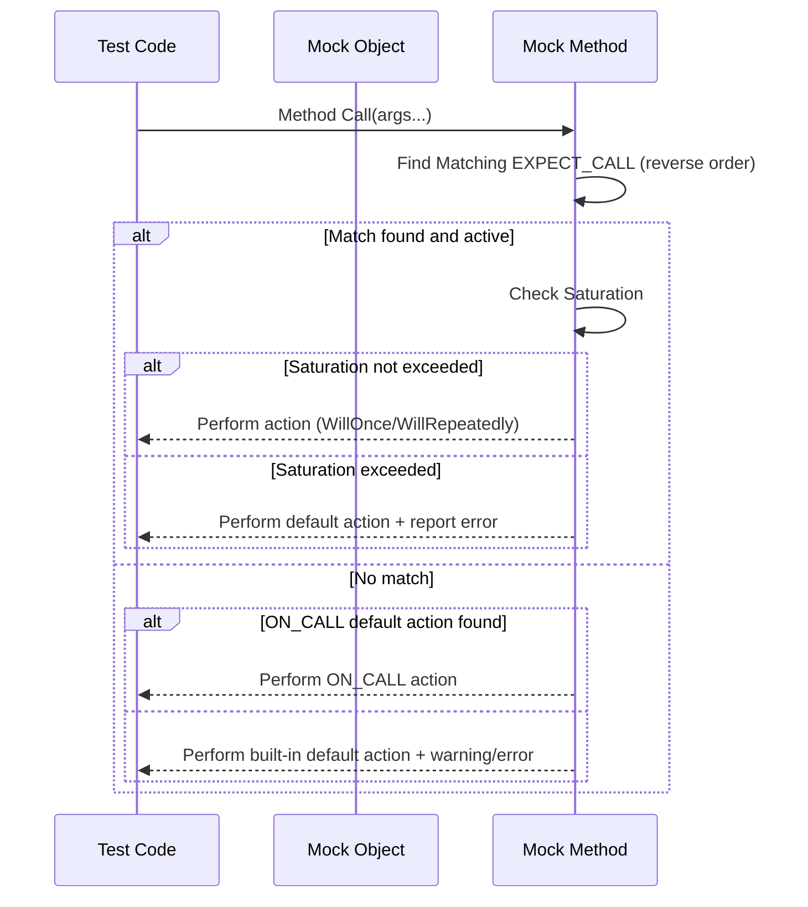

# Setting Expectations and Behaviors

This page explains how to use the core macros `ON_CALL` and `EXPECT_CALL` from GoogleMock (gMock) to control the behavior of mock methods, establish argument matching rules, specify call ordering, and manage invocation cardinalities. It guides users through creating precise and flexible mock specifications to test complex interactions effectively.

---

## Overview

GoogleMock enables you to specify how mock objects behave and what function calls are expected. This is done primarily through two macros:

- `ON_CALL`: Defines the default behavior of a mock method when it is called but without enforcing an expectation on the call.
- `EXPECT_CALL`: Defines explicit expectations about how a mock method should be called, including argument matching, number of calls, order, and the behavior when called.

Together they form a powerful Domain-Specific Language (DSL) allowing fine control over mock interactions.

---

## ON_CALL: Setting Default Behaviors

Use `ON_CALL` to specify what a mock method does *when called*, without requiring it *must be* called. This is ideal for defining common behaviors shared across multiple tests or for methods whose call count or arguments are not strictly verified.

### Syntax

```cpp
ON_CALL(mock_object, Method(matchers...))
    .With(multi_argument_matcher)          // optional
    .WillByDefault(action);                // required
```

- The `matchers...` specify argument constraints (defaults to wildcard `_` if omitted).
- `.With()` further refines argument constraints on the group of arguments as a tuple.
- `.WillByDefault()` defines the action taken when this mock method is called matching the above.

### Example

```cpp
using ::testing::Return;
...
ON_CALL(mock_turtle, GetX())
    .WillByDefault(Return(0));

ON_CALL(mock_turtle, SetPosition(_, _))
    .With(Lt())
    .WillByDefault(Return(true));
```

### Key Points

- You can have multiple `ON_CALL`s; the last matching one takes precedence.
- `ON_CALL` *does not* create expectations — it merely defines behavior.
- Use `ON_CALL` for methods not under test focus or to provide baseline stubs.

<Note>
`ON_CALL` is underused. It helps keep tests less brittle by avoiding over-specification. Prefer it over setting many `EXPECT_CALL` unless you need call verification.
</Note>

---

## EXPECT_CALL: Setting Expectations

`EXPECT_CALL` declares that a particular mock method call is expected during the test. It enables verification of argument values, call count, call order, and the action performed.

### General Syntax

```cpp
EXPECT_CALL(mock_object, Method(matchers...))
    .With(multi_argument_matcher)        // optional, must be first clause if used
    .Times(cardinality)                  // optional
    .InSequence(sequences...)            // optional, any number
    .After(expectations...)              // optional, any number
    .WillOnce(action)                    // optional, repeated multiple times
    .WillRepeatedly(action)              // optional, at most once
    .RetiresOnSaturation();              // optional, at most once
```

- The `matchers...` specify how each argument is matched.
- `.With()` lets you match all arguments together as a tuple (helps with relationships between arguments).
- `.Times()` controls how many times the call should occur.
- `.InSequence()` defines partial or full call order sequences.
- `.After()` imposes that this call should occur after specified expectations.
- `.WillOnce()` and `.WillRepeatedly()` specify actions invoked on the calls.
- `.RetiresOnSaturation()` makes the expectation inactive once saturated.

### Call Cardinalities

`Times()` accepts cardinalities defined in `::testing` namespace:

| Cardinality           | Meaning                                         |
|----------------------|------------------------------------------------|
| `AnyNumber()`         | Called any number of times (including zero).    |
| `AtLeast(n)`          | Called at least *n* times.                       |
| `AtMost(n)`           | Called at most *n* times.                        |
| `Between(m, n)`       | Called between *m* and *n* times inclusive.     |
| `Exactly(n)` or `n`   | Called exactly *n* times.                        |

If omitted, gMock infers `Times` based on the provided actions.

### Example: Simple expectation with return values

```cpp
using ::testing::Return;
EXPECT_CALL(mock_turtle, GetX())
    .Times(3)
    .WillOnce(Return(100))
    .WillOnce(Return(150))
    .WillRepeatedly(Return(200));
```

### Complex Expectations

You can impose strict call order with sequences:

```cpp
using ::testing::InSequence;
{
    InSequence s;
    EXPECT_CALL(mock, Foo(1));
    EXPECT_CALL(mock, Bar(2));
}
```

Or define complex partial orderings using `.InSequence(s1, s2)` and `.After()`:

```cpp
Sequence s1, s2;
EXPECT_CALL(mock, A()).InSequence(s1, s2);
EXPECT_CALL(mock, B()).InSequence(s1);
EXPECT_CALL(mock, C()).InSequence(s2);
```

### Sticky Expectations & Retiring

By default, expectations are "sticky": they remain active even after saturation, causing later calls to fail if made more times than expected. Use `.RetiresOnSaturation()` to make an expectation retire immediately upon saturation, allowing subsequent calls to fall through to earlier (fallback) expectations.

### Behavior when Multiple Expectations Match

- gMock selects the **last** defined active expectation that matches the call based on argument matching and active state.

- To cover unexpected arguments, add a catch-all expectation:

```cpp
EXPECT_CALL(mock, Foo(_)).Times(AnyNumber());  // Catches anything
EXPECT_CALL(mock, Foo(42));                    // More specific
```

---

## Advanced Usage

### Using `.With()` Clause

Allows matching all arguments as a tuple for more complex predicates:

```cpp
EXPECT_CALL(mock, Method(_, _))
    .With(Lt());  // first arg less than second arg
```

### Specifying Multiple `.InSequence()` Clauses

You can specify multiple sequences per expectation for partial order DAGs.

### Using `.After()` Clause

Settings calls to occur after others:

```cpp
Expectation e1 = EXPECT_CALL(mock, Init());
EXPECT_CALL(mock, Run()).After(e1);
```

Accepts up to 5 expectations or sets and can be combined multiple times.

### `.WillOnce()` and `.WillRepeatedly()` Actions

- `.WillOnce(action)` applies to the next call only and can appear multiple times.
- `.WillRepeatedly(action)` applies to all later calls after `.WillOnce` actions are consumed.

### Ordering Constraints

By default, calls can occur in any order. Use sequences and `.After()` to require specific call ordering.

### Handling Unexpected and Uninteresting Calls

- Unexpected call: Call with no matching expectation. Triggers errors.
- Uninteresting call: Call to mock method with no expectations. Generates warnings (modifiable).

You can control uninteresting call warnings by using `NiceMock` (suppresses) or `StrictMock` (fails).

### Mocking Side Effects

You can define actions in expectations that perform side effects on arguments and set return values.

---

## Practical Tips and Best Practices

- Write `EXPECT_CALL` *before* exercising the system under test to avoid undefined behavior.
- Use `ON_CALL` to set default behaviors shared by many tests.
- Add catch-all expectations with `.Times(AnyNumber())` to avoid unexpected call errors for allowed but unimportant calls.
- Use `InSequence` or `.InSequence()` to ensure call order when essential.
- Use `.RetiresOnSaturation()` to avoid sticky expectation pitfalls when calls occur in a strict sequence.
- For overloaded functions, specify argument matchers fully to disambiguate.
- Use `.With()` for argument relations that can't be expressed individually.
- Consider the verbosity flag `--gmock_verbose` to get detailed logging for debugging expectation matching.

<Info>
Set `--gmock_verbose=info` to get a trace of all mock calls and expectations, helping identify mismatches and unexpected calls.
</Info>

### Troubleshooting Common Issues

- **Too many/few actions for an expectation**: gMock warns when the number of `.WillOnce()` or `.WillRepeatedly()` does not align with `.Times()` specified.
- **Uninteresting call warnings**: Use `NiceMock` or add `.Times(AnyNumber())` expectations.
- **Unexpected call failure**: Ensure that your `EXPECT_CALL`s cover all allowed argument sets or that you don’t miss any expectations.
- **Sticky expectations pitfalls**: If repeated identical expectations are set, ensure `.RetiresOnSaturation()` is used or expectations are sequenced to avoid upper bound violated errors.

---

## Summary

Through carefully crafting `ON_CALL` and `EXPECT_CALL` statements, GoogleMock empowers you to specify precisely how mocked methods behave and what interactions your tests expect. Leveraging matchers, cardinalities, call order constraints, and default action specs, you gain rigorous control and insightful diagnostics over test behaviors.

---

## Related Documentation

- [Mocking Reference](reference/mocking.md): Detailed discussion of mock macros
- [gMock for Dummies](guides/getting-started/first-mock.md): Beginner-friendly tutorial on mocking
- [gMock Cookbook](guides/integration-advanced/custom-actions.md): Recipes for mocking techniques
- [Built-in Matchers](reference/matchers-and-actions/builtin-matchers.md)
- [Mock Actions](reference/matchers-and-actions/mock-actions.md)
- [Strictness Modes and Policies](api-reference/mocking-framework/strictness-modes.md)

### Code Examples

```cpp
#include <gmock/gmock.h>
#include <gtest/gtest.h>

using ::testing::Return;
using ::testing::_;  // wildcard matcher
using ::testing::InSequence;

class Turtle {
 public:
  virtual ~Turtle() {}
  virtual int GetX() const = 0;
  virtual void Forward(int distance) = 0;
};

class MockTurtle : public Turtle {
 public:
  MOCK_METHOD(int, GetX, (), (const, override));
  MOCK_METHOD(void, Forward, (int distance), (override));
};

TEST(PainterTest, ControlsTurtle) {
  MockTurtle turtle;

  // Default behavior when no expectations
  ON_CALL(turtle, GetX())
      .WillByDefault(Return(0));

  {
    InSequence seq;  // Enforce call order

    EXPECT_CALL(turtle, Forward(100));
    EXPECT_CALL(turtle, Forward(50));
  }

  turtle.Forward(100);  // Matches first EXPECT_CALL
  turtle.Forward(50);   // Matches second EXPECT_CALL
  EXPECT_EQ(turtle.GetX(), 0); // Uses ON_CALL default
}
```

---

## Diagram: Call Flow of EXPECT_CALL and ON_CALL



---

<Call>
Remember to always set `EXPECT_CALL` before invoking methods that are expected. Defining clear expectations reduces test brittleness and improves maintainability.
</Call>


