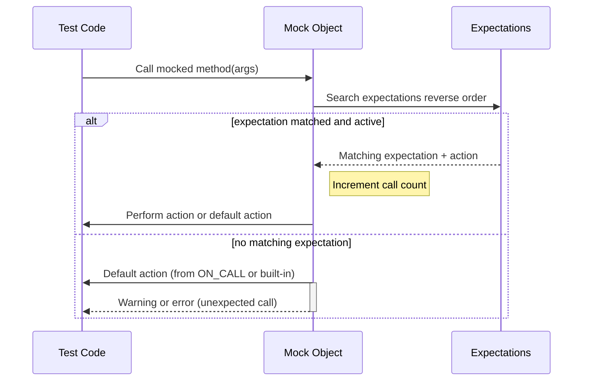

# Setting Expectations: EXPECT_CALL and ON_CALL

This page details the core APIs in GoogleMock for expressing required and optional expectations on mock objects. It covers how to specify call counts, use argument matchers, control call sequences, and define default behaviors. Key macro usages and sequence control mechanisms are explained with practical examples, aimed at helping you frame your tests precisely and readably.

---

## Overview of EXPECT_CALL and ON_CALL

GoogleMock uses two fundamental macros to control mock object behavior and expectations:

- `EXPECT_CALL`: Specifies an expectation that a mock method will be invoked with certain arguments, a particular number of times, and optionally in a specific order. It can define what actions the mock should perform on those calls.

- `ON_CALL`: Specifies default behavior for a mock method when it is called with certain arguments but does *not* imply any expectation that the call must occur.

These APIs combine to give you fine-grained control over your mock's interaction and the behavior of the system under test.

---

## Using EXPECT_CALL to Set Expectations

### Basic Syntax

```cpp
EXPECT_CALL(mock_object, Method(arg_matchers...))
    .With(multi_argument_matcher)   // optional
    .Times(cardinality)             // optional
    .InSequence(sequences...)       // zero or more
    .After(expectations...)         // zero or more
    .WillOnce(action)               // zero or more
    .WillRepeatedly(action)         // optional
    .RetiresOnSaturation();          // optional
```

- `mock_object`: your mock instance.
- `Method`: the mock method being expected.
- `arg_matchers`: zero or more argument matchers that specify which calls this expectation covers.
- Clauses modify the expectation and must appear in a specified order.

### Explanation of Key Clauses

- **With**: Applies a matcher to the entire tuple of arguments. Useful for expressing constraints across multiple arguments, e.g., "the first argument must be less than the second."

- **Times**: Specifies how many times the method is expected to be called. Supported cardinalities include `Exactly(n)`, `AtLeast(n)`, `AtMost(n)`, `Between(m, n)`, and `AnyNumber()`.

- **InSequence**: Assigns the expectation to one or more sequences, enforcing the order of calls within those sequences.

- **After**: Specifies expectations that must be satisfied before this call can occur, enabling more complex partial ordering.

- **WillOnce**: Defines an action for a single matching invocation. You can chain multiple `WillOnce` calls to specify actions for successive calls.

- **WillRepeatedly**: Defines an action for all remaining calls after `WillOnce` actions are exhausted.

- **RetiresOnSaturation**: Automatically retires the expectation once its upper call limit is reached, so that subsequent matching calls will not hit this expectation.

### Cardinality Inference

If you omit `.Times()`, GoogleMock infers the cardinality as:

- If neither `WillOnce` nor `WillRepeatedly` specified, `Times(1)` is assumed.
- If *n* `WillOnce` specified and no `WillRepeatedly`, inferred as `Times(n)`.
- If *n* `WillOnce` and one `WillRepeatedly`, inferred as `Times(AtLeast(n))`.


### Example: Simple EXPECT_CALL

```cpp
using ::testing::Return;

EXPECT_CALL(turtle, GetX())
    .Times(3)
    .WillOnce(Return(100))
    .WillOnce(Return(150))
    .WillRepeatedly(Return(200));

// turtle.GetX() will return 100, then 150, then 200 for subsequent calls.
```

### Example: Ordered Calls Using Sequence

```cpp
using ::testing::InSequence;

{
  InSequence seq;

  EXPECT_CALL(turtle, PenDown());
  EXPECT_CALL(turtle, Forward(100));
  EXPECT_CALL(turtle, PenUp());
}

// The expected calls must occur in this exact order.
```

### Example: Partial Order Using After()

```cpp
Expectation e1 = EXPECT_CALL(mock, Init1());
Expectation e2 = EXPECT_CALL(mock, Init2());
EXPECT_CALL(mock, Use())
    .After(e1, e2);  // `Use()` is expected only after both `Init1()` and `Init2()` have been called.
```

### Notes and Best Practices

- Always set expectations *before* invoking the code that uses the mock. Setting expectations afterward results in undefined behavior.
- Use argument matchers thoughtfully; over-specifying can make tests fragile.
- The order of `EXPECT_CALL`s matters: later matching expectations override earlier ones for the same method.
- Combine `Times` with `WillOnce`/`WillRepeatedly` carefully to avoid unexpected failures when the list of actions is exhausted.
- Use `RetiresOnSaturation` to avoid sticky expectations blocking other calls.

---

## Using ON_CALL to Specify Default Behavior

### Basic Syntax

```cpp
ON_CALL(mock_object, Method(arg_matchers...))
    .With(multi_argument_matcher)    // optional
    .WillByDefault(action);
```

- `ON_CALL` specifies the behavior of the mock method for matching arguments without asserting that such a call *must* happen.
- You must specify exactly one `WillByDefault` clause.

### Behavior

- The `WillByDefault` action is taken for any call matching the argument patterns that does not have a matching `EXPECT_CALL`.
- If multiple `ON_CALL`s match, the most recently declared one that matches wins.
- This allows you to specify default fallback behavior, often placed in the mock's constructor or test setup.

### Example

```cpp
using ::testing::Return;

ON_CALL(mock_foo, GetSize())
    .WillByDefault(Return(1));

// Calls to GetSize() that do not have expectations return 1.
```

### Best Practices

- Prefer using `ON_CALL` to set default behaviors shared across many tests.
- Keep `EXPECT_CALL`s for behaviors you want to verify.
- Do not expect `ON_CALL` to enforce call counts or call order.

---

## Additional Features and Controls

### Argument Matching

Both `EXPECT_CALL` and `ON_CALL` accept argument matchers per parameter or for the argument tuple as a whole via `.With()`. Use GoogleMock’s extensive matcher library for precise argument matching.

### Sequences

Use `Sequence` objects and the `InSequence()` clause to enforce ordering. The `InSequence` RAII class can make defining a sequence of expectations more succinct.

```cpp
Sequence s1, s2;
EXPECT_CALL(mock, A()).InSequence(s1, s2);
EXPECT_CALL(mock, B()).InSequence(s1);
EXPECT_CALL(mock, C()).InSequence(s2);
// Specifies partial ordering: A before B and C; C before D.
```

### Expectation Sets and the After Clause

Multiple expectations can be grouped using `ExpectationSet`. Use `.After(ExpectationSet)` to specify that an expectation is only valid after all in the set have been satisfied.

### Handling Uninteresting Calls

Calls to mock methods with no `EXPECT_CALL` set are "uninteresting". By default, they use the default action (from `ON_CALL` if any, or built-in defaults), and emit a warning unless suppressed by using `NiceMock` or defining an `EXPECT_CALL` with `Times(AnyNumber())`.

### Retiring Expectations

Sticky expectations remain active even after saturation. Use `.RetiresOnSaturation()` to have an expectation retire, making subsequent matching calls possibly match other expectations.

---

## Inside the Macros

- `EXPECT_CALL(mock, Method(args))` expands internally to a function `gmock_Method()` on the mock, coupled with matchers, returning a spec builder.
- The chaining methods (e.g., `.Times()`, `.WillOnce()`) modify the full expectation object.
- Order of chained methods is enforced, illegal reordering generates errors.

---

## Troubleshooting and Common Pitfalls

- **No expectation set before call**: Setting expectations after invoking mock methods leads to undefined behavior and may crash or silently fail.
- **Wrong cardinality**: Exceeding or falling short of expected call counts triggers failures.
- **Overlapping expectations**: Later expectations override earlier ones if both match; order your `EXPECT_CALL`s carefully.
- **Unexpected calls**: Calls that do not match any expectation trigger errors. To allow calls, use catch-all `EXPECT_CALL` with `Times(AnyNumber())` or properly use `ON_CALL`.
- **Uninteresting warnings**: Suppress by using `NiceMock` or adding `EXPECT_CALL` with `Times(AnyNumber())`.

---

## Practical Example: Using EXPECT_CALL and ON_CALL Together

```cpp
using ::testing::Return;
using ::testing::_;

class MockFoo : public Foo {
 public:
  MOCK_METHOD(int, GetValue, (), (override));
  MOCK_METHOD(void, SetValue, (int), (override));
};

TEST(FooTest, WorksWithDefaults) {
  MockFoo mock;

  // Default behavior: GetValue returns 10 if no specific expectation.
  ON_CALL(mock, GetValue()).WillByDefault(Return(10));

  // Expect SetValue to be called once with 5.
  EXPECT_CALL(mock, SetValue(5)).Times(1);

  // Expect GetValue to be called twice, returning 7 then 8.
  EXPECT_CALL(mock, GetValue())
      .WillOnce(Return(7))
      .WillOnce(Return(8));

  mock.SetValue(5);  // Matches EXPECT_CALL

  EXPECT_EQ(mock.GetValue(), 7);  // First call, EXPECT_CALL
  EXPECT_EQ(mock.GetValue(), 8);  // Second call, EXPECT_CALL
  EXPECT_EQ(mock.GetValue(), 10); // Third call, no EXPECT_CALL left, ON_CALL fallback
}
```

---

## Reference Links

- [Mocking Reference (EXPECT_CALL & ON_CALL)](https://google.github.io/googletest/reference/mocking.html#EXPECT_CALL)
- [gMock Cheat Sheet](https://google.github.io/googletest/gmock_cheat_sheet.html#SettingExpectations)
- [gMock Cookbook - Using Mocks](https://google.github.io/googletest/gmock_cook_book.html#setting-expectations)
- [gMock for Dummies - Setting Expectations](https://google.github.io/googletest/gmock_for_dummies.html#setting-expectations)

---

## Related Documentation

- [Mock Class Definition and MOCK_METHOD Macros](https://google.github.io/googletest/reference/mocking.html#MOCK_METHOD)
- [Strict, Naggy, and Nice Mocks](https://google.github.io/googletest/reference/mocking.html#StrictNaggyNice)
- [Matchers Reference](https://google.github.io/googletest/reference/matchers.html)
- [Actions Reference](https://google.github.io/googletest/reference/actions.html)
- [Mocking Best Practices Guide](https://google.github.io/googletest/guides/real-world-workflows/mocking-best-practices.html)

---

## Summary

This page centers on how to express *required* and *optional* expectations on mock objects using `EXPECT_CALL` and `ON_CALL`, covering argument matchers, call count cardinalities, call order sequences, and default behaviors for unmatched calls. It teaches how to write robust and maintainable mocks that accurately reflect your testing intent.

---

## Diagram: EXPECT_CALL Flow Conceptualization



---

## Final Tips

- Always prefer `ON_CALL` for common default behaviors and `EXPECT_CALL` for specific calls you want to enforce.
- Use sequences and the `After` clause to impose call order when required.
- Use `RetiresOnSaturation` to avoid sticky expectations blocking others.
- Suppress uninteresting warnings with `NiceMock` or explicit `EXPECT_CALL(...).Times(AnyNumber())`.
- Read the detailed sections in the mocking reference and cookbook for advanced usage.

---

This completes your comprehensive reference to setting expectations in GoogleMock with `EXPECT_CALL` and `ON_CALL` to model required and optional mock interactions clearly and reliably.
