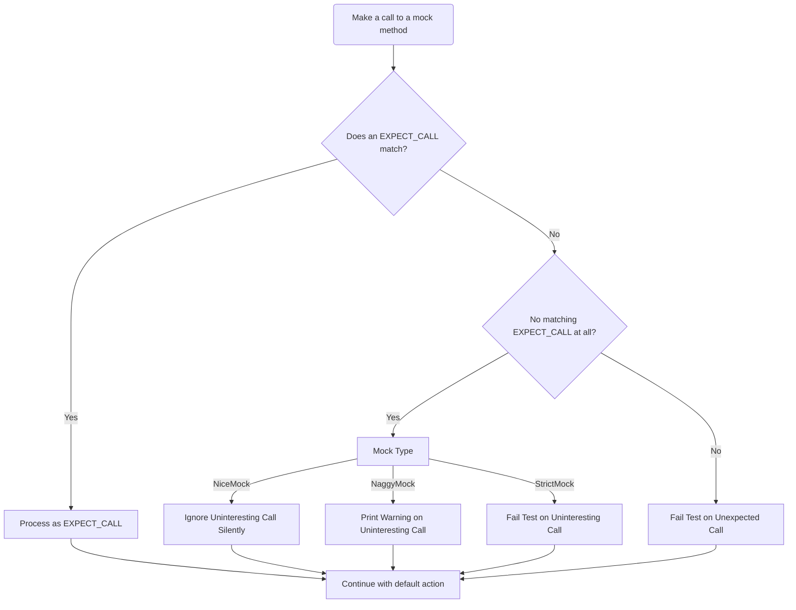

# Strict, Naggy, and Nice Mocks

This page explains how to control the behavior of GoogleMock mocks for uninteresting calls through the use of `StrictMock`, `NaggyMock`, and `NiceMock` wrappers. These wrappers help you configure whether calls to mock methods that have no explicit expectations will cause warnings, errors, or be silently ignored. Understanding and using these modifiers is essential to tailoring your test's strictness and verbosity when verifying mock interactions.

---

## Overview of Mock Strictness Modes

By default, GoogleMock mocks are **naggy**: they print warnings when you make uninteresting calls—that is, calls to mock methods without an `EXPECT_CALL` spec. To better fit your test's needs, GoogleMock provides three primary wrappers which change this default behavior:

- **`NiceMock<T>`**: Suppresses warnings on uninteresting calls, allowing them silently without complaint.
- **`NaggyMock<T>`**: Prints warnings on uninteresting calls (current default behavior).
- **`StrictMock<T>`**: Treats uninteresting calls as test failures, generating errors.

Each wrapper is a subclass of your mock class `T`, so their usage is a drop-in replacement wherever the mock is expected.

<Check>
Use `NiceMock` to keep test output clean by ignoring uninteresting calls when you expect some methods might be called but are not the focus of the test.
</Check>

<Warning>
`StrictMock` is powerful for enforcing exact interaction contracts but may cause brittle tests; use it judiciously when unanticipated calls should always be flagged.
</Warning>

## How to Use

Given a mock class named `MockFoo`, you can instantiate strictness-controlled mocks as follows:

```cpp
using ::testing::NiceMock;
using ::testing::NaggyMock;
using ::testing::StrictMock;

// Creates a nice mock that suppresses warnings for uninteresting calls.
NiceMock<MockFoo> nice_foo;

// Creates a naggy mock that warns on uninteresting calls (default behavior).
NaggyMock<MockFoo> naggy_foo;

// Creates a strict mock that treats uninteresting calls as errors.
StrictMock<MockFoo> strict_foo;
```

They accept the same constructor parameters as your mock class, so if `MockFoo` has a constructor with arguments, you can pass them through:

```cpp
NiceMock<MockBar> nice_bar("hello");
StrictMock<MockBar> strict_bar(1, 2, "hello", ...);
```

## Behavioral Differences

| Mock Type    | Uninteresting Call Behavior           | Effect on Unexpected Calls                       |
|--------------|-------------------------------------|-------------------------------------------------|
| `NiceMock`   | No warnings; calls silently proceed  | Unexpected calls still cause failures            |
| `NaggyMock`  | Prints a warning to stderr           | Unexpected calls still cause failures            |
| `StrictMock` | Test failure on uninteresting calls | Unexpected calls cause failures as usual         |

- **Uninteresting calls** are calls to mock methods with no matching `EXPECT_CALL`.
- **Unexpected calls** are calls that do not match any existing `EXPECT_CALL` predicates.

Uninteresting calls are tolerated or rejected based on strictness, while unexpected calls always fail.

## Why Use Strictness Wrappers?

- **Nice mocks** reduce noise during test development by suppressing warnings for calls you don't care about, making test output easier to parse.
- **Naggy mocks** help detect when methods without expectations are invoked, useful during debugging to identify potentially missing expectations.
- **Strict mocks** enforce complete control over mock interactions, alerting you immediately when unplanned calls occur, ensuring contract fidelity.

The recommended strategy is to use **nice mocks** for stable tests to avoid over-specification, switch to **naggy mocks** while developing tests to discover hidden calls, and reserve **strict mocks** for final assertions where you want no unexpected call to slip by.

<Info>
Note: The current default mock behavior is naggy, but plans exist to switch to nice as the default in future releases for better test maintainability.
</Info>

## Important Usage Notes

- **Applicability**: These wrappers only impact mock methods defined directly with the `MOCK_METHOD` macro in the mock class. Methods inherited from base classes may not be affected.

- **No Nesting**: Wrapping a mock with multiple strictness wrappers (e.g. `NiceMock<StrictMock<T>>`) is not supported and will result in a static assertion error.

- **Virtual Destructors Required**: For correct behavior, your mock classes should have a virtual destructor to enable proper cleanup and dispatch.

- **Leak Allowance**: You may explicitly permit mock objects to leak without verification using `Mock::AllowLeak(mock_ptr)`.

## Practical Examples

### Suppress Warnings for Uninteresting Calls with NiceMock

```cpp
class MockSpeaker {
 public:
  MOCK_METHOD(void, SayHello, ());
  MOCK_METHOD(void, SayGoodbye, ());
};

TEST(GreetingTest, UsesNiceMock) {
  NiceMock<MockSpeaker> mock;

  EXPECT_CALL(mock, SayHello());
  mock.SayHello();  // Allowed and expected.
  mock.SayGoodbye(); // No warning even without EXPECT_CALL.
}
```

### Detect Unexpected Calls with StrictMock

```cpp
StrictMock<MockSpeaker> strict_mock;

EXPECT_CALL(strict_mock, SayHello());

strict_mock.SayHello();  // OK.
strict_mock.SayGoodbye();  // Test failure: uninteresting call treated as error.
```

### Use NaggyMock for Warning Diagnostics

```cpp
NaggyMock<MockSpeaker> naggy_mock;

EXPECT_CALL(naggy_mock, SayHello());

naggy_mock.SayHello();  // OK.
naggy_mock.SayGoodbye();  // Warns about uninteresting call but test continues.
```

## Constructor Support

All three wrappers inherit constructors of the wrapped mock class enabling direct forwarding of constructor arguments. For example, given a mock with no default constructor:

```cpp
class MockWidget {
 public:
  explicit MockWidget(int size);
  MOCK_METHOD(void, DoSomething, ());
};

NiceMock<MockWidget> nice_widget(10);  // Calls MockWidget(10)
StrictMock<MockWidget> strict_widget(20); // Calls MockWidget(20)
```

## How It Works Internally (Brief)

Each wrapper inherits privately from internal helper classes that register what to do on uninteresting calls:

- `NiceMock` calls `Mock::AllowUninterestingCalls` on its instance,
- `NaggyMock` calls `Mock::WarnUninterestingCalls`,
- `StrictMock` calls `Mock::FailUninterestingCalls`.

They then publicly inherit the original mock class so all methods remain accessible with either relaxed or strict behaviors.

## Troubleshooting

<AccordionGroup title="Common Issues with Strictness Wrappers">
<Accordion title="Unrecognized strictness modifier compile errors">
Make sure you have not nested wrappers like `NiceMock<StrictMock<MockClass>>`. Nesting is not supported and will lead to static assertions.
</Accordion>
<Accordion title="Uninteresting calls still print warnings on NiceMock">
Check if the mocked methods are defined using `MOCK_METHOD` directly in the mock class. Methods from base classes might not respect the wrapper.
Also confirm that your mock class has a virtual destructor to ensure proper cleanup.
</Accordion>
<Accordion title="Unrecognized behavior with uninteresting calls after upgrading GoogleMock">
GoogleMock's default mock behavior is currently Naggy. If your tests suddenly became strict, check if your project updated GoogleMock version and adjust accordingly by explicitly using `NiceMock` or `NaggyMock`.
</Accordion>
</AccordionGroup>

## Additional References

- [Mock Class Definition and MOCK_METHOD Macros](/api-reference/mocking-framework/mock-class-definition)
- [Setting Expectations: EXPECT_CALL and ON_CALL](/api-reference/mocking-framework/setting-expectations)
- [gMock Cheat Sheet](https://google.github.io/googletest/gmock_cheat_sheet.html)
- [GoogleTest and GoogleMock Architecture Overview](/concepts/core-architecture/architecture-overview)
- [Mocking Best Practices Guide](/guides/real-world-workflows/mocking-best-practices)

---

This documentation page is designed to empower you with confidence in managing mock strictness, making your tests both effective and maintainable. Prefer `NiceMock` when in doubt, use `NaggyMock` for active test development, and apply `StrictMock` when enforcing rigorous interaction contracts.

---

## Summary Diagram (Behavioral Flow for Uninteresting Calls)


