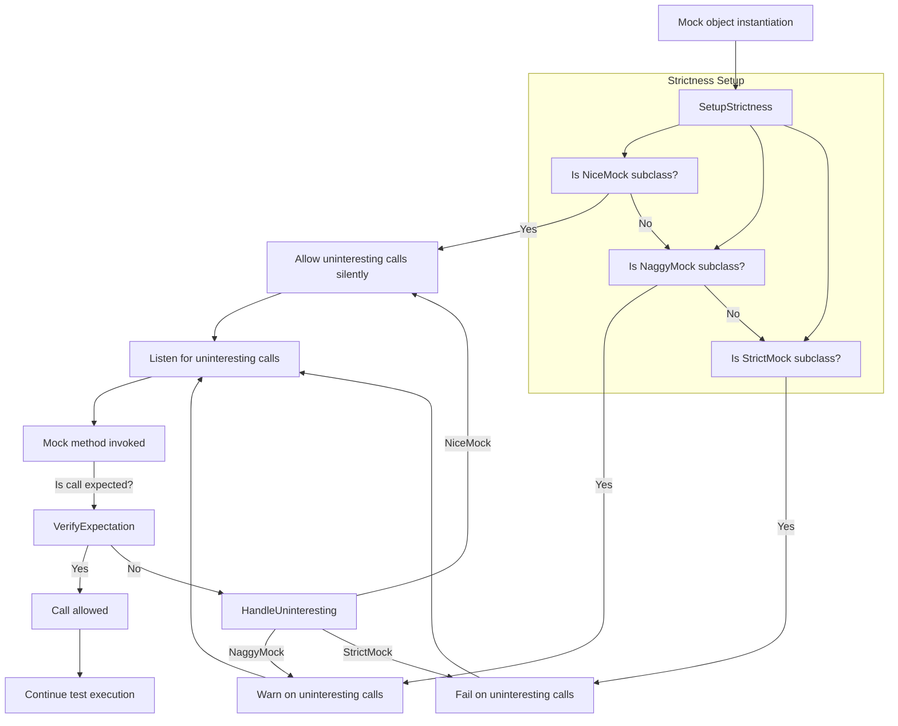

# Strictness & Mock Behavior Modifiers

GoogleMock lets you control how strictly your mock objects enforce expectations using strictness wrappers: **NiceMock**, **NaggyMock**, and **StrictMock**. These modifiers adjust how GoogleMock treats _uninteresting calls_ — method calls on mocks that have no matching expectations — impacting test output verbosity and failure behavior.

Understanding and using these strictness modifiers effectively can help you write tests that are robust, maintainable, and easier to debug.

---

## Behavior of Uninteresting Calls

An _uninteresting call_ occurs when a mock method is invoked but there is no matching `EXPECT_CALL` expectation set for that call's arguments. Handling such calls properly is crucial:

- **Default mock behavior (`NaggyMock`)**: Prints a warning but continues execution.
- **Nice mocks (`NiceMock`)**: Suppresses warnings on uninteresting calls, allowing tests to ignore irrelevant method calls silently.
- **Strict mocks (`StrictMock`)**: Treats uninteresting calls as test failures, enforcing strict verification.

### Why does this matter?

By design, GoogleMock treats interactive behavior verification as its core. If a call is uninteresting, the question is: should it alert you (or fail your test) indicating a possible missing expectation, or silently ignore it?

---

## Strictness Wrappers Overview

| Modifier    | Behavior on Uninteresting Calls                 | Base Class Relationship         | Supports Constructors with Args | Impact on Unexpected Calls |
|-------------|------------------------------------------------|--------------------------------|---------------------------------|----------------------------|
| **NiceMock**  | Ignores uninteresting calls (no warnings/failures) | Subclass of your Mock class      | Yes                             | Unexpected calls always fail |
| **NaggyMock** | Prints warnings on uninteresting calls (default) | Subclass of your Mock class      | Yes                             | Unexpected calls always fail |
| **StrictMock** | Treats uninteresting calls as failures          | Subclass of your Mock class      | Yes                             | Unexpected calls always fail |

---

## Using Strictness Modifiers

All three modifiers are template wrappers around your existing mock classes. They subclass your mock and adjust the behavior of uninteresting calls accordingly.

### Example:

```cpp
using ::testing::NiceMock;
using ::testing::NaggyMock;
using ::testing::StrictMock;

class MockFoo {
 public:
  MOCK_METHOD(void, DoThis, (), ());
};

// Default behavior: prints warnings on uninteresting calls
MockFoo default_mock;
default_mock.DoThis(); // No expectation: warning printed

// NiceMock suppresses warnings
NiceMock<MockFoo> nice_mock;
nice_mock.DoThis(); // No expectation: no warning

// StrictMock treats uninteresting calls as errors
StrictMock<MockFoo> strict_mock;
strict_mock.DoThis(); // No expectation: test failure
```

### Constructing Strictness Wrappers with Arguments

If your mock class has constructors with arguments, you can pass them directly through the wrapper:

```cpp
class MockBar {
 public:
  explicit MockBar(int x);
  MOCK_METHOD(int, GetValue, (), ());
};

NiceMock<MockBar> nice_bar(42);  // Calls MockBar(42) constructor
StrictMock<MockBar> strict_bar(7, "abc");  // Passes multiple arguments
```

---

## Important Traits & Best Practices

### 1. Impact on Unexpected Calls

All strictness wrappers affect only _uninteresting calls_. Unexpected calls — those that have expectations but whose arguments don't match — always result in errors regardless of strictness. This ensures your test verifies exact interaction.

### 2. Supported Method Definitions

Strictness modifiers work correctly only if the `MOCK_METHOD` macro is used in the mock class **directly** (not inherited) for each mocked method. If a mock method is defined in a base class, the behavior might differ depending on compiler capabilities.

### 3. Virtual Destructors

If your mock class doesn't have a virtual destructor, `NiceMock` and `StrictMock` may not work properly. Always declare a virtual destructor in mock classes.

### 4. Avoid Nesting Strictness Wrappers

Nesting `NiceMock`, `NaggyMock`, or `StrictMock` wrappers (e.g. `NiceMock<StrictMock<MockFoo>>`) is not supported and will cause errors.

---

## Why & When to Use Each Modifier

### NaggyMock (Default)

- Prints warnings on uninteresting calls.
- Useful during test development to detect any potentially missing expectations.
- Can cause noisy test output if mock methods are called but not expected explicitly.

### NiceMock

- Suppresses uninteresting call warnings.
- Useful when you want to ignore some mock methods' invocations entirely.
- Recommended for tests where only a subset of methods are of interest, yielding cleaner logs.

### StrictMock

- Makes uninteresting calls immediate test failures.
- Use when you want **tight control** over mock interactions and want your tests to fail on any unexpected behavior.
- Helps catch unanticipated calls early, improving test strictness.

---

## Migrating Between Strictness Levels

If migrating from `NaggyMock` (or default mock) to `NiceMock` or `StrictMock`, consider:

- Identify mock methods called without expectations and decide whether to suppress warnings or fail.
- Add targeted `EXPECT_CALL` clauses or consider `NiceMock` for relaxed warning suppression.
- Use `StrictMock` when rising discipline or test precision is desired.

### Sample Migration

```cpp
// Old (NaggyMock or default mock): prints warnings on uninteresting calls
MockFoo foo;
foo.DoThis();  // Warning if no expectation

// Relax warnings
NiceMock<MockFoo> nice_foo;
nice_foo.DoThis();  // No warning

// Enforce precise expectations
StrictMock<MockFoo> strict_foo;
EXPECT_CALL(strict_foo, DoThis());
strict_foo.DoThis();  // Okay
strict_foo.DoThat();  // Fails: uninteresting call
```

---

## Inspecting Mock Strictness at Runtime

You can programmatically test whether a mock is Naggy, Nice, or Strict by:

```cpp
EXPECT_TRUE(Mock::IsNice(&nice_mock));
EXPECT_TRUE(Mock::IsNaggy(&naggy_mock));
EXPECT_TRUE(Mock::IsStrict(&strict_mock));
```

This helps in diagnostic scenarios or when templates obscure type details.

---

## Advanced: How Strictness Modifiers Work (Under the Hood)

GoogleMock registers strictness handlers per mock instance on construction and deregisters them upon destruction, ensuring uninteresting call reactions happen consistently throughout the lifetime of the mock.

This design preserves the ability to use constructors with arguments transparently.

---

## Common Pitfalls & Troubleshooting

- **Unintended Warnings on Uninteresting Calls:** If warnings bother you and are expected, consider using `NiceMock`.

- **Unexpected Ignored Calls on StrictMock:** Verify all mock methods are defined with `MOCK_METHOD` directly in the mock class, including override keywords.

- **Nesting Strictness Modifiers:** Avoid nesting different strictness wrappers; refactor test code instead.

- **No Virtual Destructor:** Add a virtual destructor to your mock classes to prevent undefined behaviors and enable strictness modifiers.

- **Unclear Failure Messages:** Run tests with `--gmock_verbose=info` to get verbose logs of matching and calls to help diagnose expectation mismatches.

---

## Summary Diagram: Mock Strictness Flow


```

---

## Additional Resources

- See [gMock Cookbook: The Nice, the Strict, and the Naggy](https://google.github.io/googletest/gmock_cook_book.html#NiceStrictNaggy) for deeper conceptual and practical guidance.
- For detailed API usage of Strictness wrappers, see the [Mocking Reference: Strictness & Mock Behavior Modifiers](reference/mocking.md#NiceMock), [`NaggyMock`](reference/mocking.md#NaggyMock), and [`StrictMock`](reference/mocking.md#StrictMock) sections.
- Use `--gmock_verbose=info` flag while running tests for extensive diagnostic output to debug mock unmatched calls.
- Consult the [GoogleMock FAQ](https://google.github.io/googletest/gmock_faq.html) if you encounter common strictness-related issues.

---

By using `NiceMock`, `NaggyMock`, and `StrictMock` thoughtfully, you shape the feedback from mocks during testing, balancing between noisiness, flexibility, and strictness — ultimately attaining stable, expressive, and trustworthy tests.