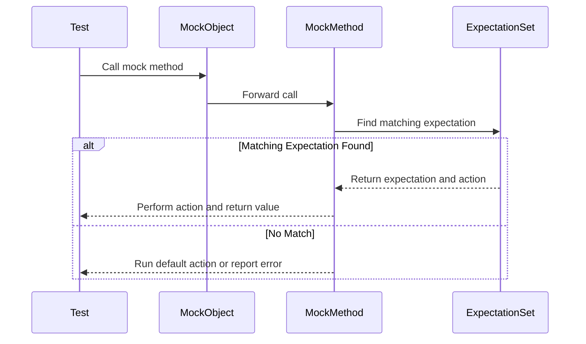

# Mock Methods and Macros

GoogleMock provides a powerful and flexible mechanism to declare and implement mock methods within mock classes. This page details how to define mock methods using macros like `MOCK_METHOD`, explains the typical structure of mock classes, and explores advanced qualifiers and patterns that enable scalable and maintainable mocking.

---

## Overview of Mock Methods

In GoogleMock, mock methods are declared using the macro `MOCK_METHOD`, which generates all necessary method implementations behind the scenes. These mock methods simulate the behavior of virtual functions in C++ classes, allowing you to specify expectations on their calls during tests.

Mock classes combine multiple such mock methods to mock entire interfaces or classes, facilitating precise verification of interactions and behaviors.

---

## Declaring Mock Methods with `MOCK_METHOD`

### Syntax

```cpp
MOCK_METHOD(return_type, method_name, (argument_types...), (qualifiers));
```

- `return_type`: The return type of the method.
- `method_name`: The name of the method to mock.
- `(argument_types...)`: Parenthesized list of argument types.
- `(qualifiers)`: Optional list of method qualifiers, like `const`, `override`, `noexcept`, etc.

### Example: Basic Mock Method Declarations

```cpp
class MockFoo {
 public:
  MOCK_METHOD(char, Bar, (const std::string& s, int i, double x));
  MOCK_METHOD(bool, Bar2, (int x, int y));
  MOCK_METHOD(void, Bar3, (int x, int y));
};
```

### Notes on Arguments with Commas

Because `MOCK_METHOD` splits parameters at commas, arguments or return types that contain commas (e.g., template types like `std::pair<int, int>`) can confuse the macro. Use one of these techniques to avoid compilation errors:

- Wrap the return or argument type containing commas in an extra pair of parentheses:

```cpp
MOCK_METHOD((std::pair<bool, int>), GetPair, ());
MOCK_METHOD(bool, CheckMap, ((std::map<int, double>), bool));
```

- Define type aliases for complex types:

```cpp
using BoolAndInt = std::pair<bool, int>;
MOCK_METHOD(BoolAndInt, GetPair, ());
```

### Placement of `MOCK_METHOD`

Always place `MOCK_METHOD` macro calls in the `public:` section of your mock class, no matter the access level of the overridden base method (public, protected, or private).

This visibility allows GoogleMock to invoke and control mock methods correctly regardless of the base class's access modifiers.


## Qualifiers Supported by `MOCK_METHOD`

When overriding methods with special qualifiers, `MOCK_METHOD` supports additional specifiers:

| Qualifier           | Description                                                                                     |
|---------------------|------------------------------------------------------------------------------------------------|
| `const`             | Marks the method as a const method (e.g., `foo() const`). Mandatory if the base method is const. |
| `override`          | Marks the method as overriding a virtual method. Recommended for safety and clarity.             |
| `noexcept`          | Marks the method `noexcept`. Required if the base method has `noexcept`.                        |
| `Calltype(...)`     | Specifies calling convention (e.g., `Calltype(STDMETHODCALLTYPE)`), useful on Windows.          |
| `ref(&)` / `ref(&&)`| Reference qualifiers for methods overloaded on reference qualifiers.                             |

Example:
```cpp
MOCK_METHOD(void, MyMethod, (int x), (const, override, noexcept));
```

## Defining Mock Classes

Mock classes typically inherit from interfaces or base classes with virtual methods. You implement each virtual method you want to mock using `MOCK_METHOD`. Here's a typical example:

```cpp
class FooInterface {
 public:
  virtual ~FooInterface() {}
  virtual int GetValue() const = 0;
  virtual void SetValue(int x) = 0;
};

class MockFoo : public FooInterface {
 public:
  MOCK_METHOD(int, GetValue, (), (const, override));
  MOCK_METHOD(void, SetValue, (int x), (override));
};
```

You don’t usually need to manually define the constructor, destructor, or method implementations—`MOCK_METHOD` expands to generate those for you.


## Advanced Mocking Techniques

### Mocking Overloaded Methods

To mock overloaded functions, define each overload separately with the appropriate argument list and qualifiers:

```cpp
class Foo {
 public:
  virtual int Func(int x) = 0;
  virtual int Func(double x) const = 0;
};

class MockFoo : public Foo {
 public:
  MOCK_METHOD(int, Func, (int x), (override));
  MOCK_METHOD(int, Func, (double x), (const, override));
};
```

If you only mock some overloads, bring others into scope with a `using` directive to avoid hiding them unintentionally.

### Mocking Methods with Move-only Types

GoogleMock supports mocking methods taking or returning move-only types (e.g., `std::unique_ptr`). Use `MOCK_METHOD` as usual. When specifying actions, use lambdas or callables to safely handle move semantics.

Example:

```cpp
class Buzzer {
 public:
  virtual std::unique_ptr<Buzz> MakeBuzz(StringPiece text) = 0;
  virtual bool ShareBuzz(std::unique_ptr<Buzz> buzz, int64_t ts) = 0;
};

class MockBuzzer : public Buzzer {
 public:
  MOCK_METHOD(std::unique_ptr<Buzz>, MakeBuzz, (StringPiece text), (override));
  MOCK_METHOD(bool, ShareBuzz, (std::unique_ptr<Buzz> buzz, int64_t ts), (override));
};
```

### Dealing with Private or Protected Methods

Even if base class methods are private or protected, `MOCK_METHOD` declarations must be public in the mock class for GoogleMock to hook properly.

### Using ON_CALL for Default Behavior

`ON_CALL` lets you configure default behavior for mock methods without asserting that they must be called:

```cpp
ON_CALL(mock_obj, Method(_))
    .WillByDefault(Return(default_value));
```

This is especially useful to provide common default behavior across multiple tests.

### Setting Expectations with EXPECT_CALL

`EXPECT_CALL` configures the expected calls and their behavior:

```cpp
EXPECT_CALL(mock_obj, Method(matcher1, matcher2))
    .Times(Exactly(2))
    .WillOnce(Return(1))
    .WillRepeatedly(Return(2));
```

You can chain various clauses like `.With()`, `.InSequence()`, `.After()`, `.RetiresOnSaturation()` to precisely control call expectations.

### Managing Mock Behavior Strictness

Use `NiceMock`, `NaggyMock`, and `StrictMock` wrappers to control warnings and errors for uninteresting calls:

- `NiceMock<MockClass>` suppresses warnings for uninteresting calls.
- `NaggyMock<MockClass>` (default) warns on uninteresting calls.
- `StrictMock<MockClass>` treats uninteresting calls as test failures.

Example:

```cpp
NiceMock<MockFoo> nice_foo;
EXPECT_CALL(nice_foo, DoSomething());
```

### Delegating Calls

You can configure mocks to delegate calls to a fake or real implementation using lambdas in `ON_CALL` or `EXPECT_CALL`, preserving interaction verification while reusing existing logic.

### Constructing Mock Classes Efficiently

To improve build times for large mocks, declare (but do not define) constructors and destructors in your header:

```cpp
class MockFoo : public Foo {
 public:
  MockFoo();
  ~MockFoo();
  MOCK_METHOD(void, DoSomething, (), (override));
};
```

Then define them trivial in a `.cc` file:

```cpp
MockFoo::MockFoo() {}
MockFoo::~MockFoo() {}
```

## Example: Writing and Using a Mock Class

```cpp
#include <gmock/gmock.h>

class Foo {
 public:
  virtual ~Foo() {}
  virtual int GetValue() const = 0;
  virtual void SetValue(int x) = 0;
};

class MockFoo : public Foo {
 public:
  MOCK_METHOD(int, GetValue, (), (const, override));
  MOCK_METHOD(void, SetValue, (int x), (override));
};

// In your test:
using ::testing::Return;
using ::testing::_;

TEST(FooTest, TestBehavior) {
  MockFoo mock;

  ON_CALL(mock, GetValue()).WillByDefault(Return(5));

  EXPECT_CALL(mock, SetValue(_)).Times(1);

  // Code under test
  mock.SetValue(7);
  EXPECT_EQ(5, mock.GetValue());
}
```

## Common Pitfalls and Tips

- **Always put your `EXPECT_CALL` before exercising the mock**, otherwise the behavior is undefined.
- When mocking overloaded methods, specify all overloads or bring the ones not mocked with `using` declarations.
- Use `RetiresOnSaturation()` for expectations that should deactivate after being satisfied to avoid upper-bound violation errors.
- For default behaviors, prefer `ON_CALL` over `EXPECT_CALL` to avoid over-constraining your tests.
- For methods with complex or verbose parameter lists, consider defining simpler mock methods that the mock delegates to for easier test writing.

## Troubleshooting

- If a mock method calls the real method, ensure the original method is declared `virtual`.
- If you get warnings about const argument qualifiers, remember that top-level `const` on parameters is ignored by C++.
- For issues with uninteresting calls, consider using `NiceMock` or setting explicit expectations for supressing warnings.
- When dealing with move-only types, prefer lambda actions instead of `Return()` with prvalue expressions.

## See Also

- [GoogleMock for Dummies](gmock_for_dummies.md) — Beginner-friendly introduction
- [Mocking Reference](reference/mocking.md) — Full reference of mocking facilities
- [GoogleMock Cookbook](gmock_cook_book.md) — Recipes and advanced usage
- [Expectations and Call Specification](expectations-api) — Details on `EXPECT_CALL` and related clauses
- [Matchers Reference](argument-matchers-api) — Guide on argument matchers used in expectations

---

## Summary Diagram of Mock Method Flow


