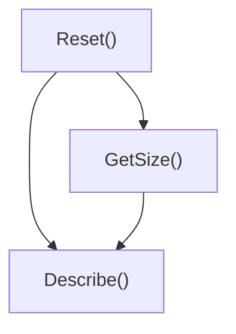

# Expectations, Calls, and Cardinalities

This page explains how to specify expectations on mock methods in GoogleMock, control the allowed number of calls using cardinalities, and define the ordering and sequencing of expected calls. It documents the usage and syntax of the core macros `EXPECT_CALL` and `ON_CALL`, clarifying their relationship and describing how to use cardinality constraints and sequences to fine-tune mock interactions.

---

## Overview

In the journey of writing robust and maintainable tests with GoogleMock, specifying **what calls to expect on your mock objects and how often** they should occur is fundamental. This documentation guides you through the **syntax and semantics of `EXPECT_CALL` and `ON_CALL` macros**, along with **cardinality controls** and **call ordering mechanisms** that help you express expectations precisely.

By mastering these constructs, you ensure your mocks verify the interactions your production code is expected to perform, avoiding brittle or overly permissive tests.

---

## Setting Expectations with `EXPECT_CALL`

`EXPECT_CALL` creates an expectation on a mock object's method, specifying which calls are anticipated during the test execution, how many times they happen, with what arguments, and in what order.

### Basic Syntax

```cpp
EXPECT_CALL(mock_object, MethodName(arg_matchers...))
    .With(multi_arg_matcher)       // Optional, once
    .Times(cardinality)            // Optional, once
    .InSequence(sequences...)      // Optional, multiple
    .After(expectations...)        // Optional, multiple
    .WillOnce(action)              // Optional, multiple
    .WillRepeatedly(action)        // Optional, once
    .RetiresOnSaturation();        // Optional, once
```

- **mock_object**: your mock instance.
- **MethodName**: the mock method name.
- **arg_matchers...**: Matchers describing the arguments expected.

### Key Points

- The **argument matchers** specify conditions for the call's arguments. If omitted, each argument matches any value (using the wildcard matcher `_`).
- `.With()` restricts expectations to calls whose *all* arguments match a multi-argument matcher (used seldomly).
- `.Times()` specifies how many times the call is expected (defaults to inferred cardinality).
- `.InSequence()` and `.After()` control call order (see below).
- `.WillOnce()` and `.WillRepeatedly()` define what happens when the call is invoked.
- `.RetiresOnSaturation()` makes the expectation inactive once its maximum number of calls is reached.

### Examples

#### Basic Expectation

```cpp
EXPECT_CALL(mock_turtle, Forward(100))
    .Times(3)
    .WillRepeatedly(Return());
```

Expect `Forward(100)` to be called exactly 3 times.

#### Matching Any Arguments

```cpp
EXPECT_CALL(mock_turtle, GoTo(_, _))
    .Times(AnyNumber());
```

Allow unlimited calls to `GoTo` with any arguments.

#### Matching by Multi-argument Matcher with `.With()`

```cpp
using ::testing::_;
using ::testing::Lt;

EXPECT_CALL(mock_turtle, SetPosition(_, _))
    .With(Lt());  // First argument less than second
```

---

## Defining Default Behaviors with `ON_CALL`

`ON_CALL` defines **behavior** for calls matching specified arguments but does not enforce any expectation that the call must occur.

### Syntax

```cpp
ON_CALL(mock_object, MethodName(arg_matchers...))
    .With(multi_arg_matcher)  // Optional, once
    .WillByDefault(action);   // Mandatory, once
```

- Behaviors set by `ON_CALL` are fallback behaviors when no matching `EXPECT_CALL` applies.
- Unlike `EXPECT_CALL`, calls matching only `ON_CALL` do not count towards expectation verification.

### Example

```cpp
ON_CALL(mock_turtle, GetX()).WillByDefault(Return(10));
```

Calls to `GetX()` with no expectation will return `10`.

---

## Cardinalities: Specifying How Many Times a Call Is Expected

Cardinalities express **how many times** an expected call should be made. You specify cardinality using the `.Times()` clause.

### Common Cardinalities

| Cardinality          | Description                                |
|----------------------|--------------------------------------------|
| `AnyNumber()`        | Function can be called any number of times.
| `AtLeast(n)`         | Call expected at least `n` times.
| `AtMost(n)`          | Call expected at most `n` times.
| `Between(m, n)`      | Call expected between `m` and `n` times (inclusive).
| `Exactly(n)` or `n`  | Call expected exactly `n` times. If `n` is 0, call should not occur.

### Default Cardinality Inference

If `.Times()` is omitted, GoogleMock infers cardinality based on `.WillOnce()` and `.WillRepeatedly()` calls:

- No `.WillOnce()` and no `.WillRepeatedly()`  → cardinality = `Times(1)`
- `n` `.WillOnce()` and no `.WillRepeatedly()` → cardinality = `Times(n)`
- `n` `.WillOnce()` and one `.WillRepeatedly()` → cardinality = `Times(AtLeast(n))`

### Example

```cpp
EXPECT_CALL(mock_turtle, GetY())
    .Times(AtLeast(2))
    .WillRepeatedly(Return(50));
```

`GetY()` must be called at least twice.

---

## Ordering Calls: Sequence and Partial Ordering

By default, GoogleMock allows calls to expected methods in **any order**. Use sequences and ordering clauses to restrict call order.

### Using `InSequence`

`InSequence` groups multiple expectations so that they must be fulfilled in the order they are declared.

```cpp
using ::testing::InSequence;

{
  InSequence seq;
  EXPECT_CALL(mock_turtle, PenDown());
  EXPECT_CALL(mock_turtle, Forward(100));
  EXPECT_CALL(mock_turtle, PenUp());
}
```

In this block, the expectations must be matched sequentially.

### Using `Sequence` and `.InSequence(...)`

For more complex call ordering, use the `Sequence` class to create named sequences and join expectations.

```cpp
using ::testing::Sequence;

Sequence s1, s2;
EXPECT_CALL(mock, Reset()).InSequence(s1, s2);
EXPECT_CALL(mock, GetSize()).InSequence(s1);
EXPECT_CALL(mock, Describe()).InSequence(s2);
```

This imposes the partial ordering illustrated by the DAG:

```text
  Reset()
    /    \
 GetSize()  Describe()
```

### Using `.After()`

`.After()` specifies that an expectation should only be matched after other expectation(s) complete.

```cpp
Expectation e1 = EXPECT_CALL(mock, InitX());
Expectation e2 = EXPECT_CALL(mock, InitY());
EXPECT_CALL(mock, Describe()).After(e1, e2);
```

`Describe()` must be called after `InitX()` and `InitY()`.

### Retiring Expectations: `.RetiresOnSaturation()`

By default, expectations stay *active* (sticky) even after their cardinality has been met, which may cause unwanted match overlapping.

You can make an expectation *retire* (become inactive) immediately after its upper bound is reached by calling `.RetiresOnSaturation()`. This is useful for cases like:

```cpp
EXPECT_CALL(mock, SetNumber(_)).Times(AnyNumber());
EXPECT_CALL(mock, SetNumber(7)).Times(2).RetiresOnSaturation();
```

Once `SetNumber(7)` is called twice, that expectation is retired, and matching calls fall back to the first expectation.

---

## Practical Tips and Best Practices

- Prefer using `ON_CALL` for behavior definitions when you don't need to verify a call happened.
- Use `EXPECT_CALL` only when you want to verify calls.
- Keep expectations simple and avoid over-specification to reduce fragility.
- To suppress uninteresting call warnings, consider `NiceMock` or explicit `EXPECT_CALL` with `.Times(AnyNumber())`.
- When ordering matters, define sequences explicitly for readability and maintainability.
- Use `.RetiresOnSaturation()` with sequences or multiple expectations to avoid clash and improve test clarity.

---

## Troubleshooting Common Issues

<AccordionGroup title="Common Pitfalls and How to Resolve Them">
<Accordion title="Too many or too few actions warning">
If you specify more `WillOnce` actions than allowed by the `.Times()` cardinality, GoogleMock will issue a warning. Similarly, having fewer `WillOnce` actions than the minimum cardinality will result in a warning. Make sure the number of `WillOnce` calls aligns with the expected number of calls.
</Accordion>
<Accordion title="Unexpected or excessive calls">
Unexpected calls (those not matching any `EXPECT_CALL`) and excessive calls (calls exceeding the `.Times()` upper bound) cause test failures. Verify all expected calls are declared and the actual call count respects the cardinality.
</Accordion>
<Accordion title="Ordering failures">
If calls occur out of order in sequences or `.After()` constraints, GoogleMock fails with messages indicating the order violation. Review your sequences and prerequisite expectations.
</Accordion>
<Accordion title="Uninteresting call warnings">
These are emitted when a mock method is called but has no active expectation. To avoid, set suitable `EXPECT_CALL` or switch to `NiceMock` for suppressing warnings.
</Accordion>
</AccordionGroup>

---

## Additional Classes and Concepts

- **Expectation**: A handle to an individual call expectation, returned by `EXPECT_CALL`.
- **ExpectationSet**: A collection of expectations usable for specifying `.After()` clauses for multiple prerequisites.
- **Sequence**: Represents a linear sequence; expectations added to the same sequence impose an ordered constraint.
- **InSequence**: Scoped helper that makes all expectations declared in its scope part of an anonymous sequence.

---

## Related Documentation

- [Mock Class and Method Macros](./mock-class-macros.md) — Defining mocks.
- [Matchers Reference](./argument-matchers.md) — Specifying argument matchers.
- [Actions and Return Value Control](./actions-and-more.md) — Specifying return and side effects.
- [Mocking Patterns & Best Practices](../guides/mocking-techniques/mocking-patterns-and-best-practices.mdx) — For advanced mock management.

---

## Summary Example

```cpp
using ::testing::Return;
using ::testing::Sequence;

Sequence s;

EXPECT_CALL(mock_turtle, PenDown()).InSequence(s);
EXPECT_CALL(mock_turtle, Forward(100)).InSequence(s);
EXPECT_CALL(mock_turtle, PenUp()).InSequence(s);

ON_CALL(mock_turtle, GetX()).WillByDefault(Return(42));

EXPECT_CALL(mock_turtle, GetX())
    .Times(3)
    .WillOnce(Return(10))
    .WillOnce(Return(20))
    .WillRepeatedly(Return(42));
```

This sets a sequence of calls to `PenDown()`, `Forward(100)`, and `PenUp()`, enforces `GetX()` to be called exactly 3 times with specific return values, and defines a default behavior for calls to `GetX()`.

---

## Useful Link

For an interactive and detailed guide on expectations, calls, and cardinalities, see the [GoogleMock Cookbook - Setting Expectations](https://github.com/google/googletest/blob/main/docs/gmock_cook_book.md#setting-expectations-and-verifying-behavior).

---

## Mermaid Diagram: Partial Order of Calls with Sequences



---

## See Also

- `MOCK_METHOD` usage details in Mock Class and Method Macros
- Argument Matchers Reference
- Actions and Return Value Control Reference
- Mock Strictness Mode Reference


---