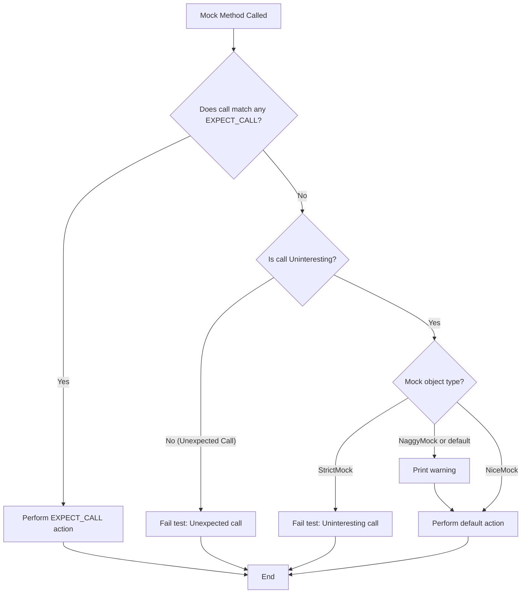

# Controlling Mock Strictness

This guide introduces how to precisely control the behavior of mock objects in GoogleMock when unexpected or uninteresting method calls occur. You will learn how to leverage the `NiceMock`, `NaggyMock`, and `StrictMock` class templates to modify the strictness of mocks, thereby managing warnings and failures during tests.

---

## Overview of Mock Strictness Classes

GoogleMock provides three key class templates to customize how mock objects behave upon receiving calls to methods that are **uninteresting** (no explicit expectation set) or **unexpected** (calls that do not match any existing expectation):

- **NiceMock<MockClass>**: Silences warnings for uninteresting calls, allowing them to pass quietly without failure.
- **NaggyMock<MockClass>**: The default behavior, which prints warnings when uninteresting calls happen.
- **StrictMock<MockClass>**: Treats uninteresting calls as errors, causing test failures.

Each is a subclass of the original mock and can replace it seamlessly wherever used.

### Why Control Mock Strictness?

When you write tests using mocks, some functions might be called without any expectations specified. GoogleMock calls these **uninteresting calls**. By default, GoogleMock warns you about these to help you catch missing expectations but lets the test run.

However, in some contexts, you want to:

- Suppress these warnings (using `NiceMock`) to reduce test noise and make tests more maintainable.
- Enforce strict correctness (using `StrictMock`) by making uninteresting calls fail tests.
- Continue to see warnings as prompts (default or `NaggyMock`) when debugging or developing tests.

This granularity lets you balance between test strictness and maintainability.

---

## Using NiceMock, NaggyMock, and StrictMock

### Basic Usage

Suppose you have a mock class `MockFoo` defined as usual:

```cpp
#include <gmock/gmock.h>

class MockFoo {
 public:
  MOCK_METHOD(void, DoThis, (), ());
  MOCK_METHOD(int, Compute, (int x), ());
  // ... other mock methods ...
};
```

You can instantiate different variants with desired strictness:

```cpp
using ::testing::NiceMock;
using ::testing::NaggyMock;
using ::testing::StrictMock;

NiceMock<MockFoo> nice_foo;      // Ignores uninteresting calls (no warnings).
NaggyMock<MockFoo> naggy_foo;    // Prints warnings on uninteresting calls (default behavior).
StrictMock<MockFoo> strict_foo;  // Fails tests on uninteresting calls.
```

All three act as subclasses of `MockFoo` and can be used interchangeably in your tests.

### Constructing Mocks with Arguments

`NiceMock`, `NaggyMock`, and `StrictMock` “inherit” constructors from the base mock, so you can pass constructor arguments as usual:

```cpp
NiceMock<MockFoo> nice_foo(42, "hello");  // Calls MockFoo(int, const char*) constructor.
StrictMock<MockBar> strict_bar("config");
```

This makes adoption simple without special handling.

### Effect on Uninteresting Calls

- `NiceMock`: All uninteresting calls are silently allowed. No warning or error.
- `NaggyMock` or default mock: Prints a warning message but allows the call.
- `StrictMock`: Fails the test immediately upon an uninteresting call.

### Effect on Unexpected Calls

Unexpected calls, i.e. calls that match **no** expectations, *always* fail regardless of `NiceMock` or `NaggyMock`. Strictness settings only impact uninteresting calls.

---

## Best Practices and Caveats

### Recommended Usage

- Use **NiceMock** as the default choice for most tests to reduce noise and improve test maintainability.
- Use **NaggyMock** temporarily during debugging to see warnings and identify missing expectations.
- Use **StrictMock** sparingly to enforce stricter correctness where every call must be expected explicitly.

### Known Limitations

- The `NiceMock`, `NaggyMock`, and `StrictMock` wrappers only work correctly for mock methods declared **directly** in the mock class using `MOCK_METHOD`. Methods inherited from base mock classes may not be affected uniformly.
- Nesting strictness wrappers (e.g. `NiceMock<StrictMock<MockFoo>>`) is **not supported**.
- If a mock class’s destructor is not virtual, behavior may be unreliable.

### Transition of Default Behavior

Currently, plain mocks behave like `NaggyMock` by default (warnings on uninteresting calls).

GoogleMock is moving toward making `NiceMock` the default, aligning with more maintainable tests.

---

## Practical Example

Here is an example test illustrating usage:
```cpp
#include <gmock/gmock.h>
#include <gtest/gtest.h>

using ::testing::NiceMock;
using ::testing::StrictMock;
using ::testing::Return;

class MockDatabase {
 public:
  MOCK_METHOD(bool, Connect, (), ());
  MOCK_METHOD(int, Query, (const std::string& sql), ());
};

// Production code depends on Database interface. Test uses mock.

TEST(DatabaseTest, NiceMockIgnoresUninterestingCalls) {
  NiceMock<MockDatabase> db;

  // Set expectation on Connect only.
  EXPECT_CALL(db, Connect()).WillOnce(Return(true));

  EXPECT_TRUE(db.Connect());

  // Query has no expectations but no warnings.
  int result = db.Query("select * from users");  // Allowed silently
  (void)result;
}

TEST(DatabaseTest, StrictMockFailsOnUninterestingCalls) {
  StrictMock<MockDatabase> db;

  EXPECT_CALL(db, Connect()).WillOnce(Return(true));

  EXPECT_TRUE(db.Connect());

  // Uninteresting call - Query will cause test failure.
  EXPECT_NONFATAL_FAILURE(db.Query("select *"), "Uninteresting mock function call");
}
```

---

## Troubleshooting Common Issues

<AccordionGroup title="Common Questions and Solutions">
<Accordion title="My uninteresting calls still cause warnings even when using NiceMock.">
Ensure your mock methods are declared directly in the mock class with `MOCK_METHOD`. Inherited mock methods may not honor strictness modifiers due to compiler limitations.
</Accordion>
<Accordion title="Why does nesting NiceMock and StrictMock not work?">
Nesting strictness modifiers is unsupported. Instead, apply one at the outermost level, e.g., `NiceMock<MockFoo>`, or `StrictMock<MockFoo>`.
</Accordion>
<Accordion title="Why might my StrictMock not fail on uninteresting calls?">
Verify your mock class has a virtual destructor and that mock methods are declared directly in the mock class. These are necessary for proper strictness enforcement.
</Accordion>
</AccordionGroup>

<Tip>
To suppress warnings about uninteresting calls on specific mock methods without applying `NiceMock` globally, consider adding `EXPECT_CALL(mock_obj, MethodName(_)).Times(::testing::AnyNumber())` to explicitly accept calls.
</Tip>

---

## Summary

This page explained how to manage mock strictness in GoogleMock using `NiceMock`, `NaggyMock`, and `StrictMock`. Controlling the strictness level helps make tests more maintainable, less noisy, or more rigorously checked according to your needs.

See related pages for details on [Defining Mock Objects](../mock-objects) and [Mock Expectations and Actions](../mock-expectations-actions) for complete mastery of mock usage in GoogleMock.

---

## References

- [gMock Cookbook: The Nice, the Strict, and the Naggy](https://google.github.io/googletest/gmock_cook_book.html#NiceStrictNaggy)
- [Mocking Reference - Controlling Strictness](../mocking/reference#NiceMock)
- [gMock Cheat Sheet: Creating NiceMock, NaggyMock, StrictMock](https://google.github.io/googletest/gmock_cheat_sheet.html#NiceStrictNaggy)

---

For further exploration, examine the source that implements these classes: `include/gmock/gmock-nice-strict.h` and the test suite `test/gmock-nice-strict_test.cc` in the GoogleTest repository.

---

## Visual Flow: Mock Call Handling by Strictness



**Legend:**
- Decision nodes with curly braces
- Processes and outcomes as rectangular boxes
- Flow arrows indicate call path

---

# End of Controlling Mock Strictness Documentation
