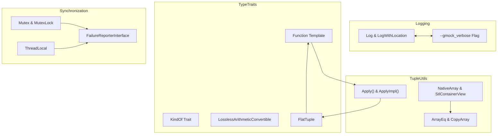

# Internal Utility Functions & Type Traits

Technical documentation of advanced internal APIs for implementers—type traits, logging helpers, tuple manipulation, and low-level test utilities. Useful for extension authors and contributors.

---

## Overview

This section of the GoogleTest API Reference is targeted at implementers, extension authors, and contributors who need to engage with GoogleMock's internal utilities. It covers advanced components such as type traits aiding compile-time type introspection, low-level logging helpers for detailed diagnostics, tuple manipulation utilities for argument processing, and test-support functions not exposed to typical mock users.

These APIs are designed for internal use and are not part of the standard user-facing mocking interface. They provide critical functionality beneath `MOCK_METHOD`, `EXPECT_CALL`, and other macros. While not intended for direct consumption in test code, understanding these utilities can empower advanced contributors to extend or troubleshoot GoogleMock effectively.

---

## Key Internal Components

### Type Traits

GoogleMock leverages extensive template meta-programming to perform compile-time operations on types, enabling features such as type-safe mock method generation, matcher compatibility, and safe casting.

#### Compile-Time Type Identification

- `KindOf<T>`: Resolves the kind of a type among predefined categories (`kBool`, `kInteger`, `kFloatingPoint`, `kOther`), facilitating safe conversions and matcher casting.

- `LosslessArithmeticConvertible<From, To>`: Determines if a conversion between two built-in arithmetic types can happen without losing information, ensuring `SafeMatcherCast` only permits valid conversions.

#### Function Traits

- `Function<F>` template: Extracts the return type (`Result`), argument types (`Arg<N>`), and tuple types from a function signature `F`. This underpins the design of mock methods handling arbitrary signatures.

- `ElemFromList`: Assists with unpacking types in variadic templates, essential for managing parameter packs in mock definitions.

#### Specialized Tuple Utilities

- `FlatTuple<T...>` and `FlatTupleElemBase`: Constructs minimal-depth tuple-like structures optimized for internal tuple management and argument forwarding, mitigating compilation bottlenecks known with `std::tuple`.

These traits and utilities enable GoogleMock to generate mock methods correctly and provide type-safe matching and invocation.

---

### Logging Helpers

Robust logging is fundamental for diagnosing mock-related issues. GoogleMock's logging utilities provide structured messages with file/line references and controllable verbosity.

- `Log(LogSeverity, const std::string&, int stack_frames_to_skip)`: Logs messages at severity levels (`kInfo`, `kWarning`), with optional stack trace inclusion for deeper diagnostics.

- `LogWithLocation(LogSeverity, const char* file, int line, const std::string&)`: Formatted logging specifying the source location, used primarily for error and warning reports within mock expectations.

- Verbosity control via flags (`--gmock_verbose`): Users can select from `info`, `warning`, or `error` levels to regulate the amount and detail of output.

These utilities are designed for internal usage by the mocking infrastructure to communicate expectation states, uninteresting calls, or action coverage.

---

### Tuple and Container Utilities

Handling flexible argument lists in mock methods requires tuple and container processing:

- `Apply` and `ApplyImpl`: Applies a callable to the unpacked elements of a tuple. Critical for forwarding calls or actions within mocking implementations.

- `ArrayEq` and `CopyArray`: Functions to compare and copy native arrays recursively, supporting multi-dimensional arrays, helping GoogleMock deal with array argument types in matchers and actions.

- `NativeArray`: Adapter converting native arrays into STL-style containers, easing container matcher usage on raw arrays.

- `StlContainerView`: Templates that provide a uniform STL-like interface for native arrays, pointers with lengths, and standard containers, enabling generic matching and iteration.

These utilities ensure GoogleMock can seamlessly handle complex argument types during matching and action execution.

---

### Low-Level Test Utilities

Supporting concurrent testing scenarios and preventing subtle test failures require meticulous synchronization and state management:

- `Mutex` and `MutexLock`: Low-level thread synchronization primitives to protect mock state, expectations, and mocks’ global registries.

- `ThreadLocal<T>`: Provides thread-local storage to support per-thread mock sequencing such as implicit sequences (`g_gmock_implicit_sequence`).

- Assertion helpers: `Assert()`, `Expect()` provide a fail-fast mechanism for internal validation without relying on user test assertions.

- Failure reporting interfaces: `FailureReporterInterface` abstracts failure reporting between fatal and non-fatal failures.

- Utilities for argument extraction and careful raw pointer extraction from smart pointers (`GetRawPointer`) ensure stability when working with various pointer types in mock arguments.

These building blocks maintain the internal consistency and thread safety of mocks and expectations.

---

## Best Practices for Extension Authors and Contributors

- **Leverage Type Traits for Safety**: Use provided compile-time traits like `KindOf` and `LosslessArithmeticConvertible` to ensure your extensions respect type safety and conversion rules.

- **Respect Internal Synchronization**: When accessing or modifying mock internal states, acquire appropriate mutexes (`g_gmock_mutex`) to avoid race conditions.

- **Use Logging Utilities Thoughtfully**: Emitting logged messages with proper severity and location will aid both users and developers to diagnose issues.

- **Tie Into Existing Tuple Utilities**: Use `Apply` and `FlatTuple` for argument unpacking in any internal function mocking or action implementations.

- **Understand Verbosity Levels**: When introducing diagnostic outputs, consider verbosity to avoid overwhelming end-users.

---

## Common Pitfalls

- **Modifying Internal State Without Locks**: Causes undefined behavior in multithreaded tests.

- **Improper Use of Unsafe Type Casts**: Bypassing compile-time checks may corrupt matchers or cause unexpected failures.

- **Ignoring Expected Argument Types**: Failing to match function signatures exactly can lead to compilation errors.

- **Overcomplicating Actions**: Using internal utilities without clear need can increase brittleness and complexity.

---

## Further Exploration and Related APIs

- For the public-facing `MOCK_METHOD` and related macros: see the [Mock Class and Method Macros](https://google.github.io/googletest/reference/mocking.html#mock-class-api).

- To understand expectation setting and call sequences: see [Expectations and Call Sequences](https://google.github.io/googletest/reference/mocking.html#expectation-api).

- For examples and recipes using internal utilities: see the GoogleMock source in `gmock-spec-builders.cc` and internal headers like `gmock-internal-utils.h`.

- To understand logging and verbosity control: see `gmock-internal-utils.h` and related flag documentation.

---

## References

- [GoogleMock Internal Utils Header (gmock-internal-utils.h)](https://github.com/google/googletest/blob/main/googlemock/include/gmock/internal/gmock-internal-utils.h)
- [GoogleMock Spec Builders Implementation (gmock-spec-builders.cc)](https://github.com/google/googletest/blob/main/googlemock/src/gmock-spec-builders.cc)
- [Type Traits & Tuple Utilities in gtest-internal.h](https://github.com/google/googletest/blob/main/googletest/include/gtest/internal/gtest-internal.h)

---

## Diagram: Internal Component Relationships

This diagram summarizes the conceptual connections between internal utilities aiding mock management, logging, synchronization, and type trait machinery.

---

## Troubleshooting Tips

- If you encounter compilation errors involving mock method signatures, check for unprotected commas in template argument lists and wrap types in parentheses or use typedefs.

- If internal assertions fail during mocking, verify that you do not bypass internal locking protocols and that types match expectations.

- Unexpected log verbosity or missing stack traces can be controlled using the `--gmock_verbose` flag.

- Memory leaks involving mock objects may stem from retaining mocks without calling `Mock::AllowLeak()` if deliberate.

---