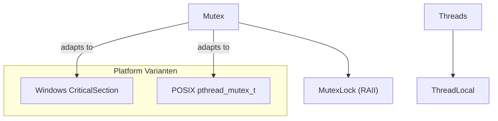

# Portability & Configuration APIs

GoogleTest ensures seamless testing across a wide range of platforms and environments through its portability and configuration APIs. These APIs detect environment features, abstract platform-specific differences, and provide utilities that enable robust, cross-platform test execution. This documentation details the macros, flags, synchronization primitives, regular expressions, file system utilities, and platform detection mechanisms that form the foundation of GoogleTest's cross-platform compatibility.

---

## 1. Environment Detection and Feature Macros

GoogleTest automatically detects and defines a comprehensive set of macros that describe the platform and capabilities available during compilation. These macros enable conditional compilation to tailor behavior to different systems.

### Key Environment Macros

| Macro Name                  | Description                                                                                 |
|-----------------------------|---------------------------------------------------------------------------------------------|
| `GTEST_OS_*`                | Identifies the operating system (e.g., `GTEST_OS_WINDOWS`, `GTEST_OS_LINUX`, `GTEST_OS_MAC`).|
| `GTEST_HAS_EXCEPTIONS`      | Indicates if C++ exception handling is enabled.                                            |
| `GTEST_HAS_RTTI`            | Indicates if Run-Time Type Information (RTTI) is enabled.                                 |
| `GTEST_HAS_PTHREAD`         | Indicates if POSIX threads are available.                                                  |
| `GTEST_HAS_POSIX_RE`        | Indicates if POSIX regular expressions are available.                                     |
| `GTEST_IS_THREADSAFE`       | True if GoogleTest supports thread-safe operations on the platform.                        |
| `GTEST_HAS_STREAM_REDIRECTION` | Defines if I/O stream redirection is supported (needed for capturing stdout/stderr).    |
| `GTEST_HAS_DEATH_TEST`      | Indicates if death tests are supported on the platform.                                   |

### Usage

Users and extended code can leverage these macros to conditionally compile code segments for specific platforms or capabilities, ensuring compatibility and optimal functionality.

---

## 2. Macros for Compiler, Feature, and API Flags

GoogleTest employs several macros to represent feature availability, compiler-specific attributes, and API exporting.

### Feature and Attribute Detection

- `GTEST_HAVE_ATTRIBUTE_(x)`: Tests if the compiler supports the attribute `x`.
- `GTEST_INTERNAL_HAVE_CPP_ATTRIBUTE(x)`: Checks for C++11 style attributes.
- Attributes for format string checking, no-inline, and no-tail-call are defined according to compiler support.

### API Export Macro

- `GTEST_API_`: Marks symbols for export or import depending on whether the library is being built or consumed, with cross-compiler support.

---

## 3. Flag Handling Macros

GoogleTest supports command-line flags and environment variables for customizing test behavior.

### Flag Macros

- `GTEST_FLAG_NAME_(name)`: Forms internal flag variable names.
- `GTEST_FLAG(name)`: Accesses the flag variable.

### Flag Definition and Declaration

- Flags are declared and defined differently depending on whether Abseil flags are available or not, abstracting flag implementation.

### Flag Utility Functions

- Functions for parsing booleans, integers, and strings from environment variables or flags.

---

## 4. Synchronization Primitives

Cross-platform thread safety is provided by abstractions over mutexes, thread-local storage, and thread handling.

### Mutex and Locking

- `Mutex`: Provides mutual exclusion primitives adapting to Windows or pthread environments.
- `MutexLock`: RAII-style lock guard that acquires and releases a `Mutex`.

### Thread-Local Storage

- `ThreadLocal<T>`: Template class to manage thread-local data with a consistent interface regardless of platform implementation details.
- Appropriate destruction of thread-local instances is ensured on thread exit to manage lifetime safely.

### Thread Creation Support (For Testing Internals)

- `ThreadWithParam<T>`: Helper for creating threads that execute user functions with parameters, primarily intended for testing GoogleTest internals.

---

## 5. Regular Expression Support

GoogleTest includes regex support abstracted over three implementations depending on platform and dependencies:

- RE2 (when built with Abseil)
- POSIX Regex (on supported UNIX-like systems)
- A simple custom regex implementation where others are unavailable

### RE Class

- Provides `FullMatch()` and `PartialMatch()` methods to test string matching.
- Handles initialization and validation internally to ensure robust regex compilation.

---

## 6. File System and I/O Utilities

GoogleTest provides abstractions for frequently used POSIX-style file operations tailored for cross-platform compatibility.

### Key Utilities

- `FileNo(FILE*)`: Retrieves the underlying file descriptor.
- `Stat(const char*, StatStruct*)`: File system status retrieval.
- `RmDir(const char*)`: Remove a directory.
- `IsDir(const StatStruct&)`: Checks if a file system object is a directory.
- `FOpen(const char*, const char*)`: Cross-platform file opening.
- `FReopen`, `FDOpen`, `FClose`, `Read`, `Write`, `Close`: Platform-adapted wrappers for corresponding operations.

### Capturing stdout and stderr

- `CaptureStdout()` and `CaptureStderr()`: Begin capturing output.
- `GetCapturedStdout()` and `GetCapturedStderr()`: Retrieve captured output and stop capturing.

---

## 7. Utility Functions

### String Manipulation

- Functions like `IsAlpha()`, `IsDigit()`, and `ToLower()` are provided with safe casting to handle various platforms and locales.

### File Location Formatting

- `FormatFileLocation(const char*, int)`: Formats file paths and line numbers akin to compiler error messages.
- `FormatCompilerIndependentFileLocation(const char*, int)`: Formats file location for compiler-independent outputs like XML reports.

---

## 8. Thread Count Detection

GoogleTest implements platform-specific methods to count active threads in the current process, where feasible (primarily UNIX and Windows flavors). When thread counting is not supported, it gracefully returns zero.

---

## 9. Error Handling and Logging

GoogleTest provides internal logging macros:

- `GTEST_LOG_(severity)`: Logs at severity levels (`INFO`, `WARNING`, `ERROR`, `FATAL`).
- `GTEST_CHECK_(condition)`: Asserts conditions with fatal failure logging.

---

## 10. Build and Compiler Configuration Points

While not directly part of the runtime API, GoogleTest includes CMake macros to configure compiler and linker flags appropriately across compilers and OSes. These ensure feature availability (such as threading and RTTI), warning levels, runtime linkage modes, and exception support.

---

## Practical Tips and Best Practices

- Use feature macros to conditionally compile code for unsupported platforms or configurations.
- Leverage `ThreadLocal<T>` to isolate tests that require thread-specific data.
- Use provided regex classes `RE` to handle text matching within tests safely.
- Capture stdout and stderr during tests to verify tested output reliably.
- Employ `GTEST_CHECK_` macros for consistency in internal assertions and failure messaging.

---

## Common Pitfalls

- Avoid directly using macros or internal utilities that end with underscores as they are subject to change.
- On some platforms, thread count detection may be unreliable or unavailable.
- Misconfiguration of compiler flags related to threading or exceptions can lead to compile failures.
- Re-entrant capture of stdout or stderr will cause fatal errors; capture streams one at a time.

---

## Example: Using `ThreadLocal` for Thread-Specific Data

```cpp
#include <gtest/internal/gtest-port.h>

// Create a ThreadLocal object with default integer 42
testing::internal::ThreadLocal<int> thread_local_int(42);

void SomeThreadFunc() {
  // Each thread will have its own copy
  int current_value = thread_local_int.get();
  // Modify thread-local value
  thread_local_int.set(current_value + 1);
}
```

## Example: Using `RE` for Regex Matching

```cpp
#include <gtest/internal/gtest-port.h>

const testing::internal::RE regex("^a.*z$");

bool matches = testing::internal::RE::FullMatch("abcz", regex);  // true
```

---

## Diagram: Basic Synchronization Components



---

For detailed source and further implementation insight, refer to the source files:

<Source url="https://github.com/google/googletest" branch="main" paths={[{"path": "googletest/include/gtest/internal/gtest-port.h", "range": "1-600"},{"path": "googletest/src/gtest-port.cc", "range": "1-600"}]} />

---