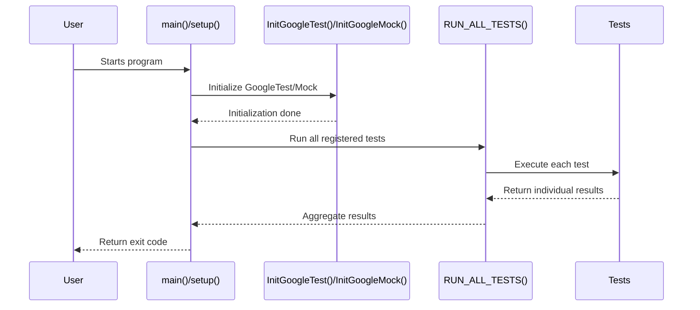

# Test Runner Integration & Entry Points

This page explains how to integrate GoogleTest and GoogleMock into your custom test runners. It focuses on the recommended entry points, platform-specific hooks, and how to leverage the provided main functions. Whether you want to write your own `main()` or link against pre-built runners, this guide will ensure your tests execute cleanly and correctly.

---

## Overview

GoogleTest and GoogleMock are designed to integrate seamlessly with your C++ test framework. By default, most users link against the provided `gtest_main` or `gmock_main` libraries, which supply a pre-defined `main()` function that handles initialization and execution. However, some use cases demand custom test runners or entry points, particularly on embedded or specialized platforms.

This documentation covers:

- How to use supplied entry points
- Writing custom `main()` functions
- Platform-specific entry point patterns for embedded systems
- Key initialization and execution steps that must be included


## Using Provided Main Libraries

For most projects, the easiest integration point is to link with one of these libraries:

| Library       | Purpose                                          |
|---------------|--------------------------------------------------|
| `gtest_main`  | Supplies a `main()` that runs all GoogleTest tests |
| `gmock_main`  | Supplies a `main()` that initializes GoogleMock and GoogleTest and runs all tests |

Linking with these libraries means you do not have to write or maintain your own `main()` function. They perform proper initialization and run `RUN_ALL_TESTS()` internally.

### How to Link with `gmock_main` (or `gtest_main`)

- Ensure your build system links against `gmock_main` (or `gtest_main` if not using mocks).
- Include your test source files as usual.
- No need to define `main()` yourself.

### Example CMake snippet:

```cmake
add_executable(my_tests my_tests.cc)
target_link_libraries(my_tests gmock_main)
```

### Behavior

- On execution, the `main()` function prints a startup message.
- Calls `testing::InitGoogleMock()` (which also initializes GoogleTest).
- Executes `RUN_ALL_TESTS()`, running all registered tests.
- Returns the overall test result as the process exit code.


## Writing a Custom `main()` Function

In some scenarios, such as when hooking into a larger test framework, customizing test startup is necessary. Your `main()` function must:

1. Call `testing::InitGoogleTest()` or `testing::InitGoogleMock()` with command line args.
2. Invoke `RUN_ALL_TESTS()` and return its result.

### Minimal Custom `main()` Example

```cpp
#include <gtest/gtest.h>
int main(int argc, char** argv) {
  testing::InitGoogleTest(&argc, argv);  // Initialize GoogleTest
  return RUN_ALL_TESTS();                // Run and return test results
}
```

### Customizing Initialization

You can parse or manipulate command-line arguments before or after initialization, but remember:

- Always call `InitGoogleTest()` or `InitGoogleMock()` before running tests.
- These functions parse and remove flags relevant to GoogleTest/Mock.
- Ensure you do not call `RUN_ALL_TESTS()` more than once.


## Platform-Specific Entry Points

GoogleTest and GoogleMock support some embedded and specialized platforms that use non-standard entry schemes:

| Platform           | Entry Point Functions      | Notes                                               |
|--------------------|----------------------------|-----------------------------------------------------|
| Arduino (ESP8266, ESP32) | `setup()`, `loop()`         | `setup()` initializes testing; `loop()` runs tests repeatedly. |
| QURT (Qualcomm)    | `main()` (without argc/argv) | `main()` calls `InitGoogleTest()` and runs tests.     |

### Example for Arduino platforms:

```cpp
void setup() {
  testing::InitGoogleMock();  // Also initializes GoogleTest
}

void loop() {
  RUN_ALL_TESTS();
}
```

### Notes:

- On ESP8266 and ESP32, Google Mock provides a built-in `main()` style integration via `setup()` and `loop()`.
- On QURT, `main()` is defined without arguments and runs all tests.


## Details from `gmock_main.cc`

The file `gmock_main.cc` defines the default `main()` for most platforms:

```cpp
int main(int argc, char** argv) {
  std::cout << "Running main() from gmock_main.cc\n";
  testing::InitGoogleMock(&argc, argv);
  return RUN_ALL_TESTS();
}
```

It ensures GoogleMock is initialized (which includes GoogleTest). This eliminates the need to call `InitGoogleTest()` separately when using mocks.


## Layered Initialization

Since GoogleMock depends on GoogleTest, the `InitGoogleMock()` function internally calls `InitGoogleTest()`. This means:

- You can call only `InitGoogleMock()` for all initialization if you use mocks.
- You should call `InitGoogleTest()` only if you do NOT use GoogleMock.


## Summary of Integration

Whether you link with `gmock_main` or write your own `main()`, remember:

- Always initialize testing frameworks before executing tests.
- Always run `RUN_ALL_TESTS()` once.
- Respect platform-specific entry points when targeting embedded systems.


## Troubleshooting Tips

- **Linker errors about `main()`:** Likely you linked against `gmock` instead of `gmock_main`. Switch to `gmock_main` or provide your own `main()`.
- **Tests not running:** Ensure `InitGoogleTest()`/`InitGoogleMock()` is called before `RUN_ALL_TESTS()`.
- **Multiple calls to `RUN_ALL_TESTS()`:** This is unsupported and may cause failures, particularly with death tests.
- **Embedded platform quirks:** Verify that your entry points match platform expectations.


## Practical Best Practices

- Prefer linking `gmock_main` or `gtest_main` to avoid writing custom entry points.
- Use `InitGoogleMock()` if you use mocks to ensure full feature initialization.
- For advanced setup, customize `main()` but strictly follow the initialization and execution sequence.
- On Arduino-like platforms, use the provided `setup()` and `loop()` conventions.


---

## Mermaid Sequence Diagram: Typical Test Runner Flow




---

### Related Documentation

- [Writing Your First Test Case](getting-started/first-test/writing-basic-test.md): How to write and run unit tests.
- [Mocking Interfaces with GoogleMock](guides/mocking-and-mocking-patterns/mocking-basics.md): Introduction to mocks.
- [Test Case Structure & Registration](api-reference/test-and-assertion-api/test-case-api.md): How tests are structured and registered.

---

### Summary

Integrating GoogleTest and GoogleMock into your test harness revolves around correct initialization and entry point usage. Choose between linking pre-built main libraries (`gmock_main`/`gtest_main`) or writing a custom `main()` that initializes the frameworks and runs `RUN_ALL_TESTS()`. On embedded platforms, follow specialized entry points like `setup()`/`loop()`.

This page details the essential user flows, platform considerations, and best practices for a smooth integration experience.