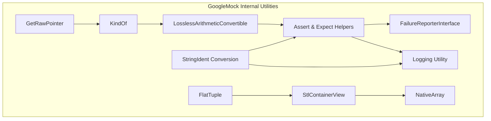

# Internal Utilities and Type Traits

Provides insight into advanced utilities and type traits used internally by GoogleMock. Recommended for expert users extending framework behavior or implementing deep integrations.

---

## Overview

This section offers a deep dive into the internal utilities and type traits that power GoogleMock's implementation. While these components are not part of the public API, understanding them benefits expert developers seeking to extend or deeply integrate with GoogleMock.

These utilities encompass advanced type trait mechanisms, helper classes, internal assertion and logging frameworks, and container views. They enable GoogleMock to provide powerful, type-safe matchers, actions, and mock behaviors.

**Important:** These utilities are subject to change without notice and should not be used directly in user code unless you are extending the framework with intimate knowledge of its internals.

---

## Key Internal Utilities

### 1. Type Classification via `KindOf` and `TypeKind`

GoogleMock internally classifies types into kinds—boolean, integral (excluding bool), floating-point, or other types—to manage safe matcher casting and implicit conversions.

- `KindOf<T>` is a template struct associating a type `T` with its `TypeKind` enum value.
- Core `TypeKind` values: 
  - `kBool`
  - `kInteger`
  - `kFloatingPoint`
  - `kOther`

This classification allows GoogleMock to reason about type conversions and ensure safe, lossless casting, especially relevant for numeric matchers and implicit matcher conversions.

### 2. Lossless Arithmetic Conversion Checks

Templates such as `LosslessArithmeticConvertibleImpl` verify at compile-time whether converting one arithmetic type to another loses information. This validation prevents unsafe matcher casts that could cause unexpected test behaviors.

### 3. Failure Reporting Interface

GoogleMock uses the `FailureReporterInterface` with two failure severities: `kFatal` and `kNonfatal`. The default implementation reports failures as Google Test failures, integrating mock assertions smoothly into the test lifecycle.

### 4. String and Identifier Utilities

- `JoinAsKeyValueTuple`: Joins vectors of strings as key-value pairs formatted as tuple fields, useful for generating readable descriptions and error messages.

- `ConvertIdentifierNameToWords`: Converts C++ identifier names into a lower-case, space-separated word list. For example, `FooBar123` becomes `foo bar 123`. This is used to generate human-friendly matcher descriptions.

### 5. Pointer and Smart Pointer Helpers

GoogleMock defines `GetRawPointer` overloads to extract raw pointers from:

- Smart pointers (calling `.get()`).
- `std::reference_wrapper`.
- Raw pointers (returns as-is).

These helpers unify pointer handling across varied pointer wrappers, facilitating polymorphic matchers for pointers.

### 6. Container Views with `StlContainerView`

GoogleMock adapts different container-like types, including native arrays (fixed-size C arrays) and pointer-size tuples, into STL-compatible views:

- Generic `StlContainerView` simply passes through STL containers.
- Specialized templates wrap native arrays to provide container-like interfaces.

This abstraction allows matchers and utilities to operate uniformly over a wide range of container types.

### 7. `FlatTuple`: Lightweight Tuple Implementation

To avoid excessive template depth and improve compilation speed, GoogleMock uses `FlatTuple` which mimics `std::tuple` but with a fixed-depth structure and efficient element access. This is employed internally to manage matchers and argument tuples.

### 8. Native Array Adaptation via `NativeArray`

To support native arrays (`T[N]`) within the matcher framework, `NativeArray` provides a container-like interface that either references or copies the source array. This allows matchers to treat C arrays similar to STL containers.

### 9. Assertion and Logging Utilities

- Internal assertion helpers (`Assert`, `Expect`) enable GoogleMock to report fatal or nonfatal failures integrated with Google Test.
- Logging utilities respect verbosity flags to control informational messages.

### 10. Compile-Time Utilities

GoogleMock uses various advanced template metaprogramming utilities:

- `ElemFromList`: Selects the N-th type from a template parameter pack.
- `Ignore`: A template that can absorb arbitrary parameters; useful in variadic processors.

These help manage the complex inheritance and parameter manipulation required for matchers and actions.

### 11. Macro Definitions for Portability

Macros manage warning suppression, type traits, compiler feature checks, and platform-specific peculiarities to ensure GoogleMock compiles and operates consistently across environments.

---

## Using Internal Utilities for Extension

Expert users building custom matchers or actions can leverage these internal utilities to:

- Safely cast and convert between matcher types using `SafeMatcherCast` and `MatcherCast` (see complementing API in matchers reference).
- Create rich matcher descriptions by converting identifiers to human-readable forms.
- Manage pointer polymorphism uniformly when writing matchers involving pointers and smart pointers.
- Operate on containers without worrying about array vs STL container distinctions.

By understanding these internals, you ensure your extensions preserve type-safety, maintain performance, and integrate seamlessly with GoogleMock's reporting and matching system.

---

## Practical Tips and Best Practices

- **Do not use these internals directly unless necessary.** They are unstable and subject to change.
- When defining polymorphic or monomorphic matchers, use the public matcher APIs and `MATCHER` macros where possible; these utilities support such macros behind the scenes.
- Use `SafeMatcherCast<T>` to ensure conversions between matcher types are lossless and safe, especially with numeric types.
- Use `GetRawPointer` to extract raw pointers cleanly when writing pointer matchers or actions handling smart pointers.
- For container matchers, rely on the container view abstractions rather than raw arrays or pointers.
- Utilize the descriptive string utilities to produce meaningful error messages.

---

## Troubleshooting

- If you experience compilation errors when extending GoogleMock with templates, verify you respect the type safety rules enforced by `SafeMatcherCast` and internal type traits.
- If matcher failure messages are confusing, consider using `ConvertIdentifierNameToWords` to improve readability.
- For pointer matchers acting unexpectedly, ensure raw pointer extraction via `GetRawPointer` is correctly applied.
- When overloading matchers or actions, take note of the internal template utilities like `ElemFromList` and `FlatTuple` to manage parameter packs sensibly.

---

## See Also

- [Matchers Reference](../mocking-and-behavior/matchers-reference.md) — for user-facing matcher functions built on these internals.
- [gMock Cookbook](../gmock_cook_book.md) — practical recipes for building mocks and matchers.
- [Mock Objects and Basic Mocking](../core-concepts/mock-objects-basics.md) — foundation of mocks.
- [Platform Porting API](../platform-extensibility/platform-porting-api.md) — for cross-platform abstraction utilities.

---

<Callout>
**Note:** This page corresponds to internal implementation files such as `gmock-internal-utils.h` and `gmock-internal-utils.cc`. All utilities described here are subject to change and not part of the public API.
</Callout>

---

## Additional Internal Components

For curious users, here are some additional internal features provided:

- **Base64 Unescaping Utility:** Used internally for matchers dealing with base64 encoded strings.
- **Warning Control Macros:** Manage compiler-specific warnings about unused parameters or unsafe conversions.
- **Universal Type Printers:** Integration for printing arbitrary types via GoogleTest's printer framework.

---

## Diagram: Internal Components Interaction

The diagram illustrates the relationships between key internal utilities.

---

## Summary

This page exposes the internal utilities and type traits foundational for GoogleMock’s advanced matcher and mocking capabilities. It explains type classification, pointer handling, container adaptation, and error reporting internals.

Understanding these elements equips advanced users to safely and effectively build custom matchers, actions, and framework extensions adhering to GoogleMock’s robust design.

---
