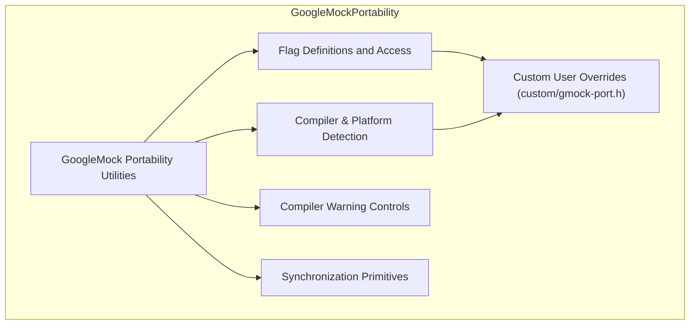

# Portability Utilities

Documentation for internal utilities supporting cross-platform compatibility, including compiler checks, flag abstractions, and low-level helpers. Intended for extending or embedding the framework.

---

## Overview

The Portability Utilities comprise a set of foundational internal tools within GoogleMock designed to ensure seamless operation across diverse platforms and compilers. These utilities encapsulate compiler feature detection, flag definition and management, platform-specific abstractions, and essential low-level helpers. While primarily targeted for internal use, they provide critical support for extending or embedding GoogleMock in various environments.

By abstracting away platform differences and compiler quirks, these utilities allow GoogleMock and dependent components to maintain consistent behavior without burdening user code with platform-specific details.

---

## Key Components and Features

### 1. Cross-Platform Compiler and Platform Detection

- **Operating System Identification:** Utilizing macros from `gtest-port-arch.h`, the utilities detect and define platform-specific macros such as `GTEST_OS_WINDOWS`, `GTEST_OS_LINUX`, `GTEST_OS_MAC`, among others. This precise detection informs conditional compilation and feature availability.

- **Compiler Version Checks:** For example, Microsoft Visual C++ compilers are checked to ensure minimum supported versions (VS2015 or later).

- **Feature Support Flags:** Macros like `GTEST_HAS_EXCEPTIONS`, `GTEST_HAS_RTTI`, and `GTEST_HAS_PTHREAD` indicate compiler and platform capabilities, enabling controlled usage of exceptions, RunTime Type Information, and threading.

### 2. Flag Definition and Management

- **Flag Macros:** These utilities provide macros such as `GMOCK_DEFINE_bool_`, `GMOCK_DEFINE_int32_`, and `GMOCK_DEFINE_string_` to define command-line flags with default values and documentation.

- **Flag Access and Mutation:** Using `GMOCK_FLAG_GET(flag_name)` and `GMOCK_FLAG_SET(flag_name, value)`, user and internal code can access and update flag values abstractly, decoupled from the underlying flag implementation.

- **Compatibility with Abseil Flags:** The utilities support integration with Abseil's flag system when enabled, falling back to traditional global variables otherwise.

### 3. Compiler Warning Controls

- Macros for pushing and popping compiler-specific warning state, such as `GMOCK_INTERNAL_WARNING_PUSH()` and `GMOCK_INTERNAL_WARNING_POP()`, ensure suppression of unwanted compiler warnings in controlled scopes.

### 4. Synchronization Primitives and Thread Safety

- Using GoogleTest's underlying abstractions, these utilities rely on mutexes, thread-local storage, and notification primitives to support thread-safe operation in GoogleMock.

- Thread-safety macros and implementations differ by platform, leveraging pthreads, Windows critical sections, or dummy implementations where threading is unsupported.

### 5. Low-Level Utility Helpers

- Safe down-casting, type traits for categorizing primitive types (`kBool`, `kInteger`, `kFloatingPoint`, `kOther`), and helper functions such as `Assert()`, `Expect()`, and log visibility checks help maintain robust internal operation.

- Utilities for handling smart pointers and raw pointers uniformly (`GetRawPointer()`).

### 6. Customization Injection Points

- Through the header `gmock-port.h` and the `custom/` directory, users can override default portability behaviors by defining macros like `GMOCK_DECLARE_bool_` and related flag declarations for tighter integration within particular build and runtime environments.

---

## Using Portability Utilities

While primarily internal and subject to change without notice, understanding these utilities aids advanced users in extending GoogleMock across challenging platforms or embedding it in custom setups.

### Initializing GoogleMock with Flags

Use `InitGoogleMock(int* argc, char** argv)` (or its wide-char variant) to initialize the framework. This function parses and removes GoogleMock-specific flags (e.g., `--gmock_verbose=info`) from the command line, using the underlying portability utilities to safely read and set flag values.

Example:

```cpp
int argc = ...;
char** argv = ...;
::testing::InitGoogleMock(&argc, argv);
```

This enables your test program to respond properly to portability-controlled flags.

### Defining and Accessing Flags

Flags controlling GoogleMock behavior can be declared or defined using provided macros:

```cpp
// Declare a boolean flag
GMOCK_DECLARE_bool_(catch_leaked_mocks);

// Define a bool flag with default value and documentation
GMOCK_DEFINE_bool_(catch_leaked_mocks, true, "Report leaked mock objects");

// Access flag values
bool catch_leaks = GMOCK_FLAG_GET(catch_leaked_mocks);

// Set flag values programmatically
GMOCK_FLAG_SET(catch_leaked_mocks, false);
```

These macros ensure seamless handling regardless of the underlying flag implementation.

### Compiler Warnings Management

To prevent noisy or unwanted compiler warnings in custom extensions or internal code, use:

```cpp
GMOCK_INTERNAL_WARNING_PUSH();
// code with potential warnings
GMOCK_INTERNAL_WARNING_POP();
```

This pattern maintains clean builds across MSVC, Clang, and GCC.

### Platform-Specific Constructs

Common platform-specific APIs and behaviors are abstracted behind conditional macros, enabling safe access to file descriptors, environment variables, and OS features without cluttering user code with #ifdefs.

For example, use GoogleTest's internal `posix` namespace wrappers for file operations and terminal checks.

---

## Best Practices and Pitfalls

- **Do not use these utilities outside GoogleMock or GoogleTest internal code unless necessary.** They are subject to change and can break compatibility.

- **Leverage provided flag macros rather than defining your own global variables.** This ensures compatibility with the framework's flag handling and integration with Abseil flags if enabled.

- **Ensure that your compiler and platform meet the minimum requirements.** The portability utilities enforce checks such as requiring MSVC 2015 or newer.

- **Avoid overriding platform detection macros unless you are certain.** Incorrect overrides can cause subtle and hard-to-debug failures.

- **Use provided abstractions for threading and synchronization to maintain portability.** Avoid native APIs directly unless necessary.

- **When extending the framework, consider customizing flags via the `custom/gmock-port.h` injection point.** This keeps your changes isolated and maintainable.

---

## Troubleshooting

### Compilation Errors Related to Portability Utilities

- Verify your compiler version and platform match the requirements enforced by portability macros.
- If you see issues with _MSC_VER, make sure you're using Visual Studio 2015 or later.
- Check for macro redefinition conflicts if mixing GoogleMock with other libraries.

### Flag Initialization Problems

- Confirm that `InitGoogleMock` is called before referencing any GoogleMock flags.
- Check your build environment for support of Abseil flags if you're seeing unexpected behavior in flag parsing.

### Platform-Specific Behavior

- On embedded or less common systems, some portability features may not be available (e.g., no environment variables, no threading).
- Use the `custom/` directory to provide platform-specific overrides.

---

## References and Further Reading

- **Flag Initialization and Usage:** See [Initialization and Flag Reference](/api-reference/platform-flags/flags-and-init) for detailed API on flag handling.

- **Platform Detection and Portability Implementation:** See [gtest-port-arch.h](https://github.com/google/googletest/blob/main/googletest/include/gtest/internal/gtest-port-arch.h) for detailed OS macros.

- **Flag Macros and Abstractions:** Investigate [gmock-port.h](https://github.com/google/googletest/blob/main/googlemock/include/gmock/internal/gmock-port.h) and related `custom/gmock-port.h` for how flags are defined.

- **Compiler Warning Management:** Internal macros manage compiler warnings for Visual C++ and Clang.

- **Threading and Synchronization:** Look into [gtest-port.h](https://github.com/google/googletest/blob/main/googletest/include/gtest/internal/gtest-port.h) for detailed threading primitives used.

---

## Diagram: Portability Utilities Core Relationships



---

## Source Code Links

- [Portability Utilities Header - gmock-port.h](https://github.com/google/googletest/blob/main/googlemock/include/gmock/internal/gmock-port.h)
- [Flag Declarations Example in gmock.cc](https://github.com/google/googletest/blob/main/googlemock/src/gmock.cc)
- [Compiler/Platform Detection - gtest-port-arch.h](https://github.com/google/googletest/blob/main/googletest/include/gtest/internal/gtest-port-arch.h)
- [Threading and Synchronization - gtest-port.h](https://github.com/google/googletest/blob/main/googletest/include/gtest/internal/gtest-port.h)

---

### Summary

This document has focused exclusively on the Portability Utilities for GoogleMock, describing how they enable cross-platform compatibility, manage compiler and platform variations, and provide abstractions for flags, synchronization, and compiler warnings. It emphasizes the global role of these utilities in fostering a consistent development and runtime environment across diverse systems.

---