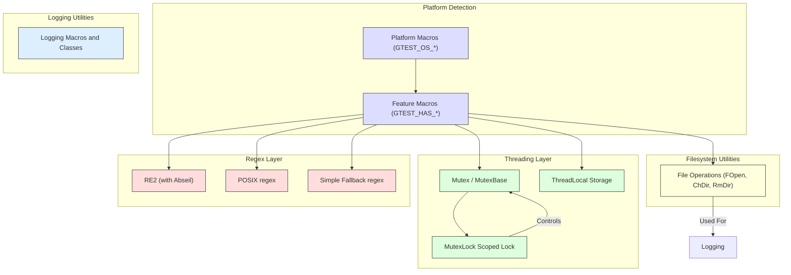

# Portability and Platform Support

GoogleTest and GoogleMock are designed to operate seamlessly across a wide range of platforms and compilers, ensuring robust C++ testing capabilities regardless of environment variations. This page documents the core APIs, utilities, and internal mechanisms that facilitate this portability, focusing on platform detection, threading, synchronization, compiler support, and environment-specific configurations.

---

## Overview

GoogleTest’s portability layer provides essential abstractions and helpers that enable the framework to function consistently across operating systems like Linux, Windows, macOS, BSDs, Android, and more. It detects platform and environment specifics, manages threading and synchronization primitives appropriately, adapts to compiler capabilities, and provides utilities for filesystem interactions among others.

This effort ensures that developers can write tests that run without modification or manual adjustment on supported platforms, maximizing reuse and reliability.

---

## Key Components

### 1. Platform and Compiler Detection

GoogleTest automatically detects the compilation environment using macros defined in `gtest-port-arch.h` and `gtest-port.h`. This module sets flags identifying the OS (e.g., Windows, Linux, macOS, Android), compiler features, exception support, threading availability, and more. 

- Platform defines include `GTEST_OS_WINDOWS`, `GTEST_OS_LINUX`, `GTEST_OS_MAC`, along with specialized variants like `GTEST_OS_WINDOWS_MINGW`.
- Feature macros such as `GTEST_HAS_EXCEPTIONS`, `GTEST_HAS_PTHREAD`, and `GTEST_HAS_RTTI` indicate support for exceptions, pthreads, and runtime type information.
- Where automatic detection is imperfect, users can override with compile-time definitions.


### 2. Threading and Synchronization Primitives

GoogleTest adapts threading support based on platform capabilities:

- On POSIX platforms with pthreads, synchronization uses `pthread_mutex_t`, `pthread_key_t`, and related pthread APIs.
- On Windows Desktop, it wraps Windows kernel synchronization objects avoiding dependencies on heavy headers like `windows.h`.
- On platforms with no threading or synchronization support, dummy no-op implementations prevent compilation errors but warn that thread safety is not guaranteed.

#### Thread-Local Storage

The framework provides a thread-local storage abstraction:

```cpp
ThreadLocal<T> my_var(default_value);
...
my_var.set(value);
const T& val = my_var.get();
```

- Uses platform-native TLS (e.g., `pthread_setspecific` or Windows TLS APIs) where available.
- Falls back to simple wrappers on unsupported platforms.

#### Mutex Locking

Mutex and scoped lock semantics are provided for automatic lock management:

```cpp
Mutex mu;
{
  MutexLock lock(&mu);
  // critical section
}
```

- Static mutex initialization macros ensure thread-safe lazy initialization where supported.


### 3. Filesystem Utilities

Abstracted filesystem functions support portability for tests involving file access:

- Functions like `FOpen()`, `ChDir()`, `RmDir()` use platform-native system calls while hiding naming and behavior differences.
- File descriptors use wrappers like `FileNo()` to abstract underlying differences.


### 4. Regular Expression Support

GoogleTest dynamically picks the best available regex implementation:

- On platforms with Abseil & RE2, uses RE2 for regex processing.
- Otherwise, uses POSIX Extended Regular Expressions on Unix-like systems.
- Fallback is a simplified internal regex engine if neither is available.


### 5. Logging and Assertions

Platform-safe logging macros handle message streaming and severity control in an OS-agnostic manner.


### 6. Environment Variables and Command Line Args

Utilities for accessing environment variables (`GetEnv()`) and command line arguments (`GetArgvs()`) abstract platform differences to ease setup and configuration in tests.


---

## Usage and Best Practices

### Ensuring Thread Safety

- GoogleTest is thread-safe on platforms with pthreads or equivalent synchronization primitives.
- If you work on an unsupported platform, explicitly disable threading with `-DGTEST_HAS_PTHREAD=0` and use the framework in a single-threaded manner.
- Don't access GoogleTest assertions concurrently across threads unless thread safety is guaranteed.

### Static vs Dynamic Libraries

- For shared-library builds, define `-DGTEST_CREATE_SHARED_LIBRARY=1` when compiling GoogleTest.
- User tests linking against shared GoogleTest must define `-DGTEST_LINKED_AS_SHARED_LIBRARY=1`.
- Platforms without consistent visibility attributes may require additional flags.

### Platform Override Macros

If the platform detection fails or your environment requires special handling, set macros such as `GTEST_OS_WINDOWS=1` or `GTEST_HAS_PTHREAD=0` at compile time to guide GoogleTest’s behavior.


---

## Common Pitfalls and Troubleshooting

### Runtime Library Mismatch (Windows)

Linker errors such as mismatched runtime library flags occur if GoogleTest and your project use different CRT linkage modes (dynamic vs static). Use the `gtest_force_shared_crt` CMake option or matching compiler flags to fix this.

### Missing Pthread Support

If build or runtime errors occur related to pthreads, verify that your environment supports pthreads or disable it via `-DGTEST_HAS_PTHREAD=0`.

### File System Support

On embedded or constrained platforms with no filesystem, features like death tests and output capturing that require file IO will be unavailable.

---

## Code Examples

```cpp
#include <gtest/gtest.h>

// Example showing thread-local usage

testing::internal::ThreadLocal<int> thread_var(10);  // default value 10

void Foo() {
  int val = thread_var.get();  // get thread-specific value
  thread_var.set(val + 1);     // update for this thread
}

// Mutex usage

testing::internal::Mutex mu;

void CriticalSection() {
  testing::internal::MutexLock lock(&mu);
  // Protected code
}
```


---

## Platform and Feature Detection Summary

| Macro                      | Description                                       | Default       |
| -------------------------- | ------------------------------------------------ | ------------- |
| `GTEST_OS_WINDOWS`         | Compiled on Windows platform                      | 1 or 0 auto   |
| `GTEST_OS_LINUX`           | Compiled on Linux platform                         | 1 or 0 auto   |
| `GTEST_HAS_EXCEPTIONS`     | Exceptions enabled in compiler                     | 1 or 0 auto   |
| `GTEST_HAS_PTHREAD`        | Pthreads library available                         | 1 or 0 auto   |
| `GTEST_HAS_RTTI`           | Runtime Type Information enabled                   | 1 or 0 auto   |
| `GTEST_HAS_FILE_SYSTEM`    | File system available                              | 1 or 0 auto   |
| `GTEST_HAS_STREAM_REDIRECTION` | Stream capturing supported                     | 1 or 0 auto   |
| `GTEST_IS_THREADSAFE`      | GoogleTest thread-safe build                        | 1 or 0 auto   |

Refer to the header `gtest-port.h` for full details on all platform macros.

---

## Integration with GoogleMock

GoogleMock builds upon the portability layer of GoogleTest and supports its platform abstractions and threading utilities, ensuring that mocks behave correctly in all supported environments.

For GoogleMock-specific customizations, see the custom header `gmock-port.h` and the customization points described in GoogleMock’s internal documentation.


---

## Additional Configuration and Customization

- Users can override default platform detection and threading with macros defined at build time.
- Custom synchronization primitives and logging implementations can be injected by defining specific macros before including `gtest/internal/gtest-port.h`.
- For more advanced control, see the customization README under `googletest/include/gtest/internal/custom/README.md`.


---

## Footnotes

- This portability layer is core to GoogleTest’s cross-platform promise. Incompatibilities or missing features should be reported.
- Compilation fails if the environment does not support at least C++17 (`GTEST_INTERNAL_CPLUSPLUS_LANG` check).


---

## References and Links

- [gtest-port.h source](https://github.com/google/googletest/blob/main/googletest/include/gtest/internal/gtest-port.h)
- [Platform detection header (gtest-port-arch.h)](https://github.com/google/googletest/blob/main/googletest/include/gtest/internal/gtest-port-arch.h)
- [GoogleTest Primer](../primer.md)
- [System Requirements](../../getting-started/prerequisites-installation/system-requirements.mdx)
- [Troubleshooting Setup Issues](../../getting-started/troubleshooting-faq/troubleshooting-setup-issues.mdx)
- [Customization Points](../internal/custom/README.md)


---

## Diagram: Core Portability Layer Components and Relationships

