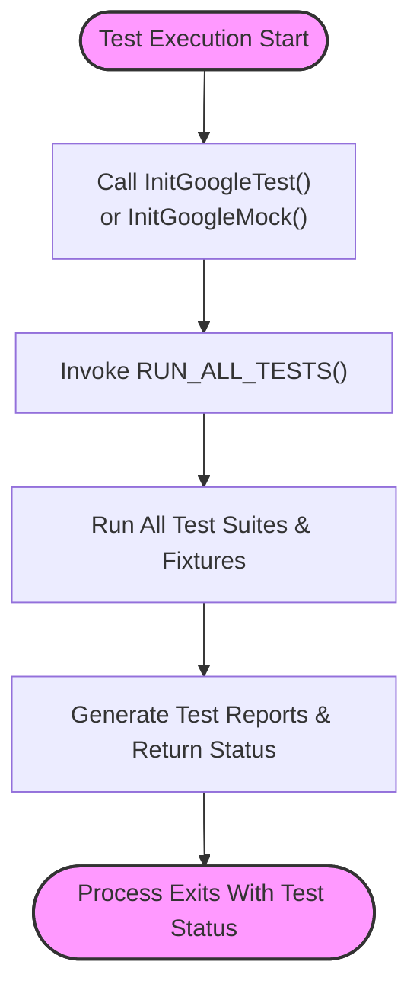

# Test Runtime & Integration

This page provides comprehensive details on how to initialize and run tests using the GoogleTest framework and the GoogleMock (gMock) extension. It covers the essential entry points, available runtime libraries such as `gtest_main` and `gmock_main`, advanced runtime configuration options, and best practices for integrating test runners with build systems and Continuous Integration (CI) environments.

---

## Overview

GoogleTest and GoogleMock provide straightforward mechanisms for initializing test programs and running all registered tests with minimal user code. This page guides you through these mechanisms, enabling you to effortlessly integrate reliable, maintainable test execution into your development and CI pipelines.

Key takeaways:

- Use default `main()` functions provided by `gtest_main` and `gmock_main` libraries to avoid writing boilerplate.
- Understand how to manually initialize GoogleTest or GoogleMock if you need custom test startup sequences.
- Learn how to properly invoke `RUN_ALL_TESTS()` to execute your test suites.
- Discover advanced runtime configuration flags for fine-tuning test behavior.
- Explore integrating test execution within automated build and CI workflows.

---

## Default Main Entry Points

GoogleTest and GoogleMock both provide pre-built main functions in the accompanying libraries `gtest_main` and `gmock_main`. Linking your tests with these libraries spares you from implementing the `main` function yourself, which simplifies test setup and ensures compliance with GoogleTest expectations.

### `gtest_main`

- Provides a normal C++ `main(int argc, char** argv)` entry point.
- Calls `testing::InitGoogleTest(&argc, argv)` to initialize the framework.
- Calls `RUN_ALL_TESTS()` to execute all tests, returning the final status.

### `gmock_main`

- Extends `gtest_main`’s functionality by initializing GoogleMock alongside GoogleTest.
- Provides a main function that calls `testing::InitGoogleMock(&argc, argv)`.
- Includes all GoogleMock mocking functionalities and initializes GoogleTest flags appropriately.
- Calls `RUN_ALL_TESTS()` to run the full suite.

### When to Use Default Main

> Most users **should link** with `gtest_main` or `gmock_main` unless a custom test startup sequence is needed.

This approach dramatically reduces the work required to bootstrap your test executable while providing full support for command-line argument parsing and flags.

---

## Writing a Custom `main()` Function

You may want to write your own `main()` function if you need custom setup or teardown logic that falls outside what test fixtures provide.

A typical minimal custom main looks like:

```cpp
#include <gtest/gtest.h>

int main(int argc, char **argv) {
  testing::InitGoogleTest(&argc, argv);
  return RUN_ALL_TESTS();
}
```

**Key points:**

- Always call `testing::InitGoogleTest` (or `testing::InitGoogleMock` if using gMock) before running tests to process command-line flags.
- Do not ignore the return value of `RUN_ALL_TESTS()`. Return it from your `main()` to allow build systems to detect test failures.
- Call `RUN_ALL_TESTS()` **only once** per process.

#### Example: Custom `main()` with Additional Setup

```cpp
#include <gtest/gtest.h>

void prepareCustomResources();
void cleanupCustomResources();

int main(int argc, char** argv) {
  testing::InitGoogleTest(&argc, argv);
  prepareCustomResources();
  int result = RUN_ALL_TESTS();
  cleanupCustomResources();
  return result;
}
```

This lets you perform arbitrary initialization or logging beyond what GoogleTest fixtures provide.

---

## Initialization Functions

GoogleTest exposes two primary initialization functions:

- `testing::InitGoogleTest(int* argc, char** argv)`
  - Parses flags specific to GoogleTest.

- `testing::InitGoogleMock(int* argc, char** argv)`
  - Initializes both GoogleMock and GoogleTest (no need to call both).

Use these functions to enable flag parsing and proper setup of testing internals.

---

## Running the Tests

### The `RUN_ALL_TESTS()` Call

- Executes all registered tests discovered by the framework.
- Returns `0` if all tests succeed; otherwise, returns a non-zero status.
- Handles proper lifecycle events for test suites and fixtures.
- Automatically respects filters and repeat parameters set via flags.

**Usage:**

```cpp
int main(int argc, char** argv) {
  testing::InitGoogleTest(&argc, argv);
  return RUN_ALL_TESTS();
}
```

### Test Execution Flow

1. Test framework initializes, processing any passed command-line flags.
2. All test fixtures are instantiated and run sequentially.
3. Assertions within tests determine pass/failure status.
4. Test listeners report results.
5. Final exit code reflects test success.

---

## Advanced Runtime Configuration

GoogleTest supports a variety of runtime flags that can be specified via command-line arguments at test startup. These options enable critical control of test execution behavior:

| Flag                         | Description                                       |
|------------------------------|-------------------------------------------------|
| `--gtest_filter`             | Run a subset of tests matching pattern.          |
| `--gtest_repeat=<n>`         | Repeat tests n times (0 = infinite).              |
| `--gtest_shuffle`            | Randomize test run order.                         |
| `--gtest_random_seed=<seed>` | Set random seed for shuffle.                      |
| `--gtest_break_on_failure`   | Break into debugger on test failure.             |
| `--gtest_output`             | Output format for test results (e.g., xml).      |

For a full list of flags and descriptions, refer to [GoogleTest Advanced Guide](../advanced.md#running-tests).

---

## Integrating Test Runners with Build & Continuous Integration

Automating test execution in build environments and CI pipelines is critical for rapid feedback and maintaining code quality. GoogleTest and GoogleMock are designed to integrate cleanly with the common CI workflows:

### Practical Integration Tips

- **Link with `gtest_main` or `gmock_main`** so your tests have a standard test entry point.
- Use **standard exit codes** of `RUN_ALL_TESTS()` for CI status reporting.
- Generate **JUnit-style XML reports** with `--gtest_output=xml:report.xml` flag for CI consumption.
- Use **test filtering** (`--gtest_filter`) to run subsets when useful in CI workflows.
- Utilize **repeat and shuffle** for test robustness.
- Integrate test runner invocation into build tools such as CMake or Bazel.

### Example CMake Integration Snippet

```cmake
add_executable(my_test_suite test_suite.cpp)
target_link_libraries(my_test_suite gtest_main)
add_test(NAME MyTests COMMAND my_test_suite)
```

You can configure your CI to run `ctest` or directly invoke the test executable.

### Continuous Integration Best Practices

- Keep tests **fast and isolated** to minimize CI delays.
- Monitor flaky tests with repeat runs and shuffling.
- Enable verbose logging during test failures for easy diagnosis.
- Combine GoogleTest native reports with CI provider test visualizers.

See the [Continuous Integration and Automation Guide](/guides/best-practices-integration/continuous-integration) for detailed workflows and examples.

---

## Platform and Special Cases

### Embedded and Arduino Support

For platforms like Arduino or embedded systems where the usual `main()` signature is unavailable, GoogleTest adapts by providing `setup()` and `loop()` functions:

```cpp
void setup() {
  testing::InitGoogleTest();
}

void loop() {
  RUN_ALL_TESTS();
}
```

### Windows Considerations

On Windows, wide character arguments are supported:

```cpp
int wmain(int argc, wchar_t** argv) {
  testing::InitGoogleTest(&argc, argv);
  return RUN_ALL_TESTS();
}
```

Ensure you link with the appropriate runtime libraries and use the Visual Studio dynamic/shared runtime flags as needed.

---

## Troubleshooting

### Common Pitfalls

- **Not calling `InitGoogleTest()` or `InitGoogleMock()`** before `RUN_ALL_TESTS()` leads to unrecognized flags and improper behavior.
- **Ignoring the return value of `RUN_ALL_TESTS()`** results in CI pipelines not detecting failed tests.
- Calling `RUN_ALL_TESTS()` multiple times can cause undefined behavior or test failures.
- Linking tests without `gtest_main` or `gmock_main` requires proper custom `main()` implementations.

### Debugging

Use `--gtest_break_on_failure` flag to halt test execution in a debugger when a failure is encountered.

Enable `--gtest_verbose=1` (if supported) for detailed runtime logging.

Refer to the [Troubleshooting Setup Issues Guide](/getting-started/troubleshooting-faq/troubleshooting-setup-issues) for platform-specific help.

---

## Summary

Using GoogleTest and GoogleMock runtime libraries enables seamless, standardized test execution with minimal boilerplate. Whether you choose the default main libraries or custom implementations, adherence to proper initialization and test execution flows guarantees reliable outcomes and smooth CI integration.

---

## Relevant Links

- [GoogleTest Primer](../primer.md) for getting started with tests.
- [Continuous Integration and Automation](../guides/best-practices-integration/continuous-integration.mdx) for CI workflows.
- [Troubleshooting Setup Issues](../getting-started/troubleshooting-faq/troubleshooting-setup-issues.mdx) for setup help.
- [Advanced GoogleTest Guide](../advanced.md#running-tests) for runtime flags and advanced usage.

---

## Diagram: Test Runtime Initialization Flow


