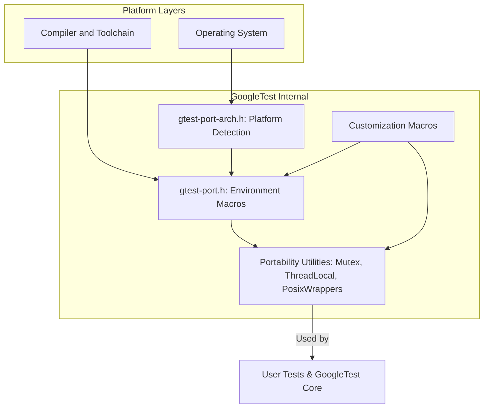

# Portability and Environment Utilities

This page documents the essential configuration macros, environment settings, and utility functions provided by GoogleTest and GoogleMock for adapting to multiple platforms and compilers. These portability and environment utilities enable seamless operation across diverse systems by abstracting platform peculiarities and providing hooks for customization.

---

## Overview

GoogleTest and GoogleMock are designed to be highly portable C++ testing frameworks. They achieve this by detecting platform features, compiler capabilities, and environment characteristics at compile-time and runtime. This page describes the main macros and utilities that govern these adaptations, ensuring consistent behavior regardless of underlying differences.

Key areas covered include:

- Platform and environment macros that reflect compiler capabilities, OS types, threading support, and exception handling.
- Synchronization primitives and threading abstractions appropriate to each platform.
- Environment variable access and utility functions.
- Customization hooks enabling users to override default implementations.

---

## Environment and Platform Macros

GoogleTest automatically defines a comprehensive set of macros that describe the compilation and runtime environment. These macros ensure your tests behave correctly in various situations without requiring manual configuration.

### Common Environment Macros

| Macro Name                      | Description
|--------------------------------|-------------------------------------------------------------------------------------|
| `GTEST_HAS_PTHREAD`             | Indicates if POSIX threads (`pthread`) are available (1 if yes, 0 otherwise).
| `GTEST_HAS_EXCEPTIONS`          | Reflects if compiler exceptions are enabled.
| `GTEST_HAS_RTTI`                | Denotes if Runtime Type Information (RTTI) is available.
| `GTEST_HAS_STD_WSTRING`         | Indicates availability of `std::wstring`.
| `GTEST_HAS_FILE_SYSTEM`         | Signals if a file system is accessible.
| `GTEST_HAS_SEH`                 | Indicates if Microsoft Structured Exception Handling is supported.
| `GTEST_HAS_CLONE`               | Shows if Linux `clone(2)` syscall is supported.
| `GTEST_HAS_STREAM_REDIRECTION` | If I/O stream redirection via `dup()` / `dup2()` is supported.


### Platform Identification Macros

GoogleTest sets macros based on OS type and platform:

- Examples include `GTEST_OS_WINDOWS`, `GTEST_OS_LINUX`, `GTEST_OS_MAC`, `GTEST_OS_CYGWIN`, and many more to differentiate platforms.

- Variants for Windows platforms like `GTEST_OS_WINDOWS_DESKTOP`, `GTEST_OS_WINDOWS_MINGW`, `GTEST_OS_WINDOWS_PHONE` help adapt to specific Windows environments.

---

## Synchronization Primitives

To provide thread-safe operation where available, GoogleTest includes synchronization abstractions that are conditionally compiled based on environment capabilities.

### Mutex and Locks

- On platforms supporting pthreads or native threading (such as Windows), `Mutex` and `MutexLock` classes are implemented with real mutexes.

- On non-thread-safe platforms, dummy implementations exist that no-op locking calls to allow compilation but disable multithreaded safety.

- Static mutexes are declared and defined via macros `GTEST_DECLARE_STATIC_MUTEX_` and `GTEST_DEFINE_STATIC_MUTEX_` enabling usage of global synchronization objects.

### Thread-Local Storage

- GoogleTest provides an abstraction for thread-local storage in the `ThreadLocal<T>` template. This is implemented using platform-specific mechanisms like Windows API or pthread keys.

- Usage example:

  ```cpp
  ThreadLocal<int> tls(100);  // Default value for each thread
  tls.set(200);               // Changes value for current thread only
  int val = tls.get();        // Gets current thread's value
  ```

- Destructor semantics assume threads exit cleanly before destruction to avoid leaks.

---

## Posix Namespace Utilities

The `testing::internal::posix` namespace contains wrappers for common file system and I/O functions that vary across platforms:

- Functions like `FileNo()`, `Stat()`, `RmDir()`, and `IsDir()` abstract underlying platform-specific calls.

- Wide platform support for functions like `ChDir()`, `FOpen()`, and `Close()` with appropriate Windows and Unix variants.

- Environment variable access is abstracted via `GetEnv()` which accounts for embedded platforms with no environment support.

---

## Error Handling and Logging Utilities

- Macros such as `GTEST_LOG_()` provide a portable way to log messages at various severity levels.

- Fatal assertions with `GTEST_CHECK_()` enforce program invariants, aborting on failure with relevant diagnostic output.

---

## Customization Hooks

You can customize GoogleTest and GoogleMock behavior by defining specific macros before compilation, enabling environment-specific overrides:

| Macro                             | Description
|----------------------------------|-----------------------------------------------------------------
| `GTEST_OS_STACK_TRACE_GETTER_`   | Specifies custom implementation for stack trace retrieval.
| `GTEST_CUSTOM_TEMPDIR_FUNCTION_` | Overrides default temp directory retrieval via `testing::TempDir()`.
| `GTEST_LOG_`                     | Custom replacement for logging macro.
| `GTEST_API_`                     | Modifies symbol exporting for building shared libraries.

Refer to `googletest/include/gtest/internal/custom/README.md` for more details.

---

## Compiler and Build Flags

- GoogleTest accommodates a broad set of compilers and supports toggling of features like exceptions, RTTI, threading, and runtime linkage via flags.

- CMake scripts included with GoogleTest tweak compiler settings to enforce warnings, static vs shared CRT linkage, and platform-specific optimizations.

- Visual Studio users have options like `gtest_force_shared_crt` to align runtime linkage settings.

---

## Practical Tips and Best Practices

- To ensure maximum portability, rely on `GTEST_HAS_*` macros to conditionally compile platform-dependent code.

- Use GoogleTest synchronization abstractions (Mutex, ThreadLocal) instead of raw OS primitives.

- Use `GetEnv()` and other posix wrappers to access environment-dependent features safely.

- Customize hooks only when necessary; defaults work on the broadest range of platforms.

---

## Example: Checking if Threading is Available

```cpp
#include <gtest/gtest.h>

#if GTEST_HAS_PTHREAD
#include <pthread.h>
#endif

TEST(PortabilityTest, ThreadingCheck) {
  #if GTEST_IS_THREADSAFE
  SUCCEED() << "GoogleTest is thread-safe on this platform.";
  #else
  SUCCEED() << "GoogleTest is not thread-safe on this platform.";
  #endif
}
```

This test allows you to detect whether GoogleTest was built with threading support.

---

## Summary Diagram: Portability Utility Layer



This diagram shows how platform and compiler information feed into GoogleTest's portability utilities, which in turn support user tests and internal framework components.

---

## Troubleshooting Common Portability Issues

- **Threading unavailable:** Define `GTEST_HAS_PTHREAD=1` manually if your platform supports pthread but was not detected.

- **Linker failures on Windows:** Use `gtest_force_shared_crt` when building with dynamic CRT runtime to avoid mismatches.

- **Environment variables not accessible:** Embedded platforms may lack `getenv()` support; fallback logic must be implemented.

- **Macro collisions:** Use the `-DGTEST_DONT_DEFINE_<MACRO>=1` flags to rename GoogleTest macros when conflicting with other code.


---

## Further Reading and References

- [Platform and Compiler Support Macros](https://github.com/google/googletest/blob/main/googletest/include/gtest/internal/gtest-port.h) - definitions of all environment macros
- [Customization Points](https://github.com/google/googletest/blob/main/googletest/include/gtest/internal/custom/README.md) - how to override defaults
- [GoogleTest CMake Build Options](https://github.com/google/googletest/blob/main/googletest/cmake/internal_utils.cmake) - configuring build flags
- [Threading and Synchronization in GoogleTest](https://github.com/google/googletest/blob/main/googletest/include/gtest/internal/gtest-port.h) - thread abstraction details

---

## Summary

The portability and environment utilities in GoogleTest and GoogleMock provide a robust foundation for cross-platform C++ testing. Understanding these macros, synchronization primitives, and customization hooks allows developers to write tests that work reliably everywhere—from Linux servers to embedded devices and Windows desktops.

This documentation empowers you to leverage GoogleTest's adaptability while avoiding common pitfalls, for seamless integration in heterogeneous development ecosystems.


---

## Source Code Reference

```plaintext
- googletest/include/gtest/internal/gtest-port.h
- googletest/include/gtest/internal/gtest-port-arch.h
- googletest/include/gtest/internal/custom/README.md
- googlemock/include/gmock/internal/gmock-port.h
- googlemock/include/gmock/internal/custom/README.md
- googletest/cmake/internal_utils.cmake
```
