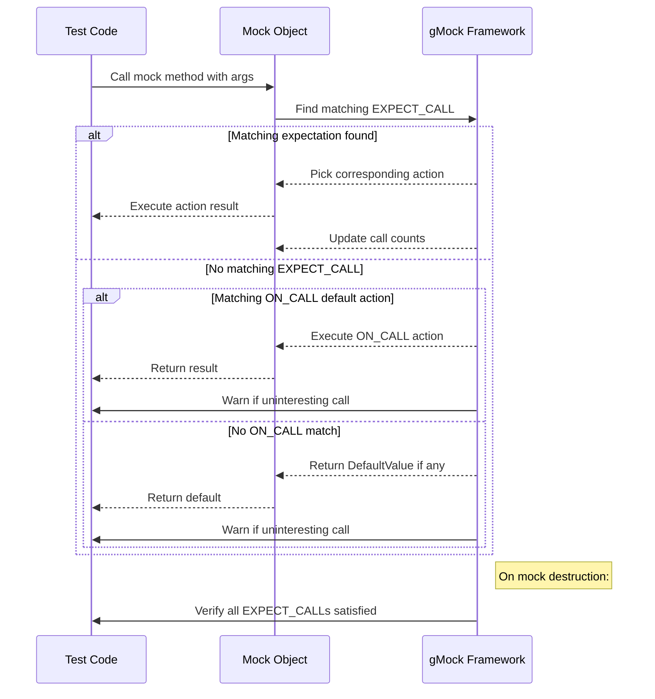

# Default Actions, Customization, and Configuration

This page summarizes the APIs and macros provided by GoogleMock that allow you to:

- Specify **default actions** on mock methods.
- Configure **global** or **test-level** mock behavior.
- Customize **test execution parameters**, including test runner setup.
- Integrate GoogleMock with project-specific needs.

These facilities enable fine-grained control over how mocks behave by default, how expectations are specified and ordered, and how test behavior is configured globally or per test.

---

## Overview of Default Actions and Expectations in GoogleMock

GoogleMock provides two primary macros to define and customize mock behavior:

- `ON_CALL`: Specifies the **default behavior** of a mock method *without* requiring the method to be called.
- `EXPECT_CALL`: Specifies an **expectation** that a mock method *will be called*, including how many times, with what arguments, and what should happen when called.

### Using `ON_CALL` to Define Default Actions

`ON_CALL(mock_object, Method(matchers))` lets you set what happens when a mock method matching the argument matchers is called. It defines a fallback behavior if no matching `EXPECT_CALL` is found.

#### Syntax:
```cpp
ON_CALL(mock_object, Method(matchers))
    .With(multi_argument_matcher)  // Optional, restricts to args as a tuple
    .WillByDefault(action);         // Required to specify behavior
```

- `.With` restricts the default action to calls whose args as a whole match a tuple matcher.
- `.WillByDefault` specifies the **action** performed each time the call matches.

#### Example:
```cpp
using ::testing::_;
using ::testing::Lt;
using ::testing::Return;
...
ON_CALL(my_mock, SetPosition(_, _))
    .With(Lt())
    .WillByDefault(Return(true));
```

> The last matching `ON_CALL` wins, allowing you to set up broad behavior early (like in constructors) and fine-tune it later.

### Using `EXPECT_CALL` to Set Call Expectations

`EXPECT_CALL(mock_object, Method(matchers))` establishes that **the method must be called** with the given argument matchers, and lets you specify cardinality, order, and behavior.

#### Syntax:
```cpp
EXPECT_CALL(mock_object, Method(matchers))
    .With(multi_argument_matcher)       // Optional
    .Times(cardinality)                 // Optional
    .InSequence(sequences...)           // Optional
    .After(expectations...)             // Optional
    .WillOnce(action)                   // Zero or more
    .WillRepeatedly(action)             // Optional
    .RetiresOnSaturation();             // Optional
```

- `.With` restricts the expectation to calls whose arguments match the combined multi-argument matcher.
- `.Times` specifies how many times the call is expected.
- `.InSequence` and `.After` control the order of calls.
- `.WillOnce` specifies actions for each call in order.
- `.WillRepeatedly` specifies an action for any calls after all `.WillOnce` are exhausted.
- `.RetiresOnSaturation` makes the expectation inactive once its call limit is reached.

#### Example:
```cpp
using ::testing::_;
using ::testing::Return;
using ::testing::AtLeast;
using ::testing::Sequence;

Sequence s;
EXPECT_CALL(my_mock, Reset())
    .InSequence(s);
EXPECT_CALL(my_mock, GetSize())
    .InSequence(s)
    .Times(AtLeast(1))
    .WillRepeatedly(Return(10));
```

### Automatic Cardinality Inference

If `.Times()` is omitted, gMock infers the expected number of calls based on provided actions:
- No `.WillOnce()` or `.WillRepeatedly()`: `Times(1)`
- `n` `.WillOnce()` and no `.WillRepeatedly()`: `Times(n)` exactly
- `n` `.WillOnce()` and one `.WillRepeatedly()`: `Times(AtLeast(n))`

### Sticky Expectations and Retiring

Expectations are "sticky" by default — they remain active even after saturation. Use `.RetiresOnSaturation()` to make them retire immediately after saturation.

---

## Default Return Values for Types

GoogleMock defines default return values for built-in types and pointers. For custom types, or to change defaults, use:

```cpp
::testing::DefaultValue<T>::Set(value);
::testing::DefaultValue<T>::SetFactory(factory_function);
::testing::DefaultValue<T>::Clear();
```

- `Set` associates a copyable default value.
- `SetFactory` sets a factory that produces moveable defaults on demand.
- `Clear` removes any default value for `T`.

This feature controls what values are returned when no action is specified.

### Example:
```cpp
DefaultValue<std::unique_ptr<MyType>>::SetFactory(
    [] { return std::make_unique<MyType>(); });

// Now, mocks returning unique_ptr<MyType> will return a new object by default.
```

---

## Mock Strictness and Behaviors

GoogleMock supports different mock object behaviors for calls without explicit expectations:

| Mock Type      | Description                              | Usage                             |
|----------------|------------------------------------------|----------------------------------|
| **NaggyMock**  | Warn on uninteresting calls (default).  | Use to surface unexpected calls. |
| **NiceMock**   | Suppress uninteresting call warnings.   | Use when uninteresting calls are expected. |
| **StrictMock** | Treat uninteresting calls as errors.    | Use for strict verification.     |

### Creating Strictness Wrappers:
```cpp
using ::testing::NiceMock;
using ::testing::NaggyMock;
using ::testing::StrictMock;

NiceMock<MockFoo> nice_foo;
NaggyMock<MockFoo> naggy_foo;
StrictMock<MockFoo> strict_foo;
```
- They behave as subclasses of the mocked type, accepting construction args.
- Strictness only affects **uninteresting calls** — calls without expectations.

### Notes:
- Strictness modifiers only affect mock methods defined with `MOCK_METHOD` in the mock's immediate class.
- Nested combinations like `NiceMock<StrictMock<T>>` are unsupported.

---

## Controlling Verification and Expected Mock Lifecycle

### Forcing Early Verification

By default, mock objects check expectation satisfaction when destroyed.
Sometimes you want to verify explicitly earlier:

```cpp
using ::testing::Mock;
...
Mock::VerifyAndClearExpectations(&mock_obj);
```
- Returns `true` if all expectations are satisfied.
- Clears expectations; do not set new expectations after calling.

### Resetting Default Actions and Expectations

You can verify and reset a mock object completely:

```cpp
bool success = Mock::VerifyAndClear(&mock_obj);
```
- Removes all expectations and default actions.
- Returns whether expectations were satisfied.

### Allowing Mock Object Leaks

If you purposely keep mocks alive beyond test scope or avoid verification on destruction, use:

```cpp
Mock::AllowLeak(&mock_obj);
```
- Suppresses leak detection warnings and verification failures at program exit.

---

## Customizing Uninteresting Call Handling Globally or Per Mock

GoogleMock handles calls to methods without expectations as follows:

- Default global behavior is a warning.
- You can change per-mock object behavior:
  - `Mock::AllowUninterestingCalls(obj);` - allow silently.
  - `Mock::WarnUninterestingCalls(obj);` - warn (default).
  - `Mock::FailUninterestingCalls(obj);` - fail the test.

Set global default with flag:

```shell
--gmock_verbose=info|warning|error
```
- `info`: log all calls, warnings, and errors.
- `warning`: log warnings and errors (default).
- `error`: log errors only.

---

## Integration and Test Runner Configuration

GoogleMock integrates tightly with GoogleTest. Key integration points related to test execution include:

- Mock expectations are verified automatically when mock objects are destructed.
- You can verify mocks explicitly using `Mock::VerifyAndClearExpectations` or `Mock::VerifyAndClear` to customize test lifecycle.
- Composite setups using sequences and expectation ordering (`InSequence`, `.After`) allow fine control of test flow.

Please refer to [Integration and Extensibility](../overview/architecture-concepts/integration-overview.md) for details on embedding GoogleMock in your build and CI pipelines.

---

## Troubleshooting Common Issues

### Common Problems:
- **Uninteresting call warnings:** Check if `EXPECT_CALL` is set for methods you expect to be called; otherwise, switch to `NiceMock` or adjust verbosity.
- **Unexpected calls:** Ensure that expectations cover all possible calls your code makes.
- **Excessive calls:** Confirm call cardinalities and use `.RetiresOnSaturation()` for finite expectations to avoid "sticky" expectations causing failures.
- **Default Return Values Missing:** Define custom `DefaultValue<T>` or set `ON_CALL` actions.

### Tips:
- Use `--gmock_verbose=info` to trace all mock calls and understand matching.
- Use explicit `.Times()` and `.WillOnce()/.WillRepeatedly()` to clarify expected call sequences.
- Use `Sequence` and `InSequence` to enforce order.
- Use `RetiresOnSaturation()` to automatically retire saturated expectations.

Consult the [Mocking Reference](../docs/reference/mocking.md) and [gMock for Dummies](../docs/gmock_for_dummies.md) for foundational concepts and examples.

---

## Further Reading and References

- [Mocking Reference (detailed macros and classes)](../docs/reference/mocking.md)
- [gMock for Dummies (introductory guide)](../docs/gmock_for_dummies.md)
- [gMock Cheat Sheet (quick syntax guide)](../docs/gmock_cheat_sheet.md)
- [Mocking Techniques Guides](../guides/mocking-techniques/creating-mocks.mdx)
- [Expectations and Actions Guide](../guides/mocking-techniques/expectations-and-actions.mdx)
- [Mock Strictness and Behavior](../api-reference/structuring-behaviors/mock-strictness.mdx)
- [Actions and Custom Responses API Reference](../api-reference/core-apis/actions-and-responses.mdx)

For advanced usage, see the [gMock Cookbook](../docs/gmock_cook_book.md).

---

## Summary Diagram of Mock Expectation Handling



---

This page focuses exclusively on the APIs and mechanics for defining and customizing mock default actions, expectations, global and per-test configuration, and test runner behaviors. For foundational concepts on mocking and more detailed usage patterns, please consult related documentation listed above.
