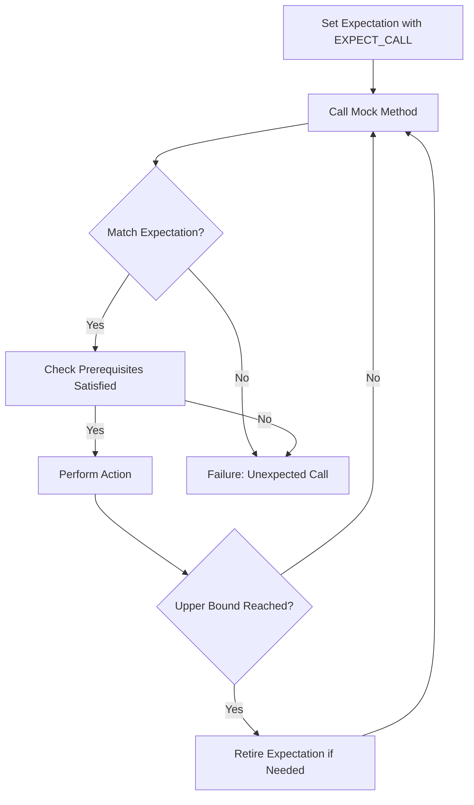

# Expectations, Call Ordering, and Sequences

GoogleMock's power lies in how it lets you specify **expectations** on mock methods—stating not only which calls to expect, but also how often, in what order, and under which conditions. This page explains how to express these mock expectations using the `EXPECT_CALL` macro and control the call order, cardinality, and sequences to write **maintainable and predictable interactions** in your tests.

---

## Overview

In interaction testing, knowing not just *what* happens but also *when* and *how many times* calls occur is critical. GoogleMock uses **Expectations** to describe this in code:

- Use `EXPECT_CALL()` to specify that a mock method is expected to be called with given arguments
- Control **call counts** (cardinalities) with `.Times()` or allow GoogleMock to infer them based on .WillOnce/.WillRepeatedly
- Specify **call order** via `.InSequence()` or `.After()` clauses
- Manage expectation **lifetime** using `.RetiresOnSaturation()`

GoogleMock also supports **Sequences** to group ordered calls easily.

## Setting Expectations with EXPECT_CALL

The core construct for expressing a mock method expectation is the `EXPECT_CALL` macro:

```cpp
EXPECT_CALL(mock_object, Method(matchers...))
    .With(multi_argument_matcher)  // Optional
    .Times(cardinality)            // Optional; inferred if omitted
    .InSequence(sequences...)      // Optional; can appear multiple times
    .After(expectations...)        // Optional; can appear multiple times
    .WillOnce(action)              // Optional; can appear multiple times
    .WillRepeatedly(action)        // Optional; at most once
    .RetiresOnSaturation();        // Optional; at most once
```

- `mock_object`: your mock instance
- `Method`: the mocked method name, with matchers for method arguments

### Behavior:
- The **last matching `EXPECT_CALL` statement** wins when matching calls
- Call counts are verified automatically, failures reported immediately
- Actions specified with `WillOnce` and `WillRepeatedly` control the behavior when matched

<Note>
Expectations must be set *before* exercising the code using the mock. Violating this leads to undefined behavior.
</Note>

### Basic Example:

```cpp
using ::testing::Return;

EXPECT_CALL(turtle, GetX())
    .Times(3)
    .WillOnce(Return(100))
    .WillOnce(Return(150))
    .WillOnce(Return(200));
```

This says `GetX()` will be invoked 3 times, returning 100, then 150, then 200:

- If called less or more than 3 times, the test will fail
- Calls to `GetX()` beyond the third call produce an error

## Call Cardinality: Controlling How Many Times an Expectation Matches

The `.Times()` clause sets the **cardinality** of an expectation — describing how many times a match is expected. You can also omit it and let GoogleMock infer cardinality from your `.WillOnce()` and `.WillRepeatedly()` calls.

### Cardinality options include:

| Cardinality         | Meaning                                  |
|---------------------|------------------------------------------|
| `AnyNumber()`       | May be called any number of times        |
| `AtLeast(n)`        | Expected at least `n` times               |
| `AtMost(n)`         | Expected at most `n` times                |
| `Between(m, n)`     | Expected between `m` and `n` times       |
| `Exactly(n)` or `n` | Expected exactly `n` times                |

### Inferring Cardinality:

- If no `.Times()` clause, and no actions, inferred cardinality is `Exactly(1)`.
- If no `.Times()` clause, and `n` `.WillOnce()` actions, inferred cardinality is `Exactly(n)`.
- If no `.Times()` clause, and `n` `.WillOnce()` actions plus `.WillRepeatedly()` specified, cardinality is `AtLeast(n)`.

<Callout title="Best Practice">
Avoid over-specifying cardinality. Use `.Times()` only when meaningful. Too strict cardinalities make tests brittle.
</Callout>

## Controlling Call Order

By default, gMock allows calls to match expectations **in any order** — so long as the arguments and call count match. However, you can impose ordering constraints using:

### 1. `.InSequence()` Clause

Assigns an expectation to one or more `Sequence` objects. All expectations in the same sequence must be matched in the order they appear.

```cpp
using ::testing::Sequence;

Sequence seq1, seq2;
EXPECT_CALL(mock, Foo())
    .InSequence(seq1);
EXPECT_CALL(mock, Bar())
    .InSequence(seq1, seq2);
EXPECT_CALL(mock, Baz())
    .InSequence(seq2);
```

This means:
- `Foo()` occurs before `Bar()` in `seq1`
- `Bar()` occurs before `Baz()` in `seq2`

Sequences can enforce strict partial orders, allowing flexibility.

### 2. `.After()` Clause

Declares that an expectation must only be matched after one or more other expectations or expectation sets have been **satisfied**.

```cpp
Expectation e1 = EXPECT_CALL(mock, Init());
ExpectationSet es;
es += EXPECT_CALL(mock, Prepare(1));
es += EXPECT_CALL(mock, Prepare(2));
EXPECT_CALL(mock, Use()).After(e1, es);
```

This specifies that `Use()` can only be called after both `Init()` and the two `Prepare()` calls have occurred.

### 3. `InSequence` Helper Object

Creating an `InSequence` object on the stack causes **all** `EXPECT_CALL`s in its scope to belong to an anonymous sequence.

```cpp
{
  InSequence s;  // unnamed sequence

  EXPECT_CALL(mock, First());
  EXPECT_CALL(mock, Second());
}
```

Calls to `First()` and `Second()` must occur sequentially. Using this helps keep code simple when all calls in a block must be ordered.

## Retiring Expectations with `.RetiresOnSaturation()`

By default, GoogleMock expectations are "sticky": they remain active even after their invocation limit has been reached, causing any extra calls to trigger failures.

If you want an expectation to become inactive **immediately when saturated** (i.e., stop matching calls and let other expectations handle subsequent calls), you attach `.RetiresOnSaturation()`:

```cpp
EXPECT_CALL(mock, Update(7))
   .Times(2)
   .RetiresOnSaturation();
```

This means once `Update(7)` has been called twice, this expectation retires and will not match further calls, allowing more general expectations to match.

## Expectation Lifetime and Pre-requisites

- An expectation with `.After()` clauses depends on others. It cannot match until *all* its pre-requisites are satisfied.
- Expectations in a `Sequence` retire automatically when later expectations in that sequence get matched.
- `.RetiresOnSaturation()` explicitly marks expectations to retire when saturated.

These mechanisms let you create precise and realistic call orderings for complex interactions.

## Using Expectation and ExpectationSet Handles

You can store the result of an `EXPECT_CALL(...)` expression in an `Expectation` object to manage ordering and reuse.

```cpp
Expectation e1 = EXPECT_CALL(mock, Setup());
EXPECT_CALL(mock, Operate()).After(e1);
```

Similarly, an `ExpectationSet` lets you group multiple expectations for `.After()`:

```cpp
ExpectationSet initSet;
initSet += EXPECT_CALL(mock, InitPart1());
initSet += EXPECT_CALL(mock, InitPart2());
EXPECT_CALL(mock, Run()).After(initSet);
```

## Common Pitfalls and Best Practices

- **Always set your expectations before exercising mocks:** Defining expectations after calls leads to undefined behavior.
- **Use sequences judiciously:** Overly strict ordering can make tests fragile.
- **Use `.RetiresOnSaturation()` to avoid sticky expectations causing unexpected failures.**
- **Define explicit call counts to catch missed or extra calls.**

## Code Examples

### Simple Expectation with Cardinality and Actions

```cpp
EXPECT_CALL(mock, Foo(42))
    .Times(3)
    .WillOnce(Return(1))
    .WillOnce(Return(2))
    .WillRepeatedly(Return(3));

mock.Foo(42);  // returns 1
mock.Foo(42);  // returns 2
mock.Foo(42);  // returns 3
mock.Foo(42);  // returns 3
```

### Call Ordering using Sequence

```cpp
Sequence s;

EXPECT_CALL(mock, Connect())
    .InSequence(s);
EXPECT_CALL(mock, Send(_))
    .InSequence(s);
EXPECT_CALL(mock, Disconnect())
    .InSequence(s);

// All calls must occur in the above order.
```

### Partial Order with Multiple Sequences

```cpp
Sequence s1, s2;

EXPECT_CALL(mock, Init())
    .InSequence(s1, s2);
EXPECT_CALL(mock, Process())
    .InSequence(s1);
EXPECT_CALL(mock, Finalize())
    .InSequence(s2);
```

This controls that `Init()` comes before `Process()` and `Finalize()`, but `Process()` and `Finalize()` can appear in any order relative to each other.

### Using .After() Clause

```cpp
Expectation init = EXPECT_CALL(mock, Init());
Expectation load = EXPECT_CALL(mock, Load()).After(init);
EXPECT_CALL(mock, Execute()).After(init, load);

// Calls to Execute() only allowed after Init() and Load().
```

## Troubleshooting Common Issues

- **Unexpected call errors:** Usually caused by missing or mismatched `EXPECT_CALL`.
- **Too many or too few calls:** Review `Times()` clause and chained `.WillOnce()` actions.
- **Ordering problems:** Check if your `.InSequence()` or `.After()` dependencies are correct and that calls happen in the required order.
- **Unretiring expectations causing failures:** Consider using `.RetiresOnSaturation()` to avoid sticky expectations interfering unexpectedly.

## Summary Diagram



This illustrates how calls are matched against expectations, checking constraints and retiring when appropriate.

---

## See Also

- [`ON_CALL`](#ON_CALL): For setting default behaviors without creating strict expectations
- [Matchers Reference](../matchers.md): How to specify argument matchers for `EXPECT_CALL`
- [Actions and Responses](../actions.md): How to specify what mocks do on calls
- [Mocking Basics](../mocking-basics.md): Guide on creating and using mock classes
- [gMock Cookbook](https://google.github.io/googletest/gmock_cook_book.html): Recipes for advanced usage

---

## Additional Best Practices

- Prefer `ON_CALL` for default behavior and reserve `EXPECT_CALL` for the calls you want to verify actually happened.
- Use `InSequence` object blocks or explicit sequences to make test intent clearer for ordered call expectations.
- Keep your expectations precise but not too restrictive — overly precise orderings or call counts lead to fragile tests.

<Tip>
To suppress warnings on uninteresting calls, consider `NiceMock` over naggy or strict mocks.
</Tip>

## Related Topics

- [Mocking Reference](../mocking.md)
- [Matchers](../matchers.md)
- [Actions](../actions.md)

---