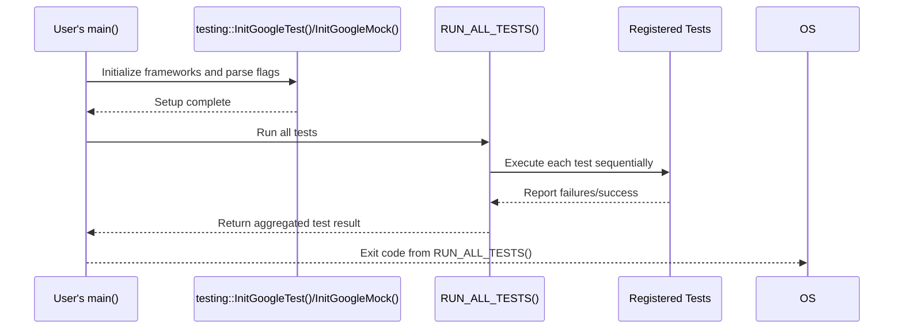

# Entrypoint and Initialization

This page explains how to set up and launch tests using the main entrypoints provided by GoogleTest and GoogleMock. It describes the initialization APIs and how test execution is orchestrated, catering to both desktop environments and embedded platforms such as Arduino and QuRT.

---

## 1. Introduction to Entrypoints

A typical GoogleTest or GoogleMock test executable requires an entrypoint that:

- Initializes the testing framework,
- Parses command-line flags,
- Runs all the registered tests,
- Returns a status that reflects the test results.

GoogleTest and GoogleMock provide main functions or equivalent entrypoints to streamline this process, allowing developers to focus on writing tests rather than boilerplate code.


## 2. GoogleTest Entrypoints

GoogleTest's primary entrypoint is a `main` function that handles the initialization and execution of tests.

### 2.1 Typical Main Function Usage

A standard main function for a GoogleTest executable looks like this:

```c++
#include <gtest/gtest.h>

int main(int argc, char **argv) {
  // Initializes GoogleTest and parses flags
  testing::InitGoogleTest(&argc, argv);

  // Runs all tests and returns 0 if successful
  return RUN_ALL_TESTS();
}
```

#### Key Points:

- `InitGoogleTest` must be called before running tests to set up internal state and parse testing flags.
- `RUN_ALL_TESTS()` runs every test registered in the program and returns 0 if all tests succeed, or 1 if any test fails.
- The return code of `RUN_ALL_TESTS()` should be used as the return value of `main()`. This allows CI systems and build automation to detect test failures based on exit codes.

### 2.2 Embedded Platform Variations

GoogleTest automatically adapts its entrypoints for embedded platforms:

- **Arduino-like platforms (ESP8266, ESP32, NRF52 with Arduino):** do not have a `main()`. Instead, the test harness uses Arduino's `setup()` and `loop()` functions:

```c++
void setup() {
  testing::InitGoogleTest();
}

void loop() {
  RUN_ALL_TESTS();
}
```

- **QuRT platform:** Uses a normal `main()` but without `argc` and `argv` parameters:

```c++
int main() {
  testing::InitGoogleTest();
  return RUN_ALL_TESTS();
}
```

These variations ensure seamless test execution regardless of environment.

## 3. GoogleMock Entrypoints and Initialization

GoogleMock depends on GoogleTest and extends its initialization APIs.

### 3.1 Typical GoogleMock Main Function

An example main function for GoogleMock tests is:

```c++
#include "gmock/gmock.h"
#include "gtest/gtest.h"

int main(int argc, char** argv) {
  std::cout << "Running main() from gmock_main.cc\n";
  testing::InitGoogleMock(&argc, argv);
  return RUN_ALL_TESTS();
}
```

#### Highlights:

- `InitGoogleMock` initializes both GoogleMock and GoogleTest.
- There is no need to call `InitGoogleTest()` separately when using GoogleMock.
- The framework parses and removes recognized flags from `argv`.
- On embedded platforms, `InitGoogleMock()` adapts to the platform’s specific entrypoint model, just like GoogleTest.

### 3.2 Embedded Platform Support

For Arduino-like platforms, GoogleMock also uses `setup()` and `loop()`:

```c++
void setup() {
  testing::InitGoogleMock();
}

void loop() {
  RUN_ALL_TESTS();
}
```

This embedded support ensures that tests using GoogleMock work on constrained platforms.

## 4. Linking Against Main Entrypoints

Most users should link against the provided `gtest_main` or `gmock_main` libraries rather than writing their own `main()` function.

- The `gtest_main` library defines a standard `main()` compatible with GoogleTest.
- The `gmock_main` library defines a `main()` initializing GoogleMock and GoogleTest.

This simplifies test binary creation and ensures consistent initialization workflows.


## 5. Workflow: Setting up and Running Tests

### Step-by-Step for Desktop Environments

<Steps>
<Step title="Write Your Tests">
Implement tests using `TEST()` or `TEST_F()` macros in your source files.
</Step>
<Step title="Link with Main Library">
Link your test executable against `gtest_main` or `gmock_main` library to get the default `main()`.
</Step>
<Step title="Build Your Test Binary">
Compile and link your test sources with GoogleTest/GoogleMock libraries.
</Step>
<Step title="Run Tests">
Execute the resulting binary. The framework initializes itself, runs all tests, and exits with an appropriate status code.
</Step>
</Steps>

### Step-by-Step for Embedded Platforms

<Steps>
<Step title="Write Tests Compatible with Embedded Restrictions">
Write your tests, mindful of resource constraints.
</Step>
<Step title="Use Framework Initialization Functions">
Use `testing::InitGoogleTest()` or `testing::InitGoogleMock()` inside `setup()`.
</Step>
<Step title="Use Loop Execution">
Call `RUN_ALL_TESTS()` inside the `loop()` function to execute tests repeatedly or once.
</Step>
<Step title="Deploy and Monitor">
Flash the binary onto the device and monitor the test output.
</Step>
</Steps>

## 6. Common Pitfalls and Tips

<Tip>
**Always call the initialization function before running tests.** Forgetting this breaks flag parsing and test setup.
</Tip>
<Tip>
**Return the value of `RUN_ALL_TESTS()` as your program exit code.** This practice is crucial for automated test systems.
</Tip>
<Tip>
**Use the provided main functions unless you need custom initialization.** Writing your own main requires calling `InitGoogleTest` or `InitGoogleMock` properly.
</Tip>
<Warning>
**Calling `RUN_ALL_TESTS()` more than once is not supported.** It can conflict with advanced features such as thread-safe death tests.
</Warning>
<Note>
Embedded platforms require adapted entrypoints (`setup()`/`loop()`) rather than the usual `main()`. Use the provided code samples.
</Note>

## 7. Example: Custom Main with GoogleTest

```c++
#include "gtest/gtest.h"

int main(int argc, char** argv) {
  testing::InitGoogleTest(&argc, argv);
  return RUN_ALL_TESTS();
}
```

## 8. Example: Using GoogleMock Main Entrypoint

If you prefer the library-provided main function, link with `gmock_main` and no main function is needed.

Alternatively, if you write your own:

```c++
#include "gmock/gmock.h"
#include "gtest/gtest.h"

int main(int argc, char** argv) {
  testing::InitGoogleMock(&argc, argv);
  return RUN_ALL_TESTS();
}
```

## 9. Summary Diagram of Test Execution Flow



---

## 10. Additional Resources

- [GoogleTest Primer](https://github.com/google/googletest/blob/main/docs/primer.md) — how to write and run your first test
- [GoogleMock Tutorial](https://google.github.io/googletest/gmock_for_dummies.html) — learn mocking basics
- [Integrating with Build Systems](https://github.com/google/googletest/blob/main/docs/integrating.md) — how to link and configure your project
- [Running Tests on Embedded Platforms](https://github.com/google/googletest/blob/main/docs/embedded.md) — adaption to Arduino, QuRT, etc.

## 11. Source Code Location

You can find the implementations of main entrypoints here:

- GoogleTest main: [gtest_main.cc](https://github.com/google/googletest/blob/main/googletest/src/gtest_main.cc)
- GoogleMock main: [gmock_main.cc](https://github.com/google/googletest/blob/main/googlemock/src/gmock_main.cc)

---

By following these initialization guidelines and using the provided abstractions, you ensure reliable, consistent startup and execution of your GoogleTest and GoogleMock-based tests across diverse platforms.