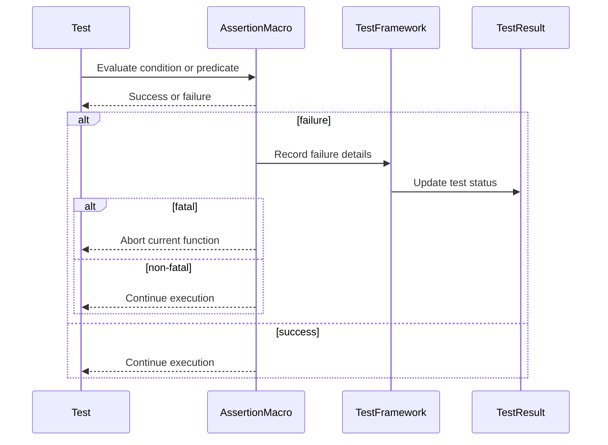

# Assertion Macros and Custom Assertions

GoogleTest provides a rich suite of assertion macros designed to make testing code behavior intuitive, expressive, and maintainable. This documentation explores standard assertions, distinctions between fatal and non-fatal failures, the ability to stream custom failure messages, predicate assertions, exception assertions, and best practices for writing custom assertions.

---

## Understanding Assertion Macros

Assertions are macros that verify conditions during test execution, providing clear feedback when expectations are not met. They come in pairs, offering either fatal failures (which abort the current function) or non-fatal failures (which allow the function to continue).

### Basic Types of Assertions

| Assertion Type    | Macro Prefix | Behavior                                                             |
|-------------------|--------------|----------------------------------------------------------------------|
| Fatal Assertion   | `ASSERT_`    | On failure, aborts the current function immediately.                 |
| Non-Fatal Assertion | `EXPECT_`   | On failure, records failure but continues execution.                 |
| Explicit Success  | `SUCCEED()`  | Reports a success explicitly, useful for documenting test progress.  |
| Explicit Failure  | `FAIL()`     | Generates fatal failure, aborting the current function.             |
| Nonfatal Failure  | `ADD_FAILURE()` | Generates a nonfatal failure allowing the test to continue.        |

### Streaming Custom Failure Messages

All assertion macros support streaming additional messages using the `<<` operator to provide context, making diagnosis easier:

```cpp
EXPECT_TRUE(my_condition) << "Expected my_condition to be true but it was false.";
ASSERT_EQ(x.size(), y.size()) << "Vectors differ in length.";
```

This flexibility lets you add detailed diagnostic messages that appear alongside the standard GoogleTest output when an assertion fails.

## Standard Assertion Macros

### Boolean Conditions

- `EXPECT_TRUE(condition)` and `ASSERT_TRUE(condition)` verify that the condition is `true`.
- `EXPECT_FALSE(condition)` and `ASSERT_FALSE(condition)` verify that the condition is `false`.

### Equality and Relational Operators

These compare two values and provide detailed failure messages including the actual values:

- Equality and inequality:
  - `EXPECT_EQ(val1, val2)` / `ASSERT_EQ(val1, val2)`
  - `EXPECT_NE(val1, val2)` / `ASSERT_NE(val1, val2)`
- Comparisons:
  - `EXPECT_LT(val1, val2)` / `ASSERT_LT(val1, val2)`
  - `EXPECT_LE(val1, val2)` / `ASSERT_LE(val1, val2)`
  - `EXPECT_GT(val1, val2)` / `ASSERT_GT(val1, val2)`
  - `EXPECT_GE(val1, val2)` / `ASSERT_GE(val1, val2)`

> **Tip:** For pointer comparisons involving C strings, prefer [`EXPECT_STREQ`](#expect_streq) family of macros rather than `EXPECT_EQ` to compare C string contents.

### String Comparisons

- `EXPECT_STREQ(str1, str2)` / `ASSERT_STREQ(str1, str2)` verify two C strings have identical content.
- `EXPECT_STRNE(str1, str2)` / `ASSERT_STRNE(str1, str2)` verify two C strings differ.
- `EXPECT_STRCASEEQ(str1, str2)` / `ASSERT_STRCASEEQ(str1, str2)` verify strings match ignoring case.
- `EXPECT_STRCASENE(str1, str2)` / `ASSERT_STRCASENE(str1, str2)` verify strings differ ignoring case.

These macros work with both narrow (char*) and wide (wchar_t*) strings.

### Floating-Point Comparisons

Floating-point comparisons use custom logic to avoid common pitfalls with precision and rounding errors:

- `EXPECT_FLOAT_EQ(val1, val2)` / `ASSERT_FLOAT_EQ(val1, val2)` compare `float` values considering 4 ULPs tolerance.
- `EXPECT_DOUBLE_EQ(val1, val2)` / `ASSERT_DOUBLE_EQ(val1, val2)` compare `double` values similarly.
- `EXPECT_NEAR(val1, val2, abs_error)` / `ASSERT_NEAR(val1, val2, abs_error)` verify values are within an `abs_error` difference.

### Exception Assertions

To test how your code handles exceptions, GoogleTest provides:

- `EXPECT_THROW(statement, exception_type)` / `ASSERT_THROW(statement, exception_type)`: Verifies that `statement` throws the specified `exception_type`.
- `EXPECT_NO_THROW(statement)` / `ASSERT_NO_THROW(statement)`: Verifies that `statement` does not throw exceptions.
- `EXPECT_ANY_THROW(statement)` / `ASSERT_ANY_THROW(statement)`: Verifies that `statement` throws any exception.

These require that exceptions are enabled in your build.

### Death Assertions

Death tests verify that a piece of code terminates the process under conditions expected to cause failure:

- `EXPECT_DEATH(statement, matcher)` / `ASSERT_DEATH(statement, matcher)`: `statement` should cause process death and the output matching `matcher`.
- `EXPECT_EXIT(statement, predicate, matcher)` / `ASSERT_EXIT(statement, predicate, matcher)`: Verifies process exit status matches `predicate` and output matches `matcher`.

See [Death Assertions](reference/assertions.md#death) for detailed usage.

## Predicate Assertions

Predicate assertions enable expressing complex test logic and customized failure messages.

### Predicate Assertions Expecting Bool

They verify a predicate returns `true`:

- `EXPECT_PRED1(pred, val1)` through `EXPECT_PRED5(pred, val1, ..., val5)`
- `ASSERT_PRED1(pred, val1)` through `ASSERT_PRED5(pred, val1, ..., val5)`

Example:

```cpp
bool IsEven(int n) { return n % 2 == 0; }
EXPECT_PRED1(IsEven, 4);  // succeeds
EXPECT_PRED1(IsEven, 3);  // fails
```

### Predicate Assertions with Custom Formatter

By defining predicate-formatter functions returning `AssertionResult`, you get richer failure information and support for arguments that cannot be streamed easily:

- `EXPECT_PRED_FORMAT*` and `ASSERT_PRED_FORMAT*` macros allow 1 to 5 arguments.

Example:

```cpp
testing::AssertionResult AssertIsEven(const char* expr, int n) {
  if (n % 2 == 0) return testing::AssertionSuccess();
  return testing::AssertionFailure() << n << " is not even.";
}
EXPECT_PRED_FORMAT1(AssertIsEven, 3);  // fails with message
```

These assertions provide full control over failure messages for complex predicates.

## Explicit Success and Failure

Sometimes control flow requires explicitly recording success or failure.

- `SUCCEED()` records a success explicitly.
- `FAIL()` records a fatal failure which aborts the current function.
- `ADD_FAILURE()` records a nonfatal failure allowing continuation.
- `ADD_FAILURE_AT(file, line)` records nonfatal failure at specific source location.

These assist in documenting test intent or handling unexpected branches.

## Custom Assertions

GoogleTest lets you write custom assertions that can integrate seamlessly with the framework.

### Writing a Predicate Function Returning `AssertionResult`

Custom assertions often use a function or functor returning `testing::AssertionResult` with conditional success or failure messages:

```cpp
testing::AssertionResult IsValid(int n) {
  if (n >= 0) return testing::AssertionSuccess();
  return testing::AssertionFailure() << n << " is negative";
}
EXPECT_TRUE(IsValid(value));
```

This approach provides richer messages compared to simple `bool` predicates.

### Using Predicate-Formatter Macros

To make assertions composable and expressive, define a predicate-formatter function:

```cpp
testing::AssertionResult IsInRange(const char* expr1, const char* expr2, int val, int low, int high) {
  if (val >= low && val <= high) return testing::AssertionSuccess();
  return testing::AssertionFailure() << expr1 << " is not in range [" << low << ", " << high << "]";
}
EXPECT_PRED_FORMAT3(IsInRange, value, 0, 10);
```

This allows assertions with detailed explanation and expression reporting.

## Best Practices & Common Pitfalls

### Assertions in Subroutines

Fatal failures (`ASSERT_*` and `FAIL`) only abort the current function where they occur. If you use them inside helper functions, the caller continues unless you manage control flow explicitly.

Use `HasFatalFailure()` to check if a fatal failure occurred and return early:

```cpp
void Helper() {
  ASSERT_TRUE(...);
}

TEST(FooTest, Sample) {
  Helper();
  if (HasFatalFailure()) return;
  ...
}
```

Alternatively, use `ASSERT_NO_FATAL_FAILURE` around calls that may fail:

```cpp
ASSERT_NO_FATAL_FAILURE(Helper());
```

Or convert fatal failures to exceptions by adding a custom listener that throws on failures.

### Avoid Using Fatal Assertions in Constructors/Destructors

Constructors and destructors cannot abort early in a safe manner. Avoid `ASSERT_*` and `FAIL` in them; use `SetUp()` and `TearDown()` instead to handle failures safely.

### Disabling Tests and Conditional Execution

Prefix test or test suite names with `DISABLED_` to disable them temporarily.

Use `GTEST_SKIP()` within tests or `SetUp()` to skip tests at runtime with an optional message.

### Using Assertions with Side-Effects

Assertions evaluate their arguments exactly once; however, the order of evaluation is undefined, so avoid side-effects in assertion parameters.

### Streaming Failure Messages

Stream messages into assertions to augment failure details.

Examples:

```cpp
EXPECT_EQ(x, y) << "Failure details: x = " << x << ", y = " << y;
``` 

### Assertions and Thread Safety

Assertions currently consider failures only on the current thread. Failures in other threads may not influence test outcomes directly.

## Sample Usage

```cpp
#include <gtest/gtest.h>

TEST(MathTest, Addition) {
  int x = 2 + 2;
  EXPECT_EQ(x, 4) << "2 + 2 should equal 4";
}

// Custom predicate

testing::AssertionResult IsEven(int n) {
  if (n % 2 == 0) return testing::AssertionSuccess();
  return testing::AssertionFailure() << n << " is odd.";
}

TEST(NumberTest, CheckEven) {
  EXPECT_PRED1(IsEven, 4);  // passes
  EXPECT_PRED1(IsEven, 3);  // fails with message
}

// Exception test

TEST(ExceptionTest, Throws) {
  EXPECT_THROW(throw std::runtime_error("fail"), std::runtime_error);
}
```

## Summary of Assertion Macros

| Assertion                | Description                                       | Macro Example                      |
|--------------------------|-------------------------------------------------|----------------------------------|
| Fatal Assertions         | Abort the test function on failure              | `ASSERT_TRUE(condition)`          |
| Non-Fatal Assertions     | Continue test on failure                          | `EXPECT_EQ(val1, val2)`           |
| String Comparisons       | Content-based comparison for C strings           | `EXPECT_STREQ(str1, str2)`        |
| Floating-Point           | Approximate equality for floats and doubles     | `EXPECT_FLOAT_EQ(a, b)`           |
| Exception Assertions    | Verify exception throwing or absence             | `EXPECT_THROW(stmt, Exception)`  |
| Death Assertions        | Verify code aborts process                        | `EXPECT_DEATH(stmt, matcher)`     |
| Explicit Fail/Success    | Record failure or success explicitly             | `FAIL()`, `SUCCEED()`             |
| Predicate Assertions    | Use custom predicates or formatters for messages | `EXPECT_PRED_FORMAT2(pred_fmt, args)` |

## Troubleshooting Common Assertion Issues

### Assertion Not Firing

- Ensure the assertion macro used is correct (`EXPECT_*` vs `ASSERT_*`).
- Make sure the test is actually running (no filter disables it).

### Test Continues After Fatal Failure

- Fatal assertions abort only the current function. Use `HasFatalFailure()` or `ASSERT_NO_FATAL_FAILURE` to propagate failures.

### Unexpected Output

- Confirm argument evaluation order doesn't affect expected behavior.
- Stream detailed custom messages to clarify failures.

### Comparing C Strings

- Use `EXPECT_STREQ` or `EXPECT_STRNE` instead of `EXPECT_EQ` for string content comparison.

## Further Resources

- [GoogleTest Assertions Reference](reference/assertions.md)
- [GoogleTest Primer](primer.md#assertions)
- [Advanced GoogleTest Topics](advanced.md#more-assertions)
- [Predicate Assertions](advanced.md#predicate-assertions-for-better-error-messages)
- [Exception Assertions](reference/assertions.md#exceptions)
- [Death Tests](advanced.md#death-tests)
- [Writing Your First Test](getting-started/first-test/writing-basic-test.mdx)

---

## Visual Diagram: Assertion Flow in a Test



---