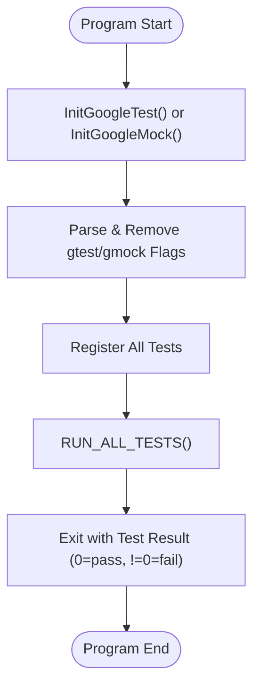

# Test Runner Entrypoints and Main Functions

GoogleTest and GoogleMock provide standardized, ready-to-use entry points (`main` functions) to run your C++ tests. This page documents the provided implementations of these test runner entrypoints, highlighting platform adaptations, initialization logic, test registration, and command-line argument handling. Understanding these main functions helps you decide when to use the prebuilt test runners and when to write your own customized main function.

---

## 1. Overview of Provided main() Implementations

Both GoogleTest and GoogleMock offer `main` functions that initialize the testing framework and execute all registered tests promptly. This means you typically do **not** need to write your own `main`, unless your tests require special setup or framework customization.

### Platforms and Adaptations

The standard `main` implementations handle cross-platform concerns:

- **Normal Platforms (Linux, Windows, macOS):** Implemented as `int main(int argc, char** argv)`.
- **Embedded or Arduino-like Platforms:** Use `void setup()` and `void loop()` functions instead of `main`, to align with embedded SDK expectations (e.g., ESP8266/ESP32, NRF52).
- **Special Cases (Windows Mobile, QuRT):** Adjust signatures and environment accordingly.

All provided main functions ensure the initialization of GoogleTest (and GoogleMock when applicable) and run the full test suite, returning the aggregated success/failure exit code.

---

## 2. Initialization Logic

The core responsibility of these main functions is to:

1. Invoke `InitGoogleTest()` or `InitGoogleMock()` to:
   - Parse and remove recognized command line flags related to GoogleTest/GoogleMock.
   - Initialize internal test registries.
   - Prepare flags and environment for test execution.

2. Call `RUN_ALL_TESTS()`, which:
   - Runs all tests registered in the program.
   - Returns zero if all tests succeed; non-zero otherwise.

3. Return the exit code from `RUN_ALL_TESTS()` to the OS.

### GoogleMock Initialization

GoogleMock depends on GoogleTest and extends initialization by calling `InitGoogleMock()`, which internally calls GoogleTest's init function. This means you shouldn’t call `InitGoogleTest()` separately when using GoogleMock.

---

## 3. Typical main() Implementations

The following snippets show canonical `main` entry points:

### Standard GoogleTest Main (`googletest/src/gtest_main.cc`)
```c++
int main(int argc, char **argv) {
  printf("Running main() from gtest_main.cc\n");
  testing::InitGoogleTest(&argc, argv);
  return RUN_ALL_TESTS();
}
```

### Standard GoogleMock Main (`googlemock/src/gmock_main.cc`)
```c++
int main(int argc, char** argv) {
  std::cout << "Running main() from gmock_main.cc\n";
  testing::InitGoogleMock(&argc, argv);
  return RUN_ALL_TESTS();
}
```

### Embedded Platforms (e.g., ESP8266, ESP32)
```c++
void setup() {
  // Initialize GoogleMock (and indirectly GoogleTest).
  testing::InitGoogleMock();
}

void loop() {
  RUN_ALL_TESTS();
}
```

For these platforms, the `setup()` and `loop()` functions replace the classical `main()` function, integrating seamlessly into the platform's event-driven model.

---

## 4. When to Use the Provided main() Functions vs. Writing Your Own

Most users will find these prebuilt main functions cover nearly all use cases:

- Quick setup: simply link your tests against `gtest_main` or `gmock_main` libraries.
- No need to define a main function explicitly.
- Consistent flag handling and correct test registration guaranteed.

**Write your own main() function if:**

- You need custom runtime logic before or after test execution.
- You want to parse or handle your own command-line flags.
- You require specialized environment setup not supported by InitGoogleTest/InitGoogleMock.

In those cases, ensure you follow the pattern of initializing the framework properly and returning the value of `RUN_ALL_TESTS()` to guarantee that test results drive the test executable’s exit code.

---

## 5. Command-line Flags Handling

`InitGoogleTest()` and `InitGoogleMock()` internally parse command-line flags for:

- Controlling test filtering (`--gtest_filter`)
- Enabling output formats (`--gtest_output`)
- Setting verbosity levels
- Configuring GoogleMock verbosity and behavior flags (e.g., `--gmock_verbose`)

Unrecognized flags are left in the argument list, allowing applications to handle them if needed.

**Tip:** Always call `InitGoogleTest()` / `InitGoogleMock()` *before* `RUN_ALL_TESTS()`, so that flags are parsed correctly.

---

## 6. Best Practices and Common Pitfalls

- **Always return the value of `RUN_ALL_TESTS()` in main:** This exit code signals test success or failure to CI systems and other automation.

- **Initialize GoogleMock only once:** Do not call `testing::InitGoogleTest()` separately when using GoogleMock; call `testing::InitGoogleMock()` instead.

- **Avoid calling `RUN_ALL_TESTS()` multiple times:** It can cause undefined behavior and conflicts with GoogleMock’s advanced features.

- **Use `gtest_main` or `gmock_main` libraries when possible:** This minimizes boilerplate and ensures consistent behavior across platforms.

- **On embedded platforms, use `setup()` and `loop()` entrypoints:** The main function is not standard on Arduino-like OSes.

---

## 7. Example: Writing a Custom main() Function

If your test requires some pre-run customization, here is a minimal example:

```c++
#include "gtest/gtest.h"

int main(int argc, char** argv) {
  // Perform application-specific initialization here

  testing::InitGoogleTest(&argc, argv); // Initialize framework and parse flags

  // Optionally, manipulate GoogleTest environment or flags here

  // Run all tests
  int result = RUN_ALL_TESTS();

  // Optionally, perform cleanup or logging here

  return result; // Ensure returned code reflects test results
}
```

---

## 8. Summary Diagram of Test Runner Initialization Flow



---

## 9. Additional References

- [GoogleTest Primer](https://github.com/google/googletest/blob/main/docs/primer.md) – Basics of tests, assertions, and test suites.
- [GoogleMock Readme](https://github.com/google/googletest/blob/main/googlemock/README.md) – Overview of mock framework concepts.
- [Writing the main() Function](https://github.com/google/googletest/blob/main/docs/primer.md#writing-the-main-function) – Details on crafting custom main functions.
- [Quickstart Setup Guide](https://github.com/google/googletest/blob/main/guides/getting-started-workflows/quickstart-setup.mdx) – How to integrate GoogleTest and GoogleMock builds.

With this knowledge, you are empowered to run your tests efficiently with minimal effort and customize your test harness to suit advanced scenarios when necessary.
