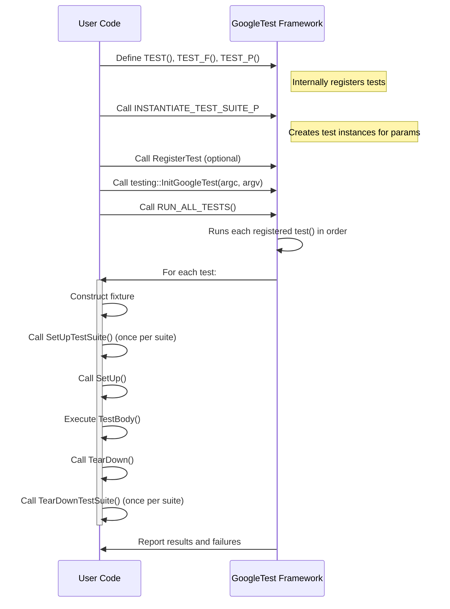

# Defining and Running Tests with GoogleTest

Master the foundations of writing, organizing, and executing tests using GoogleTest's core macros and APIs. This guide delivers a step-by-step walkthrough on defining test cases and suites, employing test fixtures, registering tests dynamically, and understanding the underlying xUnit-inspired test discovery and execution model. Armed with practical code examples and strategies, you'll confidently write robust, maintainable C++ tests that leverage GoogleTest’s powerful features.

---

## Overview

GoogleTest is built around the xUnit testing architecture, supporting tests grouped into test suites (formerly known as test cases) organized logically by functionality or module. Each test is an independent function that exercises a piece of code, verifying expected behavior through assertions. Tests can share common setup and teardown code using test fixtures, enhancing reuse and clarity.

Key concepts covered here include:

- Defining tests with `TEST()` and fixtures with `TEST_F()`.
- Writing value-parameterized tests with `TEST_P` and instantiating them using `INSTANTIATE_TEST_SUITE_P`.
- Registering tests dynamically using `RegisterTest()`.
- Managing test lifecycle methods like `SetUp()`, `TearDown()`, `SetUpTestSuite()`, and `TearDownTestSuite()`.
- Using tracing utilities like `SCOPED_TRACE` to enrich failure context.

Run all defined tests conveniently using the `RUN_ALL_TESTS()` macro, which executes tests and returns a success or failure status.

---

## 1. Writing Simple Tests

### `TEST` Macro

Use the `TEST()` macro to define an individual test function inside a test suite. It takes two parameters: the test suite name and the test name. Both must be valid C++ identifiers without underscores. GoogleTest automatically registers these tests.

```cpp
TEST(FactorialTest, HandlesZeroInput) {
  EXPECT_EQ(Factorial(0), 1);
}

TEST(FactorialTest, HandlesPositiveInput) {
  EXPECT_EQ(Factorial(3), 6);
}
```

- The full name of a test is composed as `TestSuiteName.TestName`.
- Tests in different suites may have the same individual name.

### Outcome

Individual assertions like `EXPECT_EQ` or `ASSERT_TRUE` within the test determine success or failure. A test fails if any assertion fails or if it crashes.

### Execution

Use `RUN_ALL_TESTS()` to execute all registered tests:

```cpp
int main(int argc, char** argv) {
  testing::InitGoogleTest(&argc, argv);
  return RUN_ALL_TESTS();
}
```

---

## 2. Sharing Setup with Test Fixtures

When multiple tests share common setup code and data, use test fixtures.

### Defining a Fixture

1. Derive a class from `testing::Test`.
2. Declare common data members and helper functions.
3. Override `SetUp()` and `TearDown()` if needed.

```cpp
class QueueTest : public testing::Test {
 protected:
  QueueTest() {
    q1_.Enqueue(1);
    q2_.Enqueue(2);
    q2_.Enqueue(3);
  }

  Queue<int> q0_;
  Queue<int> q1_;
  Queue<int> q2_;
};
```

### Writing Tests with Fixtures

Use `TEST_F()` with the fixture class name to write tests that use the shared objects.

```cpp
TEST_F(QueueTest, IsEmptyInitially) {
  EXPECT_EQ(q0_.size(), 0);
}

TEST_F(QueueTest, DequeueWorks) {
  int* n = q1_.Dequeue();
  ASSERT_NE(n, nullptr);
  EXPECT_EQ(*n, 1);
  delete n;
}
```

Each test runs independently with a fresh fixture instance.

### Best Practices

- Use `EXPECT_*` for checks where it makes sense to continue after failure.
- Use `ASSERT_*` when a failure should abort the current test function.

---

## 3. Value-Parameterized Tests

Enable running the same test logic across a set of input values.

### Defining Value-Parameterized Fixtures

Derive from `testing::TestWithParam<T>`, where `T` is the parameter type.

```cpp
class MyTest : public testing::TestWithParam<int> {
  // Optional: setup code
};

TEST_P(MyTest, WorksForAllParams) {
  int param = GetParam();
  EXPECT_GT(param, 0);
}
```

### Instantiating Parameterized Tests

Use `INSTANTIATE_TEST_SUITE_P` with a name prefix, the test suite, and a parameter generator.

```cpp
INSTANTIATE_TEST_SUITE_P(
  PositiveNumbers,
  MyTest,
  testing::Values(1, 2, 3, 10));
```

This generates tests named like `PositiveNumbers/MyTest.WorksForAllParams/0` etc.

### Parameter Generators

GoogleTest offers several parameter generators:

- `Range(start, end [, step])`: sequential values.
- `Values(v1, v2, ..., vN)`: explicit values.
- `ValuesIn(container)`: from arrays or collections.
- `Bool()`: yields `false` and `true`.
- `Combine(g1, g2, ...)`: Cartesian product of multiple generators.
- `ConvertGenerator<T>(generator)`: transforms generated values.

For example, combined boolean and integer parameter:

```cpp
INSTANTIATE_TEST_SUITE_P(Combined, MyTest,
  testing::Combine(testing::Bool(), testing::Range(0, 3)));
```

### Suppressing Uninstantiated Test Warning

If a parameterized test is defined but never instantiated, GoogleTest will issue a failure in the `GoogleTestVerification` suite. To suppress it:

```cpp
GTEST_ALLOW_UNINSTANTIATED_PARAMETERIZED_TEST(MyTest);
```

---

## 4. Typed and Type-Parameterized Tests

Run the same test logic across a set of C++ types.

### Typed Tests

Define a fixture class template parameterized on a type:

```cpp
template <typename T>
class MyTypedTest : public testing::Test {
  // Members can use T
};

using MyTypes = ::testing::Types<int, double, char>;
TYPED_TEST_SUITE(MyTypedTest, MyTypes);
```

Define typed tests with `TYPED_TEST`: 

```cpp
TYPED_TEST(MyTypedTest, DoesSomething) {
  TypeParam val = ...;  // 'TypeParam' is the current type
  EXPECT_TRUE(...);
}
```

### Type-Parameterized Tests

Define type-parameterized tests similarly but defer type list association.

```cpp
template <typename T>
class MyTest : public testing::Test {
  ...
};
TYPED_TEST_SUITE_P(MyTest);

TYPED_TEST_P(MyTest, Test1) { ... }
REGISTER_TYPED_TEST_SUITE_P(MyTest, Test1);

using MyTypes = ::testing::Types<int, double>;
INSTANTIATE_TYPED_TEST_SUITE_P(My, MyTest, MyTypes);
```

---

## 5. Using Test Lifecycle Hooks

GoogleTest provides hooks to manage setup/teardown at various scopes:

- **Per-test:** Override `SetUp()` and `TearDown()` in your test fixture.
- **Per-test-suite:** Define `static void SetUpTestSuite()` and `TearDownTestSuite()` in your fixture class.
- **Global Environment:** Create classes deriving from `testing::Environment` and register them with `AddGlobalTestEnvironment()`.

Example of per-test-suite setup:

```cpp
class FooTest : public testing::Test {
 public:
  static void SetUpTestSuite() {
    shared_resource_ = new Resource();
  }
  static void TearDownTestSuite() {
    delete shared_resource_;
    shared_resource_ = nullptr;
  }

 protected:
  static Resource* shared_resource_;
};

Resource* FooTest::shared_resource_ = nullptr;
```

---

## 6. Dynamic Test Registration

You can register tests dynamically at runtime using `RegisterTest()`.

### Signature

```cpp
template <typename Factory>
TestInfo* RegisterTest(const char* test_suite_name, const char* test_name,
                       const char* type_param, const char* value_param,
                       const char* file, int line, Factory factory);
```

- `factory` is a callable creating instances of a `Test` fixture.
- All tests in the same suite must use the same fixture type.
- Must be called before `RUN_ALL_TESTS()`.

### Use Case Example

```cpp
class MyFixture : public testing::Test {
  ...
};

class MyTest : public MyFixture {
 public:
  explicit MyTest(int data) : data_(data) {}
  void TestBody() override {
    EXPECT_TRUE(SomeCheck(data_));
  }
 private:
  int data_;
};

void RegisterMyTests(const std::vector<int>& values) {
  for (int v : values) {
    testing::RegisterTest(
      "MyFixture", ("Test" + std::to_string(v)).c_str(), nullptr,
      std::to_string(v).c_str(), __FILE__, __LINE__,
      [=]() -> MyFixture* { return new MyTest(v); });
  }
}

int main(int argc, char** argv) {
  testing::InitGoogleTest(&argc, argv);
  std::vector<int> tests = {1, 2, 3};
  RegisterMyTests(tests);
  return RUN_ALL_TESTS();
}
```

This is useful for tests driven by external input or generated programmatically.

---

## 7. Using `SCOPED_TRACE` for Better Failure Context

When calling subroutines or loops inside tests, failures can be hard to pinpoint. `SCOPED_TRACE` inserts additional trace information into failure messages.

```cpp
void HelperFunction(int n) {
  EXPECT_EQ(1, n);
  ASSERT_EQ(2, n);
}

TEST(MyTest, WithTrace) {
  SCOPED_TRACE("Testing with value 5");
  HelperFunction(5);
}
```

Failures inside `HelperFunction` will include the trace message "Testing with value 5" and source location.

### Best Practices

- Use `SCOPED_TRACE` in subroutines that are called frequently.
- Include loop indices in traces for iteration-specific failures.
- Traces respect lexical scopes and stack, giving layered context if nested.

---

## 8. Running the Tests

### Initialization

Before running tests, call:

```cpp
int main(int argc, char** argv) {
  testing::InitGoogleTest(&argc, argv);
  return RUN_ALL_TESTS();
}
```

- `InitGoogleTest()` parses command line flags and initializes.
- `RUN_ALL_TESTS()` executes all registered tests and returns `0` on success.

### Flags and Configuration

- Customize test runs using command-line flags like `--gtest_filter`, `--gtest_repeat`, and `--gtest_shuffle`.
- Use `--gtest_list_tests` to list all test names.

---

## 9. Common Pitfalls and Tips

- Use `ASSERT_*` for conditions that must hold to continue the test.
- Avoid fatal assertions inside constructors or destructors; prefer `SetUp()`/`TearDown()`.
- Remember each test uses a fresh fixture instance; avoid shared mutable state without synchronization.
- Provide meaningful names for test suites and tests, avoiding underscores.
- Always check the return status of `RUN_ALL_TESTS()` in your `main`.

---

## 10. Summary Example

```cpp
#include <gtest/gtest.h>

class Queue {
public:
  void Enqueue(int x) { data_.push_back(x); }
  int* Dequeue() {
    if (data_.empty()) return nullptr;
    int* val = new int(data_.front());
    data_.erase(data_.begin());
    return val;
  }
  size_t size() const { return data_.size(); }

private:
  std::vector<int> data_;
};

class QueueTest : public testing::Test {
 protected:
  QueueTest() {
    q1_.Enqueue(1);
  }
  Queue q0_, q1_;
};

TEST_F(QueueTest, IsEmptyInitially) {
  EXPECT_EQ(q0_.size(), 0);
}

TEST_F(QueueTest, DequeueWorks) {
  int* v = q1_.Dequeue();
  ASSERT_NE(v, nullptr);
  EXPECT_EQ(*v, 1);
  delete v;
}

int main(int argc, char **argv) {
  testing::InitGoogleTest(&argc, argv);
  return RUN_ALL_TESTS();
}
```

With this, you write and execute robust, well-structured C++ tests using GoogleTest.

---

_For detailed API usage and examples, consult:_
- [GoogleTest Primer](https://github.com/google/googletest/blob/main/docs/primer.md)
- [Testing Reference - TEST macros](https://github.com/google/googletest/blob/main/docs/reference/testing.md#TEST)
- [Parameterized Tests](https://github.com/google/googletest/blob/main/docs/advanced.md#value-parameterized-tests)
- [Typed Tests](https://github.com/google/googletest/blob/main/docs/advanced.md#typed-tests)
- [SCOPED_TRACE Usage](https://github.com/google/googletest/blob/main/docs/reference/testing.md#SCOPED_TRACE)

---

<AccordionGroup title="Key API Macros and Functions">
<Accordion title="TEST">
Defines a simple test function.

```cpp
TEST(TestSuiteName, TestName) {
  ...
}
```
</Accordion>
<Accordion title="TEST_F">
Defines a test using a test fixture.

```cpp
TEST_F(FixtureClassName, TestName) {
  ...
}
```
</Accordion>
<Accordion title="TEST_P">
Defines a parameterized test used with `TestWithParam<T>` fixture.

```cpp
TEST_P(FixtureClassName, TestName) {
  auto param = GetParam();
  ...
}
```
</Accordion>
<Accordion title="INSTANTIATE_TEST_SUITE_P">
Instantiates parameterized tests with a parameter generator.

```cpp
INSTANTIATE_TEST_SUITE_P(InstantiationName, TestSuiteName, testing::Values(...));
```
</Accordion>
<Accordion title="RegisterTest">
Registers a test dynamically at runtime.

```cpp
testing::RegisterTest(..., []() -> Fixture* { return new MyTest(params); });
```
</Accordion>
</AccordionGroup>

---

## Mermaid Diagram: Test Definition and Execution Flow



---