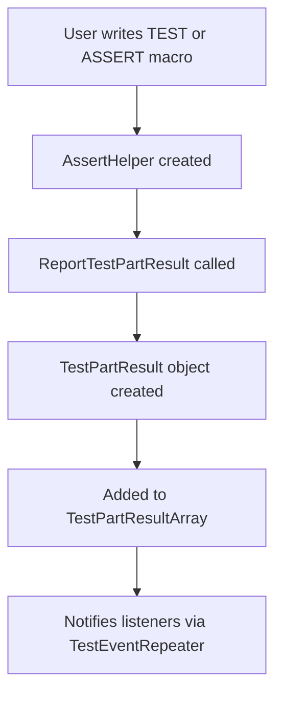

# Internal Support and Test Parts

This documentation provides an in-depth look at GoogleTest's internal support mechanisms for managing test results, assertion reporting, and the infrastructure for representing test parts. This section is crucial for advanced contributors and power users who extend or integrate with the GoogleTest framework, enabling precise control over test event processing and failure reporting.

---

## Overview of Test Parts and Reporting Infrastructure

GoogleTest breaks down each test into discrete **test parts** representing individual assertion results or explicit test outcomes such as successes, failures, and skips. Each test part encapsulates specific metadata including type, location, and messages, and collectively these parts form the backbone for test outcome summaries.

### `TestPartResult` Class

- Represents the result of a single assertion or test step.
- Records the result type: success, non-fatal failure, fatal failure, or skipped.
- Stores file name, line number, a detailed message, and a short summary message.

### `TestPartResultArray` Class

- A container for multiple `TestPartResult` objects.
- Supports appending new results and indexed retrieval.
- Ensures robust access with bounds checking to avoid invalid index usage.

### `TestPartResultReporterInterface`

- Interface to report test part results.
- Allows interception or redirection of assertion results.

---

## Detailed Description of `TestPartResult`

`TestPartResult` stores details for an assertion or test status report. It is instantiated with:

- `Type type`: Result category (success, failure, skip).
- `const char* file_name`: Source file path of the assertion.
- `int line_number`: Source line number of the assertion.
- `const char* message`: The complete failure or success message, which may include stack traces.

The class automatically derives a concise summary by trimming out stack traces from the message.

### Result Types

```cpp
enum Type {
  kSuccess,       // Assertion passed.
  kNonFatalFailure,  // Failed but allows test to continue.
  kFatalFailure,  // Failure that aborts current function/test.
  kSkip           // Test or part was skipped.
};
```

### Accessors

- `type()`: Get the result type.
- `file_name()`: File where assertion occurred (or `nullptr` if unknown).
- `line_number()`: Source line number (or -1 if unknown).
- `summary()`: Short failure message without stack trace.
- `message()`: Full message including detailed info.
- Boolean predicates: `passed()`, `failed()`, `skipped()`, `nonfatally_failed()`, `fatally_failed()`.

### Usage Example

```cpp
// Assertion failure representation
TestPartResult failure(
  TestPartResult::kFatalFailure,
  "foo.cc",
  42,
  "Expected equality but got mismatch\nStack trace: ..."
);
std::cout << "Summary: " << failure.summary() << std::endl;
```

---

## Managing Multiple Test Parts: `TestPartResultArray`

GoogleTest collects multiple assertion results within a test through `TestPartResultArray`:

- Use `Append()` to add a new test part result.
- Use `GetTestPartResult(int index)` to access individual results.
- Uses safe bounds checking; accessing out-of-range indices will terminate the program to protect against undefined behavior.

Example:

```cpp
TestPartResultArray results;
results.Append(failure);
for (int i = 0; i < results.size(); ++i) {
  const TestPartResult& part = results.GetTestPartResult(i);
  std::cout << part.message() << std::endl;
}
```

---

## Reporting Interface

The `TestPartResultReporterInterface` defines how test parts are reported. GoogleTest implements this to enable customized reporting and interception:

- `ReportTestPartResult(const TestPartResult&)`: Receives result notifications.
- Used internally by GoogleTest to distribute assertion outcomes.
- Supports interceptors such as `ScopedFakeTestPartResultReporter`, which can capture reported results for tests or your own tooling.

---

## ScopedFakeTestPartResultReporter: Intercepting Test Failures

This utility enables temporarily intercepting assertion results within a specific thread or globally:

- Construct with a pointer to a `TestPartResultArray` to collect results.
- Choose to intercept only current thread or all threads.
- Automatically restores previous reporter on destruction, ensuring clean state.

Example of use:

```cpp
TestPartResultArray failures;
{
  ScopedFakeTestPartResultReporter reporter(
      ScopedFakeTestPartResultReporter::INTERCEPT_ONLY_CURRENT_THREAD,
      &failures);
  EXPECT_EQ(1, 2);  // Fails and is captured in failures
}
// Check failures.size() for test validation
```

---

## Assertions Handling and Failure Messages

GoogleTest's assertion macros internally create `AssertHelper` objects that report the assertion status:

- `AssertHelper` is constructed with the result type, file, line, and message.
- Supports streaming failure details via the `operator=`, allowing for rich custom message construction.

Example:

```cpp
ASSERT_EQ(val1, val2) << "Failure details";
```

translates internally into constructing and reporting a `TestPartResult` with attached messages.

---

## Exception Safety and Stack Trace Support

- GoogleTest optionally catches exceptions thrown by tests and converts them into failures.
- On failure, stack traces (when enabled) are included in failure messages for easier debugging.
- Stack traces omit internal GoogleTest frames by default to focus on user code.

---

## Utility Functions and Helpers

GoogleTest includes internal helpers to support advanced failure reporting:

- `ExtractSummary()`: Extracts concise failure messages without stack traces.
- `GetCurrentOsStackTraceExceptTop()`: Retrieves current OS stack trace, skipping framework internals.
- `AppendUserMessage()`: Combines GoogleTest messages with user-supplied context.

---

## Code Snippet: Exception-Safe Assertion Reporting

```cpp
class AssertHelper {
 public:
  AssertHelper(TestPartResult::Type type, const char* file, int line,
               const char* message);
  ~AssertHelper();
  void operator=(const Message& message) const;
 private:
  struct AssertHelperData {
    TestPartResult::Type type;
    const char* file;
    int line;
    std::string message;
  }* data_;
};
```

This enables GoogleTest macros to seamlessly stream error messages that are then collected and reported to the test event listeners.

---

## Diagram: Test Result Reporting Flow



---

## Practical Tips

- Use GoogleTest assertion macros (`EXPECT_*`, `ASSERT_*`) to generate `TestPartResult`s automatically.
- Leverage `ScopedFakeTestPartResultReporter` for advanced testing or mocking of assertion behavior.
- Avoid direct manipulation of test parts unless extending GoogleTest internals.
- Customize failure reporting by implementing or wrapping `TestPartResultReporterInterface`.

---

## Troubleshooting Common Issues

- **Invalid index access in `TestPartResultArray`**: Ensure indices passed to `GetTestPartResult` are within valid range.
- **Unexpected assertion interleaving**: Use scoped test part reporters to isolate failures when testing failure-reporting code.
- **Missing stack traces**: Enable GoogleTest's stack trace flags and configure environment to allow failure signal handlers.

---

## References

- [GoogleTest Testing Reference](reference/testing.md) — for overview of test lifecycle.
- [GoogleTest Primer](primer.md) — foundational concepts and basic test writing.
- [GoogleTest Core Assertion Macros](api-reference/googletest-core-apis/assertion-macros.md) — macros that generate `TestPartResult`s.
- [ScopedFakeTestPartResultReporter](reference/testing.md#ScopedFakeTestPartResultReporter) — for testing with intercepted assertion results.
- Source code at [`googletest/include/gtest/gtest-test-part.h`](https://github.com/google/googletest/blob/main/googletest/include/gtest/gtest-test-part.h)

---

This section enables power users and contributors to understand and utilize GoogleTest's internal mechanisms for assertion and test result reporting, critical for building advanced testing scenarios and custom tooling integrations.