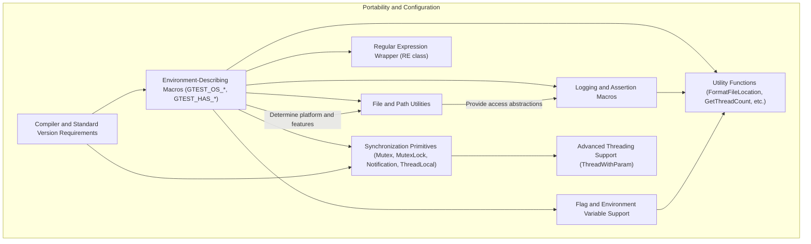

# Portability and Configuration

GoogleTest’s portability and configuration mechanisms are fundamental to enabling its seamless operation across diverse computing environments. This page documents the key macros, utilities, and low-level APIs designed to detect platform features, configure environment parameters, handle synchronization primitives, and provide consistent cross-platform behavior. These building blocks allow GoogleTest to adapt to different compilers, operating systems, threading models, and runtime environments while maintaining stable and predictable test execution.

---

## Environment-Describing Macros

GoogleTest uses a set of macros to automatically detect and describe the compilation environment. These macros configure platform-specific features and enable conditional compilation, allowing GoogleTest to optimize behavior and interface correctly with underlying OS and toolchain capabilities.

### Platform Identification

GoogleTest defines macros such as `GTEST_OS_WINDOWS`, `GTEST_OS_LINUX`, `GTEST_OS_MAC`, and others to reflect the detected operating system. These macros are always defined as `1` if true and remain undefined otherwise. This allows the library and user tests to write platform-specific code safely.

### Feature Availability

Feature-related macros, like `GTEST_HAS_EXCEPTIONS`, `GTEST_HAS_PTHREAD`, and `GTEST_HAS_RTTI`, indicate the presence or absence of language or runtime features such as exception handling support, pthreads availability, and RTTI support. GoogleTest attempts to auto-detect these but allows users to override them when necessary.

### Stream Redirection and Death Tests

Additional macros like `GTEST_HAS_STREAM_REDIRECTION` and `GTEST_HAS_DEATH_TEST` indicate support for capturing stdout/stderr and safely running death tests across platforms.

<Check>
Use these macros to write portable tests that behave correctly whether exceptions, threads, or other features are available.
</Check>

---

## Synchronization Primitives

Thread safety is crucial for running tests in multi-threaded environments. GoogleTest provides synchronization primitives including Mutexes, Locks, Notifications, and ThreadLocal storage with consistent APIs abstracting platform differences.

### `Mutex` and `MutexLock`

- **Mutex**: A platform-dependent mutex implementation with methods to `Lock()`, `Unlock()`, and `AssertHeld()`. Allows mutual exclusion to protect shared resources.
- **MutexLock**: A scoped guard that acquires a mutex on construction and releases it upon destruction, providing RAII semantics.

Different implementations exist depending on platform and threading model. For example, Windows uses native critical sections, pthread systems use `pthread_mutex_t`, and non-threadsafe builds provide dummy implementations.

### `Notification`

A lightweight thread notification class that allows a controller thread to block execution of other threads until notified. This is useful in test scenarios to coordinate thread startup.

### `ThreadLocal<T>`

Provides thread-local storage for instances of type `T`, allowing each thread to have an independent instance. GoogleTest offers this abstraction with implementations for Windows, pthreads, or a dummy version when threads are unsupported.

<Steps>
<Step title="Synchronize access to shared data">
Create a `Mutex` instance and use `MutexLock` for scoped locking to protect critical sections.
</Step>
<Step title="Coordinate thread start-up">
Use `Notification` to have threads wait until the controller signals they should proceed.
</Step>
<Step title="Manage per-thread data">
Use `ThreadLocal<T>` to store data unique to each thread safely.
</Step>
</Steps>

---

## Regular Expression Wrappers

GoogleTest supports multiple regular expression implementations, wrapped under a unified class `RE`.

- **RE2-based Implementation**: When GoogleTest is built with Abseil and RE2, it uses RE2 syntax and APIs.
- **POSIX Regex**: On platforms supporting POSIX regex APIs, uses `regex.h`.
- **Simple Regex**: Provides minimal regex functionality on other platforms.

The `RE` class supports constructing regex objects from strings and offers static methods for full and partial string matching.

---

## File and Path Utilities

GoogleTest internally abstracts file system interactions to maintain portability and uniform behavior.

- **Path Separators**: Uses `GTEST_PATH_SEP_` macro for native file separator, e.g., `"/"` or `"\\"`.
- **File Operations**: Wrappers for `fopen`, `fclose`, `stat`, `rm_dir`, and checking if a path is a directory.
- **Error Handling**: Consistent retrieval of error strings and handling of environment variables.

<Note>
Embedded or mobile platforms may lack certain file system capabilities; the abstractions gracefully degrade without breaking.
</Note>

---

## Logging and Assertions Macros

Customized macros provide uniform, portable logging and runtime checks.

- `GTEST_LOG_(severity)`: Logs messages with consistent severity levels.
- `GTEST_CHECK_`: An all-mode assertion that aborts whenever a condition is false.
- `GTEST_CHECK_POSIX_SUCCESS_`: Checks POSIX function calls for success, aborting on failure.

Best practices include streaming messages to these macros for detailed failure reports and avoiding usage where developers intend to skip error checks.

---

## Utility Functions

Several widely used utilities facilitate common tasks:

- **FormatFileLocation** and **FormatCompilerIndependentFileLocation**: Generate file and line location strings suitable for error messages and XML reports.
- **GetThreadCount**: Returns an approximate number of active threads, useful for diagnostics and test mechanisms.
- **Command Line Utilities**: Functions manipulating command line argument vectors for injection or retrieval, mostly used for death tests.

---

## Flag and Environment Variable Support

To support flexible test configuration, GoogleTest abstracts command-line flags and environment variables:

- Macros for defining, declaring, getting, and setting flags.
- Integration with Abseil Flags when available, or fallback to internally defined variables.
- Utilities to parse environment variables as bool, int32, or string, providing environment-based configuration options.

<Tip>
When designing test binaries or frameworks that embed GoogleTest, use provided flag macros and environment parsing utilities to unify configuration handling.
</Tip>

---

## Compiler and C++ Standard Requirements

GoogleTest requires compilation with C++17 or higher. It employs feature detection macros to confirm C++ language version compliance and enables or disables functionality accordingly.

Additionally:

- MSVC support requires Visual C++ 2015 or newer.
- Specific compiler warnings are suppressed or adjusted to ensure compatibility.

---

## Advanced Threading Support

For platforms supporting threads:

- GoogleTest provides a `ThreadWithParam<T>` helper for running functions in threads and synchronizing with notifications.
- Supports lazy static mutex initialization, supports static mutex declarations, and ensures scoped locking correctness.

This advanced threading support is mainly internal but surfaces through GoogleTest’s thread-safe assertion and test execution patterns.

---

## Platform Support Matrix

See [Supported Platforms](https://github.com/google/googletest/blob/main/docs/platforms.md) for the current list of officially supported operating systems, compilers, and environments.

---

## Troubleshooting and Best Practices

- **Feature Detection**: If GoogleTest misdetects exceptions, RTTI, or threading support, manually set the corresponding macros like `GTEST_HAS_EXCEPTIONS` or `GTEST_HAS_PTHREAD` at build time.
- **Thread Safety**: Use synchronization primitives appropriately in user code to avoid race conditions, especially when running tests concurrently.
- **Regex Usage**: Use GoogleTest regex wrapper class `RE` for portable regex; understand underlying engine differences if encountering subtle behavioral differences.
- **File System**: Confirm file path correctness and platform capabilities, especially for embedded or mobile targets.

<Warning>
Avoid depending on internal macros or symbols ending with underscores; only use documented public APIs and macros to ensure compatibility with future releases.
</Warning>

---

## Summary Diagram

---

## Related Documentation

- [GoogleTest Primer](https://google.github.io/googletest/primer.html): Overview of writing and running tests.
- [Core Concepts & Architecture Overview](/overview/core-concepts-architecture/architecture-overview): Understand architecture context.
- [Assertion Macros](/api-reference/googletest-core-apis/assertion-macros): Using assertion macros with platform portability.
- [Build Integration](/guides/integration-and-best-practices/build-integration): How to configure build environments for GoogleTest.
- [Supported Platforms](https://github.com/google/googletest/blob/main/docs/platforms.md): Platform compatibility matrix.

---

## Practical Tips

- Define environment macros only if necessary; rely on automatic detection to reduce manual errors.
- Always use `MutexLock` instead of manual locking/unlocking for exception-safe critical sections.
- Prefer GoogleTest’s `RE` class for regex matching for portability.
- When working in cross-platform projects, avoid filesystem-specific assumptions; use the provided wrappers.
- Use `GTEST_CHECK_` for assertions that must never be silently ignored, especially in critical sections.
- On complex projects, verify thread safety explicitly when integrating GoogleTest with multiple concurrent tests.

---

By leveraging these portability and configuration facilities, GoogleTest ensures reliable, consistent, and maintainable testing across the broad spectrum of C++ development environments.
