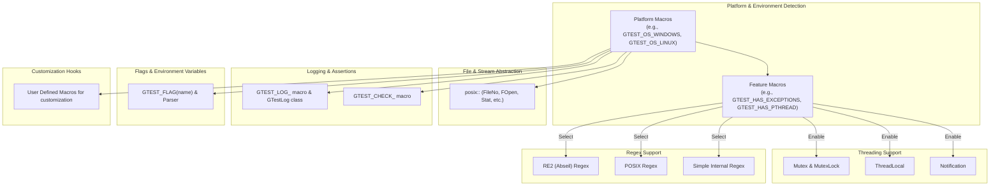

# Platform Abstractions & Portability

GoogleTest and GoogleMock provide a comprehensive set of macros, types, and internal utilities designed to ensure robust compatibility across a wide range of C++ platforms and compilers. This reference details the foundational environment detection, macro configuration, threading and synchronization primitives, file system adaptations, and flag management that make GoogleTest and GoogleMock portable and adaptable to diverse operating systems and build configurations.

---

## 1. Environment Detection and Configuration Macros

GoogleTest automatically detects the compilation environment to enable or disable features accordingly. This ensures reliable operation across platforms with different capabilities and constraints. Users can override these detections with build-time macro definitions for fine-tuned control.

### Platform-Indicating Macros

GoogleTest defines a set of macros to describe the target platform at compile time. Each macro is either defined as `1` if applicable, or undefined otherwise — never defined to `0`. These macros are automatically set and include:

| Macro                     | Description                     |
|---------------------------|--------------------------------|
| `GTEST_OS_LINUX`           | Linux-based systems             |
| `GTEST_OS_WINDOWS`         | Windows desktop and variants    |
| `GTEST_OS_MAC`             | Mac OS X                       |
| `GTEST_OS_CYGWIN`          | Cygwin environment             |
| ... and others (AIX, BSDs, Android, iOS, Solaris, etc.) |    |

For platform-specific code, use `#if` conditional checks against these macros (avoid `#ifdef`).

> **Note:** Users must never define these platform macros themselves; GoogleTest handles their correctness.

### Feature-Indicating Macros

To also adapt behavior to platform capabilities, GoogleTest defines macros indicating availability of features such as:

- `GTEST_HAS_EXCEPTIONS`: Defines if C++ exceptions are enabled.
- `GTEST_HAS_PTHREAD`: Indicates presence of POSIX threads.
- `GTEST_HAS_RTTI`: Indicates Run-time Type Information support.
- `GTEST_HAS_STD_WSTRING`: Availability of `std::wstring` support.
- `GTEST_HAS_POSIX_RE`: POSIX Extended Regex availability.
- `GTEST_HAS_CLONE`: Availability of Linux `clone(2)` system call.
- `GTEST_HAS_STREAM_REDIRECTION`: Whether stream redirection (for stdout/stderr capturing) is supported.
- `GTEST_HAS_DEATH_TEST`: Whether death tests are supported on the platform.

These flags allow GoogleTest to gracefully degrade or enable advanced features matching the platform's capabilities.

### User-Configurable Macros

GoogleTest exposes a select set of macros users may define in their build system to override defaults, including:

- `GTEST_HAS_EXCEPTIONS`: Set to 1 or 0 to enable/disable exception support.
- `GTEST_HAS_PTHREAD`: Enable/disable pthread usage as per availability.
- `GTEST_CREATE_SHARED_LIBRARY` and `GTEST_LINKED_AS_SHARED_LIBRARY`: Control shared library (DLL) builds.
- `GTEST_DEFAULT_DEATH_TEST_STYLE`: Customize default death test behavior (`fast` or `threadsafe`).

Use such macros cautiously as they significantly affect GoogleTest's internal behavior.

---

## 2. Threading and Synchronization Support

Thread safety and concurrency support are fundamental for GoogleTest in multi-threaded environments. The library detects the thread environment and provides portable synchronization primitives.

### Threading Support Detection

- `GTEST_IS_THREADSAFE` is defined to 1 when thread safety is supported (based on mutex/thread-local storage availability).
- By default, this occurs if `pthreads` are available or if Windows native threading primitives are supported.

If threading support is missing, GoogleTest compiles with dummy no-op implementations of synchronization primitives, suitable for single-threaded use only.

### Mutex and Lock Primitives

GoogleTest provides `Mutex` and `MutexLock` classes as portable primitives:

- On Windows, `Mutex` wraps `CRITICAL_SECTION` with lazy initialization.
- On pthreads platforms, `Mutex` wraps `pthread_mutex_t`.
- In no-thread-support builds, `Mutex` and `MutexLock` are dummy classes with no effect.

Users should use `MutexLock` to guard critical sections safely:

```cpp
Mutex mu;
{
  MutexLock lock(&mu);  // Locks mutex within scope
  // Critical section
}
// Mutex unlocked automatically
```

Static mutex instances can be declared and defined using the provided macros:

- `GTEST_DECLARE_STATIC_MUTEX_(mutex_name)`
- `GTEST_DEFINE_STATIC_MUTEX_(mutex_name)`

### Thread Local Storage (TLS)

GoogleTest abstracts TLS for storing thread-specific data using the template class `ThreadLocal<T>`:

- On Windows, TLS is implemented using platform APIs.
- On pthreads platforms, uses `pthread_key_t`.
- If threading is not supported, TLS falls back to a simple instance variable.

Example:

```cpp
ThreadLocal<int> tls(42);
int val = tls.get();  // Gets thread-specific value
```

---

## 3. File and Path Utilities

To ensure cross-platform compatibility for file system operations, GoogleTest provides abstractions encapsulated in the `posix` namespace.

### File Descriptor and Stream Handling

- `posix::FileNo(FILE* file)`: Returns the file descriptor integer for a FILE pointer.
- `posix::FOpen(path, mode)`: Opens a file path as FILE*, supporting wide paths on Windows.
- `posix::FReopen`, `posix::FDOpen`, and other wrappers abstract platform differences.

### Directory and File Information

- `posix::Stat(path, StatStruct*)`: Platform-adapted wrapper for `stat()` system call.
- `posix::RmDir(directory)`: Remove a directory.
- `posix::IsDir(stat_struct)`: Predicate to check if `StatStruct` represents a directory.

### Terminal Detection

- `posix::IsATTY(fd)`: Returns whether the file descriptor is associated with a terminal/console.

### Path Separators

- Macro `GTEST_PATH_SEP_` is defined as `'\'` on Windows and `'/'` elsewhere.
- `GTEST_HAS_ALT_PATH_SEP_` indicates if alternative path separators are supported.

These utilities internally handle platform differences, such as Windows using wide-character APIs or the lack of POSIX functions on some embedded platforms.

---

## 4. Regular Expression Support

GoogleTest uses regular expressions internally and adapts to environment capabilities:

- If built with Abseil, uses `RE2` library.
- If POSIX regex is available, uses `<regex.h>` with POSIX Extended syntax.
- Otherwise, falls back to its own simple regex implementation.

The class `testing::internal::RE` wraps the regular expression functionality, providing methods like `FullMatch()` and `PartialMatch()` for matching strings against patterns.

---

## 5. Logging and Assertion Utilities

GoogleTest defines macros for logging messages at various severity levels:

- `GTEST_LOG_(severity)`: Streaming macro for logging
- `LogToStderr()` and `FlushInfoLog()` to control output

Levels include `GTEST_INFO`, `GTEST_WARNING`, `GTEST_ERROR`, and `GTEST_FATAL`.

GoogleTest also provides internal assert macros such as `GTEST_CHECK_()` for enforcing conditions with logging and abort.

These mechanisms guarantee that failure information is clearly reported regardless of platform or compiler.

---

## 6. Command-Line Flags and Environment Variables

GoogleTest supports configuration via command-line flags and environment variables.

- Flag macros allow referencing, defining, and declaring flags in a consistent manner (e.g., `GTEST_FLAG(name)`).
- Flag values can be overridden by environment variables, providing flexible configuration.

```cpp
// Example: Define a boolean flag with default value.
GTEST_DEFINE_bool_(verbose, false, "Enable verbose output")

// Access flag value
if (GTEST_FLAG(verbose)) {
  // Verbose logic
}
```

This abstraction allows seamless integration with native flag-parsing or third-party libraries like Abseil Flags.

---

## 7. Customization and Extension Points

GoogleTest exposes customization hooks primarily via macros that users can define prior to compilation to adjust behavior or integrate custom implementations.

Key customization points include:

- **Logging overrides:** e.g., override `GTEST_LOG_`, `GTEST_CHECK_` macros and functions
- **Threading/primitives:** ability to provide custom implementations for `Mutex`, `ThreadLocal`, and `Notification`
- **File system access overrides:** e.g., `GTEST_CUSTOM_TEMPDIR_FUNCTION_`
- **Stack trace getters:** by defining `GTEST_OS_STACK_TRACE_GETTER_`

These permit deep customization for specialized environments or embedding scenarios.

For users wishing to extend or port GoogleTest to new platforms, this header (`gtest-port.h`) is the key entry point to adapt fundamental behavior.

---

## 8. Summary Mermaid Diagram of Portability Components



---

## Best Practices and Common Pitfalls

- **Do rely on platform macros to adapt code:** Use the defined macros like `GTEST_OS_WINDOWS` and `GTEST_HAS_PTHREAD` to write portable code that works consistently across supported platforms.

- **Do define necessary user macros only when required:** If your build environment misdetects features, set user macros like `GTEST_HAS_PTHREAD=0` explicitly.

- **Do not include GoogleTest internal headers directly:** Use `gtest/gtest.h` to include GoogleTest which internally includes port abstractions.

- **Avoid using internal macros and functions:** Those ending with underscores (e.g., `GTEST_CHECK_`) and symbols in internal namespaces are for GoogleTest internal use only.

- **Ensure your build environment supports C++17 or later:** GoogleTest requires C++17 features to function properly.

- **For embedded platforms or special environments:** Customize using the hooks provided in the `custom` directory and override necessary macros.

- **When troubleshooting:** Verify platform and feature macros values during compile-time to understand which code branches GoogleTest enables.

---

## Additional Resources & Links

- [googletest/include/gtest/internal/gtest-port.h](https://github.com/google/googletest/blob/main/googletest/include/gtest/internal/gtest-port.h) — Source of platform abstraction macros and utilities.
- [googletest/include/gtest/internal/gtest-port-arch.h](https://github.com/google/googletest/blob/main/googletest/include/gtest/internal/gtest-port-arch.h) — Platform detection logic header.
- [Customization Points](https://github.com/google/googletest/blob/main/googletest/include/gtest/internal/custom/README.md) — Learn how to extend or override platform-specific behavior.
- [System Requirements](../../../getting-started/prerequisites-installation/system-requirements.md) — Details on supported compilers and platforms.
- [Platform Abstractions Guide (Conceptual)](../../../concepts/core_architecture/portability_configurability.md) — Overview of portability strategies.

---

## Troubleshooting

If you encounter issues related to platform support or threading:

- Verify the macros defined by examining the preprocessor output (e.g., `gcc -dM` or `clang -dM`).
- Confirm that your compiler supports C++17 or later.
- Check if you correctly pass necessary flags to enable pthread or shared library support.
- If GoogleTest fails to detect features properly, explicitly define overriding macros in your build (for example, `-DGTEST_HAS_PTHREAD=1`).
- On Windows, ensure that runtime libraries and compiler flags are consistent (see Visual Studio Dynamic vs Static Runtime notes).

---

## Example: Inspecting Platform Macros

You can check what macros GoogleTest detects by running the following snippet:

```cpp
#include <iostream>
#include <gtest/internal/gtest-port.h>

int main() {
#ifdef GTEST_OS_WINDOWS
  std::cout << "Running on Windows platform.\n";
#endif
#if GTEST_HAS_PTHREAD
  std::cout << "pthread support ENABLED.\n";
#else
  std::cout << "pthread support DISABLED.\n";
#endif
  return 0;
}
```

Compile and run to confirm the environment detection.

---

This foundation ensures GoogleTest and GoogleMock deliver dependable, uniform behavior regardless of your C++ development platform.