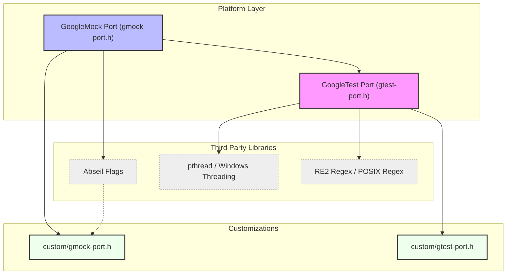

# Portability and Configuration Utilities

This page provides a comprehensive reference for the platform abstraction and portability macros used within GoogleTest and GoogleMock. It also details configuration options, including integration with Abseil flags and GoogleTest's portability layers. This is essential reading for contributors working on GoogleTest/GoogleMock internals or users embedding these frameworks in non-standard or embedded environments.

---

## 1. Purpose and Scope

GoogleTest and GoogleMock are designed for portability across a wide array of platforms, compilers, and environments. The portability and configuration utilities ensure that the framework adapts seamlessly by detecting platform capabilities and defining appropriate macros and utilities.

This page documents these abstractions, including:

- Platform and compiler feature detection
- Threading and synchronization primitives
- Filesystem and I/O compatibility layers
- Command-line flag mechanism integration (including Abseil flags)
- GoogleTest and GoogleMock internal configuration macros

These utilities underpin the reliability and portability of the entire testing framework.

---

## 2. Platform and Compiler Feature Detection

GoogleTest/GoogleMock internally define macros to identify platform features and capabilities in a systematic, consistent way. These macros:

- Are always defined to either `1` (true) or `0` (false) so downstream code can rely on straightforward checks.
- Indicate presence or absence of features such as:
  - Exception support (`GTEST_HAS_EXCEPTIONS`)
  - RTTI (`GTEST_HAS_RTTI`)
  - POSIX threads (`GTEST_HAS_PTHREAD`)
  - Availability of POSIX extended regular expressions
  - File system availability
  - Stream redirection support
  - Microsoft SEH support (`GTEST_HAS_SEH`)

### Usage

Users embedding GoogleTest/GoogleMock should **not** define these macros themselves but rely on proper detection built into the framework. However, in custom or limited environments, defining these macros explicitly in build settings or custom `gmock-port.h` can be necessary to override detection.

---

## 3. Threading and Synchronization

### Mutex and Lock Abstractions

The portability utilities provide implementations of:

- `Mutex` - platform-appropriate mutex implementation
- `MutexLock` - RAII-style lock guard

On Windows, GoogleTest uses native Windows synchronization primitives. On POSIX platforms, it uses `pthread_mutex_t`. Where threading is not supported, dummy implementations are provided.

### Thread-Local Storage

Thread-Local Storage (TLS) is supported via `ThreadLocal<T>` template class:

- Uses native TLS mechanisms (Windows TLS APIs, pthread keys)
- Provides per-thread instances initialized with default values
- Guarantees cleanup on thread exit on supported platforms

### Threads Utilities

For testing GoogleTest’s own multithreading constructs:

- `ThreadWithParam<T>` runs a function on a new thread with given parameters.
- `Notification` is a portable thread synchronization primitive for signaling across threads.

---

## 4. Filesystem and I/O Compatibility

GoogleTest internal utilities wrap around system I/O, filesystem, and environment access to provide a uniform interface:

- File and directory operations: `Stat()`, `RmDir()`, `IsDir()`, platform specific implementations.
- File descriptor and stream operations: `FileNo()`, `FOpen()`, `FReopen()`, `FDOpen()`, `FClose()`, `Read()`, `Write()`, and `Close()` with platform-specific fallbacks.
- Environment variable access: `GetEnv()` abstracts environment variable retrieval, including safe failure on embedded platforms without environment variables.

These layers avoid portability bugs in tests relying on file I/O or environment state.

---

## 5. Logging and Output Facilities

GoogleTest defines logging utilities such as `GTEST_LOG_` macros to emit logs at various severity levels: `INFO`, `WARNING`, `ERROR`, and `FATAL`.

This includes:

- Stream-based logging with automatic stream flushing
- Fatal log entries terminating the program
- Logging format utilities for file locations in error messages

---

## 6. Command Line Flags and Integration with Abseil

GoogleTest and GoogleMock support command-line flags for configuration.

### Flag Definitions and Usage:

- Macros such as `GTEST_DEFINE_bool_`, `GTEST_DEFINE_int32_`, and `GTEST_DEFINE_string_` define flags internally.
- When built with Abseil support, flags use Abseil's `ABSL_FLAG` macro for consistent, powerful flag parsing.
- GoogleMock similarly declares and defines its own flags, such as `gmock_verbose`, integrated with Abseil when available.

### Flag Access

- Use the macro `GTEST_FLAG(name)` or `GMOCK_FLAG(name)` to reference flags programmatically.
- Flags are parsed and removed from `argv` on initialization (e.g., via `InitGoogleTest()`, `InitGoogleMock()`).

---

## 7. Initialization Functions

### `InitGoogleMock`

The main entry point to initialize GoogleMock, which:

- Parses command-line flags relevant to GoogleMock.
- Removes recognized flags from `argv` and adjusts `argc`.
- Internally also initializes GoogleTest.
- Supports overloads for standard, wide-character Windows, and embedded environments without command-line arguments.

**Usage example:**
```cpp
int main(int argc, char** argv) {
  testing::InitGoogleMock(&argc, argv);
  return RUN_ALL_TESTS();
}
```

Special versions exist for wide strings (`wchar_t** argv`) and no-argument initialization.

---

## 8. Important Macros and Declarations

### GoogleMock Flags Declarations

GoogleMock declares key flags for users:

- `catch_leaked_mocks`: Determines if leaked mock objects cause errors.
- `verbose`: Controls verbosity of mocking output (`info`, `warning`, `error`).
- `default_mock_behavior`: Default behavior for mocks (e.g., naggy, nice, strict).

These flags are declared via macros like `GMOCK_DECLARE_bool_` and accessed via `GMOCK_FLAG()`.

### Other Portability Macros

GoogleTest and GoogleMock define macros for compiler attributes, function annotations (`GTEST_NO_INLINE_`), string manipulation, and error checking wrappers.

They also manage warnings and pragmas to enable cross-platform compatibility with compilers such as MSVC, Clang, GCC, and Intel.

---

## 9. Best Practices for Embedding and Contribution

- Respect the macro naming conventions — macros ending with `_` are internal and may change without notice.
- Use public macros and flags for configuration.
- For embedding GoogleTest/GoogleMock in non-standard or embedded platforms, override portability macros and possibly define your own versions in the customization header `gmock/internal/custom/gmock-port.h`.
- When defining custom flags or features, leverage the existing macro infrastructure for consistency.

---

## 10. Troubleshooting Common Issues

- **Flag parsing errors:** Ensure initialization functions `InitGoogleTest` or `InitGoogleMock` are called before any test execution.
- **Threading primitives missing:** Define build macros like `GTEST_HAS_PTHREAD` or equivalent or configure threading support.
- **Missing features or porting errors:** Provide overrides in custom port headers and confirm feature macros.

---

## 11. References and Further Reading

- [GoogleTest Portability Layer (`gtest-port.h`)](https://github.com/google/googletest/blob/main/googletest/include/gtest/internal/gtest-port.h) — underlying portability macros and utilities referenced here.
- [GoogleMock Portability Layer (`gmock-port.h`)](https://github.com/google/googletest/blob/main/googlemock/include/gmock/internal/gmock-port.h) — mocking-specific portability utilities.
- [Abseil Flags Integration](https://abseil.io/docs/cpp/guides/flags) — documentation on flag handling when GoogleTest is built with Abseil.
- [InitGoogleMock() Usage](https://github.com/google/googletest/blob/main/googlemock/include/gmock/gmock.h#L56-L71) — function overloads and descriptions.
- [Customization Points (`custom/gmock-port.h`)](https://github.com/google/googletest/tree/main/googlemock/include/gmock/internal/custom) — injection points for adapting GoogleMock portability.

---

## Appendix: Mermaid Diagram - Platform Abstraction Layers


