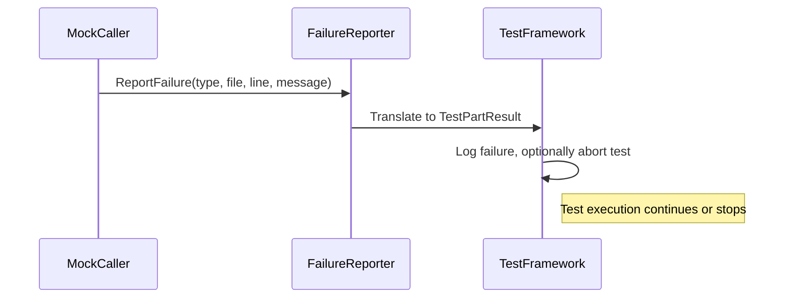

# Internal Helpers and Advanced Utilities

This documentation covers the internal helper classes, failure reporting mechanisms, logging utilities, and advanced type traits used within GoogleTest and GoogleMock. While these components are not part of the public stable API, they provide valuable tools for extensibility, robust testing, and custom test logic.

---

## 1. Overview of Internal Helpers

GoogleTest and GoogleMock include a collection of internal utilities designed to handle detailed functionality such as failure reporting, logging with verbosity control, type trait computations, and container adaptations. These components are foundational for the framework's capability to provide expressive assertion failures and matcher diagnostics.

These utilities encompass:

- **Failure Reporters:** Interfaces and classes that capture and route failure messages, integrating GoogleMock failures with GoogleTest's output mechanisms.
- **Logging Facilities:** Severity-controlled logging functions that respect the verbosity flag and synchronize output.
- **Type Traits and Conversions:** Compile-time utilities that classify arithmetic types, perform lossless conversions, and facilitate safe matcher casting.
- **Container and Tuple Adaptors:** Wrappers to support native arrays in container matchers and to optimize tuple unpacking for matcher use.

## 2. Failure Reporting Mechanisms

At the core of internal failure management is the `FailureReporterInterface`, an abstract interface that exposes a method:

```cpp
virtual void ReportFailure(FailureType type, const char* file, int line, const std::string& message) = 0;
```

where `FailureType` distinguishes fatal from non-fatal failures.

GoogleTest provides a built-in implementation:

### GoogleTestFailureReporter

This class converts GoogleMock's failure reports into GoogleTest's test part results, allowing seamless integration of failure diagnostics:

- Reports fatal failures with abortion behavior.
- Non-fatal failures are captured to allow the test to continue.

Usage is generally internal; however, understanding this mapping helps users who extend GoogleMock with custom failure reporting logic.

Example scenario:

```cpp
// When a mock expectation fails:
internal::GetFailureReporter()->ReportFailure(
    FailureReporterInterface::kFatal, __FILE__, __LINE__, "Expected call not met.");
```

## 3. Logging Utilities

Logging within GoogleMock follows verbosity controlled by the `--gmock_verbose` flag. It supports three levels:

| Level    | Description                       |
|----------|---------------------------------|
| info     | All logs (info and warnings)     |
| warning  | Warnings only                   |
| error    | No logs printed                 |

### Log API

```cpp
void Log(LogSeverity severity, const std::string& message, int stack_frames_to_skip);
```

- Logs messages to standard output if their severity meets or exceeds the verbosity threshold.
- Supports optional stack traces, skipping frames corresponding to logging internals.
- Thread-safe output serialization prevents interleaving in multi-threaded environments.

### Tips:

- Use `kWarning` severity for cautionary messages to assist diagnosis.
- Stack traces enhance log utility especially during debugging unexpected failures.

## 4. Advanced Type Traits and Safe Casting

GoogleTest defines sophisticated type trait utilities to safely manage type conversions, pointer extractions, and matcher casts:

### TypeKind Enumeration

Categorizes types into `kBool`, `kInteger`, `kFloatingPoint`, and `kOther` for precise conversion handling.

### LosslessArithmeticConvertible

A trait that verifies if arithmetic conversions between two types are lossless, preventing silent data corruption.

### Safe Matcher Casting

The internal `MatcherCast` and `SafeMatcherCast` utilities facilitate safe conversions between matcher types in GoogleMock, ensuring compatibility and type correctness in matcher usage.

### GetRawPointer Utility

Extracts raw pointers from smart pointers or reference wrappers transparently for matcher implementations dealing with pointer semantics.

## 5. Container and Tuple Adaptations

To support matchers on containers and tuples, GoogleTest offers internal adaptations:

- **StlContainerView:** Provides a unified STL-style interface over native arrays, tuples of pointers, and standard containers.
- **NativeArray:** Adapts native C arrays to STL-style containers, allowing container matchers to work seamlessly with arrays.
- **FlatTuple:** A tuple implementation optimized to minimize template instantiation depth and improve compile-time.

These components enable matchers to operate uniformly on user data structures, providing better diagnostics and flexible assertions.

## 6. Assertion and Error Handling Enhancements

Utilities like `Assert` and `Expect` functions encapsulate the GoogleTest internal failure reporting, differentiating between fatal and non-fatal assertions and ensuring standardized error messaging.

```cpp
inline void Assert(bool condition, const char* file, int line, const std::string& msg);
inline void Expect(bool condition, const char* file, int line, const std::string& msg);
```

Failing conditions invoke the failure reporter and may cause test abortion.

## 7. Usage Considerations and Extensibility

While internal helper classes and utilities are not exposed as part of the public stable API, they are critical in extending GoogleTest and GoogleMock. For instance, users implementing custom matchers or actions might rely on internal utilities for failure reporting and type safety.

### Best Practices

- Avoid direct use of internal utilities unless extending the framework.
- Use official APIs like `EXPECT_CALL`, `ASSERT_*`, and matchers for regular test writing.
- When extending, consult the internal utilities to ensure consistency with GoogleTest's failure and logging paradigms.

## 8. Practical Example: Failure Reporting Flow

Below is a high-level flow of reporting a failure in GoogleMock utilizing internal helpers:



## 9. Additional Resources

- [Matchers and Expectations Reference](/api-reference/mocking-api/matchers)
- [Assertions Reference](/api-reference/core-testing-api/assertions)
- [Mock Behavior and Strictness](/api-reference/mocking-api/mock-behavior-control)
- [Custom Matchers and Actions Guide](/guides/advanced-usage/custom-matchers-actions)

---

For further exploration, users are encouraged to navigate to the [Utilities & Internal Utilities section](/api-reference/utility-apis/internal-helpers) in the API Reference to understand where these helpers fit among the broader GoogleTest and GoogleMock APIs.